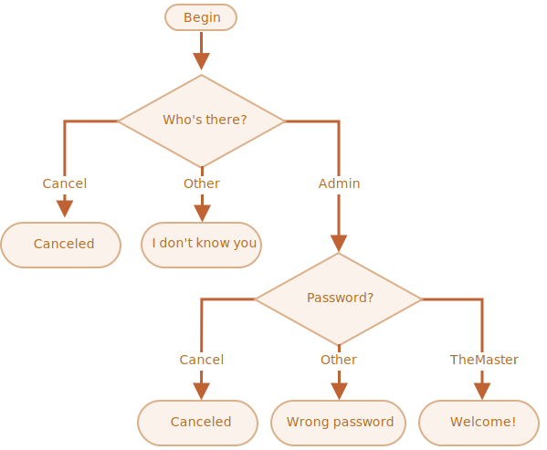

importance: 3

---

# login را بررسی کنید

کدی بنویسید که با `prompt` برای login درخواست کند.

اگر بازدید کننده `"Admin"` وارد کند، سپس برای رمز عبور `prompt` کنید، اگر ورودی یک خط خالی یا `key:Esc` باشد -- "Canceled" را نمایش دهید، اگر رشته(string) دیگری باشد -- سپس "I don't know you" را نشان دهید.

رمز عبور به شکل زیر بررسی می شود:

- اگر برابر با "TheMaster" باشد، سپس "Welcome!" را نمایش دهید،
- اگر رشته(string) دیگری باشد -- "Wrong password" را نمایش دهید،
- اگر یک رشته(string) خالی یا ورودی cancelled باشد، "Canceled" را نمایش دهید

طرح:

لطفا از بلوک های `if` تو در تو استفاده کنید. خوانایی کلی کد را در نظر بگیرید.

راهنمایی جزیی:  رد کردن یک ورودی خالی به prompt یک رشته خالی `''` بر می گرداند. فشار دادن `key:ESC` در حین prompt `null` را بر می گرداند.

[دمو]
