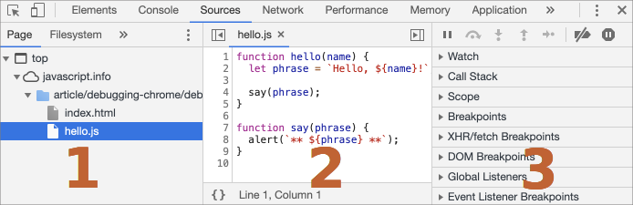
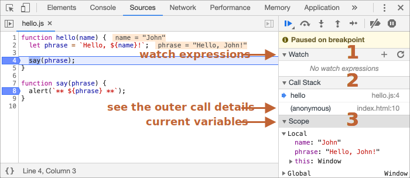
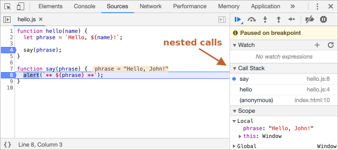

# اشکال‌زدایی در مرورگر

قبل از نوشتن کدهای پیچیده‌تر، بیاید درمورد اشکال‌زدایی صحبت کنیم.

[اشکال‌زدایی](https://fa.wikipedia.org/wiki/اشکال%E2%80%8Cزدایی) فرآیند پیدا کردن و حل خطاهای درون یک اسکریپت است.

ما در این‌جا از کروم استفاده می‌کنیم، چون دارای امکانات کافی است، اکثر مرورگرهای دیگر نیز فرآیندی مشابه دارند.

## پنل «Sources»

این پنل در نسخهٔ کروم شما ممکن است کمی متفاوت به نظر برسد، اما همچنان این دستورالعمل می‌بایست واضح باشد.

- در کروم [صفحهٔ نمونه](debugging/index.html) را باز کنید.
- Developer tools را با `key:F12` (Mac: `key:Cmd+Opt+I`) باز کنید.
- پنل `Sources` را انتخاب کنید.

اگر برای اولین‌بار این کار را می‌کنید، احتمالاً چنین چیزی را ببینید:


دکمهٔ مشخص‌شده <span class="devtools" style="background-position:-172px -98px"></span> تب همراه با فایل‌ها را باز می‌کند.

بیایید آن را کلیک کنیم و `index.html` و سپس `hello.js` را در حالت درختی انتخاب کنیم. چنین چیزی باید نشان داده شود:



پنل sources سه بخش دارد:

1. بخش **File Navigator** فایل‌های اچ‌تی‌ام‌ال، جاوااسکریپت، سی‌اس‌اس و دیگر فایل‌ها را، شامل عکس‌های ضمیمه‌شده به صفحه را لیست می‌کند. افزونه‌های کروم نیز ممکن است در این بخش نشان داده شوند.
2. بخش **Code Editor** کد منبع را نمایش می‌دهد.
3. بخش **JavaScript Debugging** برای اشکال‌زدایی است، به‌زودی آن را بررسی می‌کنیم.

اکنون می‌توانید همان دکمه مشخص‌شده را دوباره کلیک کنید  <span class="devtools" style="background-position:-172px -122px"></span> تا لیست منابع مخفی شود و جا برای کد باز شود.

## کنسول

اگر دکمهٔ `Esc` را فشار دهید, یک کنسول در پایین باز می‌شود. ما می‌توانیم دستورات را در آنجا تایپ کنیم و  `key:Enter` را فشار دهیم تا اجرا شوند.

بعد از اجرای تکه‌کد، نتایج آن در زیر آن نمایش داده می‌شوند.

<<<<<<< HEAD
برای مثال، نتیجه `1+2` می‌شود `3`، و `hello("debugger")` چیزی را بر نمی‌گرداند، پس نتیجه `undefined` است:
=======
For example, here `1+2` results in `3`, while the function call `hello("debugger")` returns nothing, so the result is `undefined`:
>>>>>>> 45934debd9bb31376ea5da129e266df5b43e545f


## بریک‌پوینت‌ها

بیایید بررسی کنیم در کد [صفحهٔ نمونه](debugging/index.html) چه اتفاقی می‌افتد. در `hello.js`، روی خط شمارهٔ `4` کلیک کنید. بله، روی خود عدد `4` ، نه روی کد.

تبریک! شما یک بریک‌پونیت ست کردید. لطفاً روی عدد خط `8` هم کلیک کنید.

باید چنین چیزی را ببینید: (بخش آبی جایی‌ست که باید کلیک کنید):


یک *بریک‌پوینت* نقطه‌ای از کد است که اشکال‌زدا به صورت خودکار در آن‌جا اجرای کد جاوااسکریپت را متوقف می‌کند.

درحالی که اجرای کد متوقف شده است، ما می‌توانیم متغیرهای فعلی را بررسی کنیم، دستوراتی را در کنسول اجرا کنیم و غیره. به عبارتی دیگر، می‌توانیم آن را اشکال‌زدایی کنیم.

همیشه می‌توانیم لیستی از بریک‌پوینت‌ها را در پنل سمت راست پیدا کنیم. این پنل در زمانی که بریک‌پونیت‌های زیادی در فایل‌های مختلفی داریم، می‌تواند کارآمد باشد. این پنل به این امکان را می‌دهد تا:
- سریعاً به مکان بریک‌پوینت در کد بپریم. (با کلیک‌کردن بر روی آن در پنل سمت راست).
- به صورت موقت بریک‌پوینت را غیرفعال کنیم با آن‌چک کردن‌ش.
- بریک‌پوینت را با راست کلیک و انتخاب کردن گزینه Remove حذف کنیم.
- و دیگر موارد...

```smart header="Conditional breakpoints"
<<<<<<< HEAD
*راست کلیک* بر روی شمارهٔ خط این امکان را می‌دهد تا یک بریک‌پوینت *شرطی* تعریف کنیم. این بریک‌پوینت تنها زمانی صدازده می‌شود که شرط تعیین‌شده درست باشد.
=======
*Right click* on the line number allows to create a *conditional* breakpoint. It only triggers when the given expression, that you should provide when you create it, is truthy.
>>>>>>> 45934debd9bb31376ea5da129e266df5b43e545f

این امکان می‌تواند برای زمانی که نیاز داریم تا تنها برای یک متغیر خاص یا پارامترهای خاصی برای فانکشن توقف کنیم کارآمد باشد. 
```

<<<<<<< HEAD
## دستور debugger
=======
## The command "debugger"
>>>>>>> 45934debd9bb31376ea5da129e266df5b43e545f

ما همچنین می‌توانیم با استفاده از دستور  `debugger` کد را متوقف کنیم، مثلاً:

```js
function hello(name) {
  let phrase = `Hello, ${name}!`;

*!*
  debugger;  // <-- اشکال‌زدا اینجا توقف می‌کند
*/!*

  say(phrase);
}
```

<<<<<<< HEAD
این امکان در زمانی که در یک ویرایش‌گر کد هستیم و نمی‌خواهیم به مرورگر برویم و اسکریپت را در developer tools پیدا کنیم و بریک‌پوینت را ست کنیم  خیلی مناسب است.

=======
Such command works only when the development tools are open, otherwise the browser ignores it.
>>>>>>> 45934debd9bb31376ea5da129e266df5b43e545f

## توقف و گَشتن

در مثال ما،  `hello()` در زمان بارگزاری صفحه صدا زده می‌شه، پس ساده‌ترین راه برای فعال‌کردن اشکال‌زدا (بعد از ست کردن بریک‌پوینت) بارگزاری مجدد صفحه‌ست. پس بیاید `key:F5` (Windows, Linux) یا `key:Cmd+R` (Mac) رو فشار بدیم.

همان‌طور که بریک‌پوینت ست شده، اجرای کد در خط چهارم متوقف می‌شه:



دراپ‌داون‌های سمت راست(مشخص‌شده با فلش) رو باز کنید. با استفاده از اون‌ها می‌تونید وضعیت فعلی کد رو بررسی کنید:

1. **`Watch` -- .نمایش مقادیر فعلی برای هر عبارت**

<<<<<<< HEAD
    شما می‌تونید دکمه به‌علاوه  `+` رو فشار بدید و یک عبارت وارد کنید. اشکال‌زدا مقدار آن را در هر لحظه از فرآیند اجرا، به صورت خودکار دوباره محاسبه می‌کنه و نمایش خواهد داد.
=======
    You can click the plus `+` and input an expression. The debugger will show its value, automatically recalculating it in the process of execution.
>>>>>>> 45934debd9bb31376ea5da129e266df5b43e545f

2. **`Call Stack` -- .نمایش زنجیرهٔ صدازدن‌های تودرتو**

    در لحظهٔ فعلی اشکال‌زدا صدازدهشده توسط `hello()` است, که خود آن صدازده‌شده توسط اسکریپتی با نام `index.html` است. (هیچ تابعی وجود ندارد، پس «anonymous» نامیده می‌شود).

    اگر بر روی یک پشته کلیک کنید (مثلاً«anonymous»)، اشکال‌زدا به کد متناظر آن می‌پرد، و همهٔ متغیرهای آن می‌توانند بررسی شوند.
3. **`Scope` -- متغیرهای فعلی**

    `Local` متغیرهای تابع محلی را نمایش می‌دهد. همچنین می‌توانید مقادیر آن‌ها را برجسته‌شده سمت راست منبع ببینید.

    `Global` شامل متغیرهای سراسری می‌شود. (بیرون از توابع).

    همچنین کلیدواژهٔ `this` نیز در آن‌جا وجود دارد که ما هنوز یاد نگرفته‌ایم، ولی به‌زودی خواهیم گرفت.

## ردیابی فرآیند اجرا

اکنون وقت آن است که اسکریپت را *ردیابی* کنیم.

دکمه‌هایی برای این‌کار در بالای پنل سمت راست وجود دارد. بیاید از آن‌ها استفاده کنیم.
<!-- https://github.com/ChromeDevTools/devtools-frontend/blob/master/front_end/Images/src/largeIcons.svg -->
<span class="devtools" style="background-position:-146px -168px"></span> -- "Resume": فرآیند اجرا را ادامه می‌دهد، میانبر `key:F8`.
:فرآیند اجرا را ادامه می‌دهد. اگر هیچ بریک‌پوینت دیگری نبود، تنها فرآیند اجرا ادامه پیدا می‌کند و اشکال‌زدا کنترل را از دست می‌دهد.

    بعد از کلیک روی آن، چنین چیزی را می‌بینیم:

    

    فرآیند اجرا ادامه پیدا کرده‌ست، به بریک‌پوینت دیگری درون  `say()` رسیده است و متوقف شده است. به «Call Stack» در سمت راست نگاه کنید. با یک صدازدن دیگر افزایش پیداکرده است. ما هم‌اکنون درون `say()` هستیم.

<span class="devtools" style="background-position:-200px -190px"></span> -- "Step": دستور بعدی را اجرا می‌کند, میانبر `key:F9`.
: عبارت بعدی را اجرا می‌کند. اگر آن را کلیک کنیم، `alert` نمایش داده خواهد شد.

    کلیک کردن دوباره و دوباره این، گام‌به‌گام همهٔ عبارات اسکریپت را اجرا می‌کند.

<<<<<<< HEAD
<span class="devtools" style="background-position:-62px -192px"></span> -- "Step over": دستور بعدی را اجرا می‌کند، اما *داخل یک تابع نمی‌شود*، میانبر `key:F10`.
: شبیه دستور قبلی «step»، اما اگر عبارت بعدی یک تابع - که built-in نباشد، مانند `alert` باشد، بلکه یک تابع که خودمان آن را تعریف کرده باشیم - باشد، متقاوت رفتار می‌کند.

    دستور «step» وارد آن می‌شود و فرآیند اجرا را در خطر اول آن متوقف می‌کند، در حالی که دستور «step over» صدازدن‌های تودرتو تابع را نامرئی اجرا می‌کند، از تابع‌های داخلی رد می‌شود.

     سپس فرآیند اجرا بعد از آن تابع بلافاصله متوقف می‌شود.
=======
<span class="devtools" style="background-position:-62px -192px"></span> -- "Step over": run the next command, but *don't go into a function*, hotkey `key:F10`.
: Similar to the previous "Step" command, but behaves differently if the next statement is a function call (not a built-in, like `alert`, but a function of our own).

    If we compare them, the "Step" command goes into a nested function call and pauses the execution at its first line, while "Step over" executes the nested function call invisibly to us, skipping the function internals.

    The execution is then paused immediately after that function call.
>>>>>>> 45934debd9bb31376ea5da129e266df5b43e545f

    این دستور اگر نخواهیم ببینیم داخل تابع چه اتفاقی می‌افتد، می‌تواند مفید واقع شود.

<span class="devtools" style="background-position:-4px -194px"></span> -- "Step into", میانبر `key:F11`.
: شبیه «step», اما در صورتی که تابع ناهمگام باشد، متقاوت رفتار می‌کند. اگر تازه شروع به یادگیری   جاوااسکریپت کرده اید، می‌توانید این تفاوت را نادیده بگیرید، چون هنوز توابع ناهمگام را نمی‌دانیم.

    برای آینده، به خاطر داشته باشید که دستور «Step» command عمل‌های ناهمگام را نادیده می‌گیرد، مانند `setTimeout` (زمان‌بندی صدازدن توابع), که بعداً اجرا می‌کند. دستور «Step into» وارد آن‌ها می‌شود، اگر نیاز باشد برای آن‌ها صبر می‌کند. [DevTools manual](https://developers.google.com/web/updates/2018/01/devtools#async) را برای اطلاعات بیشتر ببینید.

<span class="devtools" style="background-position:-32px -194px"></span> -- "Step out": فرآیند اجرا را تا انتهای تابع فعلی ادامه می‌دهد, میانبر `key:Shift+F11`.
: فرآیند اجرا را ادامه می‌دهد و در خط آخر تابع فعلی متوقف می‌شود. در زمانی که تصادفاً وارد یک تابع تودرتو شده‌ایم <span class="devtools" style="background-position:-200px -190px"></span>ولی علاقه‌ای به،  آن نداریم، و می‌خواهیم در سریع‌ترین زمان ممکن به آخر آن برسیم، کاربردی است.

<span class="devtools" style="background-position:-61px -74px"></span> -- enable/disable all breakpoints.
: این دکمه فرآیند اجرا را تغییر نمی‌ده. فقط برای خاموش/روشن کردن بریک‌پوین‌ها به صورت کلی‌ست.

<span class="devtools" style="background-position:-90px -146px"></span> -- enable/disable automatic pause in case of an error.
<<<<<<< HEAD
: زمانی که فعال باشد، و Developer tools باز باشد، در زمان وقوع خطا اسکریپت به صورت خودکار متوقف می‌شود. بعد از آن می‌توانیم متغیرها را تحلیل کنیم تا مشکل را پیدا کنیم. پس اگر اسکریپت ما با یک خطا از کار افتاد، می‌توانیم اشکال‌زدا را باز کنیم، این امکان را فعال کنیم و صفحه را مجدداً بارگزاری کنیم تا ببینیم مشکل در کجا بوده است و نوشته در آن لحظه چه بوده است.
=======
: When enabled, if the developer tools is open, an error during the script execution automatically pauses it. Then we can analyze variables in the debugger to see what went wrong. So if our script dies with an error, we can open debugger, enable this option and reload the page to see where it dies and what's the context at that moment.
>>>>>>> 45934debd9bb31376ea5da129e266df5b43e545f

```smart header="Continue to here"
راست کلیک برروی یک خط کد  context menu را باز می‌کند همراه با امکانی عالی که  «Continue to here» نامیده می‌شود.

هنگامی که می‌خواهیم چندین گام به جلو برویم، ولی خیلی تنبل هستیم تا یک بریک‌پوینت ست کنیم، کاربردی است.
```

## رخدادنگاری

برای برونداد چیزی به کنسول از کدمان، می‌توان از تابع  `console.log` استفاده کرد.

برای مقال، این مقادیر `0` تا `4` را به کنسول برونداد می‌کند:

```js run
// کنسول را باز کنید تا ببینید
for (let i = 0; i < 5; i++) {
  console.log("value,", i);
}
```

کاربران معمولی آن را نمی‌بینند، چون در کنسول است. برای دیدن آن، یا پنل کنسول را در developer tools باز کنید و یا دکمه  `key:Esc` را هنگامی که در یک پنل دیگر هستید بفشارید، کنسول در پایین صفحه باز می‌شود.

اگر به میزان کافی رخدادنگاری در کد داشته باشیم، می‌توانیم از سوابق ببینیم چه اتفاقی افتاده است، بدون نیاز به اشکال‌زدا.

## خلاصه

همان‌طور که می‌بینیم، سه راه اصلی برای متوقف کردن یک اسکریپت وجود دارد:
1. یک بریک‌پوینت.
2. عبارات  `debugger`.
3. یک خطا (اگر dev tools باز باشد و دکمه <span class="devtools" style="background-position:-90px -146px"></span> «on» باشد).

<<<<<<< HEAD
وقتی متوقف شد، می‌توانیم اشکال‌زدایی کنیم - بررسی توابع و ردیابی کد تا ببینیم کجای فرآیند اجرا به مشکل خورده است.
=======
When paused, we can debug: examine variables and trace the code to see where the execution goes wrong.
>>>>>>> 45934debd9bb31376ea5da129e266df5b43e545f

امکانات بسیار زیادتری در developer tools از چیزی که در این‌جا گفته شد وجود دارد. توضیحات کامل در <https://developers.google.com/web/tools/chrome-devtools> قابل دسترس است.

اطلاعات این بخش برای شروع اشکال‌زدایی کافی‌ست، اما بعداً، مخصوصاً اگر با مرورگر سر و کار دارید، لطفاً به آنجا بروید و قابلیت‌های پیشرفتهٔ بیشتری از developer tools را ببینید.

اوه، همچنین می‌توانید در بخش‌های مختلف dev tools کلیک کنید و ببینید چه اتفاقی می‌افتد. این احتمالاً سریع‌ترین روش برای یادگیری dev tools است. کلیک راست و context menuها را نیز فراموش نکنید!
