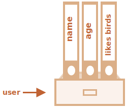

# شیءها

همانطور که از فصل <info:types> می‌دانیم، 8 نوع داده در جاوااسکریپت وجود دارد. 7 مورد "اولیه یا اصلی" نامیده می‌شوند، به این دلیل که مقدارهای آنها فقط دارای یک چیز است (رشته یا عدد یا هر چیزی).

در مقابل، شیءها (objects) برای ذخیره‌سازی مجموعه‌ای از داده‌های گوناگون و چیزهای پیچیده‌تر استفاده می‌شوند. در جاوااسکریپت، شیءها تقریبا به تمام جنبه‌های زبان نفوذ کرده‌اند. پس ما باید قبل از اینکه عمیقا به موضوع دیگری وارد شویم شیءها را بشناسیم.

یک شیء می‌تواند با آکولادها `{...}` و همراه یک لیست اختیاری از *ویژگی‌ها(property)* ساخته شود. یک ویژگی یعنی یک جفت از "key: value"، که در آن `key` یک رشته است (به آن "اسم ویژگی" هم می‌گویند) و `value` هر چیزی می‌تواند باشد.

می‌توانیم یک شیء را به عنوان یک قفسه‌ی دارای پرونده‌های علامت‌دار فرض کنیم. هر داده در پرونده‌ی خودش توسط کلید (key) ذخیره شده است. پیدا کردن یا حذف/اضافه کردن یک پرونده با اسم آن راحت می‌شود.


یک شیء خالی ("قفسه خالی") می‌تواند با استفاده از دو سینتکس ساخته شود:

```js
let user = new Object(); // "object constructor" سینتکس
let user = {};  // "object literal" سینتکس
```


معمولا، سینتکس آکولاد استفاده می‌شود. یک شیء که به این صورت تعریف شده باشد را *شیء لیتِرال* می‌نامند.

## لیترال‌ها و ویژگی‌ها

ما می‌توانیم بلافاصله ویژگی‌هایی را به صورت جفت‌هایی از "کلید: مقدار" (key: value) داخل `{...}` قرار دهیم:

```js
let user = {     // یک شیء
  name: "John",  // را ذخیره کنید "John" مقدار "name" توسط
  age: 30        // مقدار 30 را ذخیره کنید "age" توسط
};
```

یک ویژگی، قبل از `":"` دارای یک کلید (همچنین به عنوان "اسم" یا "شناسه" هم شناخته می‌شود) و یک مقدار در سمت راست دو نقطه است.

در شیء `user`، دو ویژگی وجود دارد:

1. اولین ویژگی، اسم `"name"` و مقدار `"John"` را دارد.
2. دومین ویژگی، اسم `"age"` و مقدار `30` را دارد.

شیء `user` بدست آمده می‌تواند به عنوان یک قفسه با دو پرونده‌ی علامت دار با برچسب‌های "name" و "age" فرض شود.


ما می‌توانیم در هر زمانی پرونده‌ها را اضافه یا کم کنیم یا آنها را بخوانیم.

مقدارهای ویژگی‌ها با استفاده از نقطه قابل دسترسی هستند:

```js
// مقدارهای ویژگی‌های شیء را دریافت کنید:
alert( user.name ); // John
alert( user.age ); // 30
```

مقدار می‌تواند هر چیزی باشد. بیایید یک مقدار از نوع boolean اضافه کنیم:

```js
user.isAdmin = true;
```


برای حذف یک ویژگی، از عملگر `delete` استفاده می‌کنیم:

```js
delete user.age;
```


همچنین می‌توانیم از اسم‌های چند کلمه‌ای برای ویژگی استفاده کنیم، اما آنها باید درون کوتیشن قرار بگیرند:

```js
let user = {
  name: "John",
  age: 30,
  "likes birds": true  // اسم‌های چند کلمه‌ایِ ویژگی باید درون کوتیشن باشند
};
```




آخرین ویژگی درون لیست هم می‌تواند با کاما پایان یابد:
```js
let user = {
  name: "John",
  age: 30*!*,*/!*
}
```
به این کامای "دنباله‌دار" یا "معلق" می‌گویند. این کاما اضافه/حذف/کار کردن با ویژگی‌ها را آسان‌تر می‌کند، چون همه‌ی خطوط یکسان می‌شوند.

## براکت‌ها

برای ویژگی‌های چند کلمه‌ای، دسترسی داشتن با نقطه ممکن نیست:

```js run
// این یک ارور سینتکسی می‌دهد
user.likes birds = true
```

جاوااسکریپت چنین چیزی را متوجه نمی‌شود. فکر می‌کند ما `user.likes` را مد نظر داریم، و سپس وقتی با کلمه غیرمنتظره‌ی `birds` روبرو می‌شود ارور سینتکسی می‌دهد.

نقطه نیاز دارد که کلید، یک شناسه‌ی معتبر متغیر باشد. به این معنی که: هیچ فاصله‌ای بین آن نباشد، با عدد شروع نشود و شامل کاراکترهای خاص نباشد (`$` و `_` مجاز هستند).

یک شیوه‌ی جایگزین به نام "براکت" وجود دارد که با هر رشته‌ای کار می‌کند:

```js run
let user = {};

// ایجاد کردن
user["likes birds"] = true;

// دریافت کردن
alert(user["likes birds"]); // true

// حذف کردن
delete user["likes birds"];
```

حالا همه چیز درست است. لطفا در نظر داشته باشید که رشته درون براکت‌ها به درستی درون کوتیشن قرار گرفته باشد (هر نوع کوتیشنی قابل قبول است).

براکت‌ها، بدست آوردن اسم ویژگی از نتیجه‌ی یک عبارت را هم فراهم می‌کنند، یعنی یک رشته‌ی ثابت نباشد، مثلا از یک متغیر که به این شکل انجام می‌گیرد:

```js
let key = "likes birds";

// user["likes birds"] = true; مشابه است با
user[key] = true;
```

اینجا، متغیر `key` شاید هنگام اجرای کد بدست آید یا وابسته به چیزی که کاربر وارد می‌کند باشد. سپس ما از آن برای دسترسی به ویژگی استفاده می‌کنیم. استفاده از براکت به ما انعطاف خیلی زیادی می‌دهد.

برای مثال:

```js run
let user = {
  name: "John",
  age: 30
};

let key = prompt("چه چیزی را می‌خواهید درباره کاربر بدانید؟", "name");

// دسترسی توسط متغیر
alert( user[key] ); // John :وارد شود "name" اگر
```

نقطه نمی‌تواند به همان شکل استفاده شود:

```js run
let user = {
  name: "John",
  age: 30
};

let key = "name";
alert( user.key ) // undefined
```

### ویژگی‌های محاسباتی

ما می‌توانیم زمانی که یک شیء لیترال تعریف می‌کنیم، از براکت‌ها درون آن استفاده کنیم. این کار سبب ایجاد *ویژگی‌های محاسباتی* می‌شود.

برای مثال:

```js run
let fruit = prompt("قصد خرید کدام میوه را دارید؟", "apple");

let bag = {
*!*
  [fruit]: 5, // گرفته می‌شود fruit اسم ویژگی از متغیر
*/!*
};

alert( bag.apple ); // 5 :باشد fruit="apple" اگر
```

معنی ویژگی محاسباتی ساده است: `[fruit]` به این معنی است که اسم ویژگی باید از متغیر `fruit` گرفته شود.

بنابراین اگر یک بازدیدکننده `"apple"` را وارد کند، `bag` اینگونه خواهد شد: `{apple: 5}`.

در اصل، کد بالا مانند کد پایین کار می‌کند:
```js run
let fruit = prompt("قصد خرید چه میوه‌ای دارید؟", "apple");
let bag = {};

// گرفته می‌شود fruit اسم ویژگی از متغیر
bag[fruit] = 5;
```

...اما زیباتر به نظر می‌رسد.

ما می‌توانیم از عبارات پیچیده‌تری درون براکت استفاده کنیم:

```js
let fruit = 'apple';
let bag = {
  [fruit + 'Computers']: 5 // bag.appleComputers = 5
};
```

براکت‌ها قدرت بسیار بیشتری نسبت به نقطه دارند. آنها هر نوع اسم ویژگی و متغیر را ممکن می‌سازند. اما آنها برای نوشتن سخت‌تر هستند.

پس اکثر اوقات، زمانی که اسم‌های ویژگی‌ها شناخته شده و ساده هستند، نقطه استفاده می‌شود. اگر ما به چیزی پیچیده‌تر نیاز داشته باشیم، سپس به سراغ براکت‌ها می‌رویم.

## خلاصه نویسی مقدار ویژگی

در کدنویسی واقعی معمولا نیاز داریم که از متغیرهای موجود به عنوان مقدار برای ویژگی‌ها استفاده کنیم.

برای مثال:

```js run
function makeUser(name, age) {
  return {
    name: name,
    age: age,
    // ...ویژگی‌های دیگر
  };
}

let user = makeUser("John", 30);
alert(user.name); // John
```

در مثال بالا، وِیژگی‌ها اسمی مشابه با متغیرها دارند. این موضوع که یک ویژگی را از یک متغیر بسازیم بسیار رایج است، به همین دلیل یک *خلاصه‌نویسیِ مقدارِ ویژگی* برای کوتاه‌تر کردن آن وجود دارد.

به جای `name: name` می‌توانیم فقط بنویسیم `name`، مثل کد پایین:

```js
function makeUser(name, age) {
*!*
  return {
    name, // name: name مشابه با
    age,  // age: age مشابه با
    // ...
  };
*/!*
}
```

ما می‌توانیم در یک شیء، هم از خلاصه‌نویسی استفاده کنیم هم از ویژگی‌های نرمال:

```js
let user = {
  name,  // name: name مشابه با
  age: 30
};
```


## محدودیت اسم‌های ویژگی‌ها

همانطور که از قبل می‌دانیم، یک متغیر نمی‌تواند اسمی برابر با کلماتی که توسط زبان رزرو شده‌اند داشته باشد مانند "for" و "let"، "return" و غیره.

اما برای ویژگی یک شیء، چنین محدودیتی وجود ندارد:

```js run
// این ویژگی‌ها قابل قبول هستند
let obj = {
  for: 1,
  let: 2,
  return: 3
};

alert( obj.for + obj.let + obj.return );  // 6
```

به طور خلاصه، هیچ محدودیتی برای اسم‌های ویژگی‌ها وجود ندارد. آنها می‌توانند هر رشته‌ای یا symbol (یک نوع داده خاص برای شناسه‌ها، بعدا آنها را یاد می‌گیریم) باشند.

انواع دیگر به طور خودکار به رشته تبدیل می‌شوند.

برای مثال، عدد `0` زمانی که به عنوان یک اسم ویژگی استفاده می‌شود، به رشته `"0"` تبدیل می‌شود.

```js run
let obj = {
  0: "test" // "0": "test" مشابه با
};

// به یک ویژگی دسترسی خواهند داشت (عدد 0 به رشته "0" تبدیل می‌شود) alert هر دو
alert( obj["0"] ); // test
alert( obj[0] ); // test (ویژگی یکسان)
```

یک مشکل جزئی با یک ویژگی خاص به نام `__proto__` وجود دارد. ما نمی‌توانیم مقداری که شیء نباشد را برابر با آن قرار دهیم:

```js run
let obj = {};
obj.__proto__ = 5; // مقداردهی یک عدد
alert(obj.__proto__); // [object Object] - مقدار یک شیء است و آن طور که انتظار می‌رفت کار نکرد
```

همانطور که در کد بالا دیدیم، برابر قرار دادن با یک مقدار اصلی(primitive) یعنی `5` نادیده گرفته شد.

ما طبیعت `__proto__` را در [فصل‌های بعد](info:prototype-inheritance) پوشش می‌دهیم و [راه‌هایی](info:prototype-methods) را برای درست کردن چنین رفتاری پیشنهاد می‌کنیم.

## بررسی موجودیت ویژگی با عملگر "in"

یک خصوصیت شایان ذکر شیءها در جاوااسکریپت، در مقایسه با بسیاری از زبان‌های دیگر، این است که امکان دسترسی به هر ویژگی‌ای وجود دارد. اگر آن ویژگی وجود نداشته باشد هیچ اروری دریافت نمی‌کنیم.

خواندن ویژگی‌ای که وجود ندارد فقط مقدار `undefined` را برمی‌گرداند. پس ما می‌توانیم به آسانی بررسی کنیم که ویژگی وجود دارد یا نه:

```js run
let user = {};

alert( user.noSuchProperty === undefined ); // "به معنای این است که "چنین ویژگی‌ای وجود ندارد true
```

برای انجام این کار عملگر مخصوص `"in"` هم وجود دارد.

سینتکس آن اینگونه است:
```js
"key" in object
```

برای مثال:

```js run
let user = { name: "John", age: 30 };

alert( "age" in user ); // true وجود دارد پس user.age
alert( "blabla" in user ); // false وجود ندارد پس user.blabla
```

لطفا در نظر داشته باشید که در سمت چپ `in` باید *اسم ویژگی* وجود داشته باشد که معمولا یک رشته درون کوتیشن است.

اگر ما کوتیشن را حذف کنیم، مانند متغیر فرض می‌شود، پس باید اسم واقعی برای بررسی استفاده شود. برای مثال:

```js run
let user = { age: 30 };

let key = "age";
alert( *!*key*/!* in user ); // true وجود دارد پس "age" ویژگی
```

چرا عملگر `in` باید وجود داشته باشد؟ آیا اینکه با `undefined` مقایسه انجام شود کافی نیست؟

بیشتر اوقات انجام مقایسه با `undefined` به درستی کار می‌کند. اما برای یک مورد خاص این کار با شکست مواجه می‌شود ولی `"in"` به درستی کار می‌کند.

آن مورد زمانی است که یک ویژگی شیء موجود باشد، اما `undefined` را در خود ذخیره کرده باشد:

```js run
let obj = {
  test: undefined
};

alert( obj.test ); // است، پس یعنی چنین متغیری نداریم؟ undefined خروجی

alert( "test" in obj ); // !می‌دهد، بنابراین ویژگی وجود دارد true خروجی
```

در کد بالا، ویژگی `obj.test` به طور فنی وجود دارد. پس عملگر `in` درست کار می‌کند.

موقعیت‌هایی شبیه به این به ندرت اتفاق می‌افتند، چون `undefined` نباید به صراحت برای مقداردهی استفاده شود. ما معمولا از `null` برای متغیرهای "ناشناخته" یا "خالی" استفاده می‌کنیم. در نتیجه عملگر `in` در کد مانند یک غریبه است.


## حلقه‌ی "for..in"

برای گردش در بین تمام ویژگی‌های یک شیء، شکل خاصی از حلقه وجود دارد: `for..in`. این حلقه کاملا متفاوت از ساختار `(;;)for` که قبلا آموختیم است.

سینتکس:

```js
for (key in object) {
  // بدنه برای هر کدام از کلیدهای مابین ویژگی‌های شیء اجرا می‌شود
}
```

برای مثال، بیایید تمام ویژگی‌های `user` را نمایش دهیم:

```js run
let user = {
  name: "John",
  age: 30,
  isAdmin: true
};

for (let key in user) {
  // کلیدها
  alert( key );  // name, age, isAdmin
  // مقدارهای کلیدها
  alert( user[key] ); // John, 30, true
}
```

در نظر داشته باشید که تمام ساختارهای "for" به ما اجازه تعریف متغیر ایجادکننده‌ی حلقه را داخل حلقه می‌دهند، `let key` اینجا به عنوان مثال صدق می‌کند.

همچنین ما می‌توانستیم به جای `key` از اسمی دیگر برای متغیر استفاده کنیم. برای مثال، `"for (let prop in obj)"` هم خیلی استفاده می‌شود.

### مرتب شده مثل یک شیء

آیا شیءها مرتب هستند؟ به عبارتی دیگر، اگر ما داخل یک شیء حلقه بزنیم، آیا تمام ویژگی‌های آن را با ترتیبی که اضافه شدند دریافت می‌کنیم؟ آیا می‌توانیم به این موضوع اتکا کنیم؟

جواب کوتاه این است: "مرتب شده به طوری خاص": ویژگی‌هایی که عدد صحیح هستند مرتب شده‌اند، بقیه‌ی آنها به ترتیبی که ساخته می‌شوند هستند. در ادامه به جزئیات می‌پردازیم.

به عنوان مثال، بیایید یک شیء حاوی کدهای تلفن را فرض کنیم:

```js run
let codes = {
  "49": "Germany",
  "41": "Switzerland",
  "44": "Great Britain",
  // ..,
  "1": "USA"
};

*!*
for (let code in codes) {
  alert(code); // 1, 41, 44, 49
}
*/!*
```

این شیء ممکن است برای پیشنهاد دادن لیستی از گزینه‌ها به کاربر استفاده شود. اگر ما در حال ساخت سایتی که به طور عمده برای آلمانی‌ها است باشیم پس احتمالا می‌خواهیم که `49` اولین گزینه باشد.

اما اگر ما کد را اجرا کنیم، نتیجه‌ای کاملا متفاوت می‌بینیم:

- USA (1) اولین خواهد بود.
- سپس Switzerland (41) و همینطور ادامه پیدا می‌کند.

کدهای تلفن با ترتیب صعودی مرتب می‌شوند، چون آنها اعداد صحیح هستند. پس ما `49 ،44 ،41 ،1` را خواهیم دید.

````smart header="ویژگی‌های عدد صحیح؟ داستان از چه قرار است؟"
عبارت "ویژگی عدد صحیح" در اینجا به معنی رشته‌ای است که می‌تواند بدون تغییر، به عدد صحیح تبدیل شود و برعکس.

بنابراین "49" یک اسمِ ویژگیِ صحیح است، چون زمانی که به یک عدد صحیح تبدیل می‌شود و برعکس، هنوز یکسان است. اما "49+" و "1.2" اینطور نیستند:

```js run
// یک تابع است که درون زبان ساخته شده و قسمت اعشاری را حذف می‌کند Math.trunc
alert( String(Math.trunc(Number("49"))) ); // "49", یکسان است، پس ویژگی‌ای صحیح است
alert( String(Math.trunc(Number("+49"))) ); // "49", با "49+" مشابه نیست، پس ویژگی‌ای صحیح هم نیست
alert( String(Math.trunc(Number("1.2"))) ); // "1", با "1.2" مشابه نیست، پس ویژگی‌ای صحیح هم نیست
```
````

...از سویی دیگر، اگر کلیدها عدد صحیح نباشند، به ترتیب ساخته شدن مرتب می‌شوند، برای مثال:

```js run
let user = {
  name: "John",
  surname: "Smith"
};
user.age = 25; // یک ویژگی دیگر اضافه می‌کنیم

*!*
// ویژگی‌های غیر صحیح با ترتیب ساخته شدن مرتب می‌شوند
*/!*
for (let prop in user) {
  alert( prop ); // name, surname, age
}
```

بنابراین، برای حل مشکل کدهای تلفن، ما می‌توانیم با ساخت کدهای غیر صحیح "تقلب کنیم". اضافه کردن علامت مثبت `"+"` قبل از هر کد کافی است.

مثل این:

```js run
let codes = {
  "+49": "Germany",
  "+41": "Switzerland",
  "+44": "Great Britain",
  // ..,
  "+1": "USA"
};

for (let code in codes) {
  alert( +code ); // 49, 41, 44, 1
}
```

حالا این کد همانطور که انتظار می‌رفت کار می‌کند.

## خلاصه

شیءها آرایه‌هایی شرکت‌پذیر با چند خصوصیت خاص هستند.

آنها ویژگی‌ها (جفت‌های کلید-مقدار) را ذخیره می‌کنند که:
- کلیدهای ویژگی‌ها باید رشته یا symbol باشند (معمولا رشته).
- مقدارها می‌توانند از هر نوعی باشند.

برای دسترسی داشتن به یک ویژگی، ما می‌توانیم از این روش‌ها استفاده کنیم:
- نقطه: `obj.property`.
- براکت `obj["property"]`. براکت‌ها به ما اجازه می‌دهند که key را از یک متغیر بگیریم، مثلا: `obj[varWithKey]`.

عملگرهای اضافی:
- برای حذف یک ویژگی: `delete obj.prop`.
- برای بررسی موجودیت ویژگی با اسم داده شده: `"key" in obj`.
- برای حلقه زدن درون یک شیء: حلقه‌ی `for (let key in obj)`.

چیزی که ما در این فصل آموختیم "شیء ساده" یا فقط `شیء` نامیده می‌شود.

در جاوااسکریپت شیءهای بسیار گوناگون دیگری وجود دارند:

- `Array` برای ذخیره کردن مجموعه‌ای از داده به صورت مرتب،
- `Date` برای ذخیره کردن اطلاعاتی درباره تاریخ و زمان،
- `Error` برای ذخیره کردن اطلاعات درباره‌ی یک ارور.
- ...و غیره.

هر کدام از آنها خصوصیات خاص خود را دارند که بعدا آنها را می‌آموزیم. بعضی اوقات افراد چیزهایی مانند "نوع Array" یا "نوع Date" را به زبان می‌آورند، اما به طور رسمی آنها یک نوع خاص نیستند، بلکه به یک نوع «object» تعلق دارند و آن را به روش‌های مختلف گسترش می‌دهند.

شیءها در جاوااسکریپت بسیار قدرتمند هستند. اینجا ما فقط مقدار کمی از مبحثی که بسیار بزرگ است را یاد گرفتیم. ما خیلی با شیءها کار خواهیم کرد و چیزهای جدیدی را درباره آنها در بخش‌های بعدی این آموزش یاد خواهیم گرفت.
