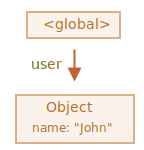

# زباله‌روبی

مدیریت حافظه در جاوااسکریپت به صورت خودکار و پنهان از ما انجام می‌شود. ما مقدارهای اصلی، شیءها، تابع‌ها و غیره را می‌سازیم... تمام اینها حافظه را اشغال می‌کنند.

وقتی چیزی دیگر مورد نیاز نباشد چه اتفاقی می‌افتد؟ موتور جاوااسکریپت چگونه این را تشخیص می‌دهد و پاک می‌کند؟

## قابلیت دسترسی

مفهوم اصلی مدیریت حافظه در جاوااسکریپت *قابلیت دسترسی* است.

به بیان ساده، مقدارهای "قابل دسترس" مقدارهایی هستند که به نحوی بتوان به آنها دسترسی داشت یا از آنها استفاده کرد. ذخیره‌شدن آنها در حافظه تضمین شده است.

1. یک مجموعه از مقدارهایی که به طور ذاتی قابل دسترس هستند وجود دارد که نمی‌توانند به دلیل‌هایی واضح حذف شوند.

    برای مثال:

    - تابعی که در حال اجرا باشد، متغیرهای محلی و پارامترهای آن.
    - تابع‌های دیگر در زنجیره‌ی کنونیِ صدازدن های تو در تو، متغیرهای محلی و پارامترهای آن.
    - متغیرهای global.
    - (چند مورد دیگر هم هستند، همچنین موردهای داخلی)

    این مقدارها *ریشه‌ها* نامیده می‌شوند.

2. هر مقدار دیگری قابل دسترس فرض می‌شود اگر از یک ریشه توسط یک مرجع یا زنجیره‎ای از مراجع قابل دسترس باشد.

    برای مثال، اگر یک شیء در متغیری global وجود داشته باشد، و آن شیء یک ویژگی داشته باشد که به شیءای دیگر رجوع می‌کند، *آن* شیء قابل دسترس فرض می‌شود. و آنهایی که این شیء به آنها رجوع می‌کند هم قابل دسترس هستند. مثال‌های دارای جزئیات در ادامه آمده است.

یک فرایند پشت پرده در موتور جاوااسکریپت وجود دارد به نام [زباله‌روبی](https://fa.wikipedia.org/wiki/بازیافت_حافظه). این فرایند تمام شیءها را زیر نظر می‌گیرد و آنهایی که غیر قابل دسترس شده‌اند را پاک می‌کند.

## یک مثال ساده

اینجا ساده‌ترین مثال را داریم:

```js
// یک ارجاع به شیء دارد user
let user = {
  name: "John"
};
```



اینجا، کمان یک مرجع شیء را نشان می‌دهد. متغیر global `"user"` به شیء `{name: "John"}` رجوع می‌کند (برای اختصار به آن John می‌گوییم). ویژگی `"name"` از John یک مقدار اصلی را ذخیره می‌کند، پس درون آن نقش بسته است.

اگر مقدار `user` بازنویسی شود، مرجع از دست می‌رود:

```js
user = null;
```


حال John غیر قابل دسترس شده است. هیج راه و مرجعی برای دسترسی به آن وجود ندارد. زباله جمع‌کن داده را دور می‌اندازد و حافظه را آزاد می‌کند.

## دو مرجع

حال بیایید تصور کنیم که مرجع را از `user` در `admin` کپی کردیم:

```js
// یک ارجاع به شیء دارد user
let user = {
  name: "John"
};

*!*
let admin = user;
*/!*
```


حال اگر دوباره کار مشابه را انجام دهیم:
```js
user = null;
```

...سپس شیء هنوز توسط متغیر global `admin` قابل دسترس است، پس در حافظه وجود دارد. اگر ما `admin` را هم بازنویسی کنیم، سپس این شیء حذف می‌شود.

## شیءهای بهم پیوسته

حالا یک مثال پیچیده‌تر. خانواده:

```js
function marry(man, woman) {
  woman.husband = man;
  man.wife = woman;

  return {
    father: man,
    mother: woman
  }
}

let family = marry({
  name: "John"
}, {
  name: "Ann"
});
```

تابع `marry` دو شیء را با دادن مرجع‌های آنها به یکدیگر "بهم پیوند می‌زند" و یک شیء جدید که شامل هر دو است را برمی‌گرداند.

ساختار حافظه حاصل:


از هم اکنون، تمام شیءها قابل دسترس هستند.

حال بیایید دو مرجع را حذف کنیم:

```js
delete family.father;
delete family.mother.husband;
```


اینکه فقط یکی از دو مرجع را حذف کنیم کافی نیست، چون تمام شیءها هنوز قابل دسترس هستند.

اما اگر ما هر دو را حذف کنیم، آن گاه می‌بینیم که John دیگر هیچ مرجع ورودی ندارد:


مرجع‌های خروجی مهم نیستند. تنها مرجع‌های ورودی می‌توانند یک شیء را قابل دسترس کنند. پس John حالا غیر قابل دسترس شده است و همراه با تمام داده‌اش که آنها هم غیر قابل دسترس شده اند، از حافظه پاک می‌شود.

بعد از زباله‌روبی:


## جزیره‌ی غیر قابل دسترس

اینکه تمام جزیره‌ی شیءهای بهم پیوسته غیر قابل دسترس شوند و از حافظه پاک شوند ممکن است.

شیء منبع مانند شیء بالا است. پس:

```js
family = null;
```

تصویر درون حافظه به تصویر زیر تبدیل می‌شود:


این مثال اهمیت زیاد مفهوم قابلیت دسترسی را نشان می‌دهد.

این واضح است که John و Ann هنوز هم بهم پیوسته هستند و هر دو مرجع‌های ورودی دارند. اما این کافی نیست.

شیء سابق `"family"` از ریشه پیوندش را از دست داده است و دیگر هیچ مرجعی به آن وجود ندارد، پس تمام جزیره غیر قابل دسترس و پاک می‌شود.

## الگوریتم داخلی

الگوریتم پایه‌ی زباله‌روبی "علامت گذاری و جارو کردن" نامیده می‌شود.

مراحل "جمع‌آوری زباله" پایین به طور منظم انجام می‌شوند:

- زباله جمع‌کن ریشه‌ها را می‌گیرد و آنها را "علامت گذاری" می‌کند (به خاطر می‌سپارد).
- سپس از تمام مرجع‌های آنها بازدید می‌کند و آنها را "علامت گذاری می‌کند".
- سپس از شیءهای علامت گذاری شده بازدید می‌کند و مرجع‌های *آنها* را علامت گذاری می‌کند. تمام شیءهای بازدید شده به خاطر سپرده می‌شوند تا در آینده دوباره از شیء یکسانی بازدید نشود.
- ...و این فرایند تا زمانی که از تمام مرجع‌های قابل دسترس (از ریشه‌ها) بازدید شود ادامه پیدا می‌کند.
- تمام شیءها به جز آنهایی که علامت گذاری شده‌اند پاک می‌شوند.

برای مثال، بیایید فرض کنیم ساختار شیء ما اینگونه باشد:


می‌توانیم به وضوح یک "جزیره‌ی غیر قابل دسترس" را در سمت راست ببینیم. حال بیایید ببینیم زباله جمع‌کنِ "علامت گذار و جارو کننده" چگونه با آن برخورد می‌کند.

اولین مرحله علامت گذاری ریشه‌ها است:


سپس مرجع‌های آنها علامت گذاری می‌شود:


...و تا جایی که ممکن باشد، مرجع‌های آنها:


حالا شیءهایی که نمی‌توان حین فرایند از آنها بازدید شود غیر قابل دسترس فرض می‌شوند و پاک می‌شوند:


همچنین می‌توانیم فرایند را اینگونه فرض کنیم که یک سطل رنگ بسیار بزرگ از ریشه ریخته می‌شود که بین تمام مرجع‌ها جریان می‌یابد و تمام شیءهای قابل دسترس را علامت گذاری می‌کند. سپس شیءهایی که علامت گذاری نشده‌اند پاک می‌شوند.

این مفهوم کلی چگونگی کار کردن زباله‌روبی است. موتورهای جاوااسکریپت بهینه‌سازی‌های زیادی را اعمال می‌کنند تا آن را سریع‌تر کنند و روی اجراشدن برنامه تاثیری نگذارد.

بعضی از بهینه‌سازی‌ها:

- **جمع‌آوری نسلی** -- شیءها به دو دسته تقسیم می‌شوند: "جدیدها" و " قدیمی‌ها". بسیاری از شیءها به وجود می‌آیند، کارشان را انجام می‌دهند و به سرعت می‌میرند، آنها می‌توانند به سرعت پاک می‌شوند. شیءهایی که برای مدت زیاد باقی می‌مانند، "قدیمی" می‌شوند و کمتر بررسی می‌شوند.
- **جمع‌آوری افزایشی** -- اگر شیءهای زیادی وجود داشته باشند و ما تلاش کنیم که یک باره برویم و تمام دسته شیء را علامت گذاری کنیم، ممکن است این کار زمان ببرد و اختلال‌های قابل رویت را در اجرا ایجاد کند. پس موتور سعی می‌کند که جمع‌آوری زباله را به چند بخش تقسیم کند. سپس هر بخش یکی یکی به صورت جداگانه انجام می‌شود. این کار برای دنبال کردن تغییرات به ثبت کردن بیشتری نیاز دارد، اما ما به جای اختلالی بزرگ اختلال‌های خیلی کوچک را خواهیم داشت.
- **جمع‌آوری زمان بیکاری** -- زباله جمع‌کن سعی می‌کند که فقط زمانی که پردازنده (CPU) بیکار است کار خود را انجام دهد تا تاثیر ممکن روی اجراشدن را کاهش دهد.

بهینه‌سازی و روش‌های دیگری هم برای الگوریتم‌های زباله‌روبی وجود دارد. همان قدر که دوست دارم آنها را اینجا توضیح دهم، نباید ادامه دهم، چون موتورهای مختلف تکنیک و فن‌های مختلفی را پیاده‌سازی می‌کنند. و این حتی مهم تر است که همانطور که موتورها پیشرفت می‌کنند چیزهایی هم تغییر می‌کنند، پس مطالعه‌ی عمیق‌تر "پیشرفته" بدون نیاز واقعی احتمالا ارزش ندارد. مگر اینکه، موضوع کاملا مربوط به علاقه باشد که در این صورت لینک‌هایی برای شما در پایین قرار داده شده است.

## خلاصه

چیزهای مهم که باید بدانیم:

- زباله‌روبی به صورت خودکار انجام می‌شود. ما نمی‌توانیم آن را مجبور یا از آن جلوگیری کنیم.
- شیءها تا زمانی که قابل دسترس باشند در حافظه باقی می‌مانند.
- مرجع بودن با قابل دسترس بودن (از یک ریشه) یکسان نیست : یک دسته‌ی شیءهای بهم پیوسته می‌توانند به طور کامل غیر قابل دسترس شوند.

موتورهای مدرن الگوریتم‌های پیشرفته‌ی زباله‌روبی را پیاده‌سازی می‌کنند.

کتاب کلی "The Garbage Collection Handbook: The Art of Automatic Memory Management" (R. Jones و بقیه افراد) بعضی از آنها را پوشش می‌دهد.

اگر شما با برنامه‌نویسی سطح پایین آشنایی دارید، اطلاعاتی با جزییات درباره زباله‌روبی V8 در این مقاله است [A tour of V8: Garbage Collection](http://jayconrod.com/posts/55/a-tour-of-v8-garbage-collection).

[بلاگ V8](https://v8.dev/) هم هر چند گاهی مقاله‌هایی درباره تغییرات مدیریت حافظه منتشر می‌کند. طبیعتا، برای یادگیری زباله‌روبی، شما بهتر است به طور کلی با یاد گرفتن چیزهای داخلی V8 آماده شوید و بلاگ [Vyacheslav Egorov](http://mrale.ph) که یکی از مهندس‌های V8 بود را بخوانید. من می‌گویم: "V8" چون مقاله‌های زیادی درباره آن در اینترنت وجود دارد. برای موتورهای دیگر، بیشتر روش‌ها مشابه هستند، اما زباله‌روبی در جنبه‌های زیادی متفاوت است.
 
اگر شما بهینه‌سازی‌های سطح پایین را نیاز دارید، دانایی عمیق موتورها چیز خوبی است. این کار عاقلانه‌ای است که بعد از آشنایی با زبان برای آن برنامه‌ریزی کنید.
