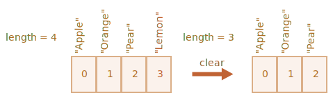

# آرایه‌ها

شیءها به شما اجازه می‌دهند که مجموعه‌ای کلیددار از مقدارها را ذخیره کنید. این چیز خوبی است.

اما بسیار پیش می‌آید که ما به یک *مجموعه‌ی مرتب* نیاز داشته باشیم، که دارای یک المان اول، دوم، سوم و غیره باشیم. برای مثال، ما نیاز داریم که یک لیست از چیزی را ذخیره کنیم: کاربران، کالاها، المان‌های HTML و غیره.

اینکه اینجا از یک شیء استفاده کنیم خوب نیست، چون هیچ روشی برای کنترل کردن ترتیب المان‌ها فراهم نمی‌کند. ما نمی‌توانیم یک ویژگی جدید را «بین» ویژگی‌های جدید اضافه کنیم. شیءها برای چنین موردی ساخته نشده‌اند.

یک ساختار داده خاص به نام `Array` وجود دارد که برای ذخیره مجموعه‌های مرتب استفاده می‌شود.

## تعریف کردن

برای ساخت یک آرایه خالی دو سینتکس وجود دارد:

```js
let arr = new Array();
let arr = [];
```

تقریبا همیشه، سینتکس دوم استفاده می‌شود. ما می‌توانیم المان‌هایی اولیه را درون براکت‌ها قرار دهیم:

```js
let fruits = ["Apple", "Orange", "Plum"];
```

المان‌های آرایه عددگذاری شده‌اند که از صفر شروع می‌شود.

ما می‌توانیم یک المان را با استفاده از عددش درون براکت‌ها دریافت کنیم:

```js run
let fruits = ["Apple", "Orange", "Plum"];

alert( fruits[0] ); // Apple
alert( fruits[1] ); // Orange
alert( fruits[2] ); // Plum
```

می‌توانیم یک المان را جایگزین کنیم:

```js
fruits[2] = 'Pear'; // now ["Apple", "Orange", "Pear"]
```

...یا یک المان جدید را به آرایه اضافه کنیم:

```js
fruits[3] = 'Lemon'; // now ["Apple", "Orange", "Pear", "Lemon"]
```

تعداد کل المان‌های درون آرایه در `length` آن است:

```js run
let fruits = ["Apple", "Orange", "Plum"];

alert( fruits.length ); // 3
```

همچنین ما می‌توانیم از `alert` برای نشان دادن کل آرایه استفاده کنیم.

```js run
let fruits = ["Apple", "Orange", "Plum"];

alert( fruits ); // Apple,Orange,Plum
```

یک آرایه می‌تواند المان‌هایی از هر نوع را ذخیره کند.

برای مثال:

```js run no-beautify
// ترکیبی از مقدارها
let arr = [ 'Apple', { name: 'John' }, true, function() { alert('hello'); } ];

// آن name دریافت شیء در ایندکس 1 و سپس نمایش
alert( arr[1].name ); // John

// دریافت تابع در ایندکس 3 و اجرا کردن آن
arr[3](); // hello
```


````smart header="کامای دنباله‌دار"
یک آرایه، درست مانند یک شیء، می‌تواند با یک کاما پایان یاید:
```js
let fruits = [
  "Apple",
  "Orange",
  "Plum"*!*,*/!*
];
```

سبک «کامای دنباله‌دار» اضافه/حذف کردن المان را آسان‌تر می‌کند، چون همه خطوط مشابه می‌شوند.
````

## Get last elements with "at"

[recent browser="new"]

Let's say we want a last element of the array.

Some programming languages allow to use negative indexes for the same purpose, like `fruits[-1]`.

Although, in JavaScript it won't work. The result will be `undefined`, because the index in square brackets is treated literally.

We can explicitly calculate the last element index and then access it: `fruits[fruits.length - 1]`.

```js run
let fruits = ["Apple", "Orange", "Plum"];

alert( fruits[fruits.length-1] ); // Plum
```

A bit cumbersome, isn't it? We need to write the variable name twice.

Luckily, there's a shorter syntax: `fruits.at(-1)`:

```js run
let fruits = ["Apple", "Orange", "Plum"];

// same as fruits[fruits.length-1]
alert( fruits.at(-1) ); // Plum
```

In other words, `arr.at(i)`:
- is exactly the same as `arr[i]`, if `i >= 0`.
- for negative values of `i`, it steps back from the end of the array.

## متدهای pop/push، shift/unshift

یک [صف](https://fa.wikipedia.org/wiki/صف_(نوع_داده_انتزاعی)) یکی از متداول‌ترین استفاده‌ها از یک آرایه است. در علوم کامپیوتر، آرایه به معنای یک مجموعه مرتب‌شده از المان‌ها است که دو عملیات را پشتیبانی می‌کند:

- `push` یک المان را به آخر اضافه می‌کند.
- `shift` یک المان را از آغاز برمی‌دارد، صف را پیش می‌برد، پس المان دوم به المان اول تبدیل می‌شود.


آرایه‌ها هر دو عملیات را پشیبانی می‌کنند.

خیلی پیش می‌آید که در عمل به آن نیاز داشته باشیم. برای مثال، یک صف از پیام‌ها که باید روی صفحه نمایش داده شوند.

آرایه‌ها یک مورد استفاده دیگر هم دارند که یک ساختار داده به نام [پشته](https://fa.wikipedia.org/wiki/پشته) است.

پشته دو عملیات را پشتیبانی می‌کند:

- `push` یک المان را به آخر اضافه می‌کند.
- `pop` یک المان را از آخر برمی‌دارد.

پس المان‌های جدید یا اضافه می‌شوند یا همیشه از «آخر» برداشته می‌شوند.

یک پشته معمولا به عنوان یک بسته‌ای از کارت‌ها فرض می‎شود: کارت‌های جدید به بالا اضافه می‌شوند یا از بالا برداشته می‌شوند:


برای پشته‌ها، آخرین چیزی که اضافه شده باشد اول دریافت می‌شود، همچنین به آن LIFO (Last-In-First-Out) هم گفته می‌شود. برای صف‌ها، ما FIFO (First-In-First-Out) را داریم.

آرایه‌ها در جاوااسکریپت می‌توانند هم به عنوان یک صف و هم به عنوان یک پشته کار کنند. آنها به شما اجازه می‌دهند که المان‌ها را به/از آغاز یا پایان اضافه/حذف کنید.

در علوم کامپیوتر ساختار داده‌ای که همچنین چیزی را ممکن می‌کند، [صف دو طرفه](https://en.wikipedia.org/wiki/Double-ended_queue) نامیده می‌شود.

**متدهایی که با انتهای آرایه کار می‌کنند:**

`pop`
: آخرین المان از آرایه را خارج می‌کند و آن را برمی‌گرداند:

    ```js run
    let fruits = ["Apple", "Orange", "Pear"];

    alert( fruits.pop() ); // می‌کند alert را حذف می‌کند و آن را "Pear"

    alert( fruits ); // Apple, Orange
    ```

    Both `fruits.pop()` and `fruits.at(-1)` return the last element of the array, but `fruits.pop()` also modifies the array by removing it.

`push`
: المان را به انتهای آرایه اضافه می‌کند:

    ```js run
    let fruits = ["Apple", "Orange"];

    fruits.push("Pear");

    alert( fruits ); // Apple, Orange, Pear
    ```

    صدا زدن `friuts.push(...)` برابر است با `fruits[fruits.length] = ...`.

**متدهایی که با آغاز آرایه کار می‌کنند:**

`shift`
: اولین المان آرایه را خارج می‌کند و آن را برمی‌گرداند:

    ```js run
    let fruits = ["Apple", "Orange", "Pear"];

    alert( fruits.shift() ); // می‌کند alert را حذف می‌کند و آن را "Apple"

    alert( fruits ); // Orange, Pear
    ```

`unshift`
: المان را به آغاز آرایه اضافه می‌کند:

    ```js run
    let fruits = ["Orange", "Pear"];

    fruits.unshift('Apple');

    alert( fruits ); // Apple, Orange, Pear
    ```

متدهای `push` و `unshift` می‌توانند چند المان را یک جا اضافه کنند:

```js run
let fruits = ["Apple"];

fruits.push("Orange", "Peach");
fruits.unshift("Pineapple", "Lemon");

// ["Pineapple", "Lemon", "Apple", "Orange", "Peach"]
alert( fruits );
```

## اجزای داخلی

یک آرایه نوع خاصی از یک شیء است. براکت‌ها که برای دسترسی به یک ویژگی `arr[0]` استفاده می‌شوند در واقع از سینتکس شیء آمده‌اند. اساسا شبیه به `obj[key]` است، که در آن `arr` شیء است، درحالی که اعداد به عنوان کلیدها استفاده می‌شوند.

آنها شیءها را با فراهم کردن متدهای خاصی برای کارکردن با مجموعه‌های مرتب شده‌ی داده و ویژگی `length` گسترده می‌کنند. اما در ریشه و ذات هنوز یک شیء هستند.

به یاد داشته باشید، فقط 8 نوع داده ساده در جاوااسکریپت وجود دارد (برای اطلاعات بیشتر فصل [انواع داده](info:types) را ببینید). آرایه یک شیء است و به همین دلیل مانند یک شیء عمل می‌کند.

برای مثال، آرایه توسط مرجع کپی می‌شود:

```js run
let fruits = ["موز"]

let arr = fruits; کپی شدن توسط مرجع (دو متغیر به آرایه مشابهی رجوع می‌کنند)

alert( arr === fruits ); // true

arr.push("گلابی"); // تغییر دادن آرایه با استفاده از مرجع

alert( fruits ); // حال دارای 2 المان است - موز، گلابی
```

اما چیزی که باعث می‌شود آرایه‌ها خاص باشند نمایش داخلی آنها است. موتور سعی می‌کند که المان‌های آرایه را در ناحیه‌ای پیوسته در حافظه ذخیره کند، یکی پس از دیگری، درست همانطور که در تصاویر این فصل  نشان داده شد، و بهینه‌سازی‌هایی هم وجود دارد، برای اینکه آرایه‌ها را بسیار سریع کنند.

اما اگر ما از کار کردن با آرایه به عنوان یک «مجموعه مرتب شده» دست بکشیم و شروع به کار کردن به عنوان یک شیء معمولی کنیم، بهینه‌سازی‌ها متوقف می‌شوند.

برای مثال، به طور فنی می‌توانیم همچین کاری کنیم:

```js
let fruits = []; // یک آرایه بسازیم

fruits[99999] = 5; // مقداردهی به یک ویژگی با ایندکسی بسیار بیشتر از طول آرایه

fruits.age = 25; // ساخت یک ویژگی با یک اسم دلخواه
```

این کار قابل انجام است، چون آرایه‌ها در ذات خود شیء هستند. ما می‌توانیم هر ویژگی‌ای را به آنها اضافه کنیم.

اما موتور خواهد دید که ما با آرایه به عنوان یک شیء معمولی کار می‌کنیم. بهینه‌سازی‌های مخصوص آرایه برای چنین موارد استفاده‌ای مناسب نیستند و غیر فعال خواهند شد و فواید آنها هم از بین خواهند رفت.

راه‌های استفاده نامناسب با یک آرایه:

- اضافه کردن یک ویژگی غیر عددی مانند `arr.test = 5`.
- ایجاد فضای خالی، مانند: اضافه کردن `arr[0]` و سپس `arr[1000]` (اضافه نکردن چیزی بین آنها).
- پر کردن آرایه با ترتیب برعکس، مثل `arr[1000]`، `arr[999]` و غیره.

لطفا به آرایه‌ها به عنوان یک ساختار خاص برای کارکردن با *داده مرتب شده* نگاه کنید. آنها متدهای خاصی را برای این موضوع فراهم می‌کنند. آرایه‌ها با حساسیت به داخل موتورهای جاوااسکریپت برای کارکردن با داده مرتب شده‌ی متوالی راه یافته‌اند، لطفا از آنها در همین راه استفاده کنید. اگر به کلیدهای دلخواه نیاز دارید، به احتمال زیاد شما در واقع به یک شیء معمولی `{}` احتیاج دارید.

## عملکرد

متدهای `push/pop` سربع اجرا می‌شوند، در حالی که `shift/unshift` کند هستند.


چرا کارکردن با انتهای آرایه از آغاز آن سریع‌تر است؟ بیایید ببینیم در طی اجراشدن چه اتفاقی می‌افتد:

```js
fruits.shift(); // یک المان را از آغاز از بین ببر
```

اینکه المان با عدد `0` را بگیریم و ازبین ببریم کافی نیست. بقیه المان‌ها هم نیاز دارند که دوباره شماره گذاری شوند.

عملیات `shift` باید 3 کار انجام دهد:

1. المان دارای ایندکس `0` را ازبین ببرد.
2. تمام المان‌ها را به سمت چپ حرکت دهد، آنها را از ایندکس `1` به `0`، از `2` به `1` و غیره دوباره شماره گذاری کند.
3. ویژگی `length` را بروز کند.


**هر چقدر المان‌های بیشتری داخل آرایه باشند، زمان بیشتری برای حرکت آنها نیاز است و عملیات درون حافظه هم بیشتر می‌شود.**

روند مشابهی برای `unshift` اتفاق می‌افتد: برای اضافه کردن یک المان به آغاز آرایه، ما باید اول المان‌های موجود را به سمت راست حرکت دهیم و ایندکس آنها را افزایش دهیم.

درباره `push/pop` چطور؟ آنها نیازی به حرکت دادن چیزی ندارند. برای استخراج یک المان از انتهای آرایه، متد `pop` ایندکس را پاک می‌کند و `length` را کوتاه می‌کند.

اقدامات برای عملیات `pop`:

```js
fruits.pop(); // یک المان را از انتها ازبین ببر
```



**متد `pop` نیازی به حرکت دادن چیزی ندارد، چون المان‌های دیگر ایندکس‌های خود را نگه می‌دارند. به همین دلیل این متد بسیار بسیار سریع است.**

روند مشابهی هم برای متد `push` اتفاق می‌افتد.

## حلقه‌ها

یکی از قدیمی‌ترین راه‌ها برای چرخش بین المان‌های آرایه استفاده از حلقه `for` برای ایندکس‌ها است:

```js run
let arr = ["Apple", "Orange", "Pear"];

*!*
for (let i = 0; i < arr.length; i++) {
*/!*
  alert( arr[i] );
}
```

اما برای آرایه‌ها شکل دیگری از حلقه وجود دارد، `for..of`:

```js run
let fruits = ["Apple", "Orange", "Plum"];

// حلقه‌زدن بین المان‌ها آرایه
for (let fruit of fruits) {
  alert( fruit );
}
```

حلقه `for..of` به عدد المان کنونی دسترسی نمی‌دهد، فقط مقدار آن، اما در بیشتر موارد همین کافی است. و کوتاه‌تر هم است.

از لحاظ فنی، به دلیل اینکه آرایه‌ها شیء هستند، استفاده از `for..in` هم ممکن است:

```js run
let arr = ["Apple", "Orange", "Pear"];

*!*
for (let key in arr) {
*/!*
  alert( arr[key] ); // Apple, Orange, Pear
}
```

اما در واقع این ایده مناسب نیست. مشکلاتی ممکن است همراه با آن رخ دهد:

1. حلقه `for..in` بین *تمام ویژگی‌ها* حلقه می‌زند، نه فقط ویژگی‌های عددی.

    شیءهایی «آرایه مانند» در مرورگر و در دیگر محیط‌ها وجود دارند، که *مانند آرایه به نظر می‌رسند*. یعنی اینکه آنها دارای `length` و ویژگی‌های ایندکسی هستند، اما ممکن است ویژگی‌ها و متدهای غیر عددی دیگری هم داشته باشند، که ما معمولا نیازی به آنها نداریم. حلقه `for..in` آنها را لیست می‌کند. پس اگر ما نیاز به کارکردن با شیءهای آرایه مانند داشته باشیم، ویژگی‌های اضافی ممکن است تبدیل به مشکل شوند.

2. حلقه `for..in` برای شیءهای معمولی بهینه‌سازی شده است، نه آرایه‌ها، و به همین دلیل 10 تا 100 برابر کندتر است. قطعا هنوز خیلی سریع است. پر سرعت بودن ممکن است فقط در تنگناها مهم باشد. اما با این حال باید از تفاوت آنها مطلع باشیم.

به طور کلی ما نباید از `for..in` برای آرایه‌ها استفاده کنیم.


## سخنی درباره "length"

ویژگی `length` زمانی که ما تغییری در آرایه ایجاد می‌کنیم، به صورت خودکار بروز می‌شود. اگر بخواهیم دقیق باشیم، در واقع این ویژگی برابر با تعداد مقدارها در آرایه نیست، بلکه برابر با بزرگ‌ترین ایندکس عددی به علاوه یک است.

برای مثال، یک المان با ایندکس بزرگ مسبب ایجاد یک length بزرگ می‌شود:

```js run
let fruits = [];
fruits[123] = "Apple";

alert( fruits.length ); // 124
```

توجه داشته باشید که ما معمولا از آرایه‌ها به این صورت استفاده نمی‌کنیم.

یک چیز جالب دیگر درباره ویژگی `length` این است که قابل نوشتن است.

اگر آن را به طور دستی افزایش دهیم، چیز جالبی اتفاق نمی‌افتد. اما اگر آن را کم کنیم، آرایه بریده می‌شود. این فرایند قابل بازگشت نیست، برای مثال:

```js run
let arr = [1, 2, 3, 4, 5];

arr.length = 2; // تا 2 المان بریده شد
alert( arr ); // [1, 2]

arr.length = 5; // را برگرداندیم length مقدار
alert( arr[3] ); // undefined :مقدارها برنمی‌گردند
```

بنابراین، ساده‌ترین راه برای خالی کردن آرایه `arr.length = 0` است.


## سازنده new Array() [#new-array]

یک سینتکس دیگر برای ساخت آرایه وجود دارد:

```js
let arr = *!*new Array*/!*("Apple", "Pear", "etc");
```

این سینتکس به ندرت استفاده می‌شود چون استفاده از براکت‌ها کوتاه‌تر است. همچنین یک خاصیت فریبنده همراه آن وجود دارد.

اگر `new Array` همراه با یک آرگومان که عدد است صدا زده شود، سپس یک آرایه *بدون المان، اما با طول داده شده* ساخته می‌شود.

بیایید ببینیم چگونه یک شخص ناخواسته شرایط را برای خود بدتر می‌کند:

```js run
let arr = new Array(2); آیا یک آرایه با 2 المان ساخته می‌شود؟

alert( arr[0] ); // undefined !المانی وجود ندارد

alert( arr.length ); // length 2
```

برای اینکه از چنین سوپرایزهایی جلوگیری کنیم، باید از براکت‌ها استفاده کنیم، مگر اینکه واقعا بدانیم در حال انجام چه کاری هستیم.

## آرایه‌های چند بعدی

آرایه‌ها می‌توانند المان‌هایی داشته باشند که خودشان هم آرایه هستند. ما می‌توانیم از آن برای آرایه‌های چند بعدی استفاده کنیم، برای مثال ذخیره کردن ماتریس‌ها:

```js run
let matrix = [
  [1, 2, 3],
  [4, 5, 6],
  [7, 8, 9]
];

alert( matrix[1][1] ); // 5 ،المان مرکزی
```

## متد toString

آرایه‌ها پیاده‌سازی خود را از متد `toString` دارند که یک لیستی از المان‌ها که توسط کاما جدا شده‌اند را برمی‌گرداند.

برای مثال:


```js run
let arr = [1, 2, 3];

alert( arr ); // 1,2,3
alert( String(arr) === '1,2,3' ); // true
```

بیایید این را هم امتحان کنیم:

```js run
alert( [] + 1 ); // "1"
alert( [1] + 1 ); // "11"
alert( [1,2] + 1 ); // "1,21"
```

آرایه‌ها نه `Symbol.toPrimitive` دارند و نه یک `valueOf` مناسب، آنها فقط تبدیل `toString` را پیاده‌سازی می‌کنند، پس اینجا `[]` به یک رشته خالی تبدیل می‌شود، `[1]` به `"1"` تبدیل می‌شود و `[1,2]` به `"1,2"` تبدیل می‌شود.

زمانی که عملگر مثبت دوگانه `"+"` چیزی را به یک رشته اضافه می‌کند، آن را هم به یک رشته تبدیل می‌کند، پس مرحله بعد اینگونه به نظر می‌رسد:

```js run
alert( "" + 1 ); // "1"
alert( "1" + 1 ); // "11"
alert( "1,2" + 1 ); // "1,21"
```

## آرایه‌ها را با استفاده از == مقایسه نکنید

آرایه‌ها در جاوااسکریپت، بر خلاف زبان‌های برنامه‌نویسی دیگر، نباید با عملگر `==` مقایسه شوند.

این عملگر نحوه برخورد خاصی برای آرایه‌ها ندارد و با آنها مانند شیءها رفتار می‌کند.

بیایید قوانین را یادآوری کنیم:

- دو شیء با `==` فقط زمانی برابر هستند که مرجع آنها به یک شیء باشد.
- اگر یکی از آرگومان‌های `==` شیء باشد و دیگری یک مقدار اصلی (primitive) باشد، سپس شیء به مقدار اصلی تبدیل می‌شود، همانطور که در فصل <info:object-toprimitive> توضیح داده شد.
- ...به استثنای `null` و `undefined` که با `==` برابر هستند اما با چیز دیگری برابر نیستند.

<<<<<<< HEAD
مقایسه سخت‌گیرانه `===` حتی ساده‌تر است چون نوع مقدارها را تبدیل نمی‌کند.
=======
The strict comparison `===` is even simpler, as it doesn't convert types.
>>>>>>> 291b5c05b99452cf8a0d32bd32426926dbcc0ce0

پس اگر ما آرایه‌ها را با `==` مقایسه کنیم، آنها هیچ وقت برابر نیستند، مگر اینکه دو متغیر را که به یک آرایه رجوع می‌کنند را مقایسه کنیم.

برای مثال:
```js run
alert( [] == [] ); // false
alert( [0] == [0] ); // false
```

این آرایه‌ها به طور فنی شیءهای متفاوت هستند. پس  آنها برابر نیستند. عملگر `==` المان به المان مقایسه نمی‌کند.

مقایسه با مقدارهای اصلی هم ظاهرا می‌تواند نتایج عجیبی بدهد:

```js run
alert( 0 == [] ); // true

alert('0' == [] ); // false
```
 
اینجا در هر دو مورد، ما یک مقدار اصلی را با یک شیء آرایه‌ای مقایسه می‌کنیم. پس آرایه `[]` برای انجام مقایسه به مقدار اصلی و سپس به یک رشته خالی `''` تبدیل می‌شود.

<<<<<<< HEAD
سپس فرایند مقایسه با مقدارهای اصلی پیش می‌رود، همانطور که در فصل <info:type-conversions> توضیح داده شد:
=======
Here, in both cases, we compare a primitive with an array object. So the array `[]` gets converted to primitive for the purpose of comparison and becomes an empty string `''`.

Then the comparison process goes on with the primitives, as described in the chapter <info:type-conversions>:
>>>>>>> 291b5c05b99452cf8a0d32bd32426926dbcc0ce0

```js run
// بعد از اینکه [] به '' تبدیل شد
alert( 0 == '' ); // true ،چون '' به عدد 0 تبدیل شد

alert('0' == '' ); // false ،هیچ تبدیلی رخ نداد، رشته‌ها متفاوت هستند
```

پس، چگونه آرایه‌ها را مقایسه کنیم؟

کاری ندارد: از عملگر `==` استفاده نکنید. به جای آن، آنها را در یک حلقه یا با استفاده از متدهای حلقه‌زدن که در فصل بعد توضیح داده شده‌اند، المان به المان مقایسه کنید.

## خلاصه

آرایه یک نوع خاصی از شیء است که برای ذخیره و مدیریت داده‌های مرتب مناسب است.

- نحوه تعریف کردن:

    ```js
    // براکت‌ها (معمولا)
    let arr = [item1, item2...];

    // new Array (به ندرت)
    let arr = new Array(item1, item2...);
    ```

    صدا زدن `new Array(number)` یک آرایه با طول داده شده می‌سازد، اما بدون المان.

- ویژگی `length` طول آرایه است، یا اگر بخواهیم دقیق باشیم، برابر با آخرین ایندکس به علاوه یک است. این ویژگی به طور خودکار توسط متدهای آرایه تنظیم می‌شود.
- اگر ما به طور دستی `length` را کوتاه کنیم، آرایه بریده می‌شود.

ما می‌توانیم از یک آرایه با عملیات‌های زیر به عنوان یک صف دو طرفه استفاده کنیم:

- `push(...items)` اضافه می‌کند `items` را به انتهای آرایه.
- `pop()` المان را از آخر حذف می‌کند و آن را برمی‌گرداند.
- `shift()` - المان را از آغاز حذف می‌کند و آن را برمی‌گرداند.
- `unshift(...items)` اضافه می‌کند `items` را به آغاز آرایه.

برای حلقه‌زدن در المان‌های آرایه:
  - `for (let i=0; i<arr.length; i++)` -- سریع کار می‌کند و با مرورگرهای قدیمی سازگار است،
  - `for (let item of arr)` -- سینتکسی مدرن که فقط برای المان‌ها استفاده می‌شود،
  - `for (let i in arr)` -- هیچ وقت از این استفاده نکنید.

برای مقایسه آرایه‌ها، از عملگر `==` (همینطور `>`، `<` و بقیه) استفاده نکنید، چون آنها با آرایه‌ها به طور خاص رفتار نمی‌کنند. با آرایه‌ها به عنوان شیء کار می‌کنند و این چیزی نیست که ما معمولا می‌خواهیم.

به جای آن، می‌توانیم از حلقه `for..of` برای مقایسه المان به المان آرایه‌ها استفاده کنیم.

ما آرایه‌ها را ادامه می‌دهیم و در فصل بعدی <info:array-methods> متدهای بیشتری برای اضافه کردن، حذف کردن، استخراج سازی المان‌ها و مرتب کردن آرایه‌ها یاد می‌گیریم
