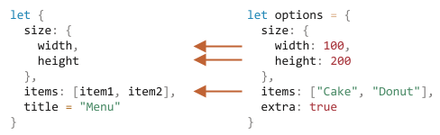

# مقداردهیِ تجزیه‌کننده‌ی ساختار

دو ساختار داده پر استفاده در جاوااسکریپت `Object` و `Array` هستند.

- شیءها به ما این امکان را می‌دهند تا چیزی بسازیم که المان‌های داده را به واسطه کلید ذخیره کند.
- آرایه‌ها به ما امکان جمع‌آوری المان‌های داده را در لیستی مرتب می‌دهند.

<<<<<<< HEAD
اگرچه، زمانی که ما آن‌ها را به تابع می‌دهیم، ممکن است که نیازی به کل یک شیء/آرایه نباشد. شاید تنها قطعه‌های تکی نیاز باشد.
 
*مقداردهیِ تجزیه‌کننده‌ی ساختار (Destructuring assignment)* یک سینتکس خاص است که به ما امکان می‌دهد تا آرایه‌ها یا شیءها را درون چند متغیر «پخش کنیم» چون بعضی اوقات این موضوع کار را راحت‌تر می‌کند.
=======
However, when we pass these to a function, we may not need all of it. The function might only require certain elements or properties.
>>>>>>> 035c5267ba80fa7b55878f7213cbde449b4092d9

تخریب ساختار همچنین با تابع‌های پیچیده که تعداد زیادی پارامتر، مقدارهای پیش‌فرض و... دارند هم به خوبی کار می‌کند. به زودی آن را خواهیم دید.

<<<<<<< HEAD
## تجزیه ساختار آرایه
=======
Destructuring also works well with complex functions that have a lot of parameters, default values, and so on. Soon we'll see that.
>>>>>>> 035c5267ba80fa7b55878f7213cbde449b4092d9

کد پایین یک مثال از چگونگی تبدیل یک آرایه به چند متغیر است:

```js
<<<<<<< HEAD
// ما یک آرایه شامل نام و نام خانوادگی داریم
=======
// we have an array with a name and surname
>>>>>>> 035c5267ba80fa7b55878f7213cbde449b4092d9
let arr = ["John", "Smith"]

*!*
// مقداردهی تجزیه‌کننده‌ی ساختار
// را قرار می‌دهد firstName = arr[0]
// surname = arr[1] و
let [firstName, surname] = arr;
*/!*

alert(firstName); // John
alert(surname);  // Smith
```

حالا ما می‌توانیم به جای اعداد آرایه با متغیرها کار کنیم.

زمانی که با `split` یا متدهای دیگری که آرایه برمی‌گردانند عالی بنظر می‌رسد:

```js run
let [firstName, surname] = "John Smith".split(' ');
alert(firstName); // John
alert(surname);  // Smith
```

<<<<<<< HEAD
همانطور که می‌بینید، سینتکس ساده است. البته چند چیز ویژه در جزییات خود دارد. بیایید برای فهمیدن بهتر آن، مثال‌های بیشتری ببینیم.

````smart header="عبارت «تجزیه‌کننده‌ی ساختار» به معنی «مخرب» نیست."
این سینتکس «مقداردهی تجزیه‌کننده‌ی ساختار» نامیده می‌شود چون با کپی کردن المان‌ها در چند متغیر «ساختار را تغییر می‌دهد». اما خود آرایه تغییر نمی‌کند.
=======
As you can see, the syntax is simple. There are several peculiar details though. Let's see more examples to understand it better.

````smart header="\"Destructuring\" does not mean \"destructive\"."
It's called "destructuring assignment," because it "destructurizes" by copying items into variables. However, the array itself is not modified.
>>>>>>> 035c5267ba80fa7b55878f7213cbde449b4092d9

فقط یک راه کوتاه‌تر برای نوشتن است:
```js
// let [firstName, surname] = arr;
let firstName = arr[0];
let surname = arr[1];
```
````

````smart header="از طریق استفاده از کاما المان‌ها را نادیده بگیرید"
المان‌هایی که که نمی‌خواهیم را می‌توان با یک کامای اضافه دور انداخت:

```js run
*!*
// به المان دوم نیاز نداریم
let [firstName, , title] = ["Julius", "Caesar", "Consul", "of the Roman Republic"];
*/!*

alert( title ); // Consul
```

<<<<<<< HEAD
در کد بالا، از المان دوم آرایه گذشتیم، المان سوم به `title` تخصیص داده شد و بقیه المان‌های آرایه هم نادیده گرفته شدند (به دلیل اینکه متغیری برای ذخیره آنها وجود ندارد).
=======
In the code above, the second element of the array is skipped, the third one is assigned to `title`, and the rest of the array items are also skipped (as there are no variables for them).
>>>>>>> 035c5267ba80fa7b55878f7213cbde449b4092d9
````

````smart header="با هر حلقه‌پذیری در سمت راست کار می‌کند"

...در واقع، ما می‌توانیم آن را با هر حلقه‌پذیری استفاده کنیم، نه فقط آرایه‌ها:

```js
let [a, b, c] = "abc"; // ["a", "b", "c"]
let [one, two, three] = new Set([1, 2, 3]);
```
این کار می‌کند چون از درون، یک مقداردهی تجزیه‌کننده‌ی ساختار با حلقه زدن در مقدار سمت راست کار می‌کند. برای فراخوانی `for..of` در مقدار سمت راست `=` و تخصیص دادن مقدارها، به نوعی خوش سینتکس است.
````


````smart header="در سمت چپ به هر چیزی تخصیص دهید"
ما می‌توانیم از «قابل مقداردهی‌ها» در سمت چپ استفاده کنیم.

برای مثال، یک ویژگی شیء:
```js run
let user = {};
[user.name, user.surname] = "John Smith".split(' ');

alert(user.name); // John
alert(user.surname); // Smith
```

````

<<<<<<< HEAD
````smart header="حلقه زدن با .entries()"
در فصل قبل ما متد [Object.entries(obj)](mdn:js/Object/entries) را دیدیم.

می‌توانیم آن را با تجزیه‌کننده‌ی ساختار برای حلقه زدن در کلیدها و مقدارهای یک شیء استفاده کنیم:
=======
````smart header="Looping with .entries()"
In the previous chapter, we saw the [Object.entries(obj)](mdn:js/Object/entries) method.

We can use it with destructuring to loop over the keys-and-values of an object:
>>>>>>> 035c5267ba80fa7b55878f7213cbde449b4092d9

```js run
let user = {
  name: "John",
  age: 30
};

<<<<<<< HEAD
// حلقه زدن در کلیدها و مقدارها
=======
// loop over the keys-and-values
>>>>>>> 035c5267ba80fa7b55878f7213cbde449b4092d9
*!*
for (let [key, value] of Object.entries(user)) {
*/!*
  alert(`${key}:${value}`); // name:John, then age:30
}
```

کد مشابه برای `Map` ساده‌تر است چون حلقه‌پذیر است:

```js run
let user = new Map();
user.set("name", "John");
user.set("age", "30");

*!*
// حلقه می‌سازد، برای تجزیه‌کننده‌ی ساختار بسیار مناسب است [key, value] با جفت‌های Map
for (let [key, value] of user) {
*/!*
  alert(`${key}:${value}`); // age:30 سپس name:John
}
```
````

````smart header="ترفند مبادله متغیرها"
یک ترفند معروف برای مبادله مقدارهای دو متغیر با استفاده از مقداردهی تجزیه‌کننده‌ی ساختار وجود دارد:

```js run
let guest = "Jane";
let admin = "Pete";

// guest=Pete، admin=Jane بیایید مقدارها را مبادله کنیم: کاری کنیم که
*!*
[guest, admin] = [admin, guest];
*/!*

alert(`${guest} ${admin}`); // Pete Jane (!با موفقیت مبادله شد)
```

اینجا ما یک آرایه موقتی از دو آرایه می‌سازیم و بلافاصله ساختار آن را نسبت به ترتیب مبادله تجزیه می‌کنیم.

می‌توانیم از این راه بیشتر از دو متغیر را مبادله کنیم.
````

### رِست '...'

معمولا، اگر آرایه طولانی‌تر از لیست سمت چپ باشد، المان‌های «اضافی» از قلم می‌افتند.

برای مثال، اینجا فقط دو المان دریافت می‌شود و بقیه نادیده گرفته می‌شوند:

```js run
let [name1, name2] = ["Julius", "Caesar", "Consul", "of the Roman Republic"];

alert(name1); // Julius
alert(name2); // Caesar
// المان‌های بعدی جایی ذخیره نمی‌شوند
```

اگر بخواهیم تمام المان‌های بعدی را دریافت کنیم -- می‌توانیم یک پارامتر دیگر اضافه کنیم که با استفاده از `"..."` «بقیه المان‌ها» را دریافت کند:

```js run
let [name1, name2, *!*...rest*/!*] = ["Julius", "Caesar", *!*"Consul", "of the Roman Republic"*/!*];

*!*
<<<<<<< HEAD
// آرایه‌ای از المان‌ها است که از المان سوم شروع می‌شود rest
=======
// rest is an array of items, starting from the 3rd one
>>>>>>> 035c5267ba80fa7b55878f7213cbde449b4092d9
alert(rest[0]); // Consul
alert(rest[1]); // of the Roman Republic
alert(rest.length); // 2
*/!*
```
 
مقدار `rest` آرایه‌ای از المان‌های باقی مانده است.

می‌توانیم از هر اسم دیگری به جای `rest` برای متغیر استفاده کنیم، فقط مطمئن شوید که قبل از آن سه نقطه وجود دارد و در انتهای مقداردهی تجزیه‌کننده‌ی ساختار قرار می‌گیرد.

```js run
let [name1, name2, *!*...titles*/!*] = ["Julius", "Caesar", "Consul", "of the Roman Republic"];
// titles = ["Consul", "of the Roman Republic"] حالا داریم
```

### مقدارهای پیش‌فرض

<<<<<<< HEAD
اگر آرایه از لیست متغیرهای سمت چپ کوتاه‌تر باشد، هیچ اروری ایجاد نمی‌شود. مقدارهای ناموجود undefined در نظر گرفته می‌شوند:
=======
If the array is shorter than the list of variables on the left, there will be no errors. Absent values are considered undefined:
>>>>>>> 035c5267ba80fa7b55878f7213cbde449b4092d9

```js run
*!*
let [firstName, surname] = [];
*/!*

alert(firstName); // undefined
alert(surname); // undefined
```

ما یک مقدار «پیش‌فرض» بخواهیم که جایگزین مقدار ناموجود شود، می‌توانیم با استفاده از `=` آن را فراهم کنیم:

```js run
*!*
// مقدارهای پیش‌فرض
let [name = "Guest", surname = "Anonymous"] = ["Julius"];
*/!*

alert(name);    // Julius (از آرایه)
alert(surname); // Anonymous (مقدار پیش‌فرض استفاده شد)
```

مقدارهای پیش‌فرض می‌توانند عبارات پیچیده‌تر یا حتی فراخوانی تابع باشند. آنها فقط زمانی که مقدار وجود نداشته باشد ارزیابی می‌شوند.

برای مثال، اینجا ما از تابع `prompt` برای دو مقدار پیش‌فرض استفاده کردیم:

```js run
// اجرا می‌شود prompt تابع suname فقط برای
let [name = prompt('name?'), surname = prompt('surname?')] = ["Julius"];

alert(name);    // Julius (از آرایه)
alert(surname); // دریافت کند prompt هر چیزی که
```

لطفا در نظر داشته باشید: `prompt` فقط برای مقدار ناموجود (`surname`) اجرا می‌شود.

## تجزیه ساختار شیء

مقداردهی تجزیه‌کننده‌ی ساختار با شیءها هم کار می‌کند.

سینتکس ساده آن اینگونه است:

```js
let {var1, var2} = {var1:…, var2:…}
```

ما باید یک شیء موجود که می‌خواهیم آن را در چند متغیر پخش کنیم در سمت راست داشته باشیم. سمت چپ شامل یک «الگوی» شیء مانند برای ویژگی‌های متناظر می‌شود. در ساده‌ترین حالت، یک لیست از اسم‌های متغیر در `{...}` است.

برای مثال:

```js run
let options = {
  title: "Menu",
  width: 100,
  height: 200
};

*!*
let {title, width, height} = options;
*/!*

alert(title);  // Menu
alert(width);  // 100
alert(height); // 200
```
 
ویژگی‌های `options.title`، `options.width` و `options.height` به متغیرهای متناظر تخصیص داده شده‌اند.

ترتیب مهم نیست. اینگونه هم کار می‌کند:

```js
// تغییر دادیم let {...} ترتیب را در
let {height, width, title} = { title: "Menu", height: 200, width: 100 }
```

الگوی سمت راست ممکن است پیچیده‌تر باشد و رابطه بین ویژگی‌ها و متغیرها را تعیین کند.

اگر ما بخواهیم که یک ویژگی را به یک متغیر با نامی دیگر تخصیص بدهیم، برای مثل، کاری کنیم که `options.width` در متغیری به نام `w` ذخیره شود، می‌توانیم اسم متغیر یا با استفاده از دو نقطه تنظیم کنیم:

```js run
let options = {
  title: "Menu",
  width: 100,
  height: 200
};

*!*
// { sourceProperty: targetVariable }
let {width: w, height: h, title} = options;
*/!*

// width -> w
// height -> h
// title -> title

alert(title);  // Menu
alert(w);      // 100
alert(h);      // 200
```

دو نقطه نشان می‌دهد که «چه چیزی : کجا ذخیره می‌شود». در مثال بالا ویژگی `width` درون `w`، ویژگی `height` درون `h` ذخیره و `title` به اسمی مشابه با خودش تخصیص داده می‌شود.

برای ویژگی‌هایی که ممکن است موجود نباشند ما می‌توانیم با استفاده از `"="` مقدار پیش‌فرض قرار دهیم، مثلا اینگونه:

```js run
let options = {
  title: "Menu"
};

*!*
let {width = 100, height = 200, title} = options;
*/!*

alert(title);  // Menu
alert(width);  // 100
alert(height); // 200
```

درست مانند آرایه‌ها یا پارامترهای تابع، مقدارهای پیش‌فرض می‌توانند هر عبارتی یا حتی فراخوانی تابع باشند. اگر مقدار موجود نباشد، آنها ارزیابی می‌شوند.

در کد زیر `prompt` برای `width` درخواست می‌کند اما برای `title` نه:

```js run
let options = {
  title: "Menu"
};

*!*
let {width = prompt("width?"), title = prompt("title?")} = options;
*/!*

alert(title);  // Menu
alert(width);  // (باشد prompt هر چیزی که نتیجه)
```

همچنین ما می‌توانیم دو نقطه و برابر قرار دادن را با هم ترکیب کنیم:

```js run
let options = {
  title: "Menu"
};

*!*
let {width: w = 100, height: h = 200, title} = options;
*/!*

alert(title);  // Menu
alert(w);      // 100
alert(h);      // 200
```

اگر ما یک شیء پیچیده با تعداد زیادی ویژگی داشته باشیم، می‌توانیم فقط چیزی که نیاز داریم را استخراج کنیم:

```js run
let options = {
  title: "Menu",
  width: 100,
  height: 200
};

// را به عنوان متغیر استخراج کنید title فقط
let { title } = options;

alert(title); // Menu
```

### الگوی رست "..."

اگر شیء بیشتر از تعدادی که ما متغیر داریم ویژگی داشته باشد چه اتفاقی می‌افتد؟ آیا می‌توانیم بعضی از آنها را دریافت کنیم و «بقیه» را جایی دیگر ذخیره کنیم؟

می‌توانیم از الگوری رست استفاده کنیم، درست همانطور که با آرایه‌ها این کار را کردیم. این کار توسط بعضی از مرورگرهای قدیمی پشتیبانی نمی‌شود (IE، از Babel برای رفع این مشکل استفاده کنید) اما در مرورگرهای جدید کار می‌کند.

اینگونه بنظر می‌رسد:

```js run
let options = {
  title: "Menu",
  height: 200,
  width: 100
};

*!*
// title = title ویژگی‌ای به اسم 
// rest = شیءای شامل بقیه ویژگی‌ها
let {title, ...rest} = options;
*/!*

// title="Menu" ،rest={height: 200, width: 100} حالا داریم
alert(rest.height);  // 200
alert(rest.width);   // 100
```

````smart header="اگر `let` وجود نداشته باشد گرفتار می‌شویم"
در مثال‌های بالا متغیرها دقیقا درون مقداردهی تعریف شدند: `let {…} = {…}`. قطعا ما می‌توانستیم بدون `let`، از متغیرهای موجود هم استفاده کنیم. اما یک مشکل وجود دارد.

این کار نمی‌کند:
```js run
let title, width, height;

// در این خط ارور می‌گیریم
{title, width, height} = {title: "Menu", width: 200, height: 100};
```

مشکل اینجاست که جاوااسکریپت در کد اصلی (نه درون یک عبارت دیگر) با `{...}` به عنوان یک بلوک کد رفتار می‌کند. چنین بلوک‌های کدی می‌توانند برای گروه‌بندی دستورات استفاده شوند، مثلا اینگونه:

```js run
{
  // یک بلوک کد
  let message = "سلام";
  // ...
  alert( message );
}
```

پس اینجا جاوااسکریپت فرض می‌کند که ما یک بلوک کد داریم و به همین دلیل است که ارور ایجاد می‌شود. به جای آن ما تجزیه ساختار می‌خواهیم.

برای اینکه به جاوااسکریپت نشان دهیم که این یک بلوک کد نیست، می‌توانیم عبارت را درون پرانتز `(...)` قرار دهیم:

```js run
let title, width, height;

// الان مناسب است
*!*(*/!*{title, width, height} = {title: "Menu", width: 200, height: 100}*!*)*/!*;

alert( title ); // Menu
```
````

## تجزیه ساختار تودرتو

<<<<<<< HEAD
اگر یک شیء یا آرایه، شیء و آرایه‌های تودرتو دیگری را شامل شود، ما می‌توانیم از الگوری پیچیده‌تری در سمت چپ برای استخراج قسمت‌های عمیق‌تر استفاده کنیم.
=======
If an object or an array contains other nested objects and arrays, we can use more complex left-side patterns to extract deeper portions.
>>>>>>> 035c5267ba80fa7b55878f7213cbde449b4092d9

در کد زیر `options` یک شیء دیگری درون ویژگی `size` و یک آرایه درون ویژگی `items` دارد. الگوی سمت چپ مقداردهی ساختار یکسانی برای استخراج مقدار از آنها را دارد:

```js run
let options = {
  size: {
    width: 100,
    height: 200
  },
  items: ["Cake", "Donut"],
  extra: true
};

// مقداردهی تجزیه‌کننده‌ی ساختار برای واضح بودن در چند خط قرار گرفته است
let {
  size: { // را اینجا قرار دهید size
    width,
    height
  },
  items: [item1, item2], // را اینجا تخصیص دهید items
  title = "Menu" // در شیء وجود ندارد (مقدار پیش‌فرض استفاده می‌شود)
} = options;

alert(title);  // Menu
alert(width);  // 100
alert(height); // 200
alert(item1);  // Cake
alert(item2);  // Donut
```

<<<<<<< HEAD
تمام ویژگی‌های شیء `options` به جز `extra` که در سمت چپ وجود ندارد، به متغیرهای متناظر خود تخصیص داده شده‌اند:
=======
All properties of `options` object except `extra` which is absent in the left part, are assigned to corresponding variables:
>>>>>>> 035c5267ba80fa7b55878f7213cbde449b4092d9



سرانجام، ما `width`، `height`، `item1`، `item2` و متغیر `title` را از مقدار پیش‌فرض داریم.

در نظر داشته باشید که هیچ متغیری برای `size` و `items` وجود ندارد چون به جای آنها، ما محتوایشان را می‌خواهیم.

## پارامترهای هوشمند تابع

<<<<<<< HEAD
بعضی اوقات پیش می‌آید که یک تابع پارامترهای زیادی داشته باشد که اکثر آنها الزامی نیستند. خصوصا برای رابط کاربری این اتفاق می‌افتد. یک تابع را تصور کنید که یک منو ایجاد می‌کند. این منو ممکن است دارای طول(width)، ارتفاع(height)، عنوان(title)، لیستی از کالاها و غیره باشد.

این یک راه برای نوشتن چنین تابعی است:
=======
There are times when a function has many parameters, most of which are optional. That's especially true for user interfaces. Imagine a function that creates a menu. It may have a width, a height, a title, an item list and so on.

Here's a bad way to write such a function:
>>>>>>> 035c5267ba80fa7b55878f7213cbde449b4092d9

```js
function showMenu(title = "Untitled", width = 200, height = 100, items = []) {
  // ...
}
```

<<<<<<< HEAD
در واقعیت، مشکل این است که چگونه ترتیب آرگومان‌ها را به یاد بسپاریم. معمولا محیط‌های کدنویسی (IDE) سعی می‌کنند به ما کمک کنند، مخصوصا اگر کد، مستند خوبی داشته باشد اما باز هم... مشکل دیگری که وجود دارد این است که چگونه یک تابع را زمانی که اکثر پارامترها به صورت پیش‌فرض مشکلی ندارند فراخوانی کنیم.
=======
In real-life, the problem is how to remember the order of arguments. Usually, IDEs try to help us, especially if the code is well-documented, but still... Another problem is how to call a function when most parameters are ok by default.
>>>>>>> 035c5267ba80fa7b55878f7213cbde449b4092d9

مثلا اینگونه؟

```js
// می‌گذاریم undefined جایی که مقدارهای پیش‌فرض مشکلی ندارند
showMenu("My Menu", undefined, undefined, ["Item1", "Item2"])
```

این قشنگ نیست. و زمانی که با پارامترهای بیشتری سر و کار داشته باشیم خوانایی کمتری دارد.

تجزیه ساختار به نجات ما می‌آید!

ما می‌توانیم پارامترها را به عنوان شیء رد کنیم و تابع بلافاصله با تجزیه ساختار، آنها را در متغیرها پخش می‌کند:

```js run
// ما شیء را به تابع می‌دهیم
let options = {
  title: "My menu",
  items: ["Item1", "Item2"]
};

// و تابع بلافاصله آن را در متغیرها پراکنده می‌کند...
function showMenu(*!*{title = "Untitled", width = 200, height = 100, items = []}*/!*) {
  // ،از شیء گرفته شده‌اند title ،items
  // ،مقدارهای پیش‌فرض استفاده شدند width ،height
  alert( `${title} ${width} ${height}` ); // My Menu 200 100
  alert( items ); // Item1, Item2
}

showMenu(options);
```

همچنین می‌توانیم از تجزیه ساختار پیچیده‌تری همراه با شیءهای تودرتو و طراحی دو نقطه‌ای استفاده کنیم:

```js run
let options = {
  title: "My menu",
  items: ["Item1", "Item2"]
};

*!*
function showMenu({
  title = "Untitled",
  width: w = 100,  // می‌رود w درون width
  height: h = 200, // می‌رود h درون height
  items: [item1, item2] // می‌رود item2 و دومی درون item1 درون items اولین المان
}) {
*/!*
  alert( `${title} ${w} ${h}` ); // My Menu 100 200
  alert( item1 ); // Item1
  alert( item2 ); // Item2
}

showMenu(options);
```

سینتکس کامل برای یک مقداردهی تجزیه‌کننده‌ی ساختار یکسان است:
```js
function({
  incomingProperty: varName = defaultValue
  ...
})
```

<<<<<<< HEAD
سپس به صورت پیش‌فرض، برای یک شیء شامل پارامترها، یک متغیر `varName` (اسم متغیر) برای ویژگی `incomingProperty` (ویژگی ورودی)، همراه با `defaultValue` وجود خواهد داشت.
=======
Then, for an object of parameters, there will be a variable `varName` for the property `incomingProperty`, with `defaultValue` by default.
>>>>>>> 035c5267ba80fa7b55878f7213cbde449b4092d9

لطفا در نظر داشته باشید که چنین تجزیه ساختاری فرض می‌کند که `showMenu()` یک آرگومان دارد. اگر ما تمام مقدارهای پیش‌فرض را بخواهیم، پس باید یک شیء خالی مشخص کنیم:

```js
showMenu({}); // خب، تمام مقدارها پیش‌فرض هستند

showMenu(); // این ارور خواهد داد
```

ما می‌توانیم با قرار دادن `{}` به عنوان مقدار پیش‌فرض برای تمام شیء شامل پارامترها این مشکل را رفع کنیم:

```js run
function showMenu({ title = "Menu", width = 100, height = 200 }*!* = {}*/!*) {
  alert( `${title} ${width} ${height}` );
}

showMenu(); // Menu 100 200
```

در کد بالا، تمام شیء آرگومان‌ها به صورت پیش‌فرض `{}` است پس همیشه چیزی برای تجزیه ساختار وجود دارد.

## خلاصه

- مقداردهی تجزیه‌کننده‌ی ساختار به ما اجازه می‌دهد تا بلافاصله یک شیء یا آرایه را روی بسیاری از متغیرها ترسیم کنیم.
- سینتکس کامل شیء:
    ```js
    let {prop : varName = defaultValue, ...rest} = object
    ```

    این به این معنی است که ویژگی `prop` باید درون متغیر `varName` برود و اگر چنین ویژگی‌ای وجود نداشت، سپس مقدار `default` باید استفاده شود.

    ویژگی‌های شیء که نقشی برای آنها وجود ندارد درون شیء `rest` کپی می‌شوند.

- سینتکس کامل آرایه:

    ```js
    let [item1 = defaultValue, item2, ...rest] = array
    ```

<<<<<<< HEAD
    المان اول درون `item1` می‎رود؛ المان دوم درون `item2` می‌شود، تمام المان‌های باقی مانده آرایه `rest` را تشکیل می‌دهند.
=======
    The first item goes to `item1`; the second goes into `item2`, and all the rest makes the array `rest`.
>>>>>>> 035c5267ba80fa7b55878f7213cbde449b4092d9

- استخراج داده از آرایه/شیءهای تودرتو هم ممکن است، برای اینکار سمت چپ باید ساختار یکسانی با سمت راست داشته باشد.