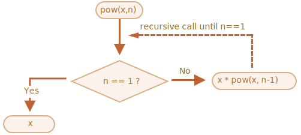

# بازگشت و پشته

بیایید برگردیم به تابع‌ها و آن‌ها را عمیق‌تر مطالعه کنیم.

اولین موضوع ما *بازگشت (recursion)* خواهد بود.

اگر شما در برنامه‌نویسی تازه‌کار نیستید، احتمالا این برای شما آشنا است و می‌توانید این فصل را رد کنید.

بازگشت یک الگوی برنامه‌نویسی است که در مواقعی که یک کار به طور طبیعی می‌تواند به چند کار از نوع یکسان اما ساده‌تر تقسیم شود کاربرد دارد. یا زمانی که کاری می‌تواند به عملی آسان به علاوه‌ی یک نوع ساده‌تر از همان کار ساده‌سازی شود. یا همانطور که به زودی خواهیم دید، برای کنار آمدن با بعضی از ساختارهای داده.

زمانی که یک تابع کاری را انجام می‌دهد، در فرایند آن، تابع می‌تواند تعداد زیادی از تابع‌های دیگر را فرا بخواند. یک مورد جرئی از این موضوع زمانی است که تابع *خودش* را فراخوانی می‌کند. به این عمل *بازگشت (recursion)* می‌گویند.

## دو طرز فکر

برای اینکه با چیزی ساده شروع کنیم، بیایید بک تابع `pow(x, n)` بنویسیم که `x` را به توانی طبیعی از `n` می‌رساند. به عبارتی دیگر، `x` را `n` بار در خودش ضرب می‌کند.

```js
pow(2, 2) = 4
pow(2, 3) = 8
pow(2, 4) = 16
```

دو راه برای پیاده‌سازی آن وجود دارد.

1. طرز فکر تکرارشونده: حلقه `for`:

    ```js run
    function pow(x, n) {
      let result = 1;

      // ضرب می‌کند x بار در n را result در حلقه
      for (let i = 0; i < n; i++) {
        result *= x;
      }

      return result;
    }

    alert( pow(2, 3) ); // 8
    ```

2. طرز فکر بازگشتی: کار را ساده کن و خودت را فراخوانی کن:

    ```js run
    function pow(x, n) {
      if (n == 1) {
        return x;
      } else {
        return x * pow(x, n - 1);
      }
    }

    alert( pow(2, 3) ); // 8
    ```

لطفا در نظر داشته باشید که نوع بازگشتی از پایه تفاوت دارد.

زمانی که `pow(x, n)` فراخوانی می‌شود، اجرای آن به دو بخش تقسیم می‌شود:

```js
              if n==1  = x
             /
pow(x, n) =
             \       
              else     = x * pow(x, n - 1)
```

1. اگر `n == 1`، سپس همه چیز بدیهی می‎شود. به آن *پایه* بازگشت می‌گویند چون بلافاصله نتیجه واضحی را ایجاد می‌کند: `pow(x, 1)` برابر با `x` است.
2. در غیر این صورت، ما می‌تونیم `pow(x, n)` را به عنوان نمایش دهیم. در ریاضیات، ممکن است کسی اینگونه <code>x<sup>n</sup> = x * x<sup>n-1</sup></code> بنویسد. به آن *مرحله بازگشتی* می‌گویند: ما می‌توانیم کار را به یک عمل ساده‌تر (ضرب در `x`) و یک فراخوانی ساده از کار یکسان (`pow` به همراه `n` کمتر) تبدیل کنیم. مرحله‌های بعدی آن را بیشتر و بیشتر ساده می‌کنند تا `n` به `1` برسد.

ما همچنین می‌توانیم بگوییم که `pow` *به طور بازگشتی* تا زمانی که `n == 1` باشد خودش را فراخوانی می‌کند.




برای مثال، برای محاسبه `pow(2, 4)` نوع بازگشتی این مراحل را می‌گذراند:

1. `pow(2, 4) = 2 * pow(2, 3)`
2. `pow(2, 3) = 2 * pow(2, 2)`
3. `pow(2, 2) = 2 * pow(2, 1)`
4. `pow(2, 1) = 2`

پس بازگشت، یک فراخوانی تابع را به فراخوانی‌ای ساده‌تر تبدیل می‌کند و سپس، به چیزی ساده‌تر و همینطور ادامه پیدا می‌کند تا نتیجه واضح باشد.

````smart header="بازگشت معمولا کوتاه‌تر است"
یک راه حل بازگشتی معمولا از راه حل تکرارشونده کوتاه‌تر است.

اینجا می‌توانیم کدی یکسان را با استفاده از عملگر `?` به جای `if` بنویسیم تا `pow(x, n)` را در حالی که هنوز هم خوانا باشد کوتاه‌تر کنیم:

```js run
function pow(x, n) {
  return (n == 1) ? x : (x * pow(x, n - 1));
}
```
````

حداکثر تعداد فراخوانی‌های تودرتو (شامل اولی هم می‌شود) را *عمق بازگشت (recursion depth)* می‌گویند. در مورد ما، این تعداد دقیقا `n` خواهد بود.

عمق بازگشت حداکثری توسط موتور جاوااسکریپت محدود می‌شود. ما می‌توانیم به 10000 بودن آن اعتماد کنیم، بعضی از موتورها بیشتر را هم مجاز می‌دانند، اما 100000 احتمالا از محدودیت بیشتر آنها خارج است. بهینه‌سازی‌های خودکاری هستند که به کاهش این عدد کمک می‌کنند («بهینه‌سازی‌های فراخوانی‌های پی‌در‎پی») اما آنها هنوز در همه‌جا پشتیبانی نمی‌شوند و فقط در موارد ساده کار می‌کنند.

این موضوع کاربرد بازگشت را محدود می‌کند اما هنوز هم بسیار گسترده است. کارهای زیادی هستند که طرز فکر بازگشتی، برای آنها کد ساده‌تر و راحت‌تری در نگهداری ارائه می‌دهد.

## زمینه‌ی اجرا و پشته

حالا بیایید بررسی کنیم که فراخوانی‌های بازگشتی چگونه کار می‌کنند. برای این کار ما به اتفاقات پشت پرده در تابع نگاه می‌اندازیم.

اطلاعاتی که درباره فرایند اجرای یک تابع درحال اجرا هستند در *زمینه‌ی اجرا (execution context)* آن ذخیره می‌شوند.

[زمینه‌ی اجرا](https://tc39.github.io/ecma262/#sec-execution-contexts) یک ساختار داده داخلی است که جزئیاتی درباره اجرای تابع را شامل می‌شود: جایی که روند کنترل در آن است، متغیرهای کنونی، مقدار `this` (ما اینجا از آن استفاده نمی‌کنیم) و چند چیز داخلی دیگر.

یک فراخوانی تابع دقیقا یک زمینه‌ی اجرا دارد که به آن اختصاص دارد.

زمانی که یک تابع فراخوانی تودرتو می‌سازد، موارد زیر اتفاق می‌افتند:

- تابع کنونی موقتا متوقف می‌شود.
- زمینه‌ی اجرای اختصاص یافته به آن در یک ساختار داده خاص به نام *پشته زمینه‌ی اجرا (execution context stack)* ذخیره می‌شود.
- فراخوانی تودرتو اجرا می‌شود.
- بعد از اینکه پایان یافت، زمینه‌ی اجرا قبلی از پشته دریافت می‌شود و تابع بیرونی از جایی که متوقف شده بود ادامه می‌یابد.

بیایید ببینیم در حین فراخوانی `pow(2, 3)` چه اتفاقی می‌افتد.

### تابع pow(2, 3)

در ابتدای فراخوانی `pow(2, 3)` زمینه‌ی اجرا متغیرها را ذخیره می‌کند: `x = 2, n = 3`، مسیر اجرا حالا در خط `1` تابع قرار دارد.

ما می‌توانیم آن را به این صورت نمایش دهیم:

<ul class="function-execution-context-list">
  <li>
    <span class="function-execution-context">Context: { x: 2, n: 3, at line 1 }</span>
    <span class="function-execution-context-call">pow(2, 3)</span>
  </li>
</ul>

این زمانی است که تابع شروع به اجرا شدن می‌کند. شرط `n == 1` falsy است پس مسیر به شاخه دوم `if` ادامه می‌دهد:

```js run
function pow(x, n) {
  if (n == 1) {
    return x;
  } else {
*!*
    return x * pow(x, n - 1);
*/!*
  }
}

alert( pow(2, 3) );
```


متغیرها یکسان هستند اما خط تغییر می‌کند پس زمینه الان اینگونه است:

<ul class="function-execution-context-list">
  <li>
    <span class="function-execution-context">Context: { x: 2, n: 3, at line 5 }</span>
    <span class="function-execution-context-call">pow(2, 3)</span>
  </li>
</ul>

برای محاسبه `x * pow(x, n - 1)`، ما باید یک زیرفراخوانی از `pow` با آرگومان‌های جدید `pow(2, 2)` بسازیم.

### تابع pow(2, 2)

برای اینکه یک فراخوانی تودرتو داشته باشیم، جاوااسکریپت زمینه‌ی اجرای کنونی را در *پشته زمینه‌ی اجرا* به یاد می‌سپارد.

اینجا ما تابع یکسان `pow` را فراخوانی می‌کنیم اما این موضوع اصلا مهم نیست. فرایند برای تمام تابع‌ها یکسان است:

1. زمینه‌ی کنونی در بالای پشته «به خاطر سپرده می‌شود».
2. زمینه‌ی جدید برای زیرفراخوانی ایجاد می‌شود.
3. زمانی که زیرفراخوانی تمام شود، زمینه‌ی قبلی از پشته بیرون می‌آید و اجرای آن ادامه پیدا می‌کند.

زمانی که ما وارد زیرفراخوانی `pow(2, 2)` شدیم پشته زمینه اینگونه خواهد بود:

<ul class="function-execution-context-list">
  <li>
    <span class="function-execution-context">Context: { x: 2, n: 2, at line 1 }</span>
    <span class="function-execution-context-call">pow(2, 2)</span>
  </li>
  <li>
    <span class="function-execution-context">Context: { x: 2, n: 3, at line 5 }</span>
    <span class="function-execution-context-call">pow(2, 3)</span>
  </li>
</ul>

زمینه‌ی اجرای کنونی در بخش بالایی (و پر رنگ) است و زمینه‌های حفظ شده قدیمی در بخش پایینی هستند.

زمانی که ما زیرفراخوانی را به پایان رساندیم، ادامه دادن زمینه‌ی قبلی آسان است چون هر دو متغیر و محل دقیق کد که در آنجا متوقف شد را حفظ می‌کند.

```smart
اینجا در تصویر ما از کلمه «خط(line)» استفاده کردیم چون در مثال ما فقط یک زیرفراخوانی در خط وجود دارد اما به طور کلی یک خط ممکن است چند زیرفراخوانی را شامل شود، مثلا `pow(…) + pow(…) + somethingElse(…)`.

بنابراین اینکه بگوییم مسیر اجرا «بلافاصله بعد از زیرفراخوانی» ادامه می‌یابد دقیق‌تر است.
```

### تابع pow(2, 1)

فرایند تکرار می‌شود: در خط `5` یک زیرفراخوانی جدید با آرگومان‌های `x=2`، `n=1` ایجاد می‌شود.

یک زمینه‌ی اجرای جدید ساخته می‌شود و زمینه‌ی قبلی در بالای پشته قرار می‌گیرد:

<ul class="function-execution-context-list">
  <li>
    <span class="function-execution-context">Context: { x: 2, n: 1, at line 1 }</span>
    <span class="function-execution-context-call">pow(2, 1)</span>
  </li>
  <li>
    <span class="function-execution-context">Context: { x: 2, n: 2, at line 5 }</span>
    <span class="function-execution-context-call">pow(2, 2)</span>
  </li>
  <li>
    <span class="function-execution-context">Context: { x: 2, n: 3, at line 5 }</span>
    <span class="function-execution-context-call">pow(2, 3)</span>
  </li>
</ul>

حالا 2 زمینه‌ی قدیمی وجود دارد و یک زمینه‌ی برای `pow(2, 1)` در حال اجرا است.

### خروج

در حین اجرای `pow(2, 1)` برخلاف قبل، شرط `n == 1` truthy است پس اولین شاخه `if` کار می‌کند:

```js
function pow(x, n) {
  if (n == 1) {
*!*
    return x;
*/!*
  } else {
    return x * pow(x, n - 1);
  }
}
```

فراخوانی‌های تودرتوی بیشتری وجود ندارد پس تابع کارش تمام می‌شود و `2` را برمی‌گرداند.

همانطور که تابع به پایان می‌رسد، دیگر نیازی به زمینه‌ی اجرای آن نیست پس از حافظه حذف می‌شود. زمینه‌ی قبلی از بالای پشته بازگردانده می‌شود:


<ul class="function-execution-context-list">
  <li>
    <span class="function-execution-context">Context: { x: 2, n: 2, at line 5 }</span>
    <span class="function-execution-context-call">pow(2, 2)</span>
  </li>
  <li>
    <span class="function-execution-context">Context: { x: 2, n: 3, at line 5 }</span>
    <span class="function-execution-context-call">pow(2, 3)</span>
  </li>
</ul>

فرایند اجرای `pow(2, 2)` ادامه می‌یابد. این فرایند دارای نتیجه زیرفراخوانی `pow(2, 1)` است پس می‌تواند ارزیابی `x * pow(x, n - 1)` را تمام کند و `4` را برگرداند.

سپس زمینه‌ی قبلی بازگردانده می‌شود:

<ul class="function-execution-context-list">
  <li>
    <span class="function-execution-context">Context: { x: 2, n: 3, at line 5 }</span>
    <span class="function-execution-context-call">pow(2, 3)</span>
  </li>
</ul>

زمانی که تمام شود، ما نتیجه `pow(2, 3) = 8` را داریم.

عمق بازگشت در این مورد **3** بود.

همانطور که از تصاویر بالا دیدیم، عمق بازگشت برابر با حداکثر تعداد زمینه‌ها در پشته است.

نیازمندی‌های حافظه را در نظر داشته باشید. زمینه‌ها حافظه را اشغال می‌کنند. در این مورد ما، به توان `n` رساندن در واقع برای تمام مقدارهای کمتر از `n`، به تعداد `n` زمینه حافظه نیاز دارد.

یک الگوریتم بر پایه حلقه کمتر حافظه اشغال می‌کند:

```js
function pow(x, n) {
  let result = 1;

  for (let i = 0; i < n; i++) {
    result *= x;
  }

  return result;
}
```

تابع `pow` تکرارشونده از زمینه‌ای استفاده می‌کند که در فرایند خود `i` و `result` را تغییر می‌دهد. نیازمندی‌های حافظه آن کوچک، ثابت و بدون وابستگی به `n` هستند.

**تمام بازگشت‌ها می‌توانند به عنوان یک حلقه بازنویسی شوند. نوعی که با حلقه نوشته شده است ممکن است مفیدتر باشد.**

...اما گاهی اوقات بازنویسی بدیهی نیست خصوصا زمانی که تابع با توجه به شروط از زیرفراخوانی‌های بازگشتی مختلف استفاده می‌کند و نتیجه‌های آنها را ادغام می‌کند یا زمانی که شاخه‌بندی پیچیده‌تر است. و بهینه‌سازی شاید نیاز نباشد و ارزش سختی آن را نداشته باشد.

بازگشت می‌تواند کد کوتاه‌تری ایجاد کند و درک و پشتیبانی از آن راحت‌تر باشد. به بهینه‌سازی‌ها همه جا نیاز نیست. اکثر اوقات ما به کد خوب نیاز داریم و به همین دلیل است که بازگشت استفاده می‌شود.

## پیمایش‌های بازگشتی

یکی دیگر از کاربردهای عالی بازگشت پیمایش بازگشتی است.

تصور کنید، ما یک شرکت داریم. ساختار کارمندان می‌تواند به عنوان یک شیء نمایش داده شود:

```js
let company = {
  sales: [{
    name: 'John',
    salary: 1000
  }, {
    name: 'Alice',
    salary: 1600
  }],

  development: {
    sites: [{
      name: 'Peter',
      salary: 2000
    }, {
      name: 'Alex',
      salary: 1800
    }],

    internals: [{
      name: 'Jack',
      salary: 1300
    }]
  }
};
```

به عبارتی دیگر، یک شرکت بخش‌های اداری دارد.

- یک بخش اداری ممکن است یک آرایه از کارمندان داشته باشد. برای مثال، بخش `sales`(فروش) 2 کارمند دارد: John و Alice.
- یا بخش اداری ممکن است به زیربخش‌هایی تقسیم شود، مثل `dovelopment`(توسعه) که دو شاخه دارد: `sites`(سایت‌ها) و `internals`(داخلی). هر کدام از آنها کارمندان خودشان را دارند.
- همچنین ممکن است که یک زیربخش رشد کند و به زیرزیربخش‌های اداری (یا تیم‌ها) تقسیم شود.

    برای مثال، بخش `sites` ممکن است در آینده به تیم‌های `siteA` و `siteB` تقسیم شود. و آنها، احتمال دارد، حتی بیشتر تقسیم شوند. این در تصویر وجود ندارد فقط چیزی است که در نظر داریم.

حالا بیایید بگوییم که ما یک تابع می‌خواهیم تا جمع تمام حقوق‌ها را بدست بیارد. چگونه می‌توانیم این کار را کنیم؟

یک راه‌حل تکرارشونده راحت نیست چون ساختار ساده نیست. ایده اول می‌تواند این باشد که یک حلقه `for` همراه با زیرحلقه‌ای در بخش‌های اداری سطح اول برای `company` بسازیم. اما سپس ما برای حلقه زدن در کارمندان بخش‌های سطح دوم مانند `sites` به زیرحلقه‌های تودرتوی بیشتری نیاز داریم. و سپس یک زیرحلقه دیگر برای بخش‌های سطح سوم که ممکن است در آینده نمایان شوند؟ اگر ما 3 یا 4 زیرحلقه درون کد بگذاریم تا در یک شیء پیمایش کنیم، کد نسبتا زشت می‌شود.

بیایید بازگشت را امتحان کنیم.

همانطور که می‌بینیم، زمانی که تابع ما یک بخش اداری برای جمع زدن دارد، 2 حالت احتمالی وجود دارد:

1. یا یک بخش «ساده» با *آرایه‌ای* از اشخاص است که در این صورت می‌توانیم در یک حلقه ساده حقوق‌ها را جمع بزنیم.
2. یا یک *شیء* یا `N` زیربخش است که در این صورت می‌توانیم `N` فراخوانی بازگشتی بسازیم تا مجموع را برای هر کدام از زیربخش‌ها بدست بیاریم و نتیجه‌ها را ادغام کنیم.

مورد اول پایه بازگشت است، مورد واضح و بدیهی، زمانی که ما یک آرایه داریم.

مورد دوم، زمانی که ما یک شیء داریم، مرحله بازگشتی است. یک کار پیچیده به چند کار ریز برای بخش‌های کوچکتر تقسیم شده است. آنها ممکن است دوباره تقسیم شوند اما دیر یا زود تقسیم شدن در (1) پایان می‌یابد.

الگوریتم در کد راحت‌تر خوانده می‌شود:


```js run
let company = { // شیء یکسان است، برای ساده بودن فشرده شده است
  sales: [{name: 'John', salary: 1000}, {name: 'Alice', salary: 1600 }],
  development: {
    sites: [{name: 'Peter', salary: 2000}, {name: 'Alex', salary: 1800 }],
    internals: [{name: 'Jack', salary: 1300}]
  }
};

// تابعی برای انجام کار
*!*
function sumSalaries(department) {
  if (Array.isArray(department)) { // (1) مورد
    return department.reduce((prev, current) => prev + current.salary, 0); // آرایه را جمع می‌زنیم
  } else { // (2) مورد
    let sum = 0;
    for (let subdep of Object.values(department)) {
      sum += sumSalaries(subdep); // فراخوانی بازگشتی برای زیربخش‌ها، نتیجه‌ها را جمع می‌زند
    }
    return sum;
  }
}
*/!*

alert(sumSalaries(company)); // 7700
```

این کد کوتاه و برای فهمیدن راحت است (امیدواریم). این قدرت بازگشت است. همچنین برای هر سطحی از تودرتویی زیربخش‌های اداری کار می‌کند.

اینجا نمودار فراخوانی‌ها را داریم:


می‌توانیم قاعده را به راحتی ببینیم: برای یک شیء `{...}` زیرفراخوانی ایجاد می‌شود در حالی که آرایه‌ها `[...]` «خروجی‌های« درخت بازگشت هستند و نتیجه فوری می‌دهند.

در نظر داشته باشید که کد از ویژگی‌های هوشمند که ما قبلا آنها را پوشش دادیم استفاده می‌کند:

- متد `arr.reduce` در فصل <info:array-methods> توضیح داده شد که برای گرفتن مجموع آرایه است.
- حلقه `for(val of Object.values(obj))` برای حلقه زدن در مقدارهای شیء: `Object.values` یک آرایه از آنها را برمی‌گرداند.


## ساختارهای بازگشتی

یک ساختار داده بازگشتی (تعریف شده به صورت بازگشتی) ساختاری است که خودش را در اجزا تکرار می‌کند.

ما به تازگی آن را بالاتر در مثال ساختار شرکت دیدیم.

یک *بخش اداری* شرکت برابر است با:
- یا آرایه‌ای از اشخاص.
- یک شیءای شامل *بخش‌ها*.

برای توسعه‌دهندگان وب مثال‌های شناخته‌شده‌تر وجود دارد: مستندات HTML و XML.

در سند HTML، یک *برچسب HTML* ممکن است لیستی از این‌ها را شامل شود:
- قسمت‌های متنی.
- کامنت‌های HTML.
- بقیه‌ی *برچسب‌های HTML* (که خودشان ممکن است شامل قسمت‌های متنی/کامنت‌ها یا برچسب‌های دیگر باشند).

این هم یک تعریف بازگشتی است.

برای درک بهتر، ما یک ساختار بازگشتی دیگر به نام «لیست پیوندی (Linked list)» که ممکن است در بعضی موارد جایگزینی برای آرایه‌ها باشند را پوشش می‌دهیم.

### لیست پیوندی

تصور کنید، ما می‌خواهیم یک لیست مرتب از شیءها را ذخیره کنیم.

انتخاب طبیعی می‌تواند آرایه باشد:

```js
let arr = [obj1, obj2, obj3];
```

...اما یک مشکل با آرایه‌ها وجود دارد. عمل‌های «حذف المان» و «اضافه‌کردن المان» زحمت زیادی دارند. برای مثال، عمل `arr.unshift(obj)` برای اینکه جایی برای `obj` جدید ایجاد کند باید تمام المان‌ها را دوباره عددگذاری کند و اگر آرایه بزرگ باشد، این کار زمان می‌برد. همین مشکل برای `arr.shift()` هم وجود دارد.

تنها تغییرات ساختاری که به عددگذاری دوباره عظیم نیازی ندارند آنهایی هستند که با انتهای آرایه کار انجام می‌دهند: `arr.push/pop`. پس زمانی که ما باید با آغاز آرایه کار کنیم، آرایه می‌تواند برای صف‌های طولانی بسیار کند باشد.

به منظور جایگزینی، اگر ما واقعا به حذف/اضافه کردن سریع احتیاج داریم، می‌توانیم یک ساختار داده دیگر به نام [لیست پیوندی (linked list)](https://fa.wikipedia.org/wiki/لیست_پیوندی) را انتخاب کنیم.

*المان لیست پیوندی* به صورت بازگشتی به عنوان یک شیء شامل ویژگی‌های زیر تعریف می‌شود:
- `value`.
- `next` ویژگی‌ای که به *المان لیست پیوندی* بعدی رجوع می‌کند یا اگر آخر باشد به `null`.

برای مثال:

```js
let list = {
  value: 1,
  next: {
    value: 2,
    next: {
      value: 3,
      next: {
        value: 4,
        next: null
      }
    }
  }
};
```

نمایش گرافیکی لیست:


یک کد جایگزین برای ساختن آن:

```js no-beautify
let list = { value: 1 };
list.next = { value: 2 };
list.next.next = { value: 3 };
list.next.next.next = { value: 4 };
list.next.next.next.next = null;
```

اینجا ما می‌توانیم حتی واضح‌تر ببینیم که چند شیء وجود دارند که هر کدام دارای `value` و `next` که به همسایه اشاره می‌کند هستند. متغیر `list` اولین شیء در زنجیره است پس با دنبال کردن اشاره‌گرهای `next` از آن می‌توانیم به هر المانی برسیم.

لیست می‌تواند به راحتی به چند قسمت تقسیم شود و بعدا دوباره بهم بپیوندد:

```js
let secondList = list.next.next;
list.next.next = null;
```


برای پیوند دادن:

```js
list.next.next = secondList;
```

و قطعا ما می‌توانیم المان‌ها را در هر جایی حذف یا اضافه کنیم.

برای مثال، برای اضافه کردن یک مقدار جدید به آغاز لیست، ما باید راس لیست را بروزرسانی کنیم:

```js
let list = { value: 1 };
list.next = { value: 2 };
list.next.next = { value: 3 };
list.next.next.next = { value: 4 };

*!*
// اضافه کردن مقدار جدید به آغاز لیست
list = { value: "new item", next: list };
*/!*
```


برای حذف یک مقدار از وسط، `next` قبلی را تغییر می‌دهیم:

```js
list.next = list.next.next;
```


ما کاری کردیم که `list.next` از `1` به `2` بپرد. مقدار `1` حالا از زنجیره خارج شده است. اگر جایی دیگر ذخیره نشده باشد، به طور خودکار از حافظه پاک می‌شود.

یرخلاف آرایه‌ها، هیچ عددگذاری دوباره عظیمی وجود ندارد و ما می‌توانیم به راحتی المان‌ها را دوباره تنظیم کنیم.

به طور طبیعی، لیست‌ها همیشه از آرایه‌ها بهتر نیستند. در غیر این صورت همه از لیست‌ها استفاده می‌کردند.

ضعف اصلی این است که ما نمی‌توانیم به راحتی با عدد یک المان به آن دسترسی پیدا کنیم. در یک آرایه کار راحتی است: `arr[n]` یک رجوع مستقیم است. اما در لیست ما باید از اولین المان شروع کنیم و به تعداد `N` بار به `next` برویم تا به المان Nاُم برسیم.

...اما همیشه به چنین کارهایی نیاز نداریم. برای مثال، زمانی که ما به یک صف یا حتی یک [صف دوطرفه](https://fa.wikipedia.org/wiki/صف_دوطرفه) نیاز داریم، ساختاری که باید اضافه/حذف کردن سریع را از هر دو انتها ممکن سازد اما دسترسی به وسط آن نیاز نیست.

لیست‌ها می‌توانند پیشرفت کنند:
- ما می‌توانیم ویژگی `prev` را در کنار `next` اضافه کنیم تا به المان قبلی رجوع کنیم و به راحتی به عقب برگردیم.
- همچنین می‌توانیم یک متغیر به نام `tail` که به المان آخر لیست رجوع می‌کند اضافه کنیم (و هر زمان که المانی اضافه/حذف می‌کنیم آن را اپدیت کنیم).
- ...ساختار داده می‌تواند با توجه به نیازهای ما خیلی تنوع داشته باشد.

## خلاصه

اصطلاحات:
- *بازگشت* یک عبارت برنامه‌نویسی و به معنی فراخوانی یک تابع در خودش است. تابع‌های بازگشتی می‌توانند برای حل کردن مسائل با راه‌هایی عالی استفاده شوند.

    زمانی که یک تابع خودش را فراخوانی می‌کند، به آن *مرحله بازگشت* می‌گویند. *اساس* بازگشت، آرگومان‌های تابع هستند که کار را انقدر ساده می‌کنند که تابع دیگر فراخوانی‌های بیشتری انجام نمی‌دهد.

- یک ساختار داده که به صورت [بازگشتی تعریف شده باشد](https://en.wikipedia.org/wiki/Recursive_data_type) ساختار داده‌ای است که می‌تواند با استفاده از خودش تعریف شود.

    برای مثال، لیست پیوندی می‌تواند به عنوان ساختار داده‌ای تعریف شود که شیءای رجوع‌کننده به یک لیست (یا هیچی) را شامل شود.

    ```js
    list = { value, next -> list }
    ```

<<<<<<< HEAD
    درخت‌ها مانند المان‌های HTML یا درخت بخش اداری در این فصل هم به طور طبیعی بازگشتی هستند: آنها شاخه‌شاخه می‌شوند و هر شاخه می‌تواند شاخه‌های دیگر هم داشته باشد.
=======
    Trees like HTML elements tree or the department tree from this chapter are also naturally recursive: they have branches and every branch can have other branches.
>>>>>>> 7000ede297bfd688f9a3767e8ca43abd9242f322

    همانطور که در مثال `sumSalary` دیدیم تابع‌های بازگشتی می‌توانند برای پیمایش درون آنها استفاده شوند.

هر تابع بازگشتی می‌تواند به صورت تکرارشونده بازنویسی شود. و گاهی اوقات برای بهینه کردن به آن نیاز است. اما برای بسیاری از کارها راه‌حل بازگشتی به اندازه کافی سریع و برای نوشتن و پشتیبانی کردن راحت‌تر است.
