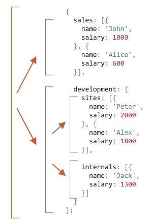
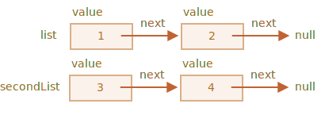

# بازگشت و استک

بیایید برگردیم به تابع‌ها و آنها را عمیق‌تر مطالعه کنیم.

اولین موضوع ما *بازگشت (recursion)* خواهد بود.

اگر شما در برنامه‌نویسی تازه‌کار نیستید، احتمالا این برای شما آشنا است و می‌توانید این فصل را رد کنید.

بازگشت یک الگوی برنامه‌نویسی است که در مواقعی که یک کار به طور طبیعی می‌تواند به چند کار از نوع یکسان اما ساده‌تر تقسیم شود کاربرد دارد. یا زمانی که کاری می‌تواند به عملی آسان به علاوه‌ی یک نوع ساده‌تر از همان کار ساده‌سازی شود. یا همانطور که به زودی خواهیم دید، برای کنار آمدن با بعضی از ساختارهای داده.

زمانی که یک تابع کاری را انجام می‌دهد، در فرایند آن، تابع می‌تواند تعداد زیادی از تابع‌های دیگر را فرا بخواند. یک مورد جرئی از این موضوع زمانی است که تابع *خودش* را فراخوانی می‌کند. به این عمل *بازگشت (recursion)* می‌گویند.

## دو طرز فکر

برای اینکه با چیزی ساده شروع کنیم، بیایید بک تابع `pow(x, n)` بنویسیم که `x` را به توانی طبیعی از `n` می‌رساند. به عبارتی دیگر، `x` را `n` بار در خودش ضرب می‌کند.

```js
pow(2, 2) = 4
pow(2, 3) = 8
pow(2, 4) = 16
```

دو راه برای پیاده‌سازی آن وجود دارد.

1. طرز فکر تکرارشونده: حلقه `for`:

    ```js run
    function pow(x, n) {
      let result = 1;

      // ضرب می‌کند x بار در n را result در حلقه
      for (let i = 0; i < n; i++) {
        result *= x;
      }

      return result;
    }

    alert( pow(2, 3) ); // 8
    ```

2. طرز فکر بازگشتی: کار را ساده کن و خودت را فراخوانی کن:

    ```js run
    function pow(x, n) {
      if (n == 1) {
        return x;
      } else {
        return x * pow(x, n - 1);
      }
    }

    alert( pow(2, 3) ); // 8
    ```

لطفا در نظر داشته باشید که نوع بازگشتی از پایه تفاوت دارد.

زمانی که `pow(x, n)` فراخوانی می‌شود، اجرای آن به دو بخش تقسیم می‌شود:

```js
              if n==1  = x
             /
pow(x, n) =
             \       
              else     = x * pow(x, n - 1)
```

1. اگر `n == 1`، سپس همه چیز بدیهی می‎شود. به آن *پایه* بازگشت می‌گویند چون بلافاصله نتیجه واضحی را ایجاد می‌کند: `pow(x, 1)` برابر با `x` است.
2. در غیر این صورت، ما می‌تونیم `pow(x, n)` را به عنوان نمایش دهیم. در ریاضیات، ممکن است کسی اینگونه <code>x<sup>n</sup> = x * x<sup>n-1</sup></code> بنویسد. به آن *مرحله بازگشتی* می‌گویند: ما می‌توانیم کار را به یک عمل ساده‌تر (ضرب در `x`) و یک فراخوانی ساده از کار یکسان (`pow` به همراه `n` کمتر) تبدیل کنیم. مرحله‌های بعدی آن را بیشتر و بیشتر ساده می‌کنند تا `n` به `1` برسد.

ما همچنین می‌توانیم بگوییم که `pow` *به طور بازگشتی* تا زمانی که `n == 1` باشد خودش را فراخوانی می‌کند.


برای مثال، برای محاسبه `pow(2, 4)` نوع بازگشتی این مراحل را می‌گذراند:

1. `pow(2, 4) = 2 * pow(2, 3)`
2. `pow(2, 3) = 2 * pow(2, 2)`
3. `pow(2, 2) = 2 * pow(2, 1)`
4. `pow(2, 1) = 2`

پس بازگشت، یک فراخوانی تابع را به فراخوانی‌ای ساده‌تر تبدیل می‌کند و سپس، به چیزی ساده‌تر و همینطور ادامه پیدا می‌کند تا نتیجه واضح باشد.

````smart header="بازگشت معمولا کوتاه‌تر است"
یک راه حل بازگشتی معمولا از راه حل تکرارشونده کوتاه‌تر است.

اینجا می‌توانیم کدی یکسان را با استفاده از عملگر `?` به جای `if` بنویسیم تا `pow(x, n)` را در حالی که هنوز هم خوانا باشد کوتاه‌تر کنیم:

```js run
function pow(x, n) {
  return (n == 1) ? x : (x * pow(x, n - 1));
}
```
````

حداکثر تعداد فراخوانی‌های تودرتو (شامل اولی هم می‌شود) را *عمق بازگشت (recursion depth)* می‌گویند. در مورد ما، این تعداد دقیقا `n` خواهد بود.

عمق بازگشت حداکثری توسط موتور جاوااسکریپت محدود می‌شود. ما می‌توانیم به 10000 بودن آن اعتماد کنیم، بعضی از موتورها بیشتر را هم مجاز می‌دانند، اما 100000 احتمالا از محدودیت بیشتر آنها خارج است. بهینه‌سازی‌های خودکاری هستند که به کاهش این عدد کمک می‌کنند («بهینه‌سازی‌های فراخوانی‌های پی‌در‎پی») اما آنها هنوز در همه‌جا پشتیبانی نمی‌شوند و فقط در موارد ساده کار می‌کنند.

این موضوع کاربرد بازگشت را محدود می‌کند اما هنوز هم بسیار گسترده است. کارهای زیادی هستند که طرز فکر بازگشتی، برای آنها کد ساده‌تر و راحت‌تری در نگهداری ارائه می‌دهد.

## زمینه‌ی اجرا و استک

حالا بیایید بررسی کنیم که فراخوانی‌های بازگشتی چگونه کار می‌کنند. برای این کار ما به اتفاقات پشت پرده در تابع نگاه می‌اندازیم.

اطلاعاتی که درباره فرایند اجرای یک تابع درحال اجرا هستند در *زمینه‌ی اجرا* آن ذخیره می‌شوند.

[زمینه‌ی اجرا](https://tc39.github.io/ecma262/#sec-execution-contexts) یک ساختار داده داخلی است که جزئیاتی درباره اجرای تابع را شامل می‌شود: جایی که روند کنترل در آن است، متغیرهای کنونی، مقدار `this` (ما اینجا از آن استفاده نمی‌کنیم) و چند چیز داخلی دیگر.

یک فراخوانی تابع دقیقا یک زمینه‌ی اجرا دارد که به آن اختصاص دارد.

زمانی که یک تابع فراخوانی تودرتو می‌سازد، موارد زیر اتفاق می‌افتند:

- تابع کنونی موقتا متوقف می‌شود.
- زمینه‌ی اجرای اختصاص یافته به آن در یک ساختار داده خاص به نام *استک زمینه‌ی اجرا* ذخیره می‌شود.
- فراخوانی تودرتو اجرا می‌شود.
- بعد از اینکه پایان یافت، زمینه‌ی اجرا قبلی از استک دریافت می‌شود و تابع بیرونی از جایی که متوقف شده بود ادامه می‌یابد.

بیایید ببینیم در حین فراخوانی `pow(2, 3)` چه اتفاقی می‌افتد.

### تابع pow(2, 3)

در ابتدای فراخوانی `pow(2, 3)` زمینه‌ی اجرا متغیرها را ذخیره می‌کند: `x = 2, n = 3`، مسیر اجرا حالا در خط `1` تابع قرار دارد.

ما می‌توانیم آن را به این صورت نمایش دهیم:

<ul class="function-execution-context-list">
  <li>
    <span class="function-execution-context">Context: { x: 2, n: 3, at line 1 }</span>
    <span class="function-execution-context-call">pow(2, 3)</span>
  </li>
</ul>

این زمانی است که تابع شروع به اجرا شدن می‌کند. شرط `n == 1` falsy است پس مسیر به شاخه دوم `if` ادامه می‌دهد:

```js run
function pow(x, n) {
  if (n == 1) {
    return x;
  } else {
*!*
    return x * pow(x, n - 1);
*/!*
  }
}

alert( pow(2, 3) );
```


متغیرها یکسان هستند اما خط تغییر می‌کند پس زمینه الان اینگونه است:

<ul class="function-execution-context-list">
  <li>
    <span class="function-execution-context">Context: { x: 2, n: 3, at line 5 }</span>
    <span class="function-execution-context-call">pow(2, 3)</span>
  </li>
</ul>

برای محاسبه `x * pow(x, n - 1)`، ما باید یک زیرفراخوانی از `pow` با آرگومان‌های جدید `pow(2, 2)` بسازیم.

### pow(2, 2)

To do a nested call, JavaScript remembers the current execution context in the *execution context stack*.

Here we call the same function `pow`, but it absolutely doesn't matter. The process is the same for all functions:

1. The current context is "remembered" on top of the stack.
2. The new context is created for the subcall.
3. When the subcall is finished -- the previous context is popped from the stack, and its execution continues.

Here's the context stack when we entered the subcall `pow(2, 2)`:

<ul class="function-execution-context-list">
  <li>
    <span class="function-execution-context">Context: { x: 2, n: 2, at line 1 }</span>
    <span class="function-execution-context-call">pow(2, 2)</span>
  </li>
  <li>
    <span class="function-execution-context">Context: { x: 2, n: 3, at line 5 }</span>
    <span class="function-execution-context-call">pow(2, 3)</span>
  </li>
</ul>

The new current execution context is on top (and bold), and previous remembered contexts are below.

When we finish the subcall -- it is easy to resume the previous context, because it keeps both variables and the exact place of the code where it stopped.

```smart
Here in the picture we use the word "line", as in our example there's only one subcall in line, but generally a single line of code may contain multiple subcalls, like `pow(…) + pow(…) + somethingElse(…)`.

So it would be more precise to say that the execution resumes "immediately after the subcall".
```

### pow(2, 1)

The process repeats: a new subcall is made at line `5`, now with arguments `x=2`, `n=1`.

A new execution context is created, the previous one is pushed on top of the stack:

<ul class="function-execution-context-list">
  <li>
    <span class="function-execution-context">Context: { x: 2, n: 1, at line 1 }</span>
    <span class="function-execution-context-call">pow(2, 1)</span>
  </li>
  <li>
    <span class="function-execution-context">Context: { x: 2, n: 2, at line 5 }</span>
    <span class="function-execution-context-call">pow(2, 2)</span>
  </li>
  <li>
    <span class="function-execution-context">Context: { x: 2, n: 3, at line 5 }</span>
    <span class="function-execution-context-call">pow(2, 3)</span>
  </li>
</ul>

There are 2 old contexts now and 1 currently running for `pow(2, 1)`.

### The exit

During the execution of `pow(2, 1)`, unlike before, the condition `n == 1` is truthy, so the first branch of `if` works:

```js
function pow(x, n) {
  if (n == 1) {
*!*
    return x;
*/!*
  } else {
    return x * pow(x, n - 1);
  }
}
```

There are no more nested calls, so the function finishes, returning `2`.

As the function finishes, its execution context is not needed anymore, so it's removed from the memory. The previous one is restored off the top of the stack:


<ul class="function-execution-context-list">
  <li>
    <span class="function-execution-context">Context: { x: 2, n: 2, at line 5 }</span>
    <span class="function-execution-context-call">pow(2, 2)</span>
  </li>
  <li>
    <span class="function-execution-context">Context: { x: 2, n: 3, at line 5 }</span>
    <span class="function-execution-context-call">pow(2, 3)</span>
  </li>
</ul>

The execution of `pow(2, 2)` is resumed. It has the result of the subcall `pow(2, 1)`, so it also can finish the evaluation of `x * pow(x, n - 1)`, returning `4`.

Then the previous context is restored:

<ul class="function-execution-context-list">
  <li>
    <span class="function-execution-context">Context: { x: 2, n: 3, at line 5 }</span>
    <span class="function-execution-context-call">pow(2, 3)</span>
  </li>
</ul>

When it finishes, we have a result of `pow(2, 3) = 8`.

The recursion depth in this case was: **3**.

As we can see from the illustrations above, recursion depth equals the maximal number of context in the stack.

Note the memory requirements. Contexts take memory. In our case, raising to the power of `n` actually requires the memory for `n` contexts, for all lower values of `n`.

A loop-based algorithm is more memory-saving:

```js
function pow(x, n) {
  let result = 1;

  for (let i = 0; i < n; i++) {
    result *= x;
  }

  return result;
}
```

The iterative `pow` uses a single context changing `i` and `result` in the process. Its memory requirements are small, fixed and do not depend on `n`.

**Any recursion can be rewritten as a loop. The loop variant usually can be made more effective.**

...But sometimes the rewrite is non-trivial, especially when function uses different recursive subcalls depending on conditions and merges their results or when the branching is more intricate. And the optimization may be unneeded and totally not worth the efforts.

Recursion can give a shorter code, easier to understand and support. Optimizations are not required in every place, mostly we need a good code, that's why it's used.

## Recursive traversals

Another great application of the recursion is a recursive traversal.

Imagine, we have a company. The staff structure can be presented as an object:

```js
let company = {
  sales: [{
    name: 'John',
    salary: 1000
  }, {
    name: 'Alice',
    salary: 1600
  }],

  development: {
    sites: [{
      name: 'Peter',
      salary: 2000
    }, {
      name: 'Alex',
      salary: 1800
    }],

    internals: [{
      name: 'Jack',
      salary: 1300
    }]
  }
};
```

In other words, a company has departments.

- A department may have an array of staff. For instance, `sales` department has 2 employees: John and Alice.
- Or a department may split into subdepartments, like `development` has two branches: `sites` and `internals`. Each of them has the own staff.
- It is also possible that when a subdepartment grows, it divides into subsubdepartments (or teams).

    For instance, the `sites` department in the future may be split into teams for `siteA` and `siteB`. And they, potentially, can split even more. That's not on the picture, just something to have in mind.

Now let's say we want a function to get the sum of all salaries. How can we do that?

An iterative approach is not easy, because the structure is not simple. The first idea may be to make a `for` loop over `company` with nested subloop over 1st level departments. But then we need more nested subloops to iterate over the staff in 2nd level departments like `sites`... And then another subloop inside those for 3rd level departments that might appear in the future? If we put 3-4 nested subloops in the code to traverse a single object, it becomes rather ugly.

Let's try recursion.

As we can see, when our function gets a department to sum, there are two possible cases:

1. Either it's a "simple" department with an *array* of people -- then we can sum the salaries in a simple loop.
2. Or it's *an object* with `N` subdepartments -- then we can make `N` recursive calls to get the sum for each of the subdeps and combine the results.

The 1st case is the base of recursion, the trivial case, when we get an array.

The 2nd case when we get an object is the recursive step. A complex task is split into subtasks for smaller departments. They may in turn split again, but sooner or later the split will finish at (1).

The algorithm is probably even easier to read from the code:


```js run
let company = { // the same object, compressed for brevity
  sales: [{name: 'John', salary: 1000}, {name: 'Alice', salary: 1600 }],
  development: {
    sites: [{name: 'Peter', salary: 2000}, {name: 'Alex', salary: 1800 }],
    internals: [{name: 'Jack', salary: 1300}]
  }
};

// The function to do the job
*!*
function sumSalaries(department) {
  if (Array.isArray(department)) { // case (1)
    return department.reduce((prev, current) => prev + current.salary, 0); // sum the array
  } else { // case (2)
    let sum = 0;
    for (let subdep of Object.values(department)) {
      sum += sumSalaries(subdep); // recursively call for subdepartments, sum the results
    }
    return sum;
  }
}
*/!*

alert(sumSalaries(company)); // 7700
```

The code is short and easy to understand (hopefully?). That's the power of recursion. It also works for any level of subdepartment nesting.

Here's the diagram of calls:



We can easily see the principle: for an object `{...}` subcalls are made, while arrays `[...]` are the "leaves" of the recursion tree, they give immediate result.

Note that the code uses smart features that we've covered before:

- Method `arr.reduce` explained in the chapter <info:array-methods> to get the sum of the array.
- Loop `for(val of Object.values(obj))` to iterate over object values: `Object.values` returns an array of them.


## Recursive structures

A recursive (recursively-defined) data structure is a structure that replicates itself in parts.

We've just seen it in the example of a company structure above.

A company *department* is:
- Either an array of people.
- Or an object with *departments*.

For web-developers there are much better-known examples: HTML and XML documents.

In the HTML document, an *HTML-tag* may contain a list of:
- Text pieces.
- HTML-comments.
- Other *HTML-tags* (that in turn may contain text pieces/comments or other tags etc).

That's once again a recursive definition.

For better understanding, we'll cover one more recursive structure named "Linked list" that might be a better alternative for arrays in some cases.

### Linked list

Imagine, we want to store an ordered list of objects.

The natural choice would be an array:

```js
let arr = [obj1, obj2, obj3];
```

...But there's a problem with arrays. The "delete element" and "insert element" operations are expensive. For instance, `arr.unshift(obj)` operation has to renumber all elements to make room for a new `obj`, and if the array is big, it takes time. Same with `arr.shift()`.

The only structural modifications that do not require mass-renumbering are those that operate with the end of array: `arr.push/pop`. So an array can be quite slow for big queues, when we have to work with the beginning.

Alternatively, if we really need fast insertion/deletion, we can choose another data structure called a [linked list](https://en.wikipedia.org/wiki/Linked_list).

The *linked list element* is recursively defined as an object with:
- `value`.
- `next` property referencing the next *linked list element* or `null` if that's the end.

For instance:

```js
let list = {
  value: 1,
  next: {
    value: 2,
    next: {
      value: 3,
      next: {
        value: 4,
        next: null
      }
    }
  }
};
```

Graphical representation of the list:


An alternative code for creation:

```js no-beautify
let list = { value: 1 };
list.next = { value: 2 };
list.next.next = { value: 3 };
list.next.next.next = { value: 4 };
list.next.next.next.next = null;
```

Here we can even more clearly see that there are multiple objects, each one has the `value` and `next` pointing to the neighbour. The `list` variable is the first object in the chain, so following `next` pointers from it we can reach any element.

The list can be easily split into multiple parts and later joined back:

```js
let secondList = list.next.next;
list.next.next = null;
```



To join:

```js
list.next.next = secondList;
```

And surely we can insert or remove items in any place.

For instance, to prepend a new value, we need to update the head of the list:

```js
let list = { value: 1 };
list.next = { value: 2 };
list.next.next = { value: 3 };
list.next.next.next = { value: 4 };

*!*
// prepend the new value to the list
list = { value: "new item", next: list };
*/!*
```


To remove a value from the middle, change `next` of the previous one:

```js
list.next = list.next.next;
```


We made `list.next` jump over `1` to value `2`. The value `1` is now excluded from the chain. If it's not stored anywhere else, it will be automatically removed from the memory.

Unlike arrays, there's no mass-renumbering, we can easily rearrange elements.

Naturally, lists are not always better than arrays. Otherwise everyone would use only lists.

The main drawback is that we can't easily access an element by its number. In an array that's easy: `arr[n]` is a direct reference. But in the list we need to start from the first item and go `next` `N` times to get the Nth element.

...But we don't always need such operations. For instance, when we need a queue or even a [deque](https://en.wikipedia.org/wiki/Double-ended_queue) -- the ordered structure that must allow very fast adding/removing elements from both ends, but access to its middle is not needed.

Lists can be enhanced:
- We can add property `prev` in addition to `next` to reference the previous element, to move back easily.
- We can also add a variable named `tail` referencing the last element of the list (and update it when adding/removing elements from the end).
- ...The data structure may vary according to our needs.

## Summary

Terms:
- *Recursion*  is a programming term that means calling a function from itself. Recursive functions can be used to solve tasks in elegant ways.

    When a function calls itself, that's called a *recursion step*. The *basis* of recursion is function arguments that make the task so simple that the function does not make further calls.

- A [recursively-defined](https://en.wikipedia.org/wiki/Recursive_data_type) data structure is a data structure that can be defined using itself.

    For instance, the linked list can be defined as a data structure consisting of an object referencing a list (or null).

    ```js
    list = { value, next -> list }
    ```

    Trees like HTML elements tree or the department tree from this chapter are also naturally recursive: they branch and every branch can have other branches.

    Recursive functions can be used to walk them as we've seen in the `sumSalary` example.

Any recursive function can be rewritten into an iterative one. And that's sometimes required to optimize stuff. But for many tasks a recursive solution is fast enough and easier to write and support.
