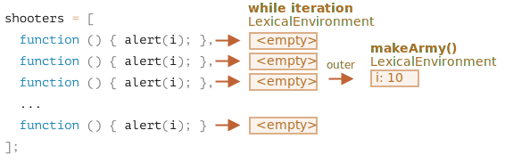

بیایید بررسی کنیم که درون `makeArmy` دقیقا چه چیزی پیش می‌آید و راه‌حل واضح می‌شود.

1. یک آرایه خالی `shooters` می‌سازد:

    ```js
    let shooters = [];
    ```
2. آن را با استفاده از `shooters.push(function)` درون حلقه از تابع‌ها پر می‌کند.

    هر المان تابع است پس نتیجه آرایه اینگونه بنظر می‌رسد:

    ```js no-beautify
    shooters = [
      function () { alert(i); },
      function () { alert(i); },
      function () { alert(i); },
      function () { alert(i); },
      function () { alert(i); },
      function () { alert(i); },
      function () { alert(i); },
      function () { alert(i); },
      function () { alert(i); },
      function () { alert(i); }
    ];
    ```

3. آرایه از تابع برگردانده می‌شود.
    
    سپس بعدها، فراخوانی هر عددی، برای مثال `army[5]()` المان `army[5]` را از آرایه دریافت می‌کند (که یک تابع است) و آن را فراخوانی می‌کند.
    
    حالا چرا تمام تابع‌ها مقدار یکسان `10` را برمی‌گردانند؟
    
    به دلیل اینکه هیچ متغیر محلی `i` درون تابع‌های `shooter` وجود ندارد. زمانی که چنین تابعی صدا زده می‌شود، `i` را از محیط لغوی بیرونی خود دریافت می‌کند.
    
    سپس مقدار `i` چه چیزی خواهد بود؟
    
    اگر ما به کد منبع نگاه کنیم:

    ```js
    function makeArmy() {
      ...
      let i = 0;
      while (i < 10) {
        let shooter = function() { // shooter تابع
          alert( i ); // باید عدد خودش را نشان دهد
        };
        shooters.push(shooter); // اضافه کردن تابع به آرایه
        i++;
      }
      ...
    }
    ```
    
    می‌توانیم ببینیم که تمام تابع‌های `shooter` در محیط لغوی تابع `makeArmy()` ساخته شده‌اند. اما زمانی که `army[5]()` فراخوانی می‌شود، `makeArmy` از قبل کار خودش را انجام داده و مقدار نهایی `i` برابر با `10` است (`while` در `i=10` می‌ایستد).
    
    به عنوان نتیجه، تمام تابع‌های `shooter` مقدار یکسان را از محیط لغوی بیرونی دریافت می‌کنند و به همین دلیل، مقدار آخر `i=10` است.
    
    
    
    همانطور که در بالا می‌بینید، در هر تکرار از بلوک `while {...}`، یک محیط لغوی جدید ساخته می‌شود. پس برای درست کردن این، ما مقدار `i` را در یک متغیر درون بلوک `while {...}` کپی می‌کنیم، مانند این:
    
    ```js run
    function makeArmy() {
      let shooters = [];
    
      let i = 0;
      while (i < 10) {
        *!*
          let j = i;
        */!*
          let shooter = function() { // shooter تابع
            alert( *!*j*/!* ); // باید عدد خودش را نشان دهد
          };
        shooters.push(shooter);
        i++;
      }
    
      return shooters;
    }
    
    let army = makeArmy();
    
    // حالا کد به درستی کار می‌کند
    army[0](); // 0
    army[5](); // 5
    ```
    
    اینجا `let j = i` یک متغیر «محلی در هر تکرار» `j` را تعریف می‌کند و `i` را در آن کپی می‌کند. مقدارهای اولیه «با مقدار خود» کپی می‌شوند پس در واقع ما یک کپی مستقل از `i` داریم که به تکرار کنونی حلقه تعلق دارد.
    
    تیراندازها به درستی کار می‌کنند چون حالا مقدار `i` کمی نزدیک‌تر شده است. درون محیط لغوی `makeArmy()` نیست بلکه در محیط لغوی متناظر با تکرار کنونی حلقه وجود دارد:
    
    
    
    اگر ما در ابتدا از `for` استفاده می‌کردیم، از چنین مشکلی جلوگیری میشد، مثل این:
    
    ```js run demo
    function makeArmy() {
    
      let shooters = [];
    
    *!*
      for(let i = 0; i < 10; i++) {
    */!*
        let shooter = function() { // shooter تابع
          alert( i ); // باید عدد خودش را نشان دهد
        };
        shooters.push(shooter);
      }
    
      return shooters;
    }
    
    let army = makeArmy();
    
    army[0](); // 0
    army[5](); // 5
    ```
    
    این کد اساسا یکسان است چون `for` در هر تکرار یک محیط لغوی جدید را ایجاد می‌کند که متغیر `i` خودش را دارد. پس `shooter` که در هر تکرار ایجاد شده است به `i` خودش از همان تکرار رجوع می‌کند.
    
    

حالا همانطور که شما زحمت زیادی را برای خواندن این راه‌حل کشیدید، دستور العمل نهایی بسیار ساده است - فقط از `for` استفاده کنید، شاید بپرسید آیا ارزش آن را داشت؟

خب اگر شما می‌توانستید به راحتی سوال را جواب دهید، راه‌حل را نمی‌خواندید. پس خوشبختانه این تکلیف باید به شما برای فهمیدن این نکات کمی کمک کرده باشد.

علاوه بر آن، مواردی وجود دارد که کسی `while` را به `for` ترجیح دهد یا سناریوهای دیگر در میان باشند که چنین مشکلاتی واقعا پیش بیایند.

