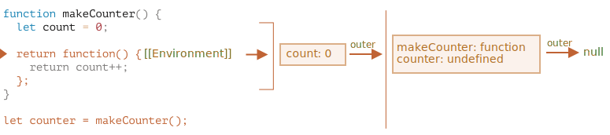

# محدوده متغیر، کلوژِر

جاوااسکریپت یک زبان بسیار تابع‌محور است. این زبان به ما آزادی زیادی می‌دهد. یک تابع می‌تواند در هر لحظه ساخته شود، به عنوان آرگومان به تابع دیگری داده شود و سپس بعدا در یک جای کاملا متفاوت از کد فراخوانی شود.

ما از قبل می‌دانیم که یک تابع می‌تواند به متغیرهای بیرون از خودش دسترسی داشته باشد (متغیرهای «بیرونی»).

اما اگر متغیرهای بیرونی از زمانی که یک تابع ساخته شد تغییر کنند چه اتفاقی می‌افتد؟ آیا تابع مقدارهای جدید را دریافت می‌کند یا قدیمی‌ها را؟

و اگر یک تابع به عنوان یک پارامتر رد و بدل شود و جای دیگری از کد فراخوانی شود، آیا به متغیرهای بیرونی در جای جدید دسترسی پیدا می‌کند؟

بیایید دانش خود را گسترده‌تر کنیم تا این سناریوها و پیچیده‌تر از اینها را درک کنیم.

```smart header="اینجا ما درباره متغیرهای `let/const` حرف می‌زنیم"
در جاوااسکریپت، 3 راه برای تعریف یک متغیر وجود دارد: `let`، `const` (این دو روش مدرن هستند) و `var` (که از گذشته باقی مانده است).

- در این مقاله ما از متغیرهای `let` در مثال‌ها استفاده می‌کنیم.
- متغیرهایی که با `const` تعریف شوند، رفتار مشابهی دارند پس این مقاله درباره `const` هم هست.
- `var` قدیمی چند تفاوت قابل توجه دارد که در مقاله <info:var> پوشش داده می‌شوند.
```

## بلوک‌های کد

اگر یک متغیر درون بلوک کد `{...}` تعریف شود، فقط درون همان بلوک قابل رویت است.

برای مثال:

```js run
{
  // یک کار با متغیرهای محلی که از بیرون نباید شناخته شوند انجام دهید

  let message = "Hello"; // فقط درون این بلوک قابل رویت است

  alert(message); // Hello
}

alert(message); // تعریف نشده است message :ارور
```

ما می‌توانیم از این خاصیت برای ایزوله کردن یک قطعه از کد که دارای متغیرهایی است که فقط به آن تعلق دارند و کار خودش را انجام می‌دهد استفاده کنیم:

```js run
{
  // نمایش پیام
  let message = "Hello";
  alert(message);
}

{
  // نمایش پیامی دیگر
  let message = "Goodbye";
  alert(message);
}
```

````smart header="بدون وجود بلوک‌ها ارور ایجاد خواهد شد"
لطفا در نظر داشته باشید که بدون بلوک‌های جدا اگر ما از `let` همراه با یک متغیر موجود استفاده کنیم، یک ارور ایجاد خواهد شد.

```js run
// نمایش پیام
let message = "Hello";
alert(message);

// نمایش پیامی دیگر
*!*
let message = "Goodbye"; // ارور: متغیر از قبل تعریف شده است
*/!*
alert(message);
```
````

برای `if`، `for`، `while` و بقیه، متغیرهایی که درون `{...}` تعریف شده باشند تنها درون آنها قابل رویت هستند:

```js run
if (true) {
  let phrase = "Hello!";

  alert(phrase); // Hello!
}

alert(phrase); // !ارور، چنین متغیری وجود ندارد
```

اینجا، بعد از اینکه `if` تمام می‌شود، `alert` متغیر `phrase` را نمی‌بیند و به همین دلیل ارور ایجاد می‌شود.

این عالی است چون به ما اجازه می‌دهد که متغیرهایی در سطح بلوک محلی بسازیم که به یک شاخه `if` اختصاص دارند.

همین موضوع برای حلقه‌های `for` و `while` هم صادق است:

```js run
for (let i = 0; i < 3; i++) {
  // قابل رویت است for فقط درون این حلقه i متغیر
  alert(i); // اول 0، سپس 1، سپس 2
}

alert(i); // ارور، چنین متغیری وجود ندارد
```

از لحاظ ظاهری، `let i` بیرون از `{...}` است. اما اینجا ساختار `for` خاص است: متغیری که درون آن ساخته شود، جزئی از بلوک کد فرض می‌شود.

## تابع‌های تودرتو

به تابعی که درون تابع دیگری ساخته شود «تودرتو» گفته می‌شود.

این کار را به راحتی در جاوااسکریپت می‌توان انجام داد.

می‌توانیم از آن برای سازماندهی کد خود استفاده کنیم، مثلا اینگونه:

```js
function sayHiBye(firstName, lastName) {

  // تابع کمک کننده که پایین‌تر استفاده می‌شود
  function getFullName() {
    return firstName + " " + lastName;
  }

  alert( "سلام " + getFullName() );
  alert( "خداحافظ " + getFullName() );

}
```

اینجا تابع *تودرتو* `getFullName()` برای راحتی استفاده شده است. این تابع می‌تواند به متغیرهای بیرونی دسترسی داشته باشد پس می‌تواند اسم کامل را برگرداند. تابع‌های تودرتو در جاوااسکریپت بسیار رایج هستند.

یک چیز جالب‌تر این است که یک تابع تودرتو می‌تواند برگردانده شود: حالا یا به عنوان یک ویژگی از شیءای جدید یا خودش به عنوان نتیجه برگردانده شود. بعدا می‌تواند در جایی دیگر مورد استفاده قرار بگیرد. مهم نیست کجا باشد، هنوز هم به متغیرهای بیرونی یکسان دسترسی دارد.

در کد پایین، `makeCounter` تابع «شمارنده» را می‌سازد که با هر بار فراخوانی عدد بعدی را برمی‌گرداند:

```js run
function makeCounter() {
  let count = 0;

  return function() {
    return count++;
  };
}

let counter = makeCounter();

alert( counter() ); // 0
alert( counter() ); // 1
alert( counter() ); // 2
```

علاوه بر اینکه ساده است، گونه‌هایی که نسبت به آن کد کمی تغییر کرده‌اند موارد استفاده کاربردی‌ای دارند، برای مثال یک [سازنده عدد تصادفی](https://fa.wikipedia.org/wiki/مولد_اعداد_شبه_تصادفی) تا برای آزمایش‌های خودکار مقدارهای تصادفی تولید کند.

این چگونه کار می‌کند؟ اگر ما چند شمارنده بسازیم، آیا آنها مستقل خواهند بود؟ چه چیزی در حال رخ دادن روی متغیرها است؟

درک چنین چیزهایی برای دانش کلی از جاوااسکریپت و سناریوهای پیچیده‌تر خوب است. پس بیایید کمی عمیق‌تر شویم.

## محیط لغوی (Lexical Environment)

```warn header="مطالب ناشناخته‌ای وجود دارند!"
توضیحات عمیق فنی را ادامه می‌خوانید.

هر چقدر که می‌خواهم از جزئیات سطح پایین زبان دوری کنم، هرگونه درکی بدون آنها کمبود دارد و کامل نیست، پس آماده باشید.
```

برای واضح بودن، توضیحات به چند مرحله تقسیم شده‌اند.

### مرحله 1. متغیرها

در جاوااسکریپت، هر تابع در حال اجرا، بلوک کد `{...}` و تمام اسکریپت، یک شیء درونی (پنهان) اختصاص یافته دارد که به عنوان *محیط لغوی* شناخته می‌شود.

شیء محیط لغوی شامل دو بخش است:

1. *ذخایر محیط (Environment Record)* -- یک شیء که تمام متغیرهای محلی را به عنوان ویژگی‌های خود (و اطلاعات دیگری مانند مقدار `this`) ذخیره می‌کند.
2. یک رجوع به *محیط لغوی بیرونی (outer)*، محیطی که به کد بیرونی اختصاص دارد.

**یک «متغیر» فقط یک ویژگی از شیء خاص درونی `Environment Record` است. «دریافت یا تغییر یک متغیر» به معنی «دریافت یا تغییر یک ویژگی از آن شیء» است.**

در این کد ساده که تابعی ندارد، تنها یک محیط لغوی وجود دارد:


این همان محیط لغوی *گلوبال* است که به تمام کد اختصاص یافته.

در تصویر بالا، مستطیل به معنای ذخایر محیط (ذخایر متغیر) است و کمان به معنی مرجع بیرونی. محیط لغوی گلوبال مرجع بیرونی ندارد و به همین دلیل است که کمان به `null` اشاره می‌کند.

همانطور که کد شروع به اجرا شدن می‌کند و ادامه می‌یابد، محیط لغوی تغییر می‌کند.

یک کد طولانی‌تر را اینجا داریم:


مستطیل‌های سمت راست نشان می‌دهند که محیط لغوی گلوبال در حین اجرا شدن چگونه تغییر می‌کند:

1. زمانی که اسکریپت شروع می‌کند، محیط لغوی از تمام متغیرهای تعریف شده پر می‌شود.
    - در ابتدا، آنها در حالت «بدون مقدار اولیه (Uninitialized)» هستند. این یک حالت درونی خاص است و به این معنی است که موتور درباره متغیر آگاه است اما تا زمانی که با `let` تعریف شود نمی‌توان به آن رجوع کرد. تقریبا مانند این است که متغیر وجود ندارد.
2. تعریف `let phrase` نمایان می‌شود. هنوز مقداردهی نشده است، پس مقدار آنها `undefined` است. ما می‌توانیم از اینجا به بعد از متغیر استفاده کنیم.
3. `phrase` یک مقدار گرفته است.
4. `phrase` مقدار را تغییر می‌دهد.

تا اینجا همه چیز ساده بنظر می‌رسد نه؟

- یک متغیر، ویژگی یک شیء خاص درونی است که به بلوک/تابع/اسکریپتی که در حال اجرا است اختصاص یافته.
- کارکردن با متغیرها در واقع کارکردن با ویژگی‌های آن شیء است.

```smart header="محیط لغوی یک شیء درون مشخصات است"
«محیط لغوی» یک شیء درون مشخصات است: این شیء فقط «به صورت تئوری» در [مشخصات زبان](https://tc39.es/ecma262/#sec-lexical-environments) وجود دارد تا چگونگی کارکردن چیزها را توصیف کند. ما نمی‌توانیم این شیء را در کدمان دریافت کنیم و آن را به صورت مستقیم دستکاری کنیم.

 تا آنجایی که رفتار قابل مشاهده همانطور که توصیف شد باقی بماند، موتورهای جاوااسکریپت ممکن است آن را بهینه کنند مثلا برای صرفه‌جویی در اشغال حافظه متغیرهایی که استفاده نمی‌شوند را حذف کنند و ترفندهای درونی دیگری را اجرا کنند.
```

### مرحله 2. Function Declaration

یک تابع هم مانند یک متغیر، مقدار است.

**تفاوت اینجاست که Function Declaration سریعا به طور کامل مقداردهی می‌شوند.**

زمانی که یک محیط لغوی ساخته می‌شود، یک Function Declaration سریعا به یک تابع آماده استفاده تبدیل می‌شود (برخلاف `let` که تا زمان تعریف آن در کد غیر قابل استفاده است).

به همین دلیل است که از تابعی که به صورت Function Declaration تعریف شده باشد، حتی قبل از رسیدن به تعریف آن می‌توانیم استفاده کنیم.

برای مثال، زمانی که ما یک تابع اضافه می‌کنیم وضعیت اولیه محیط لغوی گلوبال اینگونه است:


طبیعتا، این رفتار فقط برای Function Declarations است نه برای اعلان تابع Expression که ما یک متغیر را برابر با یک تابع قرار می‌دهیم مانند `let say = function(name)...`.

### مرحله 3. محیط‌های لغوی درونی و بیرونی

زمانی که یک تابع اجرا می‌شود، در ابتدای فراخوانی، به طور خودکار یک محیط لغوی جدید برای ذخیره متغیرهای محلی و پارامترهای فراخوانی ایجاد می‌شود.

برای مثال، برای `say("John)"` اینگونه بنظر می‌رسد (فرایند اجرا شدن در خطی است که با کمان نشانه گذاری شده است):

<!--
    ```js
    let phrase = "Hello";

    function say(name) {
     alert( `${phrase}, ${name}` );
    }

    say("John"); // Hello, John
    ```-->


در حین فراخوانی تابع ما دو محیط لغوی داریم: محیط درونی (برای فراخوانی تابع) و محیط بیرونی (گلوبال):

- محیط لغوی درونی متناظر با فرایند اجرای کنونی `say` است. این محیط یک ویژگی(property) دارد: `name` که همان آرگومان تابع است. ما `say("John")` را فراخوانی کردیم پس مقدار `name` برابر با `"John"` خواهد بود.
- محیط لغوی بیرونی همان محیط لغوی گلوبال است. این محیط متغیر `phrase` و خود تابع را شامل می‌شود.

محیط لغوی درونی یک رجوع به محیط `outer`(بیرونی) دارد.

**زمانی که کد می‌خواهد به یک متغیر دسترسی پیدا کند -- اول محیط لغوی درونی جستجو می‌شود، سپس محیط بیرونی، سپس محیط بیرونی‌تر و همینطور تا محیط لغوی گلوبال ادامه پیدا می‌کند**

اگر متغیری جایی پیدا نشود، در حالت سخت‌گیرانه(strict mode) ارور ایجاد می‌شود (بدون `use strict`، برای سازگاری با کدهای قدیمی اگر یک متغیر که موجود نیست را برای مقداردهی استفاده کنیم، یک متغیر گلوبال جدید ساخته می‌شود).

در این مثال، جستجو اینگونه پیش می‌رود:

- برای متغیر `name`، `alert` که درون `say` است بلافاصله آن را در محیط لغوی درونی پیدا می‌کند.
- زمانی که می‌خواهد به `phrase` دسترسی پیدا کند، هیچ `phrase` محلی موجود نیست، پس به محیط لغوی بیرونی رجوع و آن را آنجا پیدا می‌کند.


### مرحله 4. برگرداندن یک تابع

بیایید به مثال `makeCounter` برگردیم.

```js
function makeCounter() {
  let count = 0;

  return function() {
    return count++;
  };
}

let counter = makeCounter();
```

در ابتدای هر فراخوانی `makeCounter`، یک شیء محیط لغوی جدید ساخته می‌شود تا متغیرها را برای این فراخوانیِ `makeCounter` ذخیره کند.

بنابراین ما دو محیط لغوی تودرتو داریم، درست مانند مثال بالا:


تفاوتی که وجود دارد این است که در حین اجرای `makeCounter`، یک تابع کوچک تودرتو فقط به خاطر یک خط ایجاد می‌شود: `return count++`. ما هنوز این را اجرا نمی‌کنیم فقط می‌سازیم.

تمام تابع‌ها محیط لغوی‌ای که در آن ساخته شده‌اند را به یاد می‌سپارند. از لحاظ فنی، هیچ جادویی اینجا وجود ندارد: تمام تابع‌ها یک ویژگی پنهان `[[Environment]]` دارند که یک رجوع به محیط لغوی‌ای که تابع در آن ساخته شده است دارد:



بنابراین `counter.[[Environment]]` یک رجوع به محیط لغوی `{count: 0}` دارد. اینگونه است که تابع بدون توجه به اینکه کجا فراخوانی شده است، جایی که ساخته شده را به یاد می‌سپارد. مرجع `[[Environment]]` فقط یک بار و برای همیشه در زمان ساخت تابع تنظیم می‌شود.

بعدا، زمانی که `counter()` فراخوانی می‌شود، یک محیط لغوی جدید برای آن فراخوانی ایجاد می‌شود و مرجع محیط لغوی بیرونی آن از `counter.[[Environment]]` گرفته می‌شود:


حالا زمانی که کد، درون `counter()` را برای متغیر `count` جستجو می‌کند، ابتدا محیط لغوی خودش را جستجو می‌کند (که به دلیل نبود متغیری محلی خالی است)، سپس محیط لغویِ فراخوانیِ بیرونیِ `makeCounter()` را جستجو و آنجا آن را پیدا می‌کند و تغییرش می‌دهد.

**یک متغیر در محیط لغوی‌ای که وجود دارد تغییر می‌یابد.**

بعد از اجرا شدن وضعیت اینگونه است:


اگر ما `counter()` را چند بار فراخوانی کنیم، متغیر `count` به `2`، `3` و بیشتر در جای یکسانی افزایش می‌یابد.

```smart header="Closure(کلوژِر)"
یک عبارت کلی برنامه‌نویسی به نام "کلوژر" وجود دارد که به طور کلی توسعه‌دهندگان باید درباره آن بدانند.

یک [کلوژر](https://fa.wikipedia.org/wiki/بستار_(علوم_رایانه)) تابعی است که متغیرهای بیرون از خودش را به یاد دارد و می‌تواند به آنها دسترسی پیدا کند. در بعضی از زبان‌ها، این موضوع ممکن است یا باید یک تابع به گونه‌ای نوشته شود که این کار را انجام دهد. اما همانطور که در بالا توضیح داده شد، در جاوااسکریپت، تمام تابع‌ها به طور طبیعی کلوژر هستند (تنها یک استثنا وجود دارد که در <info:new-function> پوشش می‌دهیم).

این یعنی اینکه: آنها به طور خودکار جایی که ساخته شده‌اند را با استفاده از ویژگی پنهان `[[Environment]]` به یاد می‌سپارند و سپس کد آنها می‌تواند به متغیرهای بیرونی دسترسی پیدا کند.

زمانی که در مصاحبه کاری هستید و یک توسعه‌دهنده فرانت‌اند سوالی درباره اینکه «کلوژر چیست؟» دریافت می‌کند، به عنوان یک پاسخ معتبر می‌توانید تعریف کلوژر و یک توضیح درباره اینکه تمام تابع‌ها در جاوااسکریپت کلوژر هستند را بگویید و شاید چند کلمه درباره جزییات فنی: ویژگی `[[Environment]]` و اینکه محیط لغوی چگونه کار می‌کند.
```

## زباله‌روبی

معمولا یک محیط لغوی زمانی که فراخوانی تابع تمام می‌شود با تمام متغیرهای خود از حافظه پاک می‌شود. به این دلیل که هیچ رجوعی به آن وجود ندارد. مانند هر شیء جاوااسکریپت، فقط تا زمانی که قابل دستیابی باشد در حافظه نگهداری می‌شود.

گرچه، اگر تابع‌ای تودرتو وجود داشته باشد که بعد از پایان یک تابع هنوز قابل دسترس باشد، پس یک ویژگی `[[Environment]]` دارد که به محیط لغوی رجوع می‌کند. 

در این صورت محیط لغوی حتی بعد از تکمیل تابع هنوز قابل دسترس است پس از بین نمی‌رود.

برای مثال:

```js
function f() {
  let value = 123;

  return function() {
    alert(value);
  }
}

let g = f(); // یک رجوع به محیط لغوی را ذخیره می‌کند g.[[Environment]]
// است f() که همان محیط لغوی فراخوانی
```

لطفا در نظر داشته باشید که اگر `f()` چند بار فراخوانی شود و تابع‌های برگردانده‌شده ذخیره شوند، سپس تمام شیءهای محیط لغوی متناظر هم در حافظه نگهداری می‌شود. در کد زیر هر 3تای آنها ذخیره می‌شود:

```js
function f() {
  let value = Math.random();

  return function() { alert(value); };
}

// در آرایه 3 تابع وجود دارد، هر کدام به محیط لغوی متصل هستند
// f() محیطی از فراخوانی متناظر
let arr = [f(), f(), f()];
```

یک شیء محیط لغوی زمانی که غیر قابل دسترس شود ازبین می‌رود (درست مانند هر شیء دیگری). به عبارتی دیگر، فقط تا زمانی که حداقل یک تابع تودرتو وجود داشته باشد که به آن رجوع کند وجود خواهد داشت.

در کد زیر، بعد از اینکه تابع تودرتو حذف شود، محیط لغوی ضمیمه شده به آن (و از این رو `value`) از حافظه پاک می‌شود:

```js
function f() {
  let value = 123;

  return function() {
    alert(value);
  }
}

let g = f(); // در حافظه می‌ماند value وجود داشته باشد، متغیر g تا زمانی که تابع

g = null; // و حالا حافظه تمیز شده...
```

### بهینه‌سازی در واقعیت

همانطور که دیدیم، از لحاظ تئوری تا زمانی که یک تابع موجود است، تمام متغیرهای بیرونی هم حفظ می‌شوند.

اما در عمل، موتورهای جاوااسکریپت سعی می‌کنند که آن را بهینه کنند. آنها استفاده از متغیر را آنالیز می‌کنند و اگر از کد معلوم باشد که یک متغیر بیرونی استفاده نمی‌شود، آن را حذف می‌کنند.

**یک عارضه جانبی در موتور V8 (Chrome، Edge، Opera) این است که چنین متغیرهایی در دیباگ کردن غیر قابل دسترس می‌شوند.**

سعی کنید که مثال پایین را در Chrome بعد از بازکردن Developer Tools اجرا کنید.

زمانی که متوقف می‌شود، در کنسول `alert(value)` را تایپ کنید.

```js run
function f() {
  let value = Math.random();

  function g() {
    debugger; // ؛ چنین متغیری وجود نداردalert(value) :در کنسول تایپ کنید
  }

  return g;
}

let g = f();
g();
```

همانطور که دیدید، چنین متغیری وجود نداشت! از لحاظ تئوری، باید قابل دسترس باشد، اما موتور با بهینه‌سازی آن را ازبین برد.

این موضوع ممکن است منجر به مشکل‌های جالب (شاید وقت‌گیر) در زمان دیباگ کردن شود. یک از آنها این است که امکان دارد ما یک متغیر که هم نام با متغیر مورد نظر ما است را ببینیم:

```js run global
let value = "سوپرایز!";

function f() {
  let value = "value نزدیک ترین متغیر";

  function g() {
    debugger; // !؛ سوپرایزalert(value) در کنسول: تایپ کنید
  }

  return g;
}

let g = f();
g();
```

خوب است که درباره این خاصیت V8 بدانید. اگر در حال دیباگ کردن با Chrome/Edge/Opera باشید، به دیر یا زود با آن روبرو می‌شوید.

این یک باگ در debugger نیست بلکه یک ویژگی خاص V8 است. شاید زمانی آن را تغییر دهند. شما همیشه می‌توانید با اجرای مثال‌های این صفحه آن را بررسی کنید.
