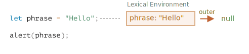

# محدوده متغیر، closure

جاوااسکریپت یک زبان بسیار تابع‌محور است. این زبان به ما آزادی زیادی می‌دهد. یک تابع می‌تواند در هر لحظه ساخته شود، به عنوان آرگومان به تابع دیگری داده شود و سپس بعدا در یک جای کاملا متفاوت از کد فراخوانی شود.

ما از قبل می‌دانیم که یک تابع می‌تواند به متغیرهای بیرون از خودش دسترسی داشته باشد (متغیرهای «بیرونی»).

اما اگر متغیرهای بیرونی از زمانی که یک تابع ساخته شد تغییر کنند چه اتفاقی می‌افتد؟ آیا تابع مقدارهای جدید را دریافت می‌کند یا قدیمی‌ها را؟

و اگر یک تابع به عنوان یک پارامتر رد و بدل شود و جای دیگری از کد فراخوانی شود، آیا به متغیرهای بیرونی در جای جدید دسترسی پیدا می‌کند؟

بیایید دانش خود را گسترده‌تر کنیم تا این سناریوها و پیچیده‌تر از اینها را درک کنیم.

```smart header="اینجا ما درباره متغیرهای `let/const` حرف می‌زنیم"
در جاوااسکریپت، 3 راه برای تعریف یک متغیر وجود دارد: `let`، `const` (این دو روش مدرن هستند) و `var` (که از گذشته باقی مانده است).

- در این مقاله ما از متغیرهای `let` در مثال‌ها استفاده می‌کنیم.
- متغیرهایی که با `const` تعریف شوند، رفتار مشابهی دارند پس این مقاله درباره `const` هم هست.
- `var` قدیمی چند تفاوت قابل توجه دارد که در مقاله <info:var> پوشش داده می‌شوند.
```

## بلوک‌های کد

اگر یک متغیر درون بلوک کد `{...}` تعریف شود، فقط درون همان بلوک قابل رویت است.

برای مثال:

```js run
{
  // یک کار با متغیرهای محلی که از بیرون نباید شناخته شوند انجام دهید

  let message = "Hello"; // فقط درون این بلوک قابل رویت است

  alert(message); // Hello
}

alert(message); // تعریف نشده است message :ارور
```

ما می‌توانیم از این خاصیت برای ایزوله کردن یک قطعه از کد که دارای متغیرهایی است که فقط به آن تعلق دارند و کار خودش را انجام می‌دهد استفاده کنیم:

```js run
{
  // نمایش پیام
  let message = "Hello";
  alert(message);
}

{
  // نمایش پیامی دیگر
  let message = "Goodbye";
  alert(message);
}
```

````smart header="بدون وجود بلوک‌ها ارور ایجاد خواهد شد"
لطفا در نظر داشته باشید که بدون بلوک‌های جدا اگر ما از `let` همراه با یک متغیر موجود استفاده کنیم، یک ارور ایجاد خواهد شد.

```js run
// نمایش پیام
let message = "Hello";
alert(message);

// نمایش پیامی دیگر
*!*
let message = "Goodbye"; // ارور: متغیر از قبل تعریف شده است
*/!*
alert(message);
```
````

برای `if`، `for`، `while` و بقیه، متغیرهایی که درون `{...}` تعریف شده باشند تنها درون آنها قابل رویت هستند:

```js run
if (true) {
  let phrase = "Hello!";

  alert(phrase); // Hello!
}

alert(phrase); // !ارور، چنین متغیری وجود ندارد
```

اینجا، بعد از اینکه `if` تمام می‌شود، `alert` متغیر `phrase` را نمی‌بیند و به همین دلیل ارور ایجاد می‌شود.

این عالی است چون به ما اجازه می‌دهد که متغیرهایی در سطح بلوک محلی بسازیم که به یک شاخه `if` اختصاص دارند.

همین موضوع برای حلقه‌های `for` و `while` هم صادق است:

```js run
for (let i = 0; i < 3; i++) {
  // قابل رویت است for فقط درون این حلقه i متغیر
  alert(i); // اول 0، سپس 1، سپس 2
}

alert(i); // ارور، چنین متغیری وجود ندارد
```

از لحاظ ظاهری، `let i` بیرون از `{...}` است. اما اینجا ساختار `for` خاص است: متغیری که درون آن ساخته شود، جزئی از بلوک کد فرض می‌شود.

## تابع‌های تودرتو

به تابعی که درون تابع دیگری ساخته شود «تودرتو» گفته می‌شود.

این کار را به راحتی در جاوااسکریپت می‌توان انجام داد.

می‌توانیم از آن برای سازماندهی کد خود استفاده کنیم، مثلا اینگونه:

```js
function sayHiBye(firstName, lastName) {

  // تابع کمک کننده که پایین‌تر استفاده می‌شود
  function getFullName() {
    return firstName + " " + lastName;
  }

  alert( "سلام " + getFullName() );
  alert( "خداحافظ " + getFullName() );

}
```

اینجا تابع *تودرتو* `getFullName()` برای راحتی استفاده شده است. این تابع می‌تواند به متغیرهای بیرونی دسترسی داشته باشد پس می‌تواند اسم کامل را برگرداند. تابع‌های تودرتو در جاوااسکریپت بسیار رایج هستند.

یک چیز جالب‌تر این است که یک تابع تودرتو می‌تواند برگردانده شود: حالا یا به عنوان یک ویژگی از شیءای جدید یا خودش به عنوان نتیجه برگردانده شود. بعدا می‌تواند در جایی دیگر مورد استفاده قرار بگیرد. مهم نیست کجا باشد، هنوز هم به متغیرهای بیرونی یکسان دسترسی دارد.

در کد پایین، `makeCounter` تابع «شمارنده» را می‌سازد که با هر بار فراخوانی عدد بعدی را برمی‌گرداند:

```js run
function makeCounter() {
  let count = 0;

  return function() {
    return count++;
  };
}

let counter = makeCounter();

alert( counter() ); // 0
alert( counter() ); // 1
alert( counter() ); // 2
```

علاوه بر اینکه ساده است، گونه‌هایی که نسبت به آن کد کمی تغییر کرده‌اند موارد استفاده کاربردی‌ای دارند، برای مثال یک [سازنده عدد تصادفی](https://fa.wikipedia.org/wiki/مولد_اعداد_شبه_تصادفی) تا برای آزمایش‌های خودکار مقدارهای تصادفی تولید کند.

این چگونه کار می‌کند؟ اگر ما چند شمارنده بسازیم، آیا آنها مستقل خواهند بود؟ چه چیزی در حال رخ دادن روی متغیرها است؟

درک چنین چیزهایی برای دانش کلی از جاوااسکریپت و سناریوهای پیچیده‌تر خوب است. پس بیایید کمی عمیق‌تر شویم.

## محیط لغوی (Lexical Environment)

```warn header="مطالب ناشناخته‌ای وجود دارند!"
توضیحات عمیق فنی را ادامه می‌خوانید.

هر چقدر که می‌خواهم از جزئیات سطح پایین زبان دوری کنم، هرگونه درکی بدون آنها کمبود دارد و کامل نیست، پس آماده باشید.
```

برای واضح بودن، توضیحات به چند مرحله تقسیم شده‌اند.

### مرحله 1. متغیرها

در جاوااسکریپت، هر تابع در حال اجرا، بلوک کد `{...}` و تمام اسکریپت، یک شیء درونی (پنهان) اختصاص یافته دارد که به عنوان *محیط لغوی* شناخته می‌شود.

شیء محیط لغوی شامل دو بخش است:

1. *ذخایر محیط (Environment Record)* -- یک شیء که تمام متغیرهای محلی را به عنوان ویژگی‌های خود (و اطلاعات دیگری مانند مقدار `this`) ذخیره می‌کند.
2. یک رجوع به *محیط لغوی بیرونی (outer)*، محیطی که به کد بیرونی اختصاص دارد.

**یک «متغیر» فقط یک ویژگی از شیء خاص درونی `Environment Record` است. «دریافت یا تغییر یک متغیر» به معنی «دریافت یا تغییر یک ویژگی از آن شیء» است.**

در این کد ساده که تابعی ندارد، تنها یک محیط لغوی وجود دارد:



این همان محیط لغوی *گلوبال* است که به تمام کد اختصاص یافته.

در تصویر بالا، مستطیل به معنای ذخایر محیط (ذخایر متغیر) است و کمان به معنی مرجع بیرونی. محیط لغوی گلوبال مرجع بیرونی ندارد و به همین دلیل است که کمان به `null` اشاره می‌کند.

همانطور که کد شروع به اجرا شدن می‌کند و ادامه می‌یابد، محیط لغوی تغییر می‌کند.

یک کد طولانی‌تر را اینجا داریم:


مستطیل‌های سمت راست نشان می‌دهند که محیط لغوی گلوبال در حین اجرا شدن چگونه تغییر می‌کند:

1. زمانی که اسکریپت شروع می‌کند، محیط لغوی از تمام متغیرهای تعریف شده پر می‌شود.
    - در ابتدا، آنها در حالت «بدون مقدار اولیه (Uninitialized)» هستند. این یک حالت درونی خاص است و به این معنی است که موتور درباره متغیر آگاه است اما تا زمانی که با `let` تعریف شود نمی‌توان به آن رجوع کرد. تقریبا مانند این است که متغیر وجود ندارد.
2. تعریف `let phrase` نمایان می‌شود. هنوز مقداردهی نشده است، پس مقدار آنها `undefined` است. ما می‌توانیم از اینجا به بعد از متغیر استفاده کنیم.
3. `phrase` یک مقدار گرفته است.
4. `phrase` مقدار را تغییر می‌دهد.

تا اینجا همه چیز ساده بنظر می‌رسد نه؟

- یک متغیر، ویژگی یک شیء خاص درونی است که به بلوک/تابع/اسکریپتی که در حال اجرا است اختصاص یافته.
- کارکردن با متغیرها در واقع کارکردن با ویژگی‌های آن شیء است.

```smart header="محیط لغوی یک شیء درون مشخصات است"
«محیط لغوی» یک شیء درون مشخصات است: این شیء فقط «به صورت تئوری» در [مشخصات زبان](https://tc39.es/ecma262/#sec-lexical-environments) وجود دارد تا چگونگی کارکردن چیزها را توصیف کند. ما نمی‌توانیم این شیء را در کدمان دریافت کنیم و آن را به صورت مستقیم دستکاری کنیم.

 تا آنجایی که رفتار قابل مشاهده همانطور که توصیف شد باقی بماند، موتورهای جاوااسکریپت ممکن است آن را بهینه کنند مثلا برای صرفه‌جویی در اشغال حافظه متغیرهایی که استفاده نمی‌شوند را حذف کنند و ترفندهای درونی دیگری را اجرا کنند.
```

### Step 2. Function Declarations

A function is also a value, like a variable.

**The difference is that a Function Declaration is instantly fully initialized.**

When a Lexical Environment is created, a Function Declaration immediately becomes a ready-to-use function (unlike `let`, that is unusable till the declaration).

That's why we can use a function, declared as Function Declaration, even before the declaration itself.

For example, here's the initial state of the global Lexical Environment when we add a function:


Naturally, this behavior only applies to Function Declarations, not Function Expressions where we assign a function to a variable, such as `let say = function(name)...`.

### Step 3. Inner and outer Lexical Environment

When a function runs, at the beginning of the call, a new Lexical Environment is created automatically to store local variables and parameters of the call.

For instance, for `say("John")`, it looks like this (the execution is at the line, labelled with an arrow):

<!--
    ```js
    let phrase = "Hello";

    function say(name) {
     alert( `${phrase}, ${name}` );
    }

    say("John"); // Hello, John
    ```-->


During the function call we have two Lexical Environments: the inner one (for the function call) and the outer one (global):

- The inner Lexical Environment corresponds to the current execution of `say`. It has a single property: `name`, the function argument. We called `say("John")`, so the value of the `name` is `"John"`.
- The outer Lexical Environment is the global Lexical Environment. It has the `phrase` variable and the function itself.

The inner Lexical Environment has a reference to the `outer` one.

**When the code wants to access a variable -- the inner Lexical Environment is searched first, then the outer one, then the more outer one and so on until the global one.**

If a variable is not found anywhere, that's an error in strict mode (without `use strict`, an assignment to a non-existing variable creates a new global variable, for compatibility with old code).

In this example the search proceeds as follows:

- For the `name` variable, the `alert` inside `say` finds it immediately in the inner Lexical Environment.
- When it wants to access `phrase`, then there is no `phrase` locally, so it follows the reference to the outer Lexical Environment and finds it there.


### Step 4. Returning a function

Let's return to the `makeCounter` example.

```js
function makeCounter() {
  let count = 0;

  return function() {
    return count++;
  };
}

let counter = makeCounter();
```

At the beginning of each `makeCounter()` call, a new Lexical Environment object is created, to store variables for this `makeCounter` run.

So we have two nested Lexical Environments, just like in the example above:


What's different is that, during the execution of `makeCounter()`, a tiny nested function is created of only one line: `return count++`. We don't run it yet, only create.

All functions remember the Lexical Environment in which they were made. Technically, there's no magic here: all functions have the hidden property named `[[Environment]]`, that keeps the reference to the Lexical Environment where the function was created:


So, `counter.[[Environment]]` has the reference to `{count: 0}` Lexical Environment. That's how the function remembers where it was created, no matter where it's called. The `[[Environment]]` reference is set once and forever at function creation time.

Later, when `counter()` is called, a new Lexical Environment is created for the call, and its outer Lexical Environment reference is taken from `counter.[[Environment]]`:


Now when the code inside `counter()` looks for `count` variable, it first searches its own Lexical Environment (empty, as there are no local variables there), then the Lexical Environment of the outer `makeCounter()` call, where it finds and changes it.

**A variable is updated in the Lexical Environment where it lives.**

Here's the state after the execution:


If we call `counter()` multiple times, the `count` variable will be increased to `2`, `3` and so on, at the same place.

```smart header="Closure"
There is a general programming term "closure", that developers generally should know.

A [closure](https://en.wikipedia.org/wiki/Closure_(computer_programming)) is a function that remembers its outer variables and can access them. In some languages, that's not possible, or a function should be written in a special way to make it happen. But as explained above, in JavaScript, all functions are naturally closures (there is only one exception, to be covered in <info:new-function>).

That is: they automatically remember where they were created using a hidden `[[Environment]]` property, and then their code can access outer variables.

When on an interview, a frontend developer gets a question about "what's a closure?", a valid answer would be a definition of the closure and an explanation that all functions in JavaScript are closures, and maybe a few more words about technical details: the `[[Environment]]` property and how Lexical Environments work.
```

## Garbage collection

Usually, a Lexical Environment is removed from memory with all the variables after the function call finishes. That's because there are no references to it. As any JavaScript object, it's only kept in memory while it's reachable.

However, if there's a nested function that is still reachable after the end of a function, then it has `[[Environment]]` property that references the lexical environment.

In that case the Lexical Environment is still reachable even after the completion of the function, so it stays alive.

For example:

```js
function f() {
  let value = 123;

  return function() {
    alert(value);
  }
}

let g = f(); // g.[[Environment]] stores a reference to the Lexical Environment
// of the corresponding f() call
```

Please note that if `f()` is called many times, and resulting functions are saved, then all corresponding Lexical Environment objects will also be retained in memory. In the code below, all 3 of them:

```js
function f() {
  let value = Math.random();

  return function() { alert(value); };
}

// 3 functions in array, every one of them links to Lexical Environment
// from the corresponding f() run
let arr = [f(), f(), f()];
```

A Lexical Environment object dies when it becomes unreachable (just like any other object). In other words, it exists only while there's at least one nested function referencing it.

In the code below, after the nested function is removed, its enclosing Lexical Environment (and hence the `value`) is cleaned from memory:

```js
function f() {
  let value = 123;

  return function() {
    alert(value);
  }
}

let g = f(); // while g function exists, the value stays in memory

g = null; // ...and now the memory is cleaned up
```

### Real-life optimizations

As we've seen, in theory while a function is alive, all outer variables are also retained.

But in practice, JavaScript engines try to optimize that. They analyze variable usage and if it's obvious from the code that an outer variable is not used -- it is removed.

**An important side effect in V8 (Chrome, Edge, Opera) is that such variable will become unavailable in debugging.**

Try running the example below in Chrome with the Developer Tools open.

When it pauses, in the console type `alert(value)`.

```js run
function f() {
  let value = Math.random();

  function g() {
    debugger; // in console: type alert(value); No such variable!
  }

  return g;
}

let g = f();
g();
```

As you could see -- there is no such variable! In theory, it should be accessible, but the engine optimized it out.

That may lead to funny (if not such time-consuming) debugging issues. One of them -- we can see a same-named outer variable instead of the expected one:

```js run global
let value = "Surprise!";

function f() {
  let value = "the closest value";

  function g() {
    debugger; // in console: type alert(value); Surprise!
  }

  return g;
}

let g = f();
g();
```

This feature of V8 is good to know. If you are debugging with Chrome/Edge/Opera, sooner or later you will meet it.

That is not a bug in the debugger, but rather a special feature of V8. Perhaps it will be changed sometime. You can always check for it by running the examples on this page.
