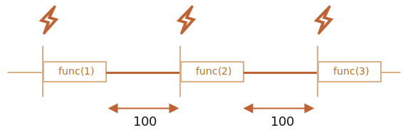

# زمان‌بندی: setTimeout و setInterval

شاید ما تصمیم بگیریم که یک تابع را همین الان اجرا نکنیم اما در زمان مشخصی در آینده اجرا کنیم. به این کار «زمان‌بندی فراخوانی» می‌گویند.

دو متد برای آن وجود دارد:

- `setTimeout` به ما اجازه می‌دهد تا یک تابع را بعد از مدتی یک بار اجرا کنیم.
- `setInterval` به ما اجازه می‌دهد که یک تابع را به صورت تکرار شونده اجرا کنیم که بعد از آن مدت زمان فراخوانی شروع می‌شود و سپس به طور پیوسته با همان فاصله زمانی تکرار می‌شود.

این متدها جزء مشخصات جاوااسکریپت نیستند. اما اکثر محیط‌ها زمان‌بند درونی دارند و این متدها را فراهم می‌کنند. خصوصا، این متدها در تمام مرورگرها و Node.js پشتیبانی می‌شوند.

## تابع setTimeout

سینتکس:

```js
let timerId = setTimeout(func|code, [delay], [arg1], [arg2], ...)
```

پارامترها:

`func|code`
: تابع یا رشته‌ای از کد برای اجرا.
معمولا یک تابع است. بنا به دلایلی مربوط به گذشته، یک رشته از کد را هم می‌توان قرار داد اما پیشنهاد نمی‌شود.

`delay`
: میزان تاخیر قبل از اجرا، به میلی‌ثانیه (1000 میلی‌ثانیه = 1 ثانیه)، به طور پیش‌فرض 0 است.

`arg1`, `arg2`...
: آرگومان‌های تابع (در IE9- پشتیبانی نمی‌شود)

برای مثال، این کد `sayHi()` را بعد از یک ثانیه فرا می‌خواند:

```js run
function sayHi() {
  alert('سلام');
}

*!*
setTimeout(sayHi, 1000);
*/!*
```

با آرگومان‌ها:

```js run
function sayHi(phrase, who) {
  alert( phrase + '، ' + who );
}

*!*
setTimeout(sayHi, 1000, "سلام", "John"); // John ،سلام
*/!*
```

اگر اولین آرگومان رشته باشد، سپس جاوااسکریپت یک تابع از آن می‌سازد.

پس این کار می‌کند:

```js run no-beautify
setTimeout("alert('سلام')", 1000);
```

اما استفاده از رشته‌ها پیشنهاد نمی‌شود، به جای آنها از تابع‌های کمانی استفاده کنید، مانند اینجا:

```js run no-beautify
setTimeout(() => alert('سلام'), 1000);
```

````smart header="تابع را رد کنید، اما آن را فراخوانی نکنید"
توسعه‌دهندگان بی‌تجربه گاهی اوقات با اضافه کردن پرانتز `()` بعد از تابع دچار اشتباه می‌شوند:

```js
// !اشتباه است
setTimeout(sayHi(), 1000);
```
این کار نمی‌کند چون `setTimeout` توقع رجوع به تابع را دارد. و اینجا `sayHi()` تابع را اجرا می‌کد و *نتیجه اجرا شدن آن* به `setTimeout` فرستاده می‌شود. در این مورد ما، نتیجه `sayHi()` برابر با `undefined` است (تابع چیزی را برنمی‌گرداند) پس چیزی زمان‌بندی نمی‌شود.
````

### لغو کردن با clearTimeout

فراخوانی `setTimeout` یک «شناسه‌ی تایمر» `timerId` را برمی‌گرداند که ما می‌توانیم برای لغو کردن اجرا شدن از آن استفاده کنیم.

سینتکس برای لغو کردن:

```js
let timerId = setTimeout(...);
clearTimeout(timerId);
```

در کد پایین، ما اجرای تابع را زمان‌بندی می‌کنیم و سپس آن را لغو می‌کنیم (تصمیم دیگری گرفتیم). در نتیجه، چیزی اتفاق نمی‌افتد:

```js run no-beautify
let timerId = setTimeout(() => alert("هیچوقت رخ نمی‌دهد"), 1000);
alert(timerId); // شناسه‌ی تایمر

clearTimeout(timerId);
alert(timerId); // (نمی‌شود null بعد از لغو کردن) شناسه یکسان
```

همانطور که از خروجی `alert` می‌بینیم، در یک مرورگر، شناسه‌ی تایمر یک عدد است. در محیط‌های دیگر، این می‌تواند چیز دیگری باشد. برای مثال، Node.js یک شیء تایمر همراه با متدهای اضافی را برمی‌گرداند.

باز هم، مشخصات جامعی برای این متدها وجود ندارد پس مشکلی نیست.

برای مرورگرها، تایمرها در [قسمت تایمرهای](https://www.w3.org/TR/html5/webappapis.html#timers) استاندارد HTML5 هستند.

## تابع setInterval

روش `setInterval` سینتکس مشابهی با `setTimeout` دارد:

```js
let timerId = setInterval(func|code, [delay], [arg1], [arg2], ...)
```

تمام آرگومان‌ها معنی یکسانی دارند. اما برخلاف `setTimeout` تابع را نه تنها یک بار بلکه بعد از مدت زمان داده شده به طور منظم اجرا می‌کند.

برای متوقف کردن فراخوانی‌های بیشتر، ما باید `clearInterval(timerId)` را فراخوانی کنیم.

مثال پایین پیام را هر 2 ثانیه نشان می‌دهد. بعد از 5 ثانیه، خروجی متوقف می‌شود:

```js run
// با فاصله 2 ثانیه تکرار می‌شود
let timerId = setInterval(() => alert('tick'), 2000);

// بعد از 5 ثانیه متوقف می‌شود
setTimeout(() => { clearInterval(timerId); alert('stop'); }, 5000);
```

```smart header="هنگامی که `alert` نمایش داده می‌شود زمان می‌گذرد"
در اکثر مرورگرها که شامل Chrome و Firefox هم می‌شود، تایمر درونی در حین نمایش `alert/confirm/prompt` به «تیک خوردن» ادامه می‌دهد.

بنابراین اگر شما کد بالا را اجرا کنید و برای چند ثانیه پنجره `alert` را رد نکنید، سپس `alert` بعدی بلافاصله بعد از اینکه آن را رد کنید نمایش داده می‌شود. فاصله زمانی واقعی بین alertها کوتاه‌تر از 2 ثانیه خواهد بود.
```

## تابع setTimeout تودرتو

دو راه برای انجام چیزی به طور منظم و پی در پی وجود دارد.

یکی از آنها `setInterval` است. راه دیگر یک `setTimeout` تودرتو است، مانند این:

```js
/** :به جای این
let timerId = setInterval(() => alert('tick'), 2000);
*/

let timerId = setTimeout(function tick() {
  alert('tick');
*!*
  timerId = setTimeout(tick, 2000); // (*)
*/!*
}, 2000);
```

تابع `setTimeout` بالا فراخوانی بعدی را درست برای انتهای فراخوانی کنونی `(*)` زمان‌بندی می‌کند.

`setTimeout` تودرتو نسبت به `setInterval` انعطاف بیشتری دارد. در این روش بسته به نتایج فراخوانی کنونی، فراخوانی بعدی ممکن است زمان‌بندی متفاوتی داشته باشد.

برای مثال، ما نیاز داریم که سرویسی بنویسیم تا هر 5 ثانیه یک درخواست به سرور بفرستد و برای داده درخواست کند اما در درصورتی که سرور شلوغ باشد، باید فاصله زمانی را به 10، 20، 40 ثانیه افزایش دهد...

اینجا یک شبه کد داریم:
```js
let delay = 5000;

let timerId = setTimeout(function request() {
  ...فرستادن درخواست...

  if (درخواست به دلیل شلوغی سرور شکست خورد) {
    // فاصله زمانی را در فراخوانی بعدی افزایش دهید
    delay *= 2;
  }

  timerId = setTimeout(request, delay);

}, delay);
```


و اگر تابع‌هایی که ما زمان‌بندی می‌کنیم از پردازنده زیاد استفاده می‌کنند، می‌توانیم زمانی که توسط یک بار اجرا شدن نیاز است را اندازه بگیریم و سپس فراخوانی بعدی را زودتر یا دیرتر زمان‌بندی کنیم.

**`setTimeout` تودرتو به ما اجازه می‌دهد که فاصله زمانی بین فراخوانی‌ها را نسبت به `setInterval` دقیق‌تر تنظیم کنیم.**

بیایید دو قطعه کد را مقایسه کنیم. اولی از `setInterval` استفاده می‌کند:

```js
let i = 1;
setInterval(function() {
  func(i++);
}, 100);
```

دومی از `setTimeout` تودرتو استفاده می‌کند:

```js
let i = 1;
setTimeout(function run() {
  func(i++);
  setTimeout(run, 100);
}, 100);
```

در `setInterval` زمان‌بند داخلی `func(i++)` را هر 100 میلی‌ثانیه اجرا می‌کند:


آیا متوجه شدید?

**فاصله زمانی واقعی بین فراخوانی‌های `func` برای `setInterval` کمتر از زمان موجود در کد است!**

این موضوع عادی است چون مدت زمانی که برای اجرای `func` صرف می‌شود بخشی از فاصله زمانی را «اشغال می‌کند».

ممکن است اجرای `func` از زمانی که ما توقع داشتیم بیشتر طول بکشد و بیشتر از 100 میلی‌ثانیه زمان ببرد.

در این صورت موتور صبر می‌کند تا اجرای `func` کامل شود سپس زمان‌بند را بررسی می‌کند و اگر زمان فراخوانی رسیده باشد، *بلافاصله* آن را دوباره اجرا می‌کند.

در مورد حساس، اگر اجرای تابع همیشه بیشتر از `delay` میلی‌ثانیه طول بکشد، سپس فراخوانی‌ها بدون اندکی مکث رخ می‌دهند.

و اینجا تصویری برای `setTimeout` تودوتو داریم:



**`setTimeout` تودرتو فاصله زمانی ثابت را تضمین می‌کند (اینجا 100 میلی‌ثانیه).**

به این دلیل که فراخوانی جدید در انتهای فراخوانی قبلی زمان‌بندی می‌شود.

````smart header="زباله‌روبی و فراخوانی setInterval/setTimeout"
زمانی که یک تابع در `setInterval/setTimeout` قرار داده شد، یک رجوع درونی به آن ساخته می‌شود و در زمان‌بند ذخیره می‌شود. این رجوع تابع را از زباله‌روبی نجات می‌دهد حتی اگر هیچ رجوع دیگری به آن وجود نداشته باشد.

```js
// تابع تا زمانی که زمان‌بند آن را فراخوانی کند درون حافظه می‌ماند
setTimeout(function() {...}, 100);
```

برای `setInterval` تابع تا زمانی که `clearInterval` فراخوانی شود درون حافظه می‌ماند.

<<<<<<< HEAD
یک عارضه جانبی وجود دارد. یک تابع به محیط لغوی بیرونی رجوع می‌کند پس، تا زمانی که تابع وجود داشته باشد، متغیرهای بیرونی هم وجود خواهند داشت. آنها حافظه بسیار بیشتری را نسبت به خود تابع اشغال می‌کنند. پس زمانی که دیگر نیازی به تابع زمان‌بندی شده نداریم، بهتر است که آن را لغو کنیم حتی اگر خیلی کوچک باشد.
=======
There's a side effect. A function references the outer lexical environment, so, while it lives, outer variables live too. They may take much more memory than the function itself. So when we don't need the scheduled function anymore, it's better to cancel it, even if it's very small.
>>>>>>> 82ed8f11b40bd40797427a5dd1763edbe1fca523
````

## تابع setTimeout بدون تاخیر

یک مورد استفاده خاص وجود دارد: `setTimeout(func, 0)` یا فقط `setTimeout(func)`.

این مورد اجرای `func` را برای نزدیک‌ترین موقع زمان‌بندی می‌کند. اما زمان‌بند آنرا بعد از اینکه اجرای اسکریپت کنونی تمام شد فرا می‌خواند.

پس تابع زمان‌بندی می‌شود تا «درست بعد از» اسکریپت کنونی اجرا شود.

برای مثال، این کد "Hello" را نمایش می‌دهد، سپس بلافاصله "World" را:

```js run
setTimeout(() => alert("World"));

alert("Hello");
```

خط اول «فراخوانی را بعد از 0 میلی‌ثانیه در تقویم» می‌گذارد. اما زمان‌بند فقط بعد از اینکه اسکریپت کنونی کامل شد «تقویم را بررسی می‌کند» پس `"Hello"` اول می‌آید و `"World"` بعد از آن.

همچنین موارد استفاده پیشرفته مربوط به مرورگر از زمان‌بندی با تاخیر 0 وجود دارند که ما در فصل <info:event-loop> به آنها می‌پردازیم.

````smart header="تاخیر صفر در واقع صفر نیست (در مرورگر)"
در مرورگر، یک محدودیت برای اینکه تایمرهای تودرتو هر چند وقت یک بار می‌توانند اجرا شوند وجود دارد. [استاندارد HTML5](https://html.spec.whatwg.org/multipage/timers-and-user-prompts.html#timers) می‌گوید: «بعد از 5 تایمر تودرتو، فاصله زمانی ناچار می‌شود که حداقل 4 میلی‌ثانیه باشد.».

بیایید با مثال پایین نشان دهیم که این یعنی چه. فراخوانی `setTimeout` در مثال زیر خودش را با تاخیر صفر دوباره زمان‌بندی می‌کند. هر فراخوانی زمان واقعی گذشته از فراخوانی قبلی را در آرایه `times` ذخیره می‌کند. تاخیرهای واقعی چگونه بنظر می‌رسند؟ بیایید ببینیم:

```js run
let start = Date.now();
let times = [];

setTimeout(function run() {
  times.push(Date.now() - start); // فاصله زمانی از فراخوانی قبلی را به یاد می‌سپارد

  if (start + 100 < Date.now()) alert(times); // فاصله‌های زمانی را بعد از 100 میلی‌ثانیه نشان می‌دهد
  else setTimeout(run); // در غیر این صورت دوباره زمان‌بندی می‌کند
});

// :مثالی از خروجی
// 1,1,1,1,9,15,20,24,30,35,40,45,50,55,59,64,70,75,80,85,90,95,100
```

ابتدا تایمرها بلافاصله اجرا می‌شوند (همانطور که در مشخصات نوشته شده) و سپس ما `...24 ,20 ,15 ,9` را می‌بینیم. فاصله زمانیِ اجباریِ بیشتر از 4 میلی‌ثانیه برای فراخوانی‌ها وارد بازی می‌شود.

همچین چیزی اگر ما از `setInterval` به جای `setTimeout` استفاده کنیم رخ می‌دهد: `setInterval(f0` تابع `f` را چند بار با تاخیر صفر اجرا می‌کند و بعد از آن با تاخیر بیشتر از 4 میلی‌ثانیه.

این محدودیت از قدیم وجود داشته و اسکریپت‌های زیادی بر آن تکیه کرده اند پس بنا به دلایلی مربوط به گذشته هنوز هم وجود دارد.

برای جاوااسکریپت سمت سرور، این محدودیت وجود ندارد و راه‌های دیگری برای زمان‌بندی یک کار ناهمزمان بدون تاخیر وجود دارند مانند [setImmediate](https://nodejs.org/api/timers.html#timers_setimmediate_callback_args) برای Node.js. پس این نکته فقط برای مرورگر است.
````

## خلاصه

- روش‌های `setTimeout(func, delay, ...args)` و `setInterval(func, delay, ...args)` به ما اجازه‌دهند تا `func` را یکبار/به طور منظم بعد از `delay` میلی‌ثانیه اجرا کنیم.
- برای لغو کردن اجرا، ما باید `clearTimeout/clearInterval` را همراه با مقدار برگردانده شده توسط `setTimeout/setInterval` فراخوانی کنیم.
- فراخوانی‌های تودرتوی `setTimeout` جایگزینی منعطف‌تر برای `setInterval` هستند که به ما اجازه می‌دند تا زمان *بین* اجرا شدن‌ها را دقیق‌تر تنظیم کنیم.
- زمان‌بندی بدون تاخیر با `setTimeout(func, 0)` (مشابه با `setTimeout(func)`) برای اینکه فراخوانی را «در اسرع وقت اما بعد از اینکه اسکریپت کنونی کامل شد» زمان‌بندی کنیم استفاده می‌شود.
- مرورگر برای پنج یا بیشتر از پنج فراخوانی تودرتوی `setTimeout` یا `setInterval` (بعد از فراخوانی پنجم) حداقل فاصله زمانی را به 4 میلی‌ثانیه محدود می‌کند. دلیل آن هم مربوط به گذشته است.

لطفا در نظر داشته باشید که روش‌های زمان‌بندی فاصله زمانی دقیق را *تضمین* نمی‌کنند.

<<<<<<< HEAD
برای مثال، تایمر درون مرورگر ممکن است به دلایل زیادی کند شود:
- کارهای زیادی به پردازنده سپرده شده است.
- تب (tab) مرورگر در حالت پس‌زمینه است.
- لپ تاپ در حال استفاده از باتری است.
=======
For example, the in-browser timer may slow down for a lot of reasons:
- The CPU is overloaded.
- The browser tab is in the background mode.
- The laptop is on battery saving mode.
>>>>>>> 82ed8f11b40bd40797427a5dd1763edbe1fca523

All that may increase the minimal timer resolution (the minimal delay) to 300ms or even 1000ms depending on the browser and OS-level performance settings.
