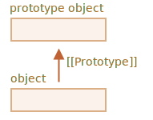
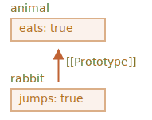

# وراثت پروتوتایپی

در برنامه‌نویسی، اغلب اوقات ما می‌خواهیم که چیزی را دریافت کنیم و آن را گسترش دهیم.

برای مثال، ما یک شیء `user` همراه با ویژگی‌ها و متدهای آن داریم و می‌خواهیم `admin` و `guest` را به عنوان نمونه‌هایی از آن که تغییر کمی دارند بسازیم. ما می‌خواهیم چیزی را که در `user` داریم را دوباره استفاده کنیم، نه اینکه متدهای آن را کپی/دوباره پیاده‌سازی کنیم، فقط یک شیء جدید را بر اساس آن بسازیم.

*وراثت پروتوتایپی(prototypal inheritance)* یک ویژگی زبان است که به این موضوع کمک می‌کند.

## ویژگی [[Prototype]]

در جاوااسکریپت، شیءها یک ویژگی پنهانی `[[Prototype]]` (دقیقا همانطور که در مشخصات زبان نام‌گذاری شده) دارند که یا `null` است یا به شیء دیگر رجوع می‌کند. آن شیء «یک پروتوتایپ (prototype)» نامیده می‌شود:



زمانی که ما یک شیء را از `object` می‌خوانیم و وجود ندارد، جاوااسکریپت به طور خودکار آن را از پروتوتایپ دریافت می‌کند. در برنامه‌نویسی، به این کار «وراثت پروتوتایپی» می‌گویند. و به زودی ما مثال‌های زیادی از چنین وراثتی را خواهیم دید، درست مانند خصوصیت‌های خفن‌تر زبان که بر اساس آن ساخته شده‌اند.

ویژگی `[[Prototype]]` درونی و پنهان است اما راه‌هایی برای مقداردهی آن وجود دارد.

یکی از آن راه‌ها استفاده از نام خاص `__proto__` است، مثلا اینگونه:

```js run
let animal = {
  eats: true
};
let rabbit = {
  jumps: true
};

*!*
rabbit.__proto__ = animal; // را تنظیم می‌کند rabbit.[[Prototype]] = animal
*/!*
```

حالا اگر ما ویژگی‌ای را از `rabbit` بخوانیم و وجود نداشته باشد، جاوااسکریپت به طور خودکار آن را از `animal` دریافت می‌کند.

برای مثال:

```js
let animal = {
  eats: true
};
let rabbit = {
  jumps: true
};

*!*
rabbit.__proto__ = animal; // (*)
*/!*

// پیدا کنیم rabbit حالا می‌توانیم هر دو ویژگی را در
*!*
alert( rabbit.eats ); // true (**)
*/!*
alert( rabbit.jumps ); // true
```

اینجا خط `(*)` شیء `animal` را به عنوان پروتوتایپ `rabbit` تنظیم می‌کند.

سپس زمانی که `alert` سعی می‌کند تا ویژگی `rabbit.eats` `(**)` را بخواند، درون `rabbit` نیست پس جاوااسکریپت مرجع `[[Prototype]]` را دنبال می‌کند و ویژگی را درون `animal` پیدا می‌کند (از پایین به بالا نگاه کنید):



اینجا می‌توانیم بگوییم که "`animal`" پروتوتایپ `rabbit` است یا "`rabbit`" به صورت پروتوتایپی از `animal` ارث‌بری کرده است.

بنابراین اگر `animal` تعداد زیادی ویژگی و متد مفید داشته باشد، سپس آن‌ها به طور خودکار درون `rabbit` هم موجود می‌شوند. چنین ویژگی‌هایی را «موروث یا به ارث‌رسیده» می‌گویند.

اگر ما یک متد درون `animal` داشته باشیم، می‌تواند با `rabbit` هم فراخوانی شود:

```js run
let animal = {
  eats: true,
*!*
  walk() {
    alert("جانور راه می‌رود");
  }
*/!*
};

let rabbit = {
  jumps: true,
  __proto__: animal
};

// از پروتوتایپ برداشته شده است walk
*!*
rabbit.walk(); // جانور راه می‌رود
*/!*
```

متد به طور خودکار از پروتوتایپ دریافت می‌شود، به این صورت:


زنجیره‌ی پروتوتایپ می‌تواند طولانی‌تر باشد:

```js run
let animal = {
  eats: true,
  walk() {
    alert("جانور راه می‌رود");
  }
};

let rabbit = {
  jumps: true,
*!*
  __proto__: animal
*/!*
};

let longEar = {
  earLength: 10,
*!*
  __proto__: rabbit
*/!*
};

// از رنجیره‌ی پروتوتایپ برداشته شده است walk
longEar.walk(); // جانور راه می‌رود
alert(longEar.jumps); // true (rabbit از)
```


حالا اگر ما چیزی را از `longEar` بخوانیم و وجود نداشته باشد، جاوااسکریپت درون `rabbit` و سپس درون `animal` به دنبال آن می‌گردد.

فقط دو محدودیت وجود دارد:

1. مرجع‌ها نمی‌توانند درون دایره قرار بگیرند. اگر ما تلاش کنیم که `__proto__` را درون یک دایره مقداردهی کنیم، جاوااسکریپت ارور ایجاد می‌کند.
2. مقدار `__proto__` می‌تواند شیء یا `null` باشد. انواع دیگر داده نادیده گرفته می‌شوند.

همچنین ممکن است واضح باشد اما باز هم: فقط یک `[[Prototype]]` می‌تواند وجود داشته باشد. یک شیء نمی‌تواند از دو شیء دیگر ارث‌بری کند.

<<<<<<< HEAD

```smart header="ویژگی `__proto__` یک getter/setter قدیمی برای `[[Prototype]]` است"
این یک اشتباه توسعه‌دهندگان تازه‌وارد است که تفاوت میان این دو را ندانند.
=======
```smart header="`__proto__` is a historical getter/setter for `[[Prototype]]`"
It's a common mistake of novice developers not to know the difference between these two.
>>>>>>> d5e8b6d308869738bd1f08dde62b64c969b0673e

لطفا توجه کنید که `__proto__` با ویژگی درونی `[[Prototype]]` *یکسان نیست*. این ویژگی یک getter/setter برای `[[Prototype]]` است. بعدا ما موقعیت‌هایی را خواهیم دید که این موضوع اهمیت دارد، اما چون فهم خود را از زبان جاوااسکریپت می‌سازیم، بیایید فقط این را در ذهن خود داشته باشیم.

ویژگی `__proto__` کمی منسوخ شده است. بنا به دلایلی مربوط به گذشته هنوز وجود دارد، جاوااسکریپت مدرن پیشنهاد می‌کند که ما باید از تابع‌های `Object.getPrototypeOf/Object.setPrototypeOf` به جای آن دریافت/مقداردهی کردن پروتوتایپ استفاده کنیم. این تابع‌ها را هم در آینده پوشش می‌دهیم.

بر اساس مشخصات زبان، `__proto__` فقط باید توسط مرورگرها پشتیبانی شود. اگرچه در واقع تمام محیط‌ها شامل سمت سرور از `__proto__` پشتیبانی می‌کند، پس ما برای استفاده از آن به مشکلی بر نخواهیم خورد.

به دلیل اینکه نشان `__proto__` از لحاظ درک کردن کمی بیشتر واضح است، در مثال‌ها از آن استفاده می‌کنیم.
```

## نوشتن از پروتوتایپ استفاده نمی‌کند

پروتوتایپ فقط برای خواندن ویژگی‌ها استفاده می‌شود.

عمل‌های نوشتن/حذف کردن به صورت مستقیم با شیء کار می‌کنند.

در مثال پایین، ما متد `walk` را در خود `rabbit` مقداردهی می‌کنیم:

```js run
let animal = {
  eats: true,
  walk() {
    /* استفاده نخواهد شد rabbit این متد توسط */
  }
};

let rabbit = {
  __proto__: animal
};

*!*
rabbit.walk = function() {
  alert("خرگوش! بپر-بپر!");
};
*/!*

rabbit.walk(); // !خرگوش! بپر-بپر
```

از این پس، فراخوانی `rabbit.walk()` بدون اینکه از پروتوتایپ استفاده کند، بلافاصله متد را در شیء پیدا و آن را اجرا می‌کند:


ویژگی‌های اکسسر استثنا هستند، مقداردهی توسط تابع setter انجام می‌شود. پس نوشتن در چنین ویژگی‌ای در واقع با فراخوانی تابع یکسان است.

به همین دلیل `admin.fullName` در کد پایین به درستی کار می‌کند:

```js run
let user = {
  name: "John",
  surname: "Smith",

  set fullName(value) {
    [this.name, this.surname] = value.split(" ");
  },

  get fullName() {
    return `${this.name} ${this.surname}`;
  }
};

let admin = {
  __proto__: user,
  isAdmin: true
};

alert(admin.fullName); // John Smith (*)

// !فعال می‌شود setter
admin.fullName = "Alice Cooper"; // (**)

alert(admin.fullName); // Alice Cooper ،تغییر یافت admin وضعیت
alert(user.fullName); // John Smith ،حفظ شد user وضعیت
```

اینجا در خط `(*)` ویژگی `admin.fullName` در پروتوتایپ `user` دارای یک getter است، پس این تابع فراخوانی می‌شود. و در خط `(**)` ویژگی در پروتوتایپ دارای یک setter است پس این تابع فراخوانی می‌شود.

## مقدار "this"

در مثال بالا ممکن است یک مثال جالب مطرح شود: مقدار `this` درون `set fullName(value)` چیست؟ ویژگی‌های `this.name` و `this.surname` در کجا نوشته می‌شوند: درون `user` یا `admin`؟

جواب ساده است: پروتوتایپ‌ها بر روی `this` هیچ تاثیری ندارند.

**مهم نیست که متد کجا پیدا شده است: درون شیء یا پروتوتایپ آن. در فراخوانی یک متد، `this` همیشه برابر با شیء قبل از نقطه است.**

پس فراخوانی setter `admin.fullName=` از `admin` به عنوان `this` استفاده می‌کند نه `user`.

در واقع این یک موضوع بسیار مهم است چون ما ممکن است شیءای بزرگ با متدهایی زیاد و شیءهایی که از آن ارث‌بری می‌کنند داشته باشیم. و زمانی که شیءهای وارث از متدهای به ارث‌برده‌شده استفاده می‌کنند، آن‌ها فقط وضعیت خودشان را تغییر می‌دهند نه وضعیت شیء بزرگ را.

برای مثال، اینجا `animal` نشان دهنده یک «حافظه متد» است و `rabbit` از آن استفاده می‌کند.

فراخوانی `rabbit.sleep()` ویژگی `this.isSleeping` را در شیء `rabbit` مقداردهی می‌کند:

```js run
// متدهایی دارد animal
let animal = {
  walk() {
    if (!this.isSleeping) {
      alert(`I walk`);
    }
  },
  sleep() {
    this.isSleeping = true;
  }
};

let rabbit = {
  name: "White Rabbit",
  __proto__: animal
};

// را تغییر می‌دهیم rabbit.isSleeping
rabbit.sleep();

alert(rabbit.isSleeping); // true
alert(animal.isSleeping); // undefined (چنین ویژگی‌ای درون پروتوتایپ نیست)
```

تصویر حاصل:


اگر ما شیءهای دیگری هم داشتیم، مثل `bird`، `snake` و غیره، که از `animal` ارث‌بری می‌کردند، آن‌ها هم به متدهای `animal` دسترسی پیدا می‌کردند. اما `this` در هر فراخوانی متد، شیء متناظر خواهد بود، که در زمان فراخوانی ارزیابی می‌شود (قبل از نقطه)، نه `animal`. پس زمانی که ما درون `this` داده قرار می‌دهیم، درون این شیءها ذخیره می‌شود.

در نتیجه، متدها به اشتراک گذاشته می‌شوند، اما وضعیت شیء نه.

## حلقه for..in

حلقه `for..in` در ویژگی‌های به ارث‌برده‌شده هم حلقه می‌زند.

برای مثال:

```js run
let animal = {
  eats: true
};

let rabbit = {
  jumps: true,
  __proto__: animal
};

*!*
// فقط کلیدهای خود شیء را برمی‌گرداند Object.keys
alert(Object.keys(rabbit)); // jumps
*/!*

*!*
// هم در کلیدهای خود شیء و هم کلیدهای به ارث‌برده‌شده حلقه می‌زنند for..in حلقه‌های
for(let prop in rabbit) alert(prop); // eats سپس ،jumps
*/!*
```

اگر این چیزی نیست که ما می‌خواهیم و دوست داریم که شامل ویژگی‌های به ارث‌برده‌شده نشود، یک متد درون‌ساخت [obj.hasOwnProperty(key)](mdn:js/Object/hasOwnProperty) وجود دارد: این متد اگر `obj` ویژگی خودش (نه به ارث‌برده‌شده) به نام `key` را داشته باشد `true` برمی‌گرداند.

پس می‌تواند ویژگی‌های به ارث‌برده‌شده را جداسازی کنیم (یا کاری دیگر با آن‌ها کنیم):

```js run
let animal = {
  eats: true
};

let rabbit = {
  jumps: true,
  __proto__: animal
};

for(let prop in rabbit) {
  let isOwn = rabbit.hasOwnProperty(prop);

  if (isOwn) {
    alert(`برای ما: ${prop}`); // jumps :برای ما
  } else {
    alert(`به ارث‌برده‌شده: ${prop}`); // eats :به ارث‌برده‌شده
  }
}
```

اینجا ما زنجیره ارث‌بری پایین را داریم: `rabbit` از `animal` ارث‌بری می‌کند که خود آن از `Object.prototype` ارث‌بری می‌کند (چون `animal` یک شیء لیترال `{...}` است، پس این موضوع پیش‌فرض انجام می‌شود) و سپس `null` در بالای آن:


در نظر داشته باشید که یک موضوع جالب وجود دارد. متد `rabbit.hasOwnProperty` از کجا می‌آید؟ ما آن را تعریف نکردیم. با نگاه به زنجیره می‌توانیم ببینیم که متد توسط `Object.prototype.hasOwnProperty` فراهم شده. به عبارتی دیگر، به ارث برده شده است.

...اما اگر `for..in` ویژگی‌های به ارث‌برده‌شده را لیست می‌کند، چرا `hasOwnProperty` مثل `eats` و `jumps` که در حلقه `for..in` ظاهر شدند، عمل نکرد؟

جواب ساده است: این ویژگی غیر قابل شمارش است. درست ماند تمام ویژگی‌های دیگر `Object.prototype`، این ویژگی پرچم `enumerable: false` دارد. و `for..in` فقط ویژگی‌های قابل شمارش را لیست می‌کند. به همین دلیل این ویژگی و دیگر ویژگی‌های `Object.prototype` لیست نشده‌اند.

```smart header="تقریبا تمام متدهای دریافت کلید/مقدار دیگر هم ویژگی‌های به ارث‌برده‌شده را نادیده می‌گیرند"
تقریبا تمام متدهای دریافت کلید/مقدار دیگر، مانند `Object.keys`، `Object.values` و بقیه، ویژگی‌های به ارث‌برده‌شده را نادیده می‌گیرند.

آن‌ها فقط روی خود شیء کارشان را انجام می‌دهند. ویژگی‌های پروتوتایپ به حساب *نمی‌آیند*.
```

## خلاصه

- در جاوااسکریپت، تمام شیءها یک ویژگی پنهان `[[Prototype]]` دارند که یا برابر با شیء است یا `null`.
- ما می‌توانیم از `obj.__proto__` برای دسترسی به آن استفاده کنیم (یک getter/setter قدیمی، راه‌های دیگری هم وجود دارد که به زودی پوشش داده می‌شوند).
- شیءای که توسط `[[Prototype]]` به آن رجوع می‌شود «پروتوتایپ (prototype)» نام دارد.
- اگر ما بخواهیم ویژگی‌ای از `obj` را بخوانیم یا متدی از آن را فراخوانی کنیم و وجود نداشته باشد، سپس جاوااسکریپت سعی می‌کند که آن را درون پروتوتایپ پیدا کند.
- عملیات نوشتن/حذف کردن به طور مستقیم روی شیء انجام می‌شوند، آن‌ها از پروتوتایپ استفاده نمی‌کنند (با فرض اینکه یک ویژگی داده‌ای است، نه یک setter).
- اگر ما `obj.method()` را فراخوانی کنیم و `method` از پروتوتایپ گرفته شود، `this` هنوز هم به `obj` رجوع می‌کند. پس متدها همیشه با شیء کنونی کار می‌کنند حتی اگر آن‌ها به ارث‌برده‌شده باشند.
- حلقه `for..in` هم درون ویژگی‌های خود شیء و هم درون ویژگی‌های به ارث‌برده‌شده حلقه می‌زند. تمام متدهای گرفتن کلید/مقدار فقط روی خود شیء کارشان را انجام می‌دهند.
