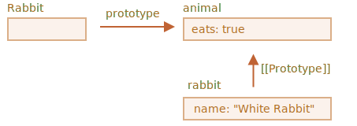
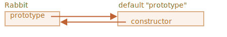

# F.prototype

به خاطر داشته باشید، شیء‌های جدید را می‌توان با یک تابع سازنده ایجاد کرد، مثل `new F()`.

اگر `F.prototype` یک شیء باشد، عملگر `new` از آن برای تنظیم `[[Prototype]]` برای شیء جدید استفاده می‌کند.

```smart
جاوا‌اسکریپت از ابتدا دارای وراثت پروتوتایپ بود. این یکی از ویژگی‌های اصلی زبان بود.

اما در قدیم، دسترسی مستقیم به آن وجود نداشت. تنها چیزی که به طور قابل اعتماد کار می‌کرد ویژگی `"prototype"` تابع سازنده بود که در این فصل توضیح داده شد. بنابراین اسکریپت‌های زیادی وجود دارند که هنوز از آن استفاده می‌کنند.
```

لطفاً توجه داشته باشید که `F.prototype` در اینجا به معنای یک ویژگی معمولی به نام `"prototype"` در `F` است. چیزی شبیه به اصطلاح "prototype" به نظر می‌رسد، اما در اینجا واقعاً به معنای یک ویژگی معمولی با این نام است.

در اینجا یک مثال وجود دارد:

```js run
let animal = {
  eats: true
};

function Rabbit(name) {
  this.name = name;
}

*!*
Rabbit.prototype = animal;
*/!*

let rabbit = new Rabbit("خرگوش سفید"); //  rabbit.__proto__ == animal

alert( rabbit.eats ); // true
```

تنظیم `Rabbit.prototype = animal` به معنای واقعی کلمه این موارد را بیان می‌کند: «وقتی یک `new Rabbit` ایجاد شد، `[[Prototype]]` آن را به `animal` اختصاص دهید".

این تصویر نتیجه است:



در تصویر، `"prototype"` یک فلش افقی است، به معنای یک ویژگی معمولی، و `[[Prototype]]` عمودی است، به معنای ارث بردن `rabbit` از `animal`.

```smart header="`F.prototype` فقط در زمان `new F` استقاده می‌شود"
ویژگی `F.prototype` تنها زمانی استفاده می‌شود که `new F` فراخوانی شود، `[[Prototype]]` را به شیء جدید اختصاص می‌دهد.

اگر پس از ایجاد، ویژگی `F.prototype` تغییر کند (`F.prototype = <یک شیء دیگر>`)، آنگاه اشیاء جدید ایجاد شده توسط `new F` شیء دیگری به عنوان `[[Prototype]]` خواهند داشت، اما اشیاء موجود، شیء قدیمی را حفظ می‌کنند.
```

## F.prototype پیش‌فرض، ویژگی سازنده

هر تابع دارای ویژگی `"prototype"` است، حتی اگر آن را تنظیم نکنیم.

`"prototype"` پیش‌فرض یک شیء با تنها ویژگی `constructor` است که به خود تابع اشاره می‌کند.

مثل این:

```js
function Rabbit() {}

/* پیش‌فرض prototype
Rabbit.prototype = { constructor: Rabbit };
*/
```



ما می‌توانیم آن را بررسی کنیم:

```js run
function Rabbit() {}
// به صورت پیش‌فرض:
// Rabbit.prototype = { constructor: Rabbit }

alert( Rabbit.prototype.constructor == Rabbit ); // true
```

طبیعتاً، اگر کاری انجام ندهیم، ویژگی `constructor` از طریق `[[Prototype]]` برای همه خرگوش‌ها در دسترس است:

```js run
function Rabbit() {}
// به صورت پیش‌فرض:
// Rabbit.prototype = { constructor: Rabbit }

let rabbit = new Rabbit(); // {constructor: Rabbit} ارث می‌برد از

alert(rabbit.constructor == Rabbit); // true (از پروتوتایپ)
```


می‌توانیم از ویژگی `constructor` برای ایجاد یک شیء جدید با استفاده از سازنده مشابه موجود استفاده کنیم.

مثل این نمونه:

```js run
function Rabbit(name) {
  this.name = name;
  alert(name);
}

let rabbit = new Rabbit("خرگوش سفید");

*!*
let rabbit2 = new rabbit.constructor("خرگوش سیاه");
*/!*
```

این مفید است زمانی که ما یک شی داریم، نمی‌دانیم از کدام سازنده برای آن استفاده شده است (مثلاً از یک کتابخانه شخص ثالث می‌آید)، و باید یکی دیگر از همان نوع ایجاد کنیم.

اما احتمالاً مهمترین چیز در مورد `"constructor"` این است که ...

*** ...خود جاوااسکریپت از مقدار درست `"constructor"` اطمینان نمی‌دهد.**

بله، در `"prototype"` پیش‌فرض برای توابع وجود دارد، اما همین. آنچه بعداً با آن اتفاق می افتد - کاملاً به ما بستگی دارد.

به ویژه، اگر پروتوتایپ پیش‌فرض را به‌طور کلی جایگزین کنیم، `"constructor"` در آن وجود نخواهد داشت.

برای مثال:

```js run
function Rabbit() {}
Rabbit.prototype = {
  jumps: true
};

let rabbit = new Rabbit();
*!*
alert(rabbit.constructor === Rabbit); // false
*/!*
```

بنابراین، برای حفظ `"constructor"` درست، می‌توانیم به جای بازنویسی به‌عنوان یک کل، ویژگی‌ها را به `"prototype"` پیش‌فرض اضافه یا از آن حذف کنیم:

```js
function Rabbit() {}

// را به طور کامل بازنویسی نکنید Rabbit.prototype
// فقط به آن اضافه کنید
Rabbit.prototype.jumps = true
// حفظ می‌شود Rabbit.prototype.constructor حالت پیش‌فرض
```

یا، به طور متناوب، ویژگی `constructor` را به صورت دستی دوباره ایجاد کنید:

```js
Rabbit.prototype = {
  jumps: true,
*!*
  constructor: Rabbit
*/!*
};

// حالا سازنده نیز درست است، زیرا ما دوباره آن را اضافه کردیم
```


## خلاصه

در این فصل به طور خلاصه نحوه تنظیم `[[Prototype]]` برای اشیاء ایجاد شده از طریق یک تابع سازنده را توضیح دادیم. در آینده شاهد الگوهای برنامه‌نویسی پیشرفته‌تری خواهیم بود که بر آن تکیه دارند.

همه چیز بسیار ساده است، فقط چند نکته برای روشن شدن همه چیز‌ها:

- ویژگی `F.prototype` (آن را با `[[Prototype]]` اشتباه نگیرید)، `[[Prototype]]` را برای اشیاء جدید، هنگام فراخوانی `new F()`  تنظیم می‌کند.
- مقدار `F.prototype` باید یک شیء یا `null`باشد: مقادیر دیگر کار نمی‌کنند.
-  ویژگی `"prototype"` تنها زمانی چنین جلوه خاصی دارد که روی یک تابع سازنده تنظیم شود و با `new` فراخوانی شود.

در اشیاء معمولی `prototype` چیز خاصی نیست:
```js
let user = {
  name: "John",
  prototype: "Bla-bla" // به هیچ صورت جادویی نیست
};
```

به‌طور پیش‌فرض همه توابع دارای `F.prototype = { constructor: F }` هستند، بنابراین می‌توانیم سازنده یک شیء را با دسترسی به ویژگی `"constructor"` آن دریافت کنیم.
