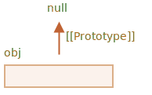

# متد‌های پروتوتایپ، اشیاء بدون __proto__

در فصل اول این بخش، اشاره کردیم که متدهای مدرنی برای راه‌اندازی یک پروتوتایپ وجود دارد.

تنظیم کردن یا خواندن پروتوتایپ با `obj.__proto__` قدیمی و تا حدی منسوح در نظر گرفته می‌شود (به بخش "ضمیمه B" استاندارد جاوااسکریپت جابجا شده است، یعنی فقط برای مرورگرها است).

متدهای جدید برای دریافت/تنظیم پروتوتایپ این‌ها هستند:

- [Object.getPrototypeOf(obj)](mdn:js/Object/getPrototypeOf) -- `[[Prototype]]` مربوط به `obj` را برمی‌گرداند.
- [Object.setPrototypeOf(obj, proto)](mdn:js/Object/setPrototypeOf) -- `[[Prototype]]` مربوط به `obj` را روی `proto` قرار می‌دهد.

تنها استفاده `__proto__`، که ناپسند نیست، استفاده از آن به عنوان یک ویژگی هنگام ایجاد یک شیء است: `{__proto__: ...}`.

اگرچه یک متد خاص برای این کار هم وجود دارد:

<<<<<<< HEAD
- [Object.create(proto, [descriptors])](mdn:js/Object/create) -- یک شیء خالی با تنظیم `proto` داده شده به عنوان `[[Prototype]]` و توصیف‌کننده‌های ویژگی اختیاری ایجاد می‌کند.
=======
- [Object.create(proto[, descriptors])](mdn:js/Object/create) -- creates an empty object with given `proto` as `[[Prototype]]` and optional property descriptors.
>>>>>>> 540d753e90789205fc6e75c502f68382c87dea9b

برای مثال:

```js run
let animal = {
  eats: true
};

// به عنوان پروتوتایپ animal ایجاد یک شیء جدید با
*!*
let rabbit = Object.create(animal); // است {__proto__: animal} با
*/!*

alert(rabbit.eats); // true

*!*
alert(Object.getPrototypeOf(rabbit) === animal); // true
*/!*

*!*
Object.setPrototypeOf(rabbit, {}); // نمونه اولیه خرگوش را به {} تغییر می‌دهد
*/!*
```

`Object.create` کمی قدرتمندتر است چون یک آرگومان دوم اختیاری دارد: توصیفگرهای ویژگی. 

ما می‌توانیم ویژگی‌های اضافی را برای شیء جدید در آنجا ارائه دهیم، مانند این:

```js run
let animal = {
  eats: true
};

let rabbit = Object.create(animal, {
  jumps: {
    value: true
  }
});

alert(rabbit.jumps); // true
```

توصیفگرها به همان قالبی هستند که در فصل <info:property-descriptors> توضیح داده شد.

می‌توانیم از `Object.create` برای انجام شبیه‌سازی شیء استفاده کنیم که بهتر از کپی کردن ویژگی‌ها در `for..in` است:

```js
let clone = Object.create(
  Object.getPrototypeOf(obj), Object.getOwnPropertyDescriptors(obj)
);
```

این فراخوانی یک کپی واقعاً دقیق از `obj` می‌سازد، شامل همه ویژگی‌ها: قابل شمارش و غیرقابل شمارش، ویژگی‌های داده و تنظیم‌کننده‌ها/دریافت‌کننده‌ها - همه چیز، و با `[[Prototype]]` صحیح.

## تاریخچه مختصر

راه‌های زیادی برای مدیریت `[[Prototype]]` وجود دارد. چگونه این اتفاق افتاد؟ چرا؟

ارث‌بری پروتوتایپی از زمان ایجاد زبان در آن وجود داشت اما راه‌های مدیریت آن طی زمان نمو کردند.

- ویژگی `"prototype"` یک تابع سازنده از زمان‌های بسیار قدیم کار کرده است. این قدیمی‌ترین راه برای ایجاد شیءهایی با پروتوتایپ تعیین شده است.
- بعداً، در سال 2012، `Object.create` در استاندارد ظاهر شد. توانایی ایجاد شیءها با یک پروتوتایپ داده شده را می‌دهد، اما توانایی دریافت/تنظیم آن را فراهم نمی‌کند. بنابراین مرورگرها دسترسی غیر استاندارد `__proto__` را پیاده‌سازی کردند که به کاربر اجازه می‌داد در هر زمان یک پروتوتایپ را دریافت/تنظیم کند.
- بعداً، در سال 2015، `Object.setPrototypeOf` و `Object.getPrototypeOf` به استاندارد اضافه شدند تا عملکردی مشابه `__proto__` داشته باشند. از آنجایی که `__proto__` به طور عملی در همه‌جا پیاده سازی شد، به نوعی منسوخ شد و به ضمیمه B استاندارد راه یافت، یعنی: اختیاری برای محیط‌های غیر مرورگر.
- بعدأ، در سال 2022، استفاده از `__proto__` درون شیءهای لیترال `{...}` به طور رسمی مجاز دانسته شد (از ضمیمه B خارج شد) اما نه به عنوان دریافت‌کننده/تنظیم‌کننده `obj.__proto__` (هنوز در ضمیمه B است).

چرا تابع‌های `getPrototypeOf/setPrototypeOf` جایگزین `__proto__` شدند؟

چرا `__proto__` تقریبا توان‌بخشی شده و استفاده از آن در `{...}` مجاز شد اما نه به عنوان دریافت‌کننده/تنظیم‌کننده؟

به زودی جواب را خواهیم گرفت.

```warn header="اگر سرعت مهم است، `[[Prototype]]` را در اشیاء موجود تغییر ندهید"
به صورت تکنیکی، ما می‌توانیم ‌`[[Prototype]]` را در هر زمان دریافت/تنظیم کنیم. اما معمولا ما فقط یک بار در زمان ساخت شیء تنظیم می‌کنیم و دیگر آن را تغییر نمی‌دهیم: `rabit` از `animal` ارث می‌برد، و این تغییر نخواد کرد.

و موتورهای جاوااسکریپت برای این کار بسیار بهینه شده‌اند. تغییر یک نمونه اولیه "on-the-fly" با `Object.setPrototypeOf` یا `obj.__proto__=` یک عملیات بسیار کند است زیرا بهینه سازی‌های داخلی برای عملیات دسترسی به ویژگی شیء را شکست می‌دهد. بنابراین از آن اجتناب کنید، مگر اینکه بدانید در حال انجام چه کاری هستید، یا سرعت جاوااسکریپت اصلا برای شما مهم نیست.
```

## اشیاء "بسیار ساده". [#very-plain]

همانطور که می‌دانیم، اشیاء می‌توانند به عنوان آرایه‌های انجمنی برای ذخیره جفت‌های کلید/مقدار استفاده شوند.

...اما اگر بخواهیم کلیدهای *ارائه شده توسط کاربر* را در آن ذخیره کنیم (مثلاً یک فرهنگ لغت وارد شده توسط کاربر)، می‌توانیم یک اشکال جالب را ببینیم: همه کلیدها به جز `"__proto__"` به خوبی کار می‌کنند.

این مثال را بررسی کنید:

```js run
let obj = {};

let key = prompt("کلید چیست؟", "__proto__");
obj[key] = "یک مقدار";

alert(obj[key]); // [object Object], not "یک مقدار"!
```

در اینجا، اگر کاربر `__proto__` را تایپ کند، انتساب در خط 4 نادیده گرفته می‌شود!

<<<<<<< HEAD
این می‌تواند قطعا برای یک غیر توسعه‌دهنده شوکه کننده باشد اما برای ما بسیار قابل فهم است. ویژگی `__proto__` خاص است: باید یک شیء یا `null` باشد. یک رشته نمی‌تواند به یک پروتوتایپ تبدیل شود. به همین دلیل است که انتساب یک رشته به `__proto__` نادیده گرفته می‌شود.
=======
That could surely be surprising for a non-developer, but pretty understandable for us. The `__proto__` property is special: it must be either an object or `null`. A string can not become a prototype. That's why assigning a string to `__proto__` is ignored.
>>>>>>> 540d753e90789205fc6e75c502f68382c87dea9b

اما ما *قصد* اجرای چنین رفتاری را نداشتیم، درست است؟ ما می‌خواهیم جفت‌های کلید/مقدار را ذخیره کنیم، و کلید با نام `"__proto__"`  به درستی ذخیره نشده است. پس این یک اشکال است!

در اینجا عواقب آن وحشتناک نیست. اما در موارد دیگر ممکن است ما شیءها را به جای رشته‌ها در `obj` ذخیره کنیم و سپس پروتوتایپ ممکن است واقعاً تغییر کند. در نتیجه، اجرا به روش‌های کاملاً غیرمنتظره اشتباه می‌شود.

بدتر از آن -- معمولاً توسعه دهندگان اصلاً به چنین امکانی فکر نمی‌کنند. این امر باعث می‌شود تا متوجه چنین اشکالاتی سخت و حتی آنها را به آسیب پذیری تبدیل کند، به خصوص زمانی که جاوااسکریپت در سمت سرور استفاده می‌شود.

موارد غیرمنتظره در زمان مقداردهی به `obj.toString`، که یک تابع درون‌ساخت است ممکن است رخ دهد.

چگونه می توانیم از این مشکل جلوگیری کنیم؟

ابتدا، می‌توانیم به جای اشیاء ساده، از `Map` برای ذخیره‌سازی استفاده کنیم، سپس همه چیز خوب است.

```js run
let map = new Map();

let key = prompt("What's the key?", "__proto__");
map.set(key, "some value");

alert(map.get(key)); // "some value" (as intended)
```

...اما سینتکس `Object` به دلیل خلاصه‌تر بودن، خوش‌آیندتر است.

خوش‌بختانه ما *می‌توانیم* از شیءها استفاده کنیم چون سازندگان زبان درباره این مشکل مدت‌ها پیش فکر کرده‌اند.

همانطور که می‌دانیم، `__proto__` ویژگی یک شیء نیست، بلکه یک ویژگی اکسسر به `Object.prototype` است:


بنابراین، اگر `obj.__proto__` خوانده یا تنظیم شود، گیرنده/تنظیم کننده مربوطه از پروتوتایپ آن فراخوانی می‌شود و `[[Prototype]]` را می‌گیرد.

همانطور که در ابتدای این بخش آموزشی گفته شد: `__proto__` راهی برای دسترسی به `[[Prototype]]` است، این خود `[[Prototype]]` نیست.

حال اگر قصد داشته باشیم از یک شیء به عنوان آرایه انجمنی استفاده کنیم و از چنین مشکلاتی خلاص شویم، می‌توانیم با یک ترفند کوچک این کار را انجام دهیم:

```js run
*!*
let obj = Object.create(null);
// obj = { __proto__: null } :یا
*/!*

let key = prompt("کلید چیست؟", "__proto__");
obj[key] = "یک مقدار";

alert(obj[key]); // "یک مقدار"
```

`Object.create(null)` یک شیء خالی فاقد پروتوتایپ ایجاد می‌کند (`[[Prototype]]` برابر با `null` است):



بنابراین، هیچ گیرنده/ تنظیم کننده ارثی برای `__proto__` وجود ندارد. اکنون به عنوان یک ویژگی داده معمولی پردازش می‌شود، بنابراین مثال بالا درست کار می‌کند.

چنین اشیایی را می‌توانیم اشیاء «بسیار ساده» یا «فرهنگی خالص» بنامیم، زیرا آنها حتی از شیء ساده معمولی `{...}` ساده‌تر هستند.

یک نقطه ضعف این است که چنین اشیایی فاقد هرگونه متد شیء داخلی هستند، به عنوان مثال. `toString`:

```js run
*!*
let obj = Object.create(null);
*/!*

alert(obj); // (toString نبود) ارور
```

... اما این معمولا برای آرایه های انجمنی خوب است.

توجه داشته باشید که اکثر متدهای مرتبط با شیء، `Object.something(...)` هستند، مانند `Object.keys(obj)` -- آنها در پروتوتایپ نیستند، بنابراین آنها به کار بر روی چنین اشیایی ادامه می‌دهند:


```js run
let chineseDictionary = Object.create(null);
chineseDictionary.hello = "你好";
chineseDictionary.bye = "再见";

alert(Object.keys(chineseDictionary)); // hello,bye
```

## خلاصه

- برای ایجاد یک شیء با پروتوتایپ تعیین شده، از این‌ها استفاده کنید:

<<<<<<< HEAD
    - سینتکس لیترال: `{ __proto__: ...}`، اجازه می‌دهد که چند ویژگی تعیین کنیم
    - یا [Object.create(proto, [descriptors])](mdn:js/Object/create)، اجازه می‌دهد که توصیف‌کننده‌های ویژگی را تعیین کنیم.
=======
    - literal syntax: `{ __proto__: ... }`, allows to specify multiple properties
    - or [Object.create(proto[, descriptors])](mdn:js/Object/create), allows to specify property descriptors.
>>>>>>> 540d753e90789205fc6e75c502f68382c87dea9b

- متدهای مدرن برای دریافت/تنظیم پروتوتایپ این‌ها هستند:

    - [Object.getPrototypeOf(obj)](mdn:js/Object/getPrototypeOf) -- `[[Prototype]]` را از `obj` برمی‌گرداند (همانند دریافت‌کننده `__proto__`).
    - [Object.setPrototypeOf(obj, proto)](mdn:js/Object/setPrototypeOf) -- `[[Prototype]]` `obj` را روی `proto` تنظیم می‌کند (همانند تنظیم‌کننده `__proto__`).

- دریافت/تنظیم پروتوتایپ با استفاده از `__proto__` درون‌ساخت پیشنهاد نمی‌شود و هم اکنون در زمینه B مشخصات زبان است.

- همچنین شیءهای بدون پروتوتایپ را پوشش دادیم که با `Object.create(null)` یا `{__proto: null}` ایجاد می‌شود.

    این شیءها به عنوان فرهنگ لغت استفاده می‌شوند تا هر کلیدی را ذخیره کنند (احتمالا کلیدی که توسط کاربر تولید شود).

    به طور طبیعی، شیءها متدهای درون‌ساخت و `__proto__` دریافت‌کننده یا تنظیم‌کننده را از `Object.prototype` ارث‌بری می‌کنند که کلیدهای متناظر را «اشغال» می‌کنند و احتمالا باعث ایجاد عوارض جانبی می‌شوند. با پروتوتایپ `null` شیءهای در حقیقت خالی هستند.