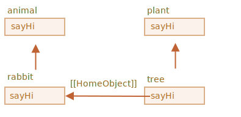

# وراثت کلاس

وراثت کلاس (class inheritance) راهی برای یک کلاس است تا کلاس دیگری را تعمیم دهد (extend).

پس می‌توانیم عملکرد جدیدی را بر اساس کلاس موجود بسازیم.

## کلمه کلیدی "extends"

فرض کنیم ما کلاس `Animal` (به معنی حیوان) را داریم:

```js
class Animal {
  constructor(name) {
    this.speed = 0;
    this.name = name;
  }
  run(speed) {
    this.speed = speed;
    alert(`${this.name} با سرعت ${this.speed} می‌دود.`);
  }
  stop() {
    this.speed = 0;
    alert(`${this.name} ایستاده است.`);
  }
}

let animal = new Animal("جانور من");
```

ما می‌توانیم شیء `animal` و کلاس `Animal` را اینگونه به صورت هندسی نمایش دهیم:


...و ما می‌خواهیم که `class Rabbit` دیگری هم بسازیم.

چون خرگوش‌ها هم جانور هستند، کلاس `Rabbit` (به معنی خرگوش) باید بر اساس `Animal` باشد و به متدهای جانور دسترسی داشته باشد تا خرگوش‌ها بتوانند کاری که جانوران "معمولی" انجام می‌دهند را انجام دهند.

سینتکس تعمیم دادن کلاس اینگونه است: `class Child extends Parent`.

بیایید کلاس `class Rabbit` را بسازیم که از `Animal` ارث‌بری می‌کند:

```js
*!*
class Rabbit extends Animal {
*/!*
  hide() {
    alert(`${this.name} قایم می‌شود!`);
  }
}

let rabbit = new Rabbit("خرگوش سفید");

rabbit.run(5); // خرگوش سفید با سرعت 5 می‌دود
rabbit.hide(); // !خرگوش سفید قایم می‌شود
```

شیء ساخته شده از کلاس `Rabbit` هم به متدهای `Rabbit`، مانند `rabbit.hide()`، دسترسی دارد و هم به متدهای `Animal`، مانند `rabbit.run()`.

از دورن، کلمه کلیدی `extends` با استفاده از مکانیزم‌های خوب و قدیمی پروتوتایپ کار می‌کند. این کلمه `Rabbit.prototype.[[Prototype]]` را برابر با `Animal.prototype` قرار می‌دهد. پس اگر متدی در `Rabbit.prototype` پیدا نشد، جاوااسکریپت آن را از `Animal.prototype` دریافت می‌کند.


برای مثال، برای پیدا کردن متد `rabbit.run`، موتور این‌ها را بررسی می‌کند (در تصویر از پایین به بالا است):
1. شیء `rabbit` (`run` ندارد).
2. پروتوتایپ آن، یعنی `Rabbit.prototype` (`hide` را دارد، اما `run` را نه).
3. پروتوتایپ آن، یعنی (با توجه به `extends`) همان `Animal.prototype` که در نهایت متد `run` را دارد.

همانطور که از فصل <info:native-prototypes> به یاد داریم، خود جاوااسکریپت از وراثت پروتوتایپی برای شیءهای درون‌ساخت استفاده می‌کند. برای مثال `Date.prototype.[[Prototype]]` برابر با `Object.prototype` است. به همین دلیل است که تاریخ‌ها به متدهای عمومی شیء دسترسی دارند.

````smart header="هر عبارتی بعد از `extends` مجاز است"
سینتکس کلاس اجازه می‌دهد که نه تنها یک کلاس بلکه هر عبارتی را بعد از `extends` قرار دهیم.

برای مثال، فراخوانی تابعی که کلاس والد را تولید می‌کند:

```js run
function f(phrase) {
  return class {
    sayHi() { alert(phrase); }
  };
}

*!*
class User extends f("سلام") {}
*/!*

new User().sayHi(); // سلام
```
اینجا `class User` از نتیجه `f("سلام")` ارث‌بری می‌کند.

این موضوع ممکن است برای الگوهای برنامه‌نویسی پیشرفته مفید باشد، زمانی که بر اساس چند شرط ما از تابع‌ها برای ایجاد کلاس‌ها استفاده می‌کنیم و می‌توانیم از آن‌ها ارث‌بری کنیم.
````

## بازنویسی متد

حالا بیایید جلوتر برویم و یک متد را بازنویسی کنیم. به طور پیش‌فرض، تمام متدهایی که در `class Rabbit` مشخص نشده‌اند به صورت مستقیم از `class Animal` «بدون تغییر» دریافت می‌شوند.

اما اگر ما متد خودمان را درون `Rabbit` مشخص کنیم، مثل `stop()`، در عوض این متد استفاده خواهد شد:

```js
class Rabbit extends Animal {
  stop() {
    // استفاده خواهد شد rabbit.stop() حالا این متد برای...
    // Animal از کلاس stop() به جای
  }
}
```

معمولا ما نمی‌خواهیم که یک متد والد را به طور کلی جایگزین کنیم بلکه می‌خواهیم متدی بر اساس آن بسازیم تا عملکرد آن را تغییر یا گسترش بدهیم. ما کاری را درون متد خود انجام می‌دهیم اما متد والد را قبل/بعد از آن یا در حین فرایند فراخوانی می‌کنیم.

کلاس‌ها کلمه کلیدی `"super"` را برای این موضوع فراهم می‌کنند.

- متد `super.method(...)` برای فراخوانی یک متد والد
- تابع `super(...)` برای فراخوانی سازنده والد (فقط درون سازنده خودمان).

برای مثال، بیایید بگذاریم خرگوش ما زمانی که می‌ایستد به طور خودکار قایم شود:

```js run
class Animal {

  constructor(name) {
    this.speed = 0;
    this.name = name;
  }

  run(speed) {
    this.speed = speed;
    alert(`${this.name} با سرعت ${this.speed} می‌دود.`);
  }

  stop() {
    this.speed = 0;
    alert(`${this.name} ایستاده است.`);
  }

}

class Rabbit extends Animal {
  hide() {
    alert(`${this.name} قایم می‌شود!`);
  }

*!*
  stop() {
    super.stop(); // والد را فراخوانی کن stop متد
    this.hide(); // را فراخوانی کن hide و سپس
  }
*/!*
}

let rabbit = new Rabbit("خرگوش سفید");

rabbit.run(5); // خرگوش سفید با سرعت 5 می‌دود
rabbit.stop(); // !خرگوش سفید ایستاده است. خرگوش سفید قایم می‌شود
```

حالا `Rabbit` متد `stop` را دارد که در فرایند خودش `super.stop()` والد را فراخوانی می‌کند.

````smart header="تابع‌های کمانی `super` ندارند"
همانطور که در فصل <info:arrow-functions> گفته شد، تابع‌های کمانی `super` ندارند.

اگر به آن دسترسی پیدا کنیم، از تابع بیرونی گرفته می‌شود. برای مثال:
```js
class Rabbit extends Animal {
  stop() {
    setTimeout(() => super.stop(), 1000); // والد بعد از 1 ثانیه stop فراخوانی
  }
}
```

مقدار `super` در تابع کمانی با مقدار آن در `stop()` یکسان است و همانطور که توقع می‌رود کار می‌کند. اگر ما یک تابع «معمولی» را اینجا مشخص کرده بودیم، ارور ایجاد می‌شد:

```js
// غیرمنتظره super
setTimeout(function() { super.stop() }, 1000);
```
````


## بازنویسی سازنده

با سازنده‌ها این کار کمی پیچیده می‌شود.

تا حالا، `Rabbit` تابع `constructor` خودش را نداشت.

با توجه به [مشخصات زبان](https://tc39.github.io/ecma262/#sec-runtime-semantics-classdefinitionevaluation)، اگر کلاسی یک کلاس دیگر را تعمیم دهد و `constructor` نداشته باشد، سپس `constructor` «خالی» زیر ایجاد می‌شود:

```js
class Rabbit extends Animal {
  // برای توابعی که بدون سازنده خودشان تعمیم داده می‌شوند ایجاد می‌شود
*!*
  constructor(...args) {
    super(...args);
  }
*/!*
}
```

همانطور که می‌توانیم ببینیم، این سازنده با پاس دادن تمام آرگومان‌ها `constructor` والد را فراخوانی می‌کند. اگر ما سازنده خودمان را ننویسیم این اتفاق می‌افتد.

حالا بیایید یک سازنده سفارشی به `Rabbit` اضافه کنیم. این سازنده علاوه بر `name` ویژگی `earLength` را هم مشخص می‌کند:

```js run
class Animal {
  constructor(name) {
    this.speed = 0;
    this.name = name;
  }
  // ...
}

class Rabbit extends Animal {

*!*
  constructor(name, earLength) {
    this.speed = 0;
    this.name = name;
    this.earLength = earLength;
  }
*/!*

  // ...
}

*!*
// !کار نمی‌کند
let rabbit = new Rabbit("خرگوش سفید", 10); // تعریف نشده است this :ارور
*/!*
```

ای وای! ارور گرفتیم. حالا نمی‌توانیم خرگوشی بسازیم. چه چیزی اشتباه است؟

جواب کوتاه:

- **سازنده‌های درون کلاس‌های ارث‌بر باید `super(...)` را فراخوانی کنند و (!) قبل از استفاده از `this` این کار را انجام دهند.**

...اما چرا؟ چه چیزی در حال اتفاق افتادن است؟ واقعا چیزی که لازم است عجیب به نظر می‌رسد.

قطعا توضیحی وجود دارد. بیایید وارد جزئیات شویم تا شما کاملا متوجه شوید که چه چیزی در حال رخ دادن است.

در جاوااسکریپت، تفاوتی بین تابع سازنده یک کلاس ارث‌بر (به «سازنده مشتق شده» هم شناخته می‌شود) و بقیه تابع‌ها وجود دارد. سازنده مشتق شده یک ویژگی درونی خاص `[[ConstructorKind]]:"derived"` را دارد. این یک برچسب درونی خاص است.

این برچسب بر رفتار آن همراه با `new` تأثیر می‌گذارد.

- زمانی که یک تابع معمولی همراه با `new` اجرا می‌شود، شیءای خالی می‌سازد و `this` را برابر با آن قرار می‌دهد.
- اما زمانی که یک سازنده مشتق شده اجرا می‌شود، این کار را نمی‌کند. این سازنده توقع دارد که سازنده والد این کار را انجام دهد.

پس یک سازنده مشتق شده باید `super` را برای اجرای سازنده والد (پایه) خود فراخوانی کند، در غیر این صورت شیءای برای `this` ساخته نخواهد شد. و ما ارور دریافت خواهیم کرد.

برای اینکه سازنده `Rabbit` کار کند، باید قبل از استفاده کردن از `this` تابع `super()` را فراخوانی کند، مانند اینجا:

```js run
class Animal {

  constructor(name) {
    this.speed = 0;
    this.name = name;
  }

  // ...
}

class Rabbit extends Animal {

  constructor(name, earLength) {
*!*
    super(name);
*/!*
    this.earLength = earLength;
  }

  // ...
}

*!*
// حالا درست است
let rabbit = new Rabbit("خرگوش سفید", 10);
alert(rabbit.name); // خرگوش سفید
alert(rabbit.earLength); // 10
*/!*
```


### بازنویسی فیلدهای کلاس: نکته‌ای فریبنده

```warn header="نکته پیشرفته"
این نکته فرض می‌کند شما درباره کلاس‌ها مقداری تجربه دارید، شاید در زبان‌های برنامه‌نویسی دیگر.

این نکته باعث بینش بهتر درون زبان می‌شود و همچنین رفتاری را که ممکن است منشا باگ‌ها باشد (اما نه اغلب اوقات) را توضیح می‌دهد.

اگر فهمیدن آن است برای شما سخت است، فقط جلو بروید، به خواندن ادامه دهید، سپس پس مدتی به سراغ آن بیایید.
```

ما نه تنها می‌توانیم متدها را بازنویسی کنیم، بلکه فیلدهای کلاس را هم می‌توانیم.

اگرچه زمانی که ما به یک فیلد بازنویسی شده درون سازنده والد دسترسی پیدا می‌کنیم رفتاری عجیب وجود دارد که نسبت به اکثر زبان‌های برنامه‌نویسی دیگر خیلی تفاوت دارد.

این مثال را در نظر بگیرید:

```js run
class Animal {
  name = 'animal';

  constructor() {
    alert(this.name); // (*)
  }
}

class Rabbit extends Animal {
  name = 'rabbit';
}

new Animal(); // animal
*!*
new Rabbit(); // animal
*/!*
```

اینجا، کلاس `Rabbit` کلاس `Animal` را تعمیم می‌دهد و فیلد `name` را با مقدار خودش بازنویسی می‌کند.

هیچ سازنده‌ای درون `Rabbit` وجود ندارد، پس سازده `Animal` فراخوانی می‌شود.

موضوع جالب این است که در هر دو مورد: `new Animal()` و `new Rabbit()`، تابع `alert` در خط `(*)` مقدار `animal` را نشان می‌دهد.

**به عبارتی دیگر، سازنده والد همیشه از مقدار فیلد خودش استفاده می‌کند، نه فیلد بازنویسی شده.**

چه چیزی درباره این عجیب است؟

اگر هنوز واضح نیست، لطفا با متدها مقایسه کنید.

اینجا کدی مشابه داریم اما به جای `this.name` ما متد `this.showName()` را فراخوانی می‌کنیم:

```js run
class Animal {
  showName() {  // this.name = 'animal' به جای
    alert('animal');
  }

  constructor() {
    this.showName(); // alert(this.name); به جای
  }
}

class Rabbit extends Animal {
  showName() {
    alert('rabbit');
  }
}

new Animal(); // animal
*!*
new Rabbit(); // rabbit
*/!*
```

لطفا توجه کنید: حالا خروجی فرق دارد.

و این چیزی است که ما طبیعتا توقع داریم. زمانی که سازنده والد در کلاس مشتق شده فراخوانی می‌شود، از متد بازنویسی شده استفاده می‌کند.

...اما برای فیلدهای کلاس اینگونه نیست. همانطور که گفته شد، سازنده والد همیشه از فیلد والد استفاده می‌کند.

چرا تفاوت وجود دارد؟

خب دلیل آن درون ترتیب مقداردهی اولیه به فیلدها است. فیلد کلاس اینگونه مقداردهی اولیه می‌شود:
- قبل از سازنده برای کلاس پایه (که چیزی را تعمیم نمی‌دهد)،
- بلافاصله بعد از `super()` برای کلاس مشتق شده.

در این مورد ما، `Rabbit` کلاس مشتق شده است. تابع `constructor()` درون آن وجود ندارد. همانطور که قبلا هم گفته شد، درست مانند این است که یک سازنده خالی فقط حاوی `super(...args)` وجود داشته باشد.

پس `new Rabbit()` تابع `super()` را فراخوانی می‌کند، به همین ترتیب سازنده والد را اجرا می‌کند و (بنا به دلیل موجود برای کلاس‌های مشتق شده) فقط بعد از آن فیلدهای کلاس خودش مقداردهی اولیه می‌شوند. در زمان اجرای سازنده والد، فیلدهای کلاس `Rabbit` هنوز وجود ندارند، به همین دلیل فیلدهای `Animal` استفاده می‌شوند.

این تفاوت جزئی بین فیلدها و متدها مختص به جاوااسکریپت است.

خوشبختانه این موضوع فقط زمانی خودش را نشان می‌دهد که یک فیلد بازنویسی شده درون سازنده والد استفاده شده باشد. سپس ممکن است فهمیدن اینکه چه چیزی در حال رخ دادن است دشوار باشد، به همین دلیل اینجا آن را توضیح دادیم.

اگر این مشکلی ایجاد کند، می‌توانید با استفاده از متدها یا getter/setterها به جای فیلدها آن را برطرف کنید.


## Super: internals, [[HomeObject]]

```warn header="Advanced information"
If you're reading the tutorial for the first time - this section may be skipped.

It's about the internal mechanisms behind inheritance and `super`.
```

Let's get a little deeper under the hood of `super`. We'll see some interesting things along the way.

First to say, from all that we've learned till now, it's impossible for `super` to work at all!

Yeah, indeed, let's ask ourselves, how it should technically work? When an object method runs, it gets the current object as `this`. If we call `super.method()` then, the engine needs to get the `method` from the prototype of the current object. But how?

The task may seem simple, but it isn't. The engine knows the current object `this`, so it could get the parent `method` as `this.__proto__.method`. Unfortunately, such a "naive" solution won't work.

Let's demonstrate the problem. Without classes, using plain objects for the sake of simplicity.

You may skip this part and go below to the `[[HomeObject]]` subsection if you don't want to know the details. That won't harm. Or read on if you're interested in understanding things in-depth.

In the example below, `rabbit.__proto__ = animal`. Now let's try: in `rabbit.eat()` we'll call `animal.eat()`, using `this.__proto__`:

```js run
let animal = {
  name: "Animal",
  eat() {
    alert(`${this.name} eats.`);
  }
};

let rabbit = {
  __proto__: animal,
  name: "Rabbit",
  eat() {
*!*
    // that's how super.eat() could presumably work
    this.__proto__.eat.call(this); // (*)
*/!*
  }
};

rabbit.eat(); // Rabbit eats.
```

At the line `(*)` we take `eat` from the prototype (`animal`) and call it in the context of the current object. Please note that `.call(this)` is important here, because a simple `this.__proto__.eat()` would execute parent `eat` in the context of the prototype, not the current object.

And in the code above it actually works as intended: we have the correct `alert`.

Now let's add one more object to the chain. We'll see how things break:

```js run
let animal = {
  name: "Animal",
  eat() {
    alert(`${this.name} eats.`);
  }
};

let rabbit = {
  __proto__: animal,
  eat() {
    // ...bounce around rabbit-style and call parent (animal) method
    this.__proto__.eat.call(this); // (*)
  }
};

let longEar = {
  __proto__: rabbit,
  eat() {
    // ...do something with long ears and call parent (rabbit) method
    this.__proto__.eat.call(this); // (**)
  }
};

*!*
longEar.eat(); // Error: Maximum call stack size exceeded
*/!*
```

The code doesn't work anymore! We can see the error trying to call `longEar.eat()`.

It may be not that obvious, but if we trace `longEar.eat()` call, then we can see why. In both lines `(*)` and `(**)` the value of `this` is the current object (`longEar`). That's essential: all object methods get the current object as `this`, not a prototype or something.

So, in both lines `(*)` and `(**)` the value of `this.__proto__` is exactly the same: `rabbit`. They both call `rabbit.eat` without going up the chain in the endless loop.

Here's the picture of what happens:


1. Inside `longEar.eat()`, the line `(**)` calls `rabbit.eat` providing it with `this=longEar`.
    ```js
    // inside longEar.eat() we have this = longEar
    this.__proto__.eat.call(this) // (**)
    // becomes
    longEar.__proto__.eat.call(this)
    // that is
    rabbit.eat.call(this);
    ```
2. Then in the line `(*)` of `rabbit.eat`, we'd like to pass the call even higher in the chain, but `this=longEar`, so `this.__proto__.eat` is again `rabbit.eat`!

    ```js
    // inside rabbit.eat() we also have this = longEar
    this.__proto__.eat.call(this) // (*)
    // becomes
    longEar.__proto__.eat.call(this)
    // or (again)
    rabbit.eat.call(this);
    ```

3. ...So `rabbit.eat` calls itself in the endless loop, because it can't ascend any further.

The problem can't be solved by using `this` alone.

### `[[HomeObject]]`

To provide the solution, JavaScript adds one more special internal property for functions: `[[HomeObject]]`.

When a function is specified as a class or object method, its `[[HomeObject]]` property becomes that object.

Then `super` uses it to resolve the parent prototype and its methods.

Let's see how it works, first with plain objects:

```js run
let animal = {
  name: "Animal",
  eat() {         // animal.eat.[[HomeObject]] == animal
    alert(`${this.name} eats.`);
  }
};

let rabbit = {
  __proto__: animal,
  name: "Rabbit",
  eat() {         // rabbit.eat.[[HomeObject]] == rabbit
    super.eat();
  }
};

let longEar = {
  __proto__: rabbit,
  name: "Long Ear",
  eat() {         // longEar.eat.[[HomeObject]] == longEar
    super.eat();
  }
};

*!*
// works correctly
longEar.eat();  // Long Ear eats.
*/!*
```

It works as intended, due to `[[HomeObject]]` mechanics. A method, such as `longEar.eat`, knows its `[[HomeObject]]` and takes the parent method from its prototype. Without any use of `this`.

### Methods are not "free"

As we've known before, generally functions are "free", not bound to objects in JavaScript. So they can be copied between objects and called with another `this`.

The very existence of `[[HomeObject]]` violates that principle, because methods remember their objects. `[[HomeObject]]` can't be changed, so this bond is forever.

The only place in the language where `[[HomeObject]]` is used -- is `super`. So, if a method does not use `super`, then we can still consider it free and copy between objects. But with `super` things may go wrong.

Here's the demo of a wrong `super` result after copying:

```js run
let animal = {
  sayHi() {
    alert(`I'm an animal`);
  }
};

// rabbit inherits from animal
let rabbit = {
  __proto__: animal,
  sayHi() {
    super.sayHi();
  }
};

let plant = {
  sayHi() {
    alert("I'm a plant");
  }
};

// tree inherits from plant
let tree = {
  __proto__: plant,
*!*
  sayHi: rabbit.sayHi // (*)
*/!*
};

*!*
tree.sayHi();  // I'm an animal (?!?)
*/!*
```

A call to `tree.sayHi()` shows "I'm an animal". Definitely wrong.

The reason is simple:
- In the line `(*)`, the method `tree.sayHi` was copied from `rabbit`. Maybe we just wanted to avoid code duplication?
- Its `[[HomeObject]]` is `rabbit`, as it was created in `rabbit`. There's no way to change `[[HomeObject]]`.
- The code of `tree.sayHi()` has `super.sayHi()` inside. It goes up from `rabbit` and takes the method from `animal`.

Here's the diagram of what happens:



### Methods, not function properties

`[[HomeObject]]` is defined for methods both in classes and in plain objects. But for objects, methods must be specified exactly as `method()`, not as `"method: function()"`.

The difference may be non-essential for us, but it's important for JavaScript.

In the example below a non-method syntax is used for comparison. `[[HomeObject]]` property is not set and the inheritance doesn't work:

```js run
let animal = {
  eat: function() { // intentionally writing like this instead of eat() {...
    // ...
  }
};

let rabbit = {
  __proto__: animal,
  eat: function() {
    super.eat();
  }
};

*!*
rabbit.eat();  // Error calling super (because there's no [[HomeObject]])
*/!*
```

## Summary

1. To extend a class: `class Child extends Parent`:
    - That means `Child.prototype.__proto__` will be `Parent.prototype`, so methods are inherited.
2. When overriding a constructor:
    - We must call parent constructor as `super()` in `Child` constructor before using `this`.
3. When overriding another method:
    - We can use `super.method()` in a `Child` method to call `Parent` method.
4. Internals:
    - Methods remember their class/object in the internal `[[HomeObject]]` property. That's how `super` resolves parent methods.
    - So it's not safe to copy a method with `super` from one object to another.

Also:
- Arrow functions don't have their own `this` or `super`, so they transparently fit into the surrounding context.
