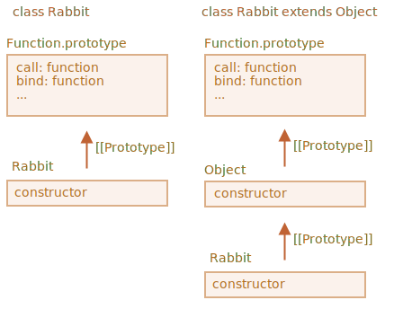

اول، بیایید ببینیم که چرا کد کار نمی‌کند.

اگر سعی کنیم که آن را اجرا کنیم دلیل واضح می‌شود. سازنده کلاس ارث‌بر باید `super()` را فراخوانی کند. در غیر این صورت `"this"` «تعریف شده» نخواهد بود.

حل این مشکل:

```js run
class Rabbit extends Object {
  constructor(name) {
*!*
    super(); // باید هنگام ارث‌بری سازنده والد را فراخوانی کنیم
*/!*
    this.name = name;
  }
}

let rabbit = new Rabbit("Rab");

alert( rabbit.hasOwnProperty('name') ); // true
```

اما این هنوز تمام ماجرا نیست.

<<<<<<< HEAD
حتی بعد از رفع این مشکل، هنوز هم یک تفاوت اساسی بین `"class Rabbit extends Object"` و `class Rabbit` وجود دارد.
=======
Even after the fix, there's still an important difference between `"class Rabbit extends Object"` and `class Rabbit`.
>>>>>>> 2901e0c64590a67d8a2bde1ea76a514d96f80469

همانطور که می‌دانیم، سینتکس "extends" دو پروتوتایپ را تنظیم می‌کند:

1. بین `"prototype"` سازنده تابع‌ها (برای متدها).
2. بین خود سازنده تابع‌ها (برای متدهای ایستا).

<<<<<<< HEAD
در این مورد ما، برای `class Rabbit extends Object` داریم:
=======
In the case of `class Rabbit extends Object` it means:
>>>>>>> 2901e0c64590a67d8a2bde1ea76a514d96f80469

```js run
class Rabbit extends Object {}

alert( Rabbit.prototype.__proto__ === Object.prototype ); // (1) true
alert( Rabbit.__proto__ === Object ); // (2) true
```

<<<<<<< HEAD
پس حالا `Rabbit` به دسترسی متدهای ایستای `Object` از طریق `Rabbit` را فراهم می‌کند، مثلا اینگونه:
=======
So `Rabbit` now provides access to the static methods of `Object` via `Rabbit`, like this:
>>>>>>> 2901e0c64590a67d8a2bde1ea76a514d96f80469

```js run
class Rabbit extends Object {}

*!*
// را فراخوانی می‌کنیم Object.getOwnPropertyNames معمولا ما
alert ( Rabbit.getOwnPropertyNames({a: 1, b: 2})); // a,b
*/!*
```

اما اگر ما `extends Object` را نداشته باشیم، سپس `Rabbit.__proto__` برابر با `Object` نخواهد بود.

اینجا یک دمو قرار دارد:

```js run
class Rabbit {}

alert( Rabbit.prototype.__proto__ === Object.prototype ); // (1) true
alert( Rabbit.__proto__ === Object ); // (2) false (!)
alert( Rabbit.__proto__ === Function.prototype ); // به صورت پیش‌فرض، مانند هر تابعی

*!*
// وجود ندارد Rabbit ارور، چنین تابعی درون
alert ( Rabbit.getOwnPropertyNames({a: 1, b: 2})); // ارور
*/!*
```

پس در این صورت `Rabbit` دسترسی به متدهای ایستای `Object` را فراهم نمی‌کند.

<<<<<<< HEAD
راستی، `Function.prototype` دارای متدهای «عمومی» تابع است، مثل `call`، `bind` و غیره. آن‌ها در هر دو مورد سرانجام در دسترس هستند چون سازنده درون‌ساخت `Object`، `Object.__proto__ === Function.prototype` را دارد.
=======
By the way, `Function.prototype` also has "generic" function methods, like `call`, `bind` etc. They are ultimately available in both cases, because for the built-in `Object` constructor, `Object.__proto__ === Function.prototype`.
>>>>>>> 2901e0c64590a67d8a2bde1ea76a514d96f80469

اینجا تصویر آن را داریم:



پس، به طور خلاصه، دو تفاوت وجود دارد:

| class Rabbit | class Rabbit extends Object  |
|--------------|------------------------------|
| --             | باید `super()` را دورن سازنده فراخوانی کند |
| `Rabbit.__proto__ === Function.prototype` | `Rabbit.__proto__ === Object` |
