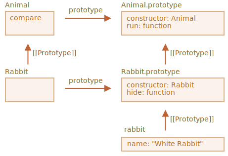

# ویژگی و متدهای ایستا

ما می‌توانیم یک متد را در خود تابع کلاس هم قرار دهیم، نه درون `"prototype"` آن. چنین متدهایی *ایستا (static)* نامیده می‌شوند.

در یک کلاس، آن‌ها با کلمه کلیدی `static` استفاده می‌شوند، مثل این:

```js run
class User {
*!*
  static staticMethod() {
*/!*
    alert(this === User);
  }
}

User.staticMethod(); // true
```

این کار دقیقا مانند این است که به طور مستقیم یک ویژگی را مقداردهی کنیم:

```js run
class User { }

User.staticMethod = function() {
  alert(this === User);
};

User.staticMethod(); // true
```

مقدار `this` درون فراخوانی `User.staticMethod()` برابر با کلاس سازنده یعنی خود `User` است (قانون «شیء قبل از نقطه»).

معمولا، متدهای ایستا برای پیاده‌سازی تابع‌هایی که به کلاس تعلق دارند و نه به هر شیء خاصی از آن استفاده می‌شوند.

برای مثال، ما شیءهای کلاس `Article` (به معنی مقاله) را داریم و به تابعی برای مقایسه آن‌ها نیاز داریم. یک راه‌حل طبیعی اضافه کردن متد `Article.compare` است، مثلا اینگونه:

```js run
class Article {
  constructor(title, date) {
    this.title = title;
    this.date = date;
  }

*!*
  static compare(articleA, articleB) {
    return articleA.date - articleB.date;
  }
*/!*
}

// کارایی
let articles = [
  new Article("HTML", new Date(2019, 1, 1)),
  new Article("CSS", new Date(2019, 0, 1)),
  new Article("JavaScript", new Date(2019, 11, 1))
];

*!*
articles.sort(Article.compare);
*/!*

alert( articles[0].title ); // CSS
```

اینجا `Article.compare` در «بالای» مقاله‌ها (articles) قرار دارد، به عنوان واسطه‌ای برای مقایسه آن‌ها. این متدی از یک مقاله نیست، بلکه برای کل کلاس است.

مثال دیگر متدی به نام "factory" (به معنی کارخانه) است. فرض کنید، ما به چند راه برای ایجاد یک مقاله نیاز داریم:

1. ساختن از طریق پارامترها (`title`، `date` و غیره).
2. ساختن یک مقاله خالی با تاریخ امروز.
3. ...یا به روشی دیگر.

اولین راه می‌تواند با استفاده از تابع سازنده پیاده‌سازی شود. و برای راه دوم می‌توانیم یک متد ایستا برای کلاس بسازیم.

مانند `Article.createTodays()` در اینجا:

```js run
class Article {
  constructor(title, date) {
    this.title = title;
    this.date = date;
  }

*!*
  static createTodays() {
    // this = Article ،به یاد داشته باشید
    return new this("خلاصه‌ی امروز", new Date());
  }
*/!*
}

let article = Article.createTodays();

alert( article.title ); // خلاصه‌ی امروز
```

حالا هر بار که نیاز داشته باشیم یک خلاصه از امروز بسازیم، می‌توانیم `Article.createTodays()` را فراخوانی کنیم. یکبار دیگر هم می‌گوییم، این متدی از مقاله (article) نیست بلکه متدی از کل کلاس است.

متدهای ایستا همچنین در کلاس‌های مربوط به پایگاه داده (database) برای جست‌وجو/ذخیره/حذف ورودی‌ها از پایگاه داده هم استفاده می‌شوند، مثلا اینگونه:

```js
// کلاسی خاص برای مدیریت مقاله‌ها است Article با فرض اینکه
// :متد ایستا برای حذف مقاله‌ها
Article.remove({id: 12345});
```

## Static properties

[recent browser=Chrome]

Static properties are also possible, they look like regular class properties, but prepended by `static`:

```js run
class Article {
  static publisher = "Ilya Kantor";
}

alert( Article.publisher ); // Ilya Kantor
```

That is the same as a direct assignment to `Article`:

```js
Article.publisher = "Ilya Kantor";
```

## Inheritance of static properties and methods [#statics-and-inheritance]

Static properties and methods are inherited.

For instance, `Animal.compare` and `Animal.planet` in the code below are inherited and accessible as `Rabbit.compare` and `Rabbit.planet`:

```js run
class Animal {
  static planet = "Earth";

  constructor(name, speed) {
    this.speed = speed;
    this.name = name;
  }

  run(speed = 0) {
    this.speed += speed;
    alert(`${this.name} runs with speed ${this.speed}.`);
  }

*!*
  static compare(animalA, animalB) {
    return animalA.speed - animalB.speed;
  }
*/!*

}

// Inherit from Animal
class Rabbit extends Animal {
  hide() {
    alert(`${this.name} hides!`);
  }
}

let rabbits = [
  new Rabbit("White Rabbit", 10),
  new Rabbit("Black Rabbit", 5)
];

*!*
rabbits.sort(Rabbit.compare);
*/!*

rabbits[0].run(); // Black Rabbit runs with speed 5.

alert(Rabbit.planet); // Earth
```

Now when we call `Rabbit.compare`, the inherited `Animal.compare` will be called.

How does it work? Again, using prototypes. As you might have already guessed, `extends` gives `Rabbit` the `[[Prototype]]` reference to `Animal`.



So, `Rabbit extends Animal` creates two `[[Prototype]]` references:

1. `Rabbit` function prototypally inherits from `Animal` function.
2. `Rabbit.prototype` prototypally inherits from `Animal.prototype`.

As a result, inheritance works both for regular and static methods.

Here, let's check that by code:

```js run
class Animal {}
class Rabbit extends Animal {}

// for statics
alert(Rabbit.__proto__ === Animal); // true

// for regular methods
alert(Rabbit.prototype.__proto__ === Animal.prototype); // true
```

## Summary

Static methods are used for the functionality that belongs to the class "as a whole". It doesn't relate to a concrete class instance.

For example, a method for comparison `Article.compare(article1, article2)` or a factory method `Article.createTodays()`.

They are labeled by the word `static` in class declaration.

Static properties are used when we'd like to store class-level data, also not bound to an instance.

The syntax is:

```js
class MyClass {
  static property = ...;

  static method() {
    ...
  }
}
```

Technically, static declaration is the same as assigning to the class itself:

```js
MyClass.property = ...
MyClass.method = ...
```

Static properties and methods are inherited.

For `class B extends A` the prototype of the class `B` itself points to `A`: `B.[[Prototype]] = A`. So if a field is not found in `B`, the search continues in `A`.
