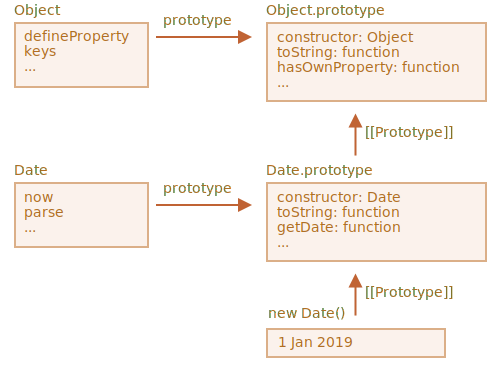

# تعمیم دادن کلاس‌های درون‌ساخت

کلاس‌های درون‌ساخت مانند Array، Map و بقیه هم قابل تعمیم هستند.

برای مثال، اینجا `PowerArray` از `Array` نیتیو ارث‌بری می‌کند:

```js run
// اضافه کردن یک متد دیگر به آن (می‌توانیم بیشتر هم اضافه کنیم)
class PowerArray extends Array {
  isEmpty() {
    return this.length === 0;
  }
}

let arr = new PowerArray(1, 2, 5, 10, 50);
alert(arr.isEmpty()); // false

let filteredArr = arr.filter(item => item >= 10);
alert(filteredArr); // 10, 50
alert(filteredArr.isEmpty()); // false
```

لطفا به یک موضوع جالب توجه کنید. متدهای درون‌ساخت مانند `filter`، `map` و بقیه -- شیءهای جدیدی که دقیقا از `PowerArray` به ارث برده شده ساخته شده‌اند را برمی‌گردانند. پیاده‌سازی درونی آن‌ها از ویژگی `constructor` شیء برای این کار استفاده می‌کند.

در مثال بالا،
```js
arr.constructor === PowerArray
```

زمانی که `arr.filter()` فراخوانی می‌شود، از درون، آرایه‌ای جدید از نتیجه‌ها را با استفاده از `arr.constructor` ایجاد می‌کند نه `Array` پایه‌ای.

حتی فراتر از آن، می‌توانیم این عملکرد را شخصی‌سازی کنیم.

می‌توانیم یک getter استاتیک `Symbol.species` خاص را به کلاس اضافه کنیم. اگر این متد وجود داشته باشد، باید تابع سازنده‌ای که جاوااسکریپت از درون برای ایجاد المان‌های جدید درون `map`، `filter` و بقیه استفاده می‌کند را برگرداند.

اگر بخواهیم متدهای درون‌ساخت مانند `map` یا `filter` آرایه‌های معمولی برگردانند، می‌توانیم در `Symbol.species` کلاس `Array` را برگردانیم، مثل اینجا:

```js run
class PowerArray extends Array {
  isEmpty() {
    return this.length === 0;
  }

*!*
  // متدهای درون‌ساخت از این به عنوان تابع سازنده استفاده می‌کنند
  static get [Symbol.species]() {
    return Array;
  }
*/!*
}

let arr = new PowerArray(1, 2, 5, 10, 50);
alert(arr.isEmpty()); // false

// به عنوان سازنده، آرایه‌ای جدید تشکیل می‌دهد arr.constructor[Symbol.species] با استفاده از filter
let filteredArr = arr.filter(item => item >= 10);

*!*
// است Array نیست بلکه PowerArray یک filteredArr
*/!*
alert(filteredArr.isEmpty()); // Error: filteredArr.isEmpty is not a function
```

همانطور که می‌بینید، حالا `.filter` کلاس `Array` را برمی‌گرداند. پس عملکرد تعمیم داده شده دیگر پاس داده نمی‌شود.

```smart header="مجموعه‌های دیگر هم به طور مشابه عمل می‌کنند"
مجموعه‌های دیگر، مثال `Map` و `Set`، همینطور کار می‌کنند. آن‌ها هم از `Symbol.species` استفاده می‌کنند.
```

## ارث‌بری ایستا در درون‌ساخت‌ها وجود ندارد

شیءهای درون‌ساخت متدهای ایستا خود را دارند، برای مثال `Object.keys`، `Array.isArray` و غیره.

همانطور که از قبل می‌دانیم، کلاس‌های نیتیو یکدیگر را تعمیم می‌دهند. برای مثال `Array` کلاس `Object` را تعمیم می‌دهد.

طبیعاتا، زمانی که کلاسی کلاس دیگر را تعمیم می‌دهد، هم متدهای ایستا و هم متدهای غیر ایستا به ارث برده می‌شوند. این موضوع به طور کامل در مقاله [](info:static-properties-methods#statics-and-inheritance) توضیح داده شد.

اما کلاس‌های درون‌ساخت استثنا هستند. آن‌ها ویژگی‌های ایستا را از یکدیگر به ارث نمی‌برند.

برای مثال، هر دو کلاس `Array` و `Date` از `Object` ارث‌بری می‌کنند، پس نمونه‌های آن‌ها از `Object.prototype` متدهایی دارند. اما `Array.[[Prototype]]` به `Object` رجوع نمی‌کند پس برای مثال، مندهای ایستای `Array.keys()` (یا `Date.keys()`) وجود ندارند.

اینجا ساختاری تصویری برای `Date` و `Object` داریم:



همانطور که می‌بینید، بین `Date` و `Object` هیچ ارتباطی وجود ندارد. آن‌ها مستقل هستند، فقط `Date.prototype` از `Object.prototype` ارث‌بری می‌کند.

این یک تفاوت مهم شیءهای درون‌ساخت در مقایسه با چیزی است که از `extends` بدست می‌آوریم است.
