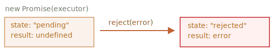

# وعده (promise)

تصور کنید که یک خواننده برتر هستید و طرفداران شب و روز درخواست آهنگ بعدی شما را دارند.

برای اینکه کمی راحت بشوید، قول می‌دهید پس از انتشار آن را برای آن‌ها ارسال کنید. شما یک لیست به طرفداران خود می‌دهید. آن‌ها می‌توانند آدرس ایمیل خود را پر کنند، به طوری که وقتی آهنگ در دسترس قرار گرفت، همه مشترکین فورا آن را دریافت کنند. و حتی اگر مشکلی پیش بیاید، فرض کنید آتش سوزی در استودیو، به طوری که نتوانید آهنگ را منتشر کنید، باز هم به آن‌ها اطلاع داده خواهد شد.

همه خوشحال هستند: شما، چون مردم دیگر مزاحم شما نمی‌شوند، و طرفداران، چون آهنگ را از دست نمی‌دهند.

این یک تشبیه واقعی برای چیزهایی است که اغلب در برنامه‌نویسی داریم:

1. یک "کد تولید‌کننده" که کاری انجام می‌دهد و زمانی می‌برد. به عنوان مثال، کدهایی که داده‌ها را از طریق شبکه بارگیری می‌کند. این یک "خواننده" است.
2. یک "کد مصرف‌کننده" که نتیجه‌ی "کد تولیدکننده" را پس از آماده شدن می خواهد. بسیاری از توابع ممکن است به آن نتیجه نیاز داشته باشند. اینها "طرفداران" هستند.
3. یک *وعده* (*promise*) یک شیء خاص جاوااسکریپت است که "کد تولید‌کننده" و "کد مصرف‌کننده" را به یکدیگر پیوند می‌دهد. از نظر تشبیه ما: این فهرست اشتراک است. "کد تولید‌کننده" هر زمانی را که برای تولید نتیجه وعده داده شده نیاز دارد طول می‌کشد، و "وعده" (promise) آن نتیجه را پس از آماده شدن برای همه کدهای مشترک شده در دسترس قرار می‌دهد.

این تشبیه خیلی دقیق نیست، زیرا وعده‌های (promises) جاوا‌اسکریپت پیچیده‌تر از یک لیست اشتراک ساده است: آن‌ها دارای ویژگی‌ها و محدودیت‌های اضافی هستند. اما برای شروع خوب است.

نحوِ (syntax) سازنده برای یک شیء وعده (promise) به صورت زیر است:

```js
let promise = new Promise(function(resolve, reject) {
  // executor (the producing code, "singer")
});
```

تابعی که به `new Promise` ارسال می‌شود *اجرا‌کننده* نامیده می‌شود. هنگامی که `new Promise` ایجاد می‌شود، اجرا‌کننده به طور خودکار اجرا می‌شود. این شامل کد تولید‌کننده است که در نهایت باید نتیجه را ایجاد کند. از نظر تشبیه بالا: اجراکننده "خواننده" است.

آرگومان‌های آن `resolve` و `reject`  فراخوان‌هایی هستند که توسط خود جاوا‌اسکریپت ارائه شده است. کد ما فقط در داخل اجرا‌کننده است.

وقتی اجرا‌کننده به نتیجه رسید، چه زود باشد چه دیر، مهم نیست، باید یکی از این callback ها را فراخوانی کند:

- `resolve(value)` — `value` اگر کار با موفقیت به پایان رسید، با نتیجه‌ی.
- `reject(error)` — همان شیء خطا است `error` ، اگر خطایی رخ داده باشد  

بنابراین به طور خلاصه: اجراکننده به طور خودکار اجرا می‌شود و تلاش می‌کند تا یک کار را انجام دهد. هنگامی که کار با تلاش به پایان رسید، در صورت موفقیت‌آمیز بودن، `resolve` یا در صورت وجود هر خطایی `reject` را فراخوانی می‌کند.

شیء `promise` که توسط سازنده `new Promise` برگردانده شده است دارای این ویژگی‌های داخلی است:

- `state` — .تغییر می‌کند `"rejected"` فراخوانی می‌شود به `reject` یا زمانی که `"fulfilled"` به `resolve` سپس با فراخوانی، `"pending"` در ابتدا
- `result` — .تغییر می‌کند `error` فراخوانی می شود به `reject(error)`  یا زمانی که `value` به `resolve(value)` سپس با فراخوانی ،`undefined` در ابتدا

بنابراین اجرا‌کننده در نهایت `promise` را به یکی از این حالات منتقل می‌کند:


بعداً خواهیم دید که چگونه "طرفداران" می‌توانند در این تغییرات مشترک شوند.

در اینجا یک نمونه از سازنده وعده (promise) و یک تابع اجرا‌کننده ساده با "کد تولید‌کننده" است که زمانی می‌برد (از طریق `setTimeout`):

```js run
let promise = new Promise(function(resolve, reject) {
  //  ساخته می‌شود به طور خودکار اجرا می‌شود (promise)این تابع زمانی که وعده

  // انجام شد "done" پس از 1 ثانیه سیگنال می‌دهد که کار با نتیجه 
  setTimeout(() => *!*resolve("done")*/!*, 1000);
});
```

با اجرای کد بالا می توانیم دو چیز را ببینیم:

۱. اجرا‌کننده به صورت خودکار و بلافاصله فراخوانی می‌شود (توسط `new Promise`).<br /> 
۲. اجرا‌کننده دو آرگومان دریافت می‌کند: `resolve` و `reject`. این توابع توسط موتور جاوااسکریپت از پیش تعریف شده‌اند, بنابراین ما نیازی به ایجاد آن‌ها نداریم. وقتی آماده شدیم فقط باید یکی از آن‌ها را فراخوانی کنیم.

    :را تغییر می‌دهد `promise` را برای ایجاد نتیجه فراخوانی می‌کند. این وضعیت شیء `resolve("done")` پس از یک ثانیه "پردازش"، اجرا‌کننده

    

این نمونه‌ای از تکمیل موفقیت آمیز کار بود، یک "fulfilled promise".

و حال نمونه‌ای از ردشدن(rejecting) وعده‌ی(promise) اجرا‌کننده با یک خطا:

```js
let promise = new Promise(function(resolve, reject) {
  // بعد از 1 ثانیه سیگنال می‌دهد که کار با یک خطا تمام شده است
  setTimeout(() => *!*reject(new Error("Whoops!"))*/!*, 1000);
});
```

فراخوانیِ `(...)reject` شیء وعده(promise) را به وضعیت `"rejected"` می‌برد:



به طور خلاصه، اجرا‌کننده باید یک کار را انجام دهد (معمولاً کاری که زمان می‌برد) و سپس `resolve` یا `reject` را برای تغییر وضعیت شیء وعده‌ی(promise) مربوطه فراخوانی کند.

به وعده‌ای که یا حل‌و‌فصل(resolved) می‌شود یا رد(rejected) می‌شود، "تسویه‌شده" ("settled") می‌گویند، برخلاف وعده‌ای(promise) که در ابتدا "درحال انتظار" ("pending") است.

````smart header="تنها یک نتیجه یا یک خطا می تواند وجود داشته باشد"
.را فراخوانی کند. هر تغییر وضعیتی نهایی است `reject` یا یک `resolve` اجرا‌کننده باید فقط یک

:نادیده گرفته می‌شوند `reject` و `resolve` همه فراخوانی‌های دیگر از

```js
let promise = new Promise(function(resolve, reject) {
*!*
  resolve("done");
*/!*

  reject(new Error("…")); // نادیده گرفته شد
  setTimeout(() => resolve("…")); // نادیده گرفته شد
});
```

ایده این است که کار انجام شده توسط اجرا‌کننده ممکن است تنها یک نتیجه یا یک خطا داشته باشد.

.تنها یک آرگومان (یا هیچی) را انتظار دارد و آرگومان‌های اضافی را نادیده می‌گیرد `resolve`/`reject` ،همچنین
````

```smart header="کنید (reject)رد `Error` با اشیاء"</br>
<span dir="rtl">در صورتی که مشکلی پیش بیاید، اجرا‌کننده باید `reject` را فراخوانی کند. این کار می‌تواند با هر نوع آرگومانی انجام شود (دقیقاً مانند `resolve`). اما توصیه می‌شود از اشیاء `Error` (یا اشیایی که از `Error` به ارث می‌برند) استفاده کنید. دلیل آن به زودی مشخص خواهد شد.<span>
```

````smart header="را فراخوانی می‌کند `Resolve`/`Reject` بلافاصله"
:را فراخوانی کنیم، مانند این `reject` یا `resolve` را فراخوانی می‌کند، اما مجبور نیست. همچنین می‌توانیم بلافاصله `resolve`/`reject` در عمل، یک اجرا‌کننده معمولاً کاری را به صورت ناهمزمان انجام می‌دهد و پس از مدتی

```js
let promise = new Promise(function(resolve, reject) {
  // وقت خود را برای انجام کار صرف نمی کنیم
  resolve(123); // بلافاصله نتیجه را بدهید: 123
});
```

به عنوان مثال، این ممکن است زمانی اتفاق بیفتد که ما شروع به انجام یک کار می‌کنیم، اما بعد می‌بینیم که همه چیز قبلاً تکمیل شده و در حافظه پنهان(cache) ذخیره شده است.

خوبه. ما بلافاصله یک وعده(promise) حل‌شده(resolved) داریم.
````

```smart header="The `state` and `result` are internal"
The properties `state` and `result` of the Promise object are internal. We can't directly access them. We can use the methods `.then`/`.catch`/`.finally` for that. They are described below.
```

## Consumers: then, catch, finally

A Promise object serves as a link between the executor (the "producing code" or "singer") and the consuming functions (the "fans"), which will receive the result or error. Consuming functions can be registered (subscribed) using methods `.then`, `.catch` and `.finally`.

### then

The most important, fundamental one is `.then`.

The syntax is:

```js
promise.then(
  function(result) { *!*/* handle a successful result */*/!* },
  function(error) { *!*/* handle an error */*/!* }
);
```

The first argument of `.then` is a function that runs when the promise is resolved, and receives the result.

The second argument of `.then` is a function that runs when the promise is rejected, and receives the error.

For instance, here's a reaction to a successfully resolved promise:

```js run
let promise = new Promise(function(resolve, reject) {
  setTimeout(() => resolve("done!"), 1000);
});

// resolve runs the first function in .then
promise.then(
*!*
  result => alert(result), // shows "done!" after 1 second
*/!*
  error => alert(error) // doesn't run
);
```

The first function was executed.

And in the case of a rejection, the second one:

```js run
let promise = new Promise(function(resolve, reject) {
  setTimeout(() => reject(new Error("Whoops!")), 1000);
});

// reject runs the second function in .then
promise.then(
  result => alert(result), // doesn't run
*!*
  error => alert(error) // shows "Error: Whoops!" after 1 second
*/!*
);
```

If we're interested only in successful completions, then we can provide only one function argument to `.then`:

```js run
let promise = new Promise(resolve => {
  setTimeout(() => resolve("done!"), 1000);
});

*!*
promise.then(alert); // shows "done!" after 1 second
*/!*
```

### catch

If we're interested only in errors, then we can use `null` as the first argument: `.then(null, errorHandlingFunction)`. Or we can use `.catch(errorHandlingFunction)`, which is exactly the same:


```js run
let promise = new Promise((resolve, reject) => {
  setTimeout(() => reject(new Error("Whoops!")), 1000);
});

*!*
// .catch(f) is the same as promise.then(null, f)
promise.catch(alert); // shows "Error: Whoops!" after 1 second
*/!*
```

The call `.catch(f)` is a complete analog of `.then(null, f)`, it's just a shorthand.

### finally

Just like there's a `finally` clause in a regular `try {...} catch {...}`, there's `finally` in promises.

The call `.finally(f)` is similar to `.then(f, f)` in the sense that `f` always runs when the promise is settled: be it resolve or reject.

`finally` is a good handler for performing cleanup, e.g. stopping our loading indicators, as they are not needed anymore, no matter what the outcome is.

Like this:

```js
new Promise((resolve, reject) => {
  /* do something that takes time, and then call resolve/reject */
})
*!*
  // runs when the promise is settled, doesn't matter successfully or not
  .finally(() => stop loading indicator)
  // so the loading indicator is always stopped before we process the result/error
*/!*
  .then(result => show result, err => show error)
```

That said, `finally(f)` isn't exactly an alias of `then(f,f)` though. There are few subtle differences:

1. A `finally` handler has no arguments. In `finally` we don't know whether the promise is successful or not. That's all right, as our task is usually to perform "general" finalizing procedures.
2. A `finally` handler passes through results and errors to the next handler.

    For instance, here the result is passed through `finally` to `then`:
    ```js run
    new Promise((resolve, reject) => {
      setTimeout(() => resolve("result"), 2000)
    })
      .finally(() => alert("Promise ready"))
      .then(result => alert(result)); // <-- .then handles the result
    ```

    And here there's an error in the promise, passed through `finally` to `catch`:

    ```js run
    new Promise((resolve, reject) => {
      throw new Error("error");
    })
      .finally(() => alert("Promise ready"))
      .catch(err => alert(err));  // <-- .catch handles the error object
    ```

That's very convenient, because `finally` is not meant to process a promise result. So it passes it through.

We'll talk more about promise chaining and result-passing between handlers in the next chapter.


````smart header="We can attach handlers to settled promises"
If a promise is pending, `.then/catch/finally` handlers wait for it. Otherwise, if a promise has already settled, they just run:

```js run
// the promise becomes resolved immediately upon creation
let promise = new Promise(resolve => resolve("done!"));

promise.then(alert); // done! (shows up right now)
```

Note that this makes promises more powerful than the real life "subscription list" scenario. If the singer has already released their song and then a person signs up on the subscription list, they probably won't receive that song. Subscriptions in real life must be done prior to the event.

Promises are more flexible. We can add handlers any time: if the result is already there, they just execute.
````

Next, let's see more practical examples of how promises can help us write asynchronous code.

## Example: loadScript [#loadscript]

We've got the `loadScript` function for loading a script from the previous chapter.

Here's the callback-based variant, just to remind us of it:

```js
function loadScript(src, callback) {
  let script = document.createElement('script');
  script.src = src;

  script.onload = () => callback(null, script);
  script.onerror = () => callback(new Error(`Script load error for ${src}`));

  document.head.append(script);
}
```

Let's rewrite it using Promises.

The new function `loadScript` will not require a callback. Instead, it will create and return a Promise object that resolves when the loading is complete. The outer code can add handlers (subscribing functions) to it using `.then`:

```js run
function loadScript(src) {
  return new Promise(function(resolve, reject) {
    let script = document.createElement('script');
    script.src = src;

    script.onload = () => resolve(script);
    script.onerror = () => reject(new Error(`Script load error for ${src}`));

    document.head.append(script);
  });
}
```

Usage:

```js run
let promise = loadScript("https://cdnjs.cloudflare.com/ajax/libs/lodash.js/4.17.11/lodash.js");

promise.then(
  script => alert(`${script.src} is loaded!`),
  error => alert(`Error: ${error.message}`)
);

promise.then(script => alert('Another handler...'));
```

We can immediately see a few benefits over the callback-based pattern:


| Promises | Callbacks |
|----------|-----------|
| Promises allow us to do things in the natural order. First, we run `loadScript(script)`, and `.then` we write what to do with the result. | We must have a `callback` function at our disposal when calling `loadScript(script, callback)`. In other words, we must know what to do with the result *before* `loadScript` is called. |
| We can call `.then` on a Promise as many times as we want. Each time, we're adding a new "fan", a new subscribing function, to the "subscription list". More about this in the next chapter: [](info:promise-chaining). | There can be only one callback. |

So promises give us better code flow and flexibility. But there's more. We'll see that in the next chapters.
