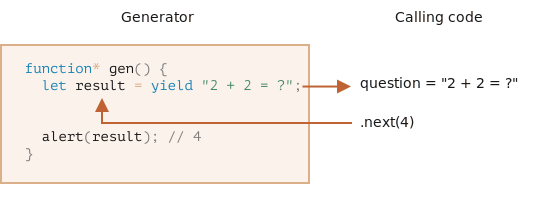

# Generators

توابع معمول فقط یک‌بار می‌توانند یک مقدار(مثلا یک object یا undefined) را برگردانند.

اما generatorها می‌توانند چندین بار، بر اساس تقاضا، مقادیر متفاوت را برگردانند(اصطلاحا yield کنند.). generatorها با [iterableها](info:iterable) به خوبی کار می‌کنند و به کمک آن‌ها می‌توان جریان‌های داده ساخت.

## توابع Generator

برای ساختن یک generator به یک سینتکس خاص نیاز است: *function، که به آن "تابع generator" می‌گویند.

ظاهر یک تابع generator به صورت زیر است:

```js
function* generateSequence() {
  yield 1;
  yield 2;
  return 3;
}
```

توابع generator با توابع معمول، رفتار متفاوتی دارند. زمانی که این توابع صدا می‌شوند، بدنه آن‌ها اجرا نمی‌شود؛ در عوض، یک آبجکت خاص به نام "generator object" برمی‌گردانند که به وسیله آن اجرای تابع را می‌توان کنترل کرد.

برای مثال:

```js run
function* generateSequence() {
  yield 1;
  yield 2;
  return 3;
}

//برمی‌گرداند generator یک آبجکت generator تابع
let generator = generateSequence();
\*!*
alert(generator); // [object Generator]
\*/!*
```

اجرای بدنه تابع هنوز شروع نشده است:


متد اصلی یک آبجکت generator متد `()next` است. هنگامی که صدا می‌شود، بدنه تابع تا اولین `yield value` اجرا می‌شود(`value` می‌تواند حذف شود که در این صورت `undefined` است.)؛ سپس اجرای تابع متوقف می‌شود و مقدار yield شده برگرداننده می‌شود.

مقدار برگردانده شده توسط متود `next` همواره یک آبجکت با 2 پراپرتی است:
- `value`: مقدار برگرداننده شده توسط `yield`.
- `done`: یک Boolean است که در صورت اتمام بدنه تابع مقدار true و در غیر این صورت مقدار false دارد.

برای مثال، در کد زیر، یک آبجکت generator ایجاد شده و اولین مقدار `yield` شده توسط آن گرفته شده است:

```js run
function* generateSequence() {
  yield 1;
  yield 2;
  return 3;
}

let generator = generateSequence();

\*!*
let one = generator.next();
\*/!*

alert(JSON.stringify(one)); // {value: 1, done: false}
```

اکنون فقط مقدار اول را گرفته‌ایم و اجرای تابع در خط دوم متوقف شده است:


اکنون اگر دوباره `()generator.next` را صدا بزنیم اجرای تابع شروع می‌شود و تا `yield` بعدی و برگردانده شدن مقدار ادامه می‌یابد:

```js
let two = generator.next();

alert(JSON.stringify(two)); // {value: 2, done: false}
```


و اگر برای بار سوم آن را صدا بزنیم، اجرای تابع به `return` می‌رسد و تمام می‌شود:

```js
let three = generator.next();

alert(JSON.stringify(three)); // {value: 3, *!*done: true*/!*}
```


اکنون از روی `done:true` متوجه می‌شویم کار generator تمام شده و `value:3` آخرین مقدار برگردانده شده توسط generator است.

دیگر صدا کردن `()generator.next` منطقی نیست. اگر این کار را انجام دهیم، آبجکت یکسانی با `done:true` برگردانده می‌شود.

```smart header="`function* f(…)`یا`function *f(…)`؟"
هر دو سینتکس صحیح هستند.

ولی معمولا اولی ترجیح داده می‌شود؛ چون `*` نوع تابع و نه نام تابع را مشخص می‌کند.
````

## generatorها iterable هستند.

همان‌طور که احتمالا با توجه به `()next` متوجه شده‌اید، generatorها [iterable](info:iterable) هستند.

با استفاد از `for..of` می‌توان از `value` آن‌ها استفاده کرد:

```js run
function* generateSequence() {
  yield 1;
  yield 2;
  return 3;
}

let generator = generateSequence();

for(let value of generator) {
  alert(value); // ابتدا 1 و سپس 2
}
````

این شیوه از صدا کردن `next` تمیزتر است؛ این‌گونه فکر نمی‌کنید؟

...اما دقت کنید: مثال بالا ابتدا `1` و سپس `2` را نشان داد؛ خبری از `3` نیست!

علت این اتفاق این است که `for..of` آخرین مقدار را هنگامی که `done:true` است در نظر نمی‌گیرد. هنگام برگرداندن آخرین مقدار با `return`، بر خلاف `done:true`، `yield` است. در نتیجه برای نشان دادن تمام مقادیر باید آن‌ها را با `yield` برگردانیم:

```js run
function* generateSequence() {
  yield 1;
  yield 2;
\*!*
  yield 3;
\*/!*
}

let generator = generateSequence();

for(let value of generator) {
  alert(value); // ابتدا 1 سپس 2 و بعد از آن 3
}
```

از آنجایی که generatorها iterable هستند، از تمام functionality آن‌ها نیز برای generatorها می‌توان استفاده کرد؛ مثل spread syntax `...`:

```js run
function* generateSequence() {
  yield 1;
  yield 2;
  yield 3;
}

let sequence = [0, ...generateSequence()];

alert(sequence); // 0, 1, 2, 3
```

در کد بالا، `()generateSequence...`، باعث می‌شود آبجکت generator که iterable هم هست به آرایه‌ای از اعداد تبدیل شود.(درباره spread syntax در چپتر [](info:rest-parameters-spread#spread-syntax) بیشتر بخوانید.)

## استفاده از generatorها برای iterableها

در چپتر [](info:iterable) یک آبجکت `range` ساختیم که مقادیر `from..to` را باز می‌گرداند.

کد آن به شرح زیر بود:

```js run
let range = {
  from: 1,
  to: 5,

  // در ابتدا این متود را فقط یک بار صدا می‌کند for..of range
  [Symbol.iterator]() {
    // این، آبجکت ایتریتور را باز می‌گرداند:
	 // فقط با آن آبجکت کار می‌کند و از آن مقادیر بعدی را می‌خواند for..of سپس
    return {
      current: this.from,
      last: this.to,

      // صدا می‌شود for..of توسط iteration در هر next()
      next() {
        // {value: ..., done: ...}:باید مقدار را به عنوان یک آبجکت برگرداند
        if (this.current <= this.last) {
          return { done: false, value: this.current++ };
        } else {
          return { done: true };
        }
      },
    };
  },
};

// برمی‌گرداند range.to تا range.from اعداد را از range روی iteration
alert([...range]); // 1,2,3,4,5
```

می‌توان از یک تابع generator برای iteration به جای Symbol.iterator استفاده کرد.

این همان `range` اما بسیار جمع و جور تر است:

```js run
let range = {
  from: 1,
  to: 5,

  *[Symbol.iterator]() {//[Symbol.iterator] نسخه جمع و جور : function*()
    for (let value = this.from; value <= this.to; value++) {
      yield value;
    }
  },
};

alert([...range]); // 1,2,3,4,5
```

دلیل کارکرد روش بالا این است که  `()range[Symbol.iterator]` دقیقا همان چیزی را برمی‌گرداند که `for..of` انتظار دارد:
- متود `next` موجود است.
- مقدار بازگشتی به فرم `{value:..., done:true/false}` است.

این کارکرد یک اتفاق نیست، generatorها با توجه به  iterator ها، برای پیاده‌سازی ساده‌تر آن‌ها به زبان اضافه شده‌اند.

روشی که از generator استفاده می‌کند بسیار مختصرتر از روش اول `range` است و همان کارکرد را دارد.

```smart header="generatorها ممکن است تا ابد مقدار تولید کنند"
در مثال بالا، یک دنباله کران‌دار تولید کردیم، ولی می‌توان به همان روش یک دنباله بی‌کران از مقادیر را ساخت. مثل یک دنباله بی‌پایان از اعداد شبه تصادفی.

چنین کاربردی قطعا به یک `break` یا `return` در `for..of` نیاز دارد. در غیر این صورت حلقه تا ابد تکرار می‌شود.
```

## ترکیب generatorها

ترکیب generatorها قابلیتی است که به وسیله آن می‌توان generatorها را در هم `embed` کرد.

برای مثال یک generator داریم که یک دنباله از اعداد را تولید می‌کند:

```js
function* generateSequence(start, end) {
  for (let i = start; i <= end; i++) yield i;
}
```

اکنون می‎‌خواهیم از آن به نحوی بازاستفاده کنیم که دنباله پیچیده‌تری بتوان ایجاد کرد:
- ابتدا ارقام از `0` تا `9`(با کد کاراکتر 48 تا 57)
-  سپس حروف بزرگ از `A` تا `Z`(با کد کاراکتر 65 تا 90)
-  سپس حروف کوچک از `a` تا `z`(با کد کاراکتر 97 تا 122)

برای مثال از این دنباله می‌توان با انتخاب کاراکتر، برای تولید رمز عبور استفاده کرد.

در توابع معمولی، برای ترکیب جواب‌ها از چندین تابع دیگر، آن‌ها را صدا می‌کنیم، مقادیر را ذخیره می‌کنیم و سپس در آخر آن‌ها را به هم `join` می‌کنیم.

برای generatorها سینتکس`*yield` برای "embed" کردن یک generator درون دیگری استفاده می‌شود.

generator ترکیب شده:

```js run
function* generateSequence(start, end) {
  for (let i = start; i <= end; i++) yield i;
}

function* generatePasswordCodes() {

\*!*
  // 0..9
  yield* generateSequence(48, 57);

  // A..Z
  yield* generateSequence(65, 90);

  // a..z
  yield* generateSequence(97, 122);
\*/!*

}

let str = '';

for(let code of generatePasswordCodes()) {
  str += String.fromCharCode(code);
}

alert(str); // 0..9A..Za..z
```

عبارت `*yield` اجرا را به یک generator دیگر می‌سپارد(اصطلاحا `delegate` می‌کند). بدان معنا که `yeild* gen` روی `gen` ایتریت می‌کند و به صورت درونی مقدار yield شده را به بیرون هدایت می‌کند؛ انگار که کلا مقدار توسط generator دوم تولید شده است.

اگر از generatorها به صورت inline و تو در تو استفاده کنیم نیز به همان نتیجه می‌رسیم:

```js run
function* generateSequence(start, end) {
  for (let i = start; i <= end; i++) yield i;
}

function* generateAlphaNum() {

\*!*
  // yield* generateSequence(48, 57);
  for (let i = 48; i <= 57; i++) yield i;

  // yield* generateSequence(65, 90);
  for (let i = 65; i <= 90; i++) yield i;

  // yield* generateSequence(97, 122);
  for (let i = 97; i <= 122; i++) yield i;
\*/!*

}

let str = '';

for(let code of generateAlphaNum()) {
  str += String.fromCharCode(code);
}

alert(str); // 0..9A..Za..z
```

ترکیب generatorها یک راه معقول برای استفاده از جریان یک generator درون دیگری است و از حافظه بیشتر برای ذخیره مقادیر استفاده نمی‌کند.

## yield یک خیابان دو طرفه است.

تا الان، generatorها بسیار شبیه به آبجکت‌های iterable با یک سینتکس خاص برای تولید مقادیر بودند؛ درواقع اما generatorها بسیار قدرتمندتر و انعطاف پذیرتر هستند.

چون `yield` یک خیابان دو طرفه است: نه تنها مقدار را به بیرون برمی‌گرداند بلکه می‌تواند مقادیر را به داخل generator بیاورد.

برای این کار باید `()generator.next` را با یک argument صدا کنیم. این argument تبدیل به مقدار برگردانده شده توسط خود yield درون generator می‌شود.

برای مثال:

```js run
function* gen() {
\*!*
  // یک سوال را به کد بیرونی برگردانید و منتظر جواب شوید
  let result = yield "2 + 2 = ?"; // (*)
\*/!*

  alert(result);
}

let generator = gen();

let question = generator.next().value; // <-- مقدار را بر می‌گرداند yield

generator.next(4); // --> برمی‌گرداند generator نتیجه را به
```



1. نمی‌توان اولین بار که `()generator.next` صدا می‌شود به آن argument داد و در صورت داده شدن، نادید گرفته خواهد شد. پس از صدا شدن متود، اجرای  generator شروع می‌شود و مقدار اولین yield را برمی‌گرداند. اکنون اجرای generator متوقف شده و در خط `*` مانده است.
2. سپس مانند تصویر بالا، نتیجه yield اول در متغیر `question` ذخیره می‌شود.
3. با اجرای `generator.next(4)`، اجرای generator دوباره شروع می‌‎شود و مقدار متغیر `result` برابر `4` می‌شود.

توجه داشته باشید که نیاز نیست کد بیرونی فورا `(4)next` را صدا کند؛ اگر طول بکشد، generator صبر خواهد کرد.

برای مثال:

```js
// پس از تاخیری دوباره شروع می‌شود generator اجرای
setTimeout(() => generator.next(4), 1000);
```

همان‌طور که مشاهده می‌شود بر خلاف توابع معمولی، یک generator و کد صدا زننده‌اش می‌توانند با هم مقادیر را از طریق `next/yield` رد و بدل کنند.

یک مثال دیگر:

```js run
function* gen() {
  let ask1 = yield "2 + 2 = ?";

  alert(ask1); // 4

  let ask2 = yield "3 * 3 = ?";

  alert(ask2); // 9
}

let generator = gen();

alert(generator.next().value); // "2 + 2 = ?"

alert(generator.next(4).value); // "3 * 3 = ?"

alert(generator.next(9).done); // true
```

تصویر اجرا:


1. اولین `()next`اجرای generator را آغاز می‌کند تا به اولین yield برسد.
2. نتیجه به کد بیرونی برگردانده می‌شود.
3. صدا زده شدن `next(4)` مقدار `4` را به generator به عنوان نتیجه اولین yield باز می‌گرداند و اجرای generator را دوباره شروع می‌کند.
4. به yield دوم می‌رسد و مقدار آن نتیجه دومین بار صدا شدن `next` است.
5. صدا زده شدن `next(9)`مقدار `9` را به عنوان نتیجه دومین yield برمی‌گرداند و اجرای generator دوباره شروع می‌شود تا به انتهای تابع، `done:true` برسد.

درست مثل بازی پینگ پنگ؛ `(value)next` یک مقدار را به generator پاس می‌دهد که نتیجه yield فعلی می‌شود و سپس نتیجه yield بعدی به بیرون پاس داده می‌شود.

## generator.throw

همان‌طور که در مثال‌های بالا دیدیم، کد بیرونی می‌تواند یک مقدار را به generator در جواب yield پاس بدهد.

...اما می‌تواند در آن حین یک ارور پرتاب کند که طبیعی است؛ چون ارور نیز یک جور نتیجه است.

برای اینکه یک ارور را به yield پاس بدهیم، باید `(err)genrator.throw` را صدا کنیم. در این صورت، `err` در خط با yield پرتاب می‌شود.

برای مثال اینجا yield شدن "2 + 2 = ?" باعث ارور می‌شود:

```js run
function* gen() {
  try {
    let result = yield "2 + 2 = ?"; // (1)

    alert("اجرا به اینجا نمی‌رسد چون خط بالا ارور پرتاب کرده است");
  } catch(e) {
    alert(e); // ارور را نشان می‌دهد
  }
}

let generator = gen();

let question = generator.next().value;

\*!*
generator.throw(new Error("پاسخ در دیتابیس من نیست")); // (2)
\*/!*
```

ارور پرتاب شده به داخل generator در خط `2` باعث exception در خط `1` دارای yield می‌شود که در مثال بالا توسط `try..catch` گرفته شده و نمایش داده می‌شود.

اگر آن را catch نکنیم، مانند هر exception دیگری اجرا از generator به کد بیرونی منتقل می‌شود.

خط فعلی کد صدا زننده، خط دارای `generator.throw` با لیبل `2` است. پس خطا را این گونه هم می‌توان گرفت:

```js run
function* generate() {
  let result = yield "2 + 2 = ?"; // خطا در این خط
}

let generator = generate();

let question = generator.next().value;

\*!*
try {
  generator.throw(new Error("پاسخ در دیتابیس من نیست"));
} catch(e) {
  alert(e); // ارور را نمایش می‌دهد
}
\*/!*
```

اگر ارور را catch نکنیم، در صورت وجود کد بیرونی اجرا به آن منتقل می‌شود و اگر آن‌جا نیز هندل نشده باشد، اجرای کد با خطا پایان می‌پذیرد.

## generator.return

این متود اجرای generator را به اتمام می‌رساند و مقدار argument را به عنوان نتیجه برمی‌گرداند.

```js
function* gen() {
  yield 1;
  yield 2;
  yield 3;
}

const g = gen();

g.next(); // { value: 1, done: false }
g.return("foo"); // { value: "foo", done: true }
g.next(); // { value: undefined, done: true }
```

اگر در یک generatorخاتمه یافته دوباره از `()generator.return`استفاده کنیم، همان مقدار را دوباره برمی‌گرداند.([MDN](https://developer.mozilla.org/en-US/docs/Web/JavaScript/Reference/Global_Objects/Generator/return)).

معمولا از آن استفاده نمی‌شود؛ چون اکثر زمان‌ها می‌خواهیم تمام مقادیر را بگیریم، اما موقعی که بخواهیم در شرایط خاص generator را متوقف کنیم کاربرد دارد.

## خلاصه

- generatorها توسط تابع generator تولید می‌شوند. `{...} (...) function* f`
- عملگر yield (فقط) در داخل generatorها وجود دارد.
- کد بیرونی و generator ممکن است توسط `next/yield` با هم نتایج را رد و بدل کنند.

در جاوااسکریپت مدرن، generatorها کم استفاده می‌شوند. اما گاهی اوقات می‌توانند مفید باشند؛ رد و بدل کردن داده با کد صدا زننده، یک قابلیت منحصر بفرد است. هم‌چنین برای ساخت iterableها هم بکار می‌روند.

علاوه بر آن، در چپتر بعدی، async generatorها را یاد خواهیم گرفت که برای خواندن جریان‌های asynchronously generated data استفاده می‌شود؛ مثلا fetchهای paginatedشده در شبکه توسط `for await...of loop`.

از آنجایی که در برنامه نویسی وب، با جریان‌های داده، زیاد سر و کار داریم این یک کاربرد بسیار مهم است.
