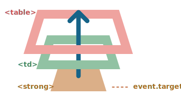

# پترن Event delegation

گرفتن (capture) و bubbling ایونت ها به ما این توانایی را میدهد که از یکی از قویترین الگوهای ایونت هندلینگ یعنی *event delegation* استفاده کنیم.

ایده این است که اگر تعداد زیادی المنت داریم و میخواهیم به یک شکل آنها رو هندل کنیم به جای اینکه به تک تک آنها هندلر مجزا اختصاص دهیم، یک هندلر را برای المنت والد مشترک آنها اختصاص میدهیم.

در هندلری که اختصاص میدهیم با استفاده از `event.target` محل وقوع رویداد را متوجه میشویم و بنابراین میتوانیم آنرا هندل کنیم.

بیاید تا با هم یک مثال رو بررسی کنیم -- [دیاگرام Ba-Gua] (http://en.wikipedia.org/wiki/Ba_gua) که یک فلسفه چینی باستانی رو نشون میده

به این شکل :

[iframe height=350 src="bagua" edit link]

فایل HTML به اینصورت خواهد بود:

```html
<table>
  <tr>
    <th colspan="3"><em>Bagua</em> Chart: Direction, Element, Color, Meaning</th>
  </tr>
  <tr>
    <td class="nw"><strong>Northwest</strong><br>Metal<br>Silver<br>Elders</td>
    <td class="n">...</td>
    <td class="ne">...</td>
  </tr>
  <tr>...2 more lines of this kind...</tr>
  <tr>...2 more lines of this kind...</tr>
</table>
```

جدول 9 سلول دارد اما این عدد امکان دارد 99 یا 9999 باشد. مهم نیست.

**ماموریت ما این است که سلول `<td>` که روی آن کلیک شد را هایلایت کنیم**

به جای آنکه هندلر `onclick` را به هریک از تگ های `<td>` اساین کنیم (که ممکن است تعداد زیادی از آنها داشته باشیم)، هندلر "catch-all" را برروی المنت `<table>` اساین میکنیم.

این عمل از `event.target` برای پیدا کردن المنت کلیک شده و هایلایت آن استفاده می‌کند.

کد:

```js
let selectedTd;

*!*
table.onclick = function(event) {
  let target = event.target; // کلیک کجا اتفاق افتاد؟

  if (target.tagName != 'TD') return; // المنت TD نیست؟ پس المنت موردنظر ما نیست

  highlight(target); // هایلایتش کن
};
*/!*

function highlight(td) {
  if (selectedTd) { // اگر هایلایتی وجود دارد آنرا حذف کن
    selectedTd.classList.remove('highlight');
  }
  selectedTd = td;
  selectedTd.classList.add('highlight'); // TD جدید را هایلایت کن
}
```

این کد به اینکه چند سلول داخل جدول قرار دارد اهمیتی نمیدهد. میتوانیم المنت‌های `<td>` رو به شکل دینامیکی هر زمان که خواستیم اضافه/کم کنیم و همچنان هایلایت کار خواهد کرد.

اما همچنان یک اشکال وجود دارد.

کلیک ممکن است نه روی `<td>` بلکه درون آن اتفاق بیفتد.

در اینصورت اگر به داخل HTML نگاهی بندازیم میتوانیم تگ های درون `<td>` را ببینمی. مثل المنت `<strong>`

```html
<td>
*!*
  <strong>Northwest</strong>
*/!*
  ...
</td>
```

طبیعتا زمانی که یک کلیک بر روی `<strong>` انجام میشود آنگاه مقدار `event.target` برابر آن خواهد شد.



در هندلر `table.onclick` ما باید مقدار `event.target` را گرفته و از این طریق مشخص کنیم که آیا کلیک درون `<td>` اتفاق افتاده یا نه.

کد بهبود یافته شده:

```js
table.onclick = function(event) {
  let td = event.target.closest('td'); // (1)

  if (!td) return; // (2)

  if (!table.contains(td)) return; // (3)

  highlight(td); // (4)
};
```

توضیحات:
1. متد `elem.closest(selector)` نزدیک‌ترین المنت به سلکتور را برمیگرداند. در این مسئله ما در مسیر از سورس المنت به بالا به دنبال المنت `<td>` هستیم.
2. اگر `event.target` درون هیچ `<td>` نباشد آنگاه فراخوانی تابع بلافاصله برمیگردد. درست مانند آنکه چیزی برای انجام دادن وجود ندارد.
3. در مسئله جدول‌های تودرتو `event.target` ممکن است یک المنت `<td>` باشد که خارج از جدول مورد نظر ما قرار گرفته است بنابراین نیاز است بررسی کنیم که المنت آیا درون جدول موردنظر ما قرار دارد یا نه.
4. و اگر چنین است آنگاه هایلایتش کن.

در نتیحه ما یک کد هایلایتر سریع و کارا داریم که عملکرد آن به تعداد سلول‌های `<td>` در جدول ارتباطی ندارد.

## مثالی از الگوی delegation: اکشن‌های مارک‌آپ

استفاده‌های دیگری هم برای event delegation وجود دارد

در نظر بگیرید که میخواهیم یک منو با دکمه‌های "Save", "Load"، "Search" و مانند آن بسازیم آبجکتی با متدهای `save`, `load`, `search` و ... وجود دارد. چطور میتوانیم این متدهارا به دکمه‌های مربوطه وصل کنیم؟

اولین ایده‌ای که به ذهن میرسد ممکن است این باشد که برای هریک از دکمه‌ها هندلر مجزا اساین کنیم. اما راه‌حل بهتری هم وجود دارد. می‌توانیم یک هندلر به کل منو و اتریبیوت‌های `data-action` دکمه‌ها اضافه کنیم.

```html
<button *!*data-action="save"*/!*>Click to Save</button>
```

هندلر اتریبیوت را خوانده و متد را اجرا میکند. نگاهی به این مثال واقعی بیندازید:

```html autorun height=60 run untrusted
<div id="menu">
  <button data-action="save">Save</button>
  <button data-action="load">Load</button>
  <button data-action="search">Search</button>
</div>

<script>
  class Menu {
    constructor(elem) {
      this._elem = elem;
      elem.onclick = this.onClick.bind(this); // (*)
    }

    save() {
      alert('saving');
    }

    load() {
      alert('loading');
    }

    search() {
      alert('searching');
    }

    onClick(event) {
*!*
      let action = event.target.dataset.action;
      if (action) {
        this[action]();
      }
*/!*
    };
  }

  new Menu(menu);
</script>
```

توجه کنید که در `(*)` متد `this.onClick` به `this` متصل شده است. این مهم است زیرا در غیراینصورت `this` درون آن به المنت DOM رفرنس میدهد (`elem`) نه به آبجکت `Menu` و `this[action]` چیزی که ما میخواهیم نخواهد بود.

خب، استفاده از الگوی delegation اینجا برای ما چه فایده‌ای دارد؟

```مقایسه
+ نیازی به نوشتن کد برای اختصاص دادن یک هندلر به هریک از دکمه‌ها نداریم. فقط یک متد مینویسیم و در مارک‌آپ قرار می‌دهیم.
+ ساختار HTML منعطف خواهد بود، می‌توانیم دکمه‌ها را هر زمان که خواستیم اضافه/کم کنیم.
```

همچنین میتوانیم از کلاس‌های `action-save`، `action-load` استفاده کنیم. اما از لحاط سمنتیک اتریبیوت `data-action` بهتر است. به علاوه می‌توانیم از آن در CSS rule ها هم استفاده کنیم.

## الگوی "behavior"

همچنین ما میتوانیم با استفاده از الگوی delegation با استفاده از اتریبیوت‌ها و کلاس‌های خاص رفتارهایی را به صورت *declaratively* به المنت‌ها اضافه کنیم.

الگو دو قسمت دارم:
1. یک اتریبیوت شخصی‌سازی شده که بیانگر رفتار آن باشد را به المنت اضافه میکنیم.
2. یک هندلر به وسعت داکیومنت ایونت‌ها را ردیابی میکند و اگر یک رویداد بر روی المنتی بااتریبوت موردنظر اتفاق آنگاه عمل خواهد کرد.

### رفتار شمارشگر

برای مثال اینجا اتریبیوت `data-counter` رفتار "مقدار را با کلیک افزایش بده" را به دکمه‌ها اضافه میکند.

```html run autorun height=60
Counter: <input type="button" value="1" data-counter>
One more counter: <input type="button" value="2" data-counter>

<script>
  document.addEventListener('click', function(event) {

    if (event.target.dataset.counter != undefined) { // در صورتی که اتریبیوت وجود داشته باشد..
      event.target.value++;
    }

  });
</script>
```

اگر بر روی یک دکمه کلیک کنیم مقدار آن افزایش می‌یابد. اینجا روش کلی مهم است نه دکمه ها.

ممکن است هر تعداد اتریبیوت با مقدار `data-counter` که بخواهیم داشته باشیم. هر زمان که بخواهیم میتوانیم یکی دیگه اضافه کنیم. با استفاده از الگوی event delegation  با افزودن یک اتریبیوت که بیانگر رفتاری جدید است HTML را گسترش داده‌ایم.

```warn header="For document-level handlers -- always `addEventListener`"
زمانی که یک ایونت هندلر را به آبجکت `document` اختصاص میدهیم، همواره باید از `addEventListener` استفاده کنیم، نه `document.on<event>` چون دومی موجب کانفلیکت خواهد شد: هندلرهای جدید جایگزین قدیمی‌ها خواهند شد.

برای پروژه‌های واقعی طبیعتا ممکن است هندلرهای زیادی روی `document` در قسمت‌های مختلف کد تعریف شده باشد.
```

### رفتار: تغییر وضعیت

یک مثال دیگر از این رفتار. یک کلیک بر روی المنتی با اتریبیوت `data-toggle-id` المنتی با `id` داده شده را نمایش/پنهان می‌کند.

```html autorun run height=60
<button *!*data-toggle-id="subscribe-mail"*/!*>
  Show the subscription form
</button>

<form id="subscribe-mail" hidden>
  Your mail: <input type="email">
</form>

<script>
*!*
  document.addEventListener('click', function(event) {
    let id = event.target.dataset.toggleId;
    if (!id) return;

    let elem = document.getElementById(id);

    elem.hidden = !elem.hidden;
  });
*/!*
</script>
```

بیاید تا یک بار دیگه به کاری که انجام دادیم توجه کنیم. حالا برای افزودن کارکرد تغییر وضعیت به یک المنت نیازی به دانستن جاوااسکریپت نداریم، تنها با استفاده از اتریبیوت `data-toggle-id` میتوان اینکار را انجام داد.

این ممکن است خیلی کار مارا راحت کند. نیازی به نوشتن جاوااسکریپت برای هر المنت نیست. تنها با استفاده از رفتار. هندلری که به وسعت داکیومنت تعریف کردیم باعث میشود راه حل ما برای همه‌ی المنت‌های داخل صفحه کار کند.

همچنین میتوانیم چندین رفتار را برای یک المنت ترکیب کنیم.

الگوی "رفتار" میتواند یک جایگزین برای mini fragment های جاوااسکریپت باشد.

## خلاصه

الگوی Event delegation واقعا باحال است! این الگو یکی از مفیدترین الگوها برای ایونت‌های DOM است.

این الگو معمولا برای کنترل تعداد زیادی از المان‌های مشابه استفاده می‌شود اما این تنها کاربرد آن نیست.

الگوریت:

1. یک هندلر برای کل کانتینر قرار دهید.
2. در هندلر المنت سورس را از طریق `event.target` بیابید.
4. اگر ایونت درون المنتی که موردنظر ماست اتفاق افتاده است آنگاه ایونت را هندل کنید.

فواید:

```مقایسه
+ عدم نیاز به اضافه کردن تعداد زیادی هندلر باعث ذخیره حافظه و ساده‌سازی شروع میشود
+ کد کمتر: زمان اضافه و کم کردن المان‌ها نیازی به تغییر در هندلرها نیست.
+ تغییرات DOM: میتواینم با استفاده از `innerHTML` و ابزارهای مشابه آن تعداد زیادی المان را کم/زیاد کنیم.
```

بدون شک این الگو هم محدودیت‌های خودش را دارد:

```مقایسه
- نخست ایونت باید bubble کند. بعضی از ایونت‌ها bubble نمی‌کنند. همچنین هندلرهای سطح پایین نباید از `event.stopPropagation()` استفاده کنند.
- دوم اینکه ممکن است به بار CPU اضافه کند چون  هندلری که در سطح کانتینر تعریف شده است، درهرکجای کانتینر، بدون توجه به اینکه آیا مدنظر ما هستند یا نه به رویدادها واکنش نشان خواهد داد. اما این بار CPU معمولا قابل چشم‌پوشی است بنابراین ما آنرا به حساب نمی‌آوریم.
```
