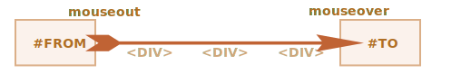

# حرکت موس: روی/بیرون‌از عنصر، ورود/خروج‌از عنصر

اکنون درباره رویدادهایی که با حرکت موس بین عناصر صفحه اتفاق می‌افتد، بیشتر صحبت میکنیم.

## رویدادهای mouseover/mouseout, relatedTarget

رویداد `mouseover` زمانی اتفاق می‌افتد که اشاره‌گر موس روی یک عنصر می‌رود, و `mouseout` -- زمانی که از روی آن بیرون می‌رود.


این‌ها رویدادهای خاصی هستند، زیرا یک خاصیت به نام `relatedTarget` دارند. این خاصیت به نوعی متمم `target` خواهد بود. زمانی که اشاره‌گر موس یک عنصر را با ورودی به عنصر دیگر ترک می‌کند، یکی از آن‌ها `target`، و دیگری `relatedTarget` خواهد بود.

برای `mouseover`:

- `event.target` -- عنصری خواهدبود که اشاره‌گر موس روی آن رفته‌است.
- `event.relatedTarget` -- عنصری خواهد بود که اشاره‌گر موس آنرا ترک کرده، به صورت: (`relatedTarget` -> `target`).

برای `mouseout` برعکس است:

- `event.target` -- عنصری خواهد بود که اشاره‌گر موس آنرا ترک‌کرده.
- `event.relatedTarget` -- عنصری خواهد بود که زیر اشاره‌گر موس قرار می‌گیرد، به صورت: (`target` -> `relatedTarget`).

```online
در مثال زیر هر چهره و اجزای آن عناصر جداگانه هستند. زمانی که اشاره‌گر موس‌ را روی آن‌ها حرکت دهید، رویدادهایی که اتفاق می‌افتند را مشاهده خواهید کرد.

هر رویداد اطلاعاتی درباره هر دو `target` و `relatedTarget` دارد:

[codetabs src="mouseoverout" height=280]
```

```warn header="`relatedTarget` می‌تواند `null` باشد"
خاصیت `relatedTarget` می‌تواند است `null` باشد.

این عادی است و فقط به این معنی است که اشاره‌گر موس از عنصر دیگری نیامده، بلکه از خارج از پنجره مرورگر وارد شده. یا اینکه با خارج شدن، از پنجره مرورگر خارج شده.

ما باید این احتمال را هنگام استفاده از `event.realtedTarget` در کد به یاد داشته باشیم. اگر ما سعی کنیم که `event.relatedTarget.tagName` دسترسی پیدا کنیم، با خطا مواجه خواهیم شد.
```

## پرش از روی عناصر

رویداد `mousemove` زمانی اتفاق می‌افتد که اشاره‌گر موس حرکت کند. اما به این معنی نیست که برای هر پیکسل این رویداد اتفاق بیفتد.

مرورگر موقعیت اشاره‌گر موس را هرچند وقت بسیار کوتاه یکبار چک می‌کند. و اگر تغییری را ببیند رویداد را صدا می‌زند.

به این معنی که اگر بازدیدکننده موس را سریع حرکت دهد، ممکن است بعضی از عناصر داخل DOM از قلم بیفتند:



اگر که موس از `#FROM` سریعا به `#TO` حرکت کند، مانند شکل بالا، عناصر `<div>` وسطی (یا بعضی از آن‌ها) ممکن‌است از قلم بیفتند. رویداد `mouseout` ممکن است روی `#FROM` و بعد از آن سریعا `mouseover` روی `#TO` اتفاق بیفتد.

این برای کارایی برنامه خوب است، چون ممکن است از روی تعداد زیاد عنصر بین دو عنصر عبور کند. در عمل معمولا نمی‌خواهیم همه‌ای این ورود و خروج از تک تک عناصر را پردازش کنیم.

از طرف دیگر، باید در نظر داشته باشیم که اشاره‌گر موس همیشه همه‌ی عناصر را در طول مسیر حرکتش "ملاقات" نمی‌کند. ممکن است "پرش" کند.

در حالت خاصی، ممکن است که اشاره‌گر موس از بیرون از پنجره مرورگر، دقیقا داخل یک عنصر پرش کند. در این حالت `realtedTarget` مقدار `null` خواهد داشت، چون اشاره‌گر عملا از "ناکجا آباد" آمده است:


```online
می‌توانید این رفتار را به صورت زنده در قسمت آزمایشی زیر ببینید.

کد اچ‌تی‌ام‌ال دارای دو عنصر تو در تو است: عنصر `<div id="child">` داخل عنصر `<div id="parent">` قرار گرفته است. اگر که اشاره‌گر موس را سریعا روی آنها حرکت دهید، ممکن است که فقط عنصر فرزند رویداد را صدا بزند، یا شاید عنصر پدر، حتی ممکن است اصلا رویداد اتفاق نیفتد.

همچنین اشاره‌گر را داخل `div` فرزند ببرید، و سپس آنرا از روی عنصر پدر، با پایین بردن اشاره‌گر از روی عنصر فرزند خارج کنید. اگر حرکت به اندازه کافی سریع باشد، عنصر پدر نادیده گرفته خواهد شد. اشاره‌گر موس از روی عنصر پدر بدون توجه به آن عبور می‌کند.

[codetabs height=360 src="mouseoverout-fast"]
```

```smart header="اگر `mouseover` اتفاق بیفتد, حتما `mouseout` اتفاق خواهد افتاد"
در صورت حرکت سریع اشاره‌گر موس، عناصر بین حرکت ممکن است نادیده گرفته‌‌شوند، اما چیزی که از آن مطمئن هستیم این است که: اگر اشاره‌گر موس "رسما" وارد یک عنصر شود (رویداد `mouseover` اتفاق بیفتند)، هنگام ترک این عنصر همیشه رویداد `mouseout` نیز اتفاق خواهد افتاد.
```

## رویداد mouseout وقتی اشاره‌گر وارد عنصر فرزند می‌شود

یک ویژگی مهم `mouseout` این است که زمانی که از یک عنصر به فرزندان آن برویم، اتفاق می‌افتد. برای مثال در اچ‌تی‌ام‌ال زیر زمانی که از `#parent` به `#child` برویم:

```html
<div id="parent">
  <div id="child">...</div>
</div>
```

اگر روی `#parent` باشیم و سپس اشاره‌گر موس را داخل‌تر و داخل `#child` ببریم، رویداد `mouseout` روی `#parent` اتفاق می‌افتد.


ممکن‌ است عجیب باشد، اما به سادگی شرح داده می‌شود.

**با توجه به منطق مرورگر، اشاره گر موس این امکان را دارد که فقط بالای *یک* عنصر در یک زمان واحد باشد. داخلی‌ترین و بالاترین به واسطه z-index.**

پس اگر داخل یک عنصر دیگر (حتی فرزند) شود، پس از قبلی بیرون می‌رود.

به این نکته دیگر درباره جزئیات پردازش رویدادها دقت کنید.

رویداد `mouseover` زمانی که روی یک فرزند اتفاق بیفتد، به اطلاح بالا می‌رود. به این معنی که اگر `parent` یک کنترل‌کننده برای رویداد `mouseover` داشته باشد، فراخوانی ‌می‌شود:


```online
در مثال زیر به خوبی می‌توانید ببینید: `<div id="child">` داخل `<div id="parent">` قرار دارد. برای رویدادهای `mouseover/out` کنترل‌کننده‌هایی روی `#parent` تعریف شده که جزئیاتی درباره رویداد را در خروجی نمایش می‌دهد.

اگر اشاره‌گر موس را از روی `#parent` حرکت دهید و روی `#child` ببرید، دو رویداد را روی `#parent` خواهید دید:
1. `mouseout [target: parent]` (ترک پدر), سپس
2. `mouseover [target: child]` (ورود به فرزند, اصطلاحا بالا رفته).

[codetabs height=360 src="mouseoverout-child"]
```

همانطور که نشان داده‌شد، زمانی که اشاره‌گر موس از `#parent` بیرون و روی `#child` می‌رود، هر دو کنترل کننده پدر فراخوانده می‌شوند: `mouseout` و `mouseover`:

```js
parent.onmouseout = function(event) {
  /* event.target: عنصر پدر */
};
parent.onmouseover = function(event) {
  /* event.target: عنصر فرزند (اصطلاحا بالا رفته) */
};
```

**اگر که `event.target` را داخل کنترل‌کننده‌ها بررسی نکنیم، به نظر می‌رسد که موس `#parent` را ترک‌ کرده و سپس سریعا روی آن برگشته است.**

But that's not the case! The pointer is still over the parent, it just moved deeper into the child element.

If there are some actions upon leaving the parent element, e.g. an animation runs in `parent.onmouseout`, we usually don't want it when the pointer just goes deeper into `#parent`.

To avoid it, we can check `relatedTarget` in the handler and, if the mouse is still inside the element, then ignore such event.

Alternatively we can use other events: `mouseenter` and `mouseleave`, that we'll be covering now, as they don't have such problems.

## Events mouseenter and mouseleave

Events `mouseenter/mouseleave` are like `mouseover/mouseout`. They trigger when the mouse pointer enters/leaves the element.

But there are two important differences:

1. Transitions inside the element, to/from descendants, are not counted.
2. Events `mouseenter/mouseleave` do not bubble.

These events are extremely simple.

When the pointer enters an element -- `mouseenter` triggers. The exact location of the pointer inside the element or its descendants doesn't matter.

When the pointer leaves an element -- `mouseleave` triggers.

```online
This example is similar to the one above, but now the top element has `mouseenter/mouseleave` instead of `mouseover/mouseout`.

As you can see, the only generated events are the ones related to moving the pointer in and out of the top element. Nothing happens when the pointer goes to the child and back. Transitions between descendants are ignored

[codetabs height=340 src="mouseleave"]
```

## Event delegation

Events `mouseenter/leave` are very simple and easy to use. But they do not bubble. So we can't use event delegation with them.

Imagine we want to handle mouse enter/leave for table cells. And there are hundreds of cells.

The natural solution would be -- to set the handler on `<table>` and process events there. But `mouseenter/leave` don't bubble. So if such event happens on `<td>`, then only a handler on that `<td>` is able to catch it.

Handlers for `mouseenter/leave` on `<table>` only trigger when the pointer enters/leaves the table as a whole. It's impossible to get any information about transitions inside it.

So, let's use `mouseover/mouseout`.

Let's start with simple handlers that highlight the element under mouse:

```js
// let's highlight an element under the pointer
table.onmouseover = function(event) {
  let target = event.target;
  target.style.background = 'pink';
};

table.onmouseout = function(event) {
  let target = event.target;
  target.style.background = '';
};
```

```online
Here they are in action. As the mouse travels across the elements of this table, the current one is highlighted:

[codetabs height=480 src="mouseenter-mouseleave-delegation"]
```

In our case we'd like to handle transitions between table cells `<td>`: entering a cell and leaving it. Other transitions, such as inside the cell or outside of any cells, don't interest us. Let's filter them out.

Here's what we can do:

- Remember the currently highlighted `<td>` in a variable, let's call it `currentElem`.
- On `mouseover` -- ignore the event if we're still inside the current `<td>`.
- On `mouseout` -- ignore if we didn't leave the current `<td>`.

Here's an example of code that accounts for all possible situations:

[js src="mouseenter-mouseleave-delegation-2/script.js"]

Once again, the important features are:
1. It uses event delegation to handle entering/leaving of any `<td>` inside the table. So it relies on `mouseover/out` instead of `mouseenter/leave` that don't bubble and hence allow no delegation.
2. Extra events, such as moving between descendants of `<td>` are filtered out, so that `onEnter/Leave` runs only if the pointer leaves or enters `<td>` as a whole.

```online
Here's the full example with all details:

[codetabs height=460 src="mouseenter-mouseleave-delegation-2"]

Try to move the cursor in and out of table cells and inside them. Fast or slow -- doesn't matter. Only `<td>` as a whole is highlighted, unlike the example before.
```

## Summary

We covered events `mouseover`, `mouseout`, `mousemove`, `mouseenter` and `mouseleave`.

These things are good to note:

- A fast mouse move may skip intermediate elements.
- Events `mouseover/out` and `mouseenter/leave` have an additional property: `relatedTarget`. That's the element that we are coming from/to, complementary to `target`.

Events `mouseover/out` trigger even when we go from the parent element to a child element. The browser assumes that the mouse can be only over one element at one time -- the deepest one.

Events `mouseenter/leave` are different in that aspect: they only trigger when the mouse comes in and out the element as a whole. Also they do not bubble.
