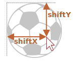

<!---
ترجمه تیتر اول از متن
-->
# درگ و دراپ با رویداد های موس 

گرفتن یک آیتم از صفحه وب و انداختن اون در جایی دیگر گاهی اوقات راه حلی واضح و ساده واسه انجام کارای خفنه که مثلا میتونه برای انداختن آیتم ها توی سبد خرید یا چینش ترتیب فایل ها توی فایل منیجر کاربردی باشه 

در استاندارد html مدرن یک راهکاری به اسم [section about Drag and Drop](https://html.spec.whatwg.org/multipage/interaction.html#dnd) وجود داره که با event هایی مثل `dragstart`, `dragend` و... کار میکنه 

این event ها به شما توانایی پیاده سازی نوع خاصی از سیستم درگ و دراپ رو میدن برای مثال درگ کردن فایل از فایل منیجر و انداختنش توی مرورگر دقیقا مثل همون سیستمی که کتابخانه های آپلودر کار میکنن

ولی این Event های بومی جاوااسکریپت محدودیتم زیاد دارن مثلا ما نمی تونیم محدوده مشخصی برای درگ کردن بزاریم و یوزر میتونه از هرفایلی رو درگ کنه و روی مرورگر دراپ کنه یا نمی تونیم بگیم میتونه چند تا فایل رو هم زمان درگ و دراپ کنه و کلی محدودیت دیگه که حسابی دست و پامون رو میبنده تازه موبایل ها هم ازشون به درستی پشتیبانی نمی کنن و حسابی دردسر ساز میشن

پس حالا میخوایم بریم ببینیم چطوری خودمون با استفاده از mouse event ها سیستم درگ و دراپ خودمون رو بسازیم 

# الگوریتم درگ و دراپ

الگوریتم درگ و دراپ در مراحل اولیه اینطوری به نظر میرسه 

1. ابتدا از `mousedown` استفاده می کنیم تا متوجه بشیم یوزر میخواد المنت رو حرکت بده 
2. سپس از `mousemove` برای پیدا کردن موقعیت موس استفاده میکنیم. تا بتونیم با 
`left/top` مقادیر `position:absolute` رو تغییر بدیم 
3. در نهایت از `mouseup` بهره می بریم تا بفهمیم کار تموم شده و المنت باید دراپ شه 

اما اینا که مقدماتن بعدا خواهیم دید چطور باید فیچر های جذاب دیگه ای بهش اضافه کرد مثلا المانی که داریم درگ و دراپ می کنیم رو هایلایت کنیم

حالا وقتشه مراحل پیاده سازی درگ و دراپ کردن یک توپ رو ببینیم

```js
ball.onmousedown = function(event) {
  // (1) آماده سازی واسه جابه جایی : absolute اش می کنیم و z-index اش رو زیاد میکنیم که بیاد لایه بالاتر
  ball.style.position = 'absolute';
  ball.style.zIndex = 1000;

  // از هر والدی خارجش میکنیم و مستقیما در body قرار میدیمش 
  // to make it positioned relative to the body
  // تا مکان اش با body در تناسب باشه 
  document.body.append(ball);

  // centers the ball at (pageX, pageY) coordinates
  //  توپ رو میاریم وسط ورودی های (pageX, pageY)
  function moveAt(pageX, pageY) {
    ball.style.left = pageX - ball.offsetWidth / 2 + 'px';
    ball.style.top = pageY - ball.offsetHeight / 2 + 'px';
  }

  // (1) move our absolutely positioned ball under the pointer
  // (1) توپ مون رو زیر نشانگر موس میاریم
  moveAt(event.pageX, event.pageY);

  function onMouseMove(event) {
    moveAt(event.pageX, event.pageY);
  }

  // (2) move the ball on mousemove
  // (2) با حرکت موس توپ مون هم حرکت میدیم
  document.addEventListener('mousemove', onMouseMove);

  // (3) drop the ball, remove unneeded handlers
  // (3) توپ رو دراپ می کنیم و اضافات رو پاک می کنیم 
  ball.onmouseup = function() {
    document.removeEventListener('mousemove', onMouseMove);
    ball.onmouseup = null;
  };

};
```
اگر ما این کد رو اجرا کنیم می فهمیم یک چیزی عجیب و غریبه اونم اینه توپ سر جاش میمونه و ما یک نسحه کپی شده از اون رو می کشیم 

```online
این مثالی از این موضوعه : 

[iframe src="ball" height=230]

سعی کنید درگ و دراپ کنید تا همچین رفتاری ببینید 
```

دلیلش اینه مرورگر خودش برای تصاویر و متن ها و دیگر المان ها از درگ و دراپ پشتیبانی می کنه. خودش خودکار اجرا میشه و البته با درگ و دراپ ای که ما نوشتیم تداخل داره. چون اونی برای خود مرورگره برای اجرا شدن اولویت داره 

برای غیرفعال کردنش :‌

```js
ball.ondragstart = function() {
  return false;
};
```

الان دیگه همه چیز درست پیش میره.

```online
[iframe src="ball2" height=230]
```

یک بینش مهم دیگه - ما
`mousemove` 
رو از 
`document` 
دریافت می کنیم نه از توپ مون اما به نظر میاد موس همیشه روی توپه و ما داریم موس رو روی توپ حرکت میدیم 

اما ما به خاطر داریم 
`mousemove` 
اغلب اجرا میشه ولی نه برای همه پیکسل ها پس وقتی موس رو خیلی سریع حرکت میدیم یا به خارج از پنجره میبریم توپ به وسط صفحه میره 

پس ما باید با 
`document` 
سر و کار داشته باشیم که اینطور اوقات توپ رو بگیریم 

## موقعیت دهی درست 

در مثال ها توپ مون زیر و وسط نشانگر موس هستش 

```js
ball.style.left = pageX - ball.offsetWidth / 2 + 'px';
ball.style.top = pageY - ball.offsetHeight / 2 + 'px';
``` 

بد نیستا اما یک مشکلی وجود داره برای شروع درگ و دراپ اگر کلیک موس رو لبه های توپ فشار بدیم یک دفعه میاد وسط نشانگر که جالب جلوه نمی کنه 

پس اگر ما بیایم توپ مون رو به نسبت جا به جایی موس حرکت بدیم بهتر میشه 

برای مثال ما توپ رو از لبه درگ میکنیم و موس هم روی همون لبه توپ میمونه و توپ جا به جا میشه 


 
بریم الگوریتم مون رو بروز کنیم : 

1. وقتی که کلیک میکنه فاصله موس از گوشه سمت چپ بالای پنجره در متغیر های 
`shiftX/shiftY` 
ثبت بشه. هنگام درگ با استفاده ازشون جا به جایی رو محاسبه می کنیم 

    برای بدست آوردن این فاصله توپ و موس از تفاضل موقعیت توپ و موقعیت اولیه موس استفاده می کنیم 

    ```js
    // onmousedown
    let shiftX = event.clientX - ball.getBoundingClientRect().left;
    let shiftY = event.clientY - ball.getBoundingClientRect().top;
    ```

2. بعد وقتی درگ می کنیم توپ رو در همان فاصله ای که از موس داشت نگه میداریم. مثل این کد : 

    ```js
    // onmousemove
    // ball has position:absolute
    ball.style.left = event.pageX - *!*shiftX*/!* + 'px';
    ball.style.top = event.pageY - *!*shiftY*/!* + 'px';
    ```

کد نهایی با موقعیت دهی بهتر :‌

```js
ball.onmousedown = function(event) {

*!*
  let shiftX = event.clientX - ball.getBoundingClientRect().left;
  let shiftY = event.clientY - ball.getBoundingClientRect().top;
*/!*

  ball.style.position = 'absolute';
  ball.style.zIndex = 1000;
  document.body.append(ball);

  moveAt(event.pageX, event.pageY);

  // ضمن در نظر گرفتن تغییر موقعیت نسبت به اولش
  // توپ رو به (pageX, pageY) جا به جا میکنیم
  function moveAt(pageX, pageY) {
    ball.style.left = pageX - *!*shiftX*/!* + 'px';
    ball.style.top = pageY - *!*shiftY*/!* + 'px';
  }

  function onMouseMove(event) {
    moveAt(event.pageX, event.pageY);
  }

  // توپ رو با جا به جایی موس حمل می کنیم 
  document.addEventListener('mousemove', onMouseMove);

  // توپ رو دراپ می کنیم و چیزای اضافه رو بیخیال میشیم
  ball.onmouseup = function() {
    document.removeEventListener('mousemove', onMouseMove);
    ball.onmouseup = null;
  };

};

ball.ondragstart = function() {
  return false;
};
```

```online
In action (inside `<iframe>`):

[iframe src="ball3" height=230]
```

حالا اگر توپ رو از گوشه درگ کنیم تفاوت کاملا مشهوده در ورژن قبلی توپ از پایین نشانگر موس میپرید اما الان در همان موقعیت اولیش نشانگر موس رو دنبال میکنه 

## نواحی قابل دراپ 

در مثال های قبلی توپ می تونست هرجایی دراپ بشه و همونجا بمونه اما در زندگی واقعی ما معمولا یک المان رو درگ می کنیم و توی المان دیگر دراپ می کنیم برای مثل فایل را به درون فولدر می بریم و غیره 

بخوام خلاصه تر بگم ما یک المنت 
draggable 
رو درگ می کنیم و درون یک المنت 
droppable 
دراپ می کنیم 

چیزی که نیاز داریم بدانیم :
- جایی که المنت پس از عملیات دراپ شده - جهت انجام عملیات مربوطه 
- و ترجیحا بدونیم المانی که درونش دراپ می کنیم 
droppable 
است و هایلایتش کنیم 

راه حل یک جورایی جالب و کمی مشکله. خب بیاید همینجا بریم تو کارش 

اولین ایده چیه؟ احتمالا استفاده از 
`mouseover/mouseup`
در نواحی 
droppable 
از صفحه؟ 

خب مشکل اینجاست وقتی که درگ می کنیم المنت 
draggable 
مون همیشه بالای بقیه المنت هاست و ایونت های موس همیشه روی المنت بالایی اجرا میشن نه اونایی که پایینشن 

برای مثال پایینش دو تا 
`<div>` 
قرار دارن که آبی و قرمزن. قرمزه بالای آبیه است (کاملا یکدیگر را پوشاندن). راهی وجود نداره که ایونت رو روی آبیه دریافت کنیم چون قرمز بالاتر هست 

```html run autorun height=60
<style>
  div {
    width: 50px;
    height: 50px;
    position: absolute;
    top: 0;
  }
</style>
<div style="background:blue" onmouseover="alert('never works')"></div>
<div style="background:red" onmouseover="alert('over red!')"></div>
```

برای المنت 
draggable 
هم همین اتفاق میوفته. توپ همیشه بالای بقیه المنت ها قرار داره پس ایونت های موس هم روی توپ اجرا میشن. پس ایونت هایی که ما برای المنت های پایینی نوشتیم کار نمی کنن 

بخاطر همین ایده اولیه برای نوشتن 
handler
برای نواحی 
droppable 
توی این تمرین جوابگو نیست چون اجرا نمیشن 

پس جیکار کنیم؟

متودی وجود داره که 
`document.elementFromPoint(clientX, clientY)` 
نامیده میشه  که نزدیک ترین المنت رو به مشخصات داده شده بر میگردونه یا اگر مشخصات داده شده خارج از پنجره باشه خروجی 
`null` 
خواهد داد 
اگر چند المنت با هم در تداخل باشن یعنی روی هم قرار گرفته باشند بالایی را خروجی خواهد داد 

می تونیم در ایونت هندلر هامون برای پیدا کردن ناحیه 
droppable 
ازش استفاده کنیم 

```js
// در ایونت هندلر موس 
ball.hidden = true; // (*) مخفی کردن المنتی که درگ کردیم

let elemBelow = document.elementFromPoint(event.clientX, event.clientY);
// elemBelow is the element below the ball, may be droppable
// elemBelow المنت زیر موس است که شاید droppable باشد 

ball.hidden = false;
``` 

لطفا توجه داشته باشید : ما نیاز داریم قبل از صدا زدن مواردی که با 
`(*)` 
نشانه گذاری شدن توپ رو مخفی کنیم در غیر این صورت معمولا توپ نزدیک تر و بالاتر است و خروجی میشود. پس لازم است توپ را مخفی کنیم و سپس به سرعت به نمایش در بیاریم و در این بین دستورات را اجرا کنیم 

ما می توانیم از این کد برای بررسی عنصری که با موس در حال عبور از روی آن هستیم استفاده کنیم و هنگامی که قصد دراپ داریم چک کنیم ببینیم آت ناحیه 
droppable 
است یا نیست 

کد توسعه داده شده با 
`onMouseMove` 
برای یافتن عتاصر 
droppable 

```js
// ناحیه droppable که ما همین الان داریم با موس از رویش رد میشویم
let currentDroppable = null;

function onMouseMove(event) {
  moveAt(event.pageX, event.pageY);

  ball.hidden = true;
  let elemBelow = document.elementFromPoint(event.clientX, event.clientY);
  ball.hidden = false;

  // ایونت های mousemove ممکن است خارج از صفحه باشند (هنگامی که توپ خارج از صفحه نمایش درگ شده)

  // اگر clientX/clientY خارج از پنجره باشند elementFromPoint خروجی null می دهد 
  if (!elemBelow) return;

  // ناحیه droppables با class ای به نام droppable نام گذاری شدند
  let droppableBelow = elemBelow.closest('.droppable');

  if (currentDroppable != droppableBelow) {
    // ما داریم موس رو به داخل یا خارج ناحیه droppable میبریم 
    // توجه : هر دو مقدار می توانند null باشند 
    //   currentDroppable=null  اگر قبل از این ایونت روی ناحیه droppable نبوده باشیم
    //   droppableBelow=null اگر هنگام اجرا شدن این ایونت روی ناحیه droppable نباشیم

    if (currentDroppable) {
      // منطقی برای درک کردن خارج شدن از ناحیه droppable برای حذف کردن هایلایت 
      leaveDroppable(currentDroppable);
    }
    currentDroppable = droppableBelow;
    if (currentDroppable) {
      // منطقی برای درک کردن ورود به ناحیه droppable
      enterDroppable(currentDroppable);
    }
  }
}
```

