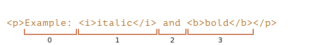

کتابخانه ها:
  - d3
  - domtree
    
---

# Selection and Range


در این فصل به انتخاب در سند و همچنین انتخاب در فیلدهای فرم، مانند `<input>` خواهیم پرداخت.

جاوا اسکریپت می تواند به یک انتخاب موجود دسترسی داشته باشد، گره های DOM را به طور کلی یا جزئی انتخاب یا لغو انتخاب کند، محتوای انتخاب شده را از سند حذف کند، آن را در یک برچسب قرار دهد و غیره.

می‌توانید دستور العمل‌هایی برای کارهای رایج در انتهای فصل، در بخش "Summary" بیابید. شاید این نیازهای فعلی شما را پوشش دهد، اما اگر متن کامل را بخوانید، خیلی بیشتر به دست خواهید آورد.

درک اشیاء زیربنایی `Range` و `Selection` آسان است، و پس از آن برای اینکه آنها را به آنچه می‌خواهید انجام دهند، به هیچ دستور العملی نیاز نخواهید داشت.
## Range

فهوم اصلی انتخاب [Range](https://dom.spec.whatwg.org/#ranges) است، که اساساً یک جفت "boundary points"است: شروع محدوده و پایان محدوده.

یک `Range` object بدون پارامتر ساخته می شود: 

```js
let range = new Range();
```

پس می‌توانیم مرزهای انتخاب را با استفاده از `range.setStart(node, offset)` و `range.setEnd(node, offset)` تنظیم کنیم.

همانطور که ممکن است حدس بزنید، در ادامه از اشیاء `Range`  برای انتخاب استفاده خواهیم کرد، اما ابتدا اجازه دهید تعداد کمی از این اشیاء ایجاد کنیم.

### Selecting the text partially

نکته جالب این است که آرگومان اول `node` در هر دو روش می تواند یک text node یا یelement node عنصر باشد و معنای آرگومان دوم به آن بستگی دارد.

**اگر `node` یک text nodeاست، `offset` باید موقعیتی در متن آن باشد.**

به عنوان مثال، با توجه به عنصر `<p>Hello</p>`، می‌توانیم محدوده حاوی حروف «ll» را به صورت زیر ایجاد کنیم:

```html run
<p id="p">Hello</p>
<script>
  let range = new Range();
  range.setStart(p.firstChild, 2);
  range.setEnd(p.firstChild, 4);
  
  // toString of a range returns its content as text
  console.log(range); // ll
</script>
```


در اینجا اولین فرزند `<p>` را می گیریم (این text node است) و موقعیت های متن را در داخل آن مشخص می کنیم:


### Selecting element nodes


** متناوباً، اگر `node` یک element node است، `offset` باید شماره فرزند باشد.**

این برای ایجاد محدوده هایی که شامل گره ها به عنوان یک کل هستند، مفید است، نه اینکه در جایی در متن خود متوقف شوند.

به عنوان مثال، ما یک قطعه سند پیچیده تر داریم:
```html autorun
<p id="p">Example: <i>italic</i> and <b>bold</b></p>
```

در اینجا ساختار DOM آن با هر دو گره عنصر و متن آمده است:

<div class="select-p-domtree"></div>

<script>
let selectPDomtree = {
  "name": "P",
  "nodeType": 1,
  "children": [{
    "name": "#text",
    "nodeType": 3,
    "content": "Example: "
  }, {
    "name": "I",
    "nodeType": 1,
    "children": [{
      "name": "#text",
      "nodeType": 3,
      "content": "italic"
    }]
  }, {
    "name": "#text",
    "nodeType": 3,
    "content": " and "
  }, {
    "name": "B",
    "nodeType": 1,
    "children": [{
      "name": "#text",
      "nodeType": 3,
      "content": "bold"
    }]
  }]
}

drawHtmlTree(selectPDomtree, 'div.select-p-domtree', 690, 320);
</script>


بیایید یک محدوده برای `"Example: <i>italic</i>"` بسازیم.

همانطور که می بینیم، این عبارت دقیقاً از دو فرزند `<p>` با نمایه های  `0`  و `1` تشکیل شده است:


- نقطه شروع  `<p>` به عنوان  `node` والد، و  `0` به عنوان آفست است.
  
    بنابراین می‌توانیم آن را به‌عنوان `range.setStart(p, 0)` تنظیم کنیم.
- نقطه پایانی نیز `<p>` را به عنوان  `node` والد، اما  `2` را به عنوان آفست دارد (محدوده تا را مشخص می کند، اما `offset` را شامل نمی شود).
  
    بنابراین می‌توانیم آن را به‌عنوان `range.setEnd(p, 2)` تنظیم کنیم.

در اینجا نسخه ی نمایشی است. اگر آن را اجرا کنید، می بینید که متن انتخاب شده است:

```html run
<p id="p">Example: <i>italic</i> and <b>bold</b></p>

<script>
*!*
  let range = new Range();

  range.setStart(p, 0);
  range.setEnd(p, 2);
*/!*

  // toString of a range returns its content as text, without tags
  console.log(range); // Example: italic

  // apply this range for document selection (explained later below)
  document.getSelection().addRange(range);
</script>
```

در اینجا یک پایه تست انعطاف‌پذیرتر وجود دارد که در آن می‌توانید اعداد شروع/پایان محدوده را تنظیم کنید و انواع دیگر را بررسی کنیدد:

```html run autorun
<p id="p">Example: <i>italic</i> and <b>bold</b></p>

From <input id="start" type="number" value=1> – To <input id="end" type="number" value=4>
<button id="button">Click to select</button>
<script>
  button.onclick = () => {
  *!*
    let range = new Range();

    range.setStart(p, start.value);
    range.setEnd(p, end.value);
  */!*

    // apply the selection, explained later below
    document.getSelection().removeAllRanges();
    document.getSelection().addRange(range);
  };
</script>
```

به عنوان مثال، انتخاب در همان `<p>` از آفست `1` تا `4`، محدوده `<i>italic</i> and <b>bold</b>` را به ما می‌دهد:



```smart header="گره های شروع و پایان می توانند متفاوت باشند"
ما مجبور نیستیم از همان گره در «setStart» و «setEnd» استفاده کنیم. یک محدوده ممکن است در بسیاری از گره‌های غیرمرتبط باشد. فقط مهم است که پایان آن پس از شروع در سند باشد.
```

### Selecting a bigger fragment

بیایید در مثال خود یک انتخاب بزرگتر انجام دهیم، مانند این:


ما قبلاً می دانیم که چگونه این کار را انجام دهیم. فقط باید شروع و پایان را به عنوان یک افست نسبی در گره های متنی تنظیم کنیم.

ما باید یک محدوده ایجاد کنیم، که:
- از موقعیت 2 در `<p>` فرزند اول شروع می‌شود (با گرفتن همه حرف‌های اول «مثال<b>ample:</b>» به جز دو حرف اول)
- در `<b>`فرزند اول به موقعیت 3 ختم می شود (با گرفتن سه حرف اول "<b>bol</b>d"، اما نه بیشتر):
  
```html run
<p id="p">Example: <i>italic</i> and <b>bold</b></p>

<script>
  let range = new Range();

  range.setStart(p.firstChild, 2);
  range.setEnd(p.querySelector('b').firstChild, 3);

  console.log(range); // ample: italic and bol

  // use this range for selection (explained later)
  window.getSelection().addRange(range);
</script>
```

همانطور که می بینید، ساختن طیف وسیعی از هر چیزی که می خواهیم بسیار آسان است.

اگر می‌خواهیم گره‌ها را به‌عنوان یک کل بگیریم، می‌توانیم عناصر را در  `setStart/setEnd` ارسال کنیم. در غیر این صورت می توانیم در سطح متن کار کنیم.

## Range properties

شی range که در مثال بالا ایجاد کردیم دارای ویژگی های زیر است:


-  `startContainer`، `startOffset` - گره و افست شروع،
   - در مثال بالا: اولین گره متن داخل `<p>` و  `2`.
-  `endContainer`، `endOffset` - گره و افست انتهایی،
   - در مثال بالا: اولین گره متن داخل `<b>` و `3`.
- `collapsed` -- boolean، `true` اگر محدوده در همان نقطه شروع و به پایان برسد (بنابراین هیچ محتوایی در محدوده وجود ندارد)،
   - در مثال بالا: `false`.
- "commonAncestorContainer" - نزدیکترین جد مشترک همه گره های موجود در محدوده،
   - در مثال بالا:`<p>`.


## Range selection methods

روش‌های راحت زیادی برای دستکاری محدوده‌ها وجود دارد.

قبلاً `setStart` و `setEnd` را دیده‌ایم، در اینجا روش‌های مشابه دیگری وجود دارد.

تنظیم شروع محدوده:

- `setStart(node, offset)` تنظیم شروع در: موقعیت `offset` در `node`
- `setStartBefore(node)`شروع را در: درست قبل از `node` تنظیم کنید
- `setStart(node, offset)` مجموعه شروع در: درست بعد از `node`.

تنظیم پایان محدوده (روش های مشابه)

- `setEnd(node, offset)` پایان را در: موقعیت `offset` در `node` تنظیم کنید
- `setEndBefore(node)` پایان را در: درست قبل از `node` تنظیم کنید
- `setEndAfter(node)` پایان را در: درست بعد از `node` تنظیم کنید

از نظر فنی، `setStart/setEnd` می‌تواند هر کاری انجام دهد، اما روش‌های بیشتر راحتی بیشتری را فراهم می‌کنند.

در همه این روش‌ها، `node` می‌تواند هم یک متن یا یک گره عنصر باشد: برای گره‌های متنی، `offset` بسیاری از کاراکترها را رد می‌کند، در حالی که برای گره‌های عنصر از بسیاری از گره‌های فرزند.

حتی روش های بیشتری برای ایجاد محدوده:
- `selectNode(node)` محدوده را برای انتخاب کل  `node` تنظیم کنید
- `selectNodeContents(node)` محدوده را برای انتخاب کل محتویات  `node` تنظیم کنید
- `selectNodeContents(node)` اگر `toStart=true` set end=start، در غیر این صورت start=end را تنظیم کنید، بنابراین محدوده را جمع می کند
- `cloneRange()` یک محدوده جدید با شروع/پایان یکسان ایجاد می کند

## Range editing methods

هنگامی که محدوده ایجاد شد، می‌توانیم محتوای آن را با استفاده از این روش‌ها دستکاری کنیم:

- `deleteContents()` -- محتوای محدوده را از سند حذف کنید
- `extractContents()` -- محتوای محدوده را از سند حذف کنید و به عنوان [DocumentFragment](info:modifying-document#document-fragment)
- `cloneContents()` -- محتویات محدوده را کلون کنید و به عنوان [DocumentFragment](info:modifying-document#document-fragment)
- `insertNode(node)` -- `node` را در سند در ابتدای محدوده وارد کنید
- `surroundContents(node)`- `node` را در اطراف محتوای محدوده قرار دهید. برای انجام این کار، محدوده باید دارای هر دو برچسب باز و بسته برای همه عناصر داخل آن باشد: هیچ محدوده جزئی مانند `<i>abc`.

با این روش ها اساساً می توانیم هر کاری را با گره های انتخاب شده انجام دهیم.

در اینجا پایه آزمایشی برای مشاهده آنها در عمل آمده است:

```html run refresh autorun height=260
Click buttons to run methods on the selection, "resetExample" to reset it.

<p id="p">Example: <i>italic</i> and <b>bold</b></p>

<p id="result"></p>
<script>
  let range = new Range();

  // Each demonstrated method is represented here:
  let methods = {
    deleteContents() {
      range.deleteContents()
    },
    extractContents() {
      let content = range.extractContents();
      result.innerHTML = "";
      result.append("extracted: ", content);
    },
    cloneContents() {
      let content = range.cloneContents();
      result.innerHTML = "";
      result.append("cloned: ", content);
    },
    insertNode() {
      let newNode = document.createElement('u');
      newNode.innerHTML = "NEW NODE";
      range.insertNode(newNode);
    },
    surroundContents() {
      let newNode = document.createElement('u');
      try {
        range.surroundContents(newNode);
      } catch(e) { console.log(e) }
    },
    resetExample() {
      p.innerHTML = `Example: <i>italic</i> and <b>bold</b>`;
      result.innerHTML = "";

      range.setStart(p.firstChild, 2);
      range.setEnd(p.querySelector('b').firstChild, 3);

      window.getSelection().removeAllRanges();  
      window.getSelection().addRange(range);  
    }
  };

  for(let method in methods) {
    document.write(`<div><button onclick="methods.${method}()">${method}</button></div>`);
  }

  methods.resetExample();
</script>
```

مچنین روش هایی برای مقایسه محدوده ها وجود دارد، اما به ندرت از آنها استفاده می شود. هنگامی که به آنها نیاز دارید، لطفاً به spec](https://dom.spec.whatwg.org/#interface-range) یا [MDN manual](mdn:/api/Range) مراجعه کنید.


## Selection

در واقع `Range` یک شیء عمومی برای مدیریت محدوده های انتخابی است. اگرچه، ایجاد یک `Range` به این معنی نیست که ما یک انتخاب را روی صفحه می بینیم.

ما ممکن است اشیاء `Range` ایجاد کنیم، آنها را به اطراف منتقل کنیم -- آنها به صورت بصری چیزی را به تنهایی انتخاب نمی کنند.

انتخاب سند با شی`Selection`نشان داده میشود که میتواند به عنوان`window.getSelection()`یا`document.getSelection()`به دست آید. یک انتخاب ممکن است شامل محدوده صفر یابیشتر باشد. حداقل، specification](https://www.w3.org/TR/selection-api/) این رامیگوید.اگرچه درعمل، فقط فایرفاکس اجازه میدهد تا با استفاده از`key:Ctrl+click` (`key:Cmd+click` برای Mac)، چندین محدوده را در سند انتخاب کنید.

در اینجا یک اسکرین شات از یک انتخاب با 3 محدوده، ساخته شده در فایرفاکس آمده است:


سایر مرورگرها حداکثر 1 محدوده را پشتیبانی می کنند. همانطور که خواهیم دید، برخی از روش های  `Selection` نشان می دهد که ممکن است محدوده های زیادی وجود داشته باشد، اما باز هم، در همه مرورگرها به جز فایرفاکس، حداکثر 1 وجود دارد.

در اینجا یک نسخه نمایشی کوچک وجود دارد که انتخاب فعلی (چیزی را انتخاب کنید و کلیک کنید) را به عنوان متن نشان می دهد:

<button onclick="alert(document.getSelection())">alert(document.getSelection())</button>

## Selection properties

همانطور که گفته شد، یک انتخاب ممکن است در تئوری شامل چندین محدوده باشد. ما می توانیم این اشیاء محدوده را با استفاده از روش بدست آوریم:

- `getRangeAt(i)` -- محدوده i-ام را دریافت کنید که از `0` شروع می شود. در همه مرورگرها به جز فایرفاکس، فقط «0» استفاده می شود.

همچنین، ویژگی هایی وجود دارد که اغلب راحتی بهتری را ارائه می دهند.

مشابه یک محدوده، یک شی انتخاب یک شروع به نام "anchor" و پایان به نام "focus" دارد.

ویژگی های اصلی انتخاب عبارتند از:

-`anchorNode` -- گره ای که انتخاب شروع می شود،
- `anchorOffset` - آفست در `anchorNode` جایی که انتخاب شروع می شود،
- `focusNode` - گره ای که در آن انتخاب به پایان می رسد،
-`focusOffset` - آفست در `focusNode` جایی که انتخاب به پایان می رسد،
- `isCollapsed` -- `true` اگر انتخاب چیزی (محدوده خالی) را انتخاب نکند یا وجود نداشته باشد.
- `rangeCount` -- تعداد محدوده ها در انتخاب، حداکثر `1` در همه مرورگرها به جز فایرفاکس.

 ```smart header="انتخاب پایان/شروع در مقابل محدوده"


تفاوت‌های مهمی بین لنگر/فوکوس انتخاب در مقایسه با `Range` start/end وجود دارد.

همانطور که می دانیم، اشیاء  `Range` همیشه شروع خود را قبل از پایان دارند.

برای انتخاب، همیشه اینطور نیست.

انتخاب چیزی با ماوس را می توان در هر دو جهت انجام داد:  "left-to-right" یا  "right-to-left".

به عبارت دیگر، وقتی دکمه ماوس را فشار داده و سپس در سند به جلو حرکت می کند، انتهای آن (focus) بعد از شروع آن (anchor) خواهد بود.
به عنوان مثال. اگر کاربر شروع به انتخاب با ماوس کند و از "مثال" به "مورب" برود:


...اما همین انتخاب را می توان به عقب انجام داد: از "مورب" به "مثال" (جهت عقب) شروع می شود، سپس پایان آن (focus) قبل از شروع (anchor) خواهد بود:


```

## Selection events

رویدادهایی برای پیگیری انتخاب وجود دارد:

- `elem.onselectstart` -- زمانی که یک انتخاب *شروع می شود* به طور خاص روی عنصر `elem` (یا داخل آن). به عنوان مثال، زمانی که کاربر دکمه ماوس را روی آن فشار می دهد و شروع به حرکت اشاره گر می کند.
     - جلوگیری از عمل پیش فرض شروع انتخاب را لغو می کند. بنابراین شروع انتخاب از این عنصر غیرممکن می شود، اما عنصر همچنان قابل انتخاب است. بازدیدکننده فقط باید انتخاب را از جای دیگری شروع کند.
- `document.onselectionchange` - هر زمان که یک انتخاب تغییر کند یا شروع شود.
     - لطفاً توجه داشته باشید: این کنترل کننده را می توان فقط روی `document` تنظیم کرد، همه انتخاب های موجود در آن را ردیابی می کند.

### Selection tracking demo

در اینجا یک نسخه نمایشی کوچک است. این انتخاب فعلی در `document` را ردیابی می کند و مرزهای آن را نشان می دهد:

```html run height=80
<p id="p">Select me: <i>italic</i> and <b>bold</b></p>

From <input id="from" disabled> – To <input id="to" disabled>
<script>
  document.onselectionchange = function() {
    let selection = document.getSelection();

    let {anchorNode, anchorOffset, focusNode, focusOffset} = selection;

    // anchorNode and focusNode are text nodes usually
    from.value = `${anchorNode?.data}, offset ${anchorOffset}`;
    to.value = `${focusNode?.data}, offset ${focusOffset}`;
  };
</script>
```

### Selection copying demo

دو روش برای کپی کردن محتوای انتخابی وجود دارد:

1. می‌توانیم از `document.getSelection().toString()` برای دریافت آن به عنوان متن استفاده کنیم.
2. در غیر این صورت، برای کپی کردن DOM کامل، به عنوان مثال. اگر نیاز به قالب‌بندی داشته باشیم، می‌توانیم محدوده‌های زیربنایی را با `getRangeAt(...)` دریافت کنیم. یک شی `Range` به نوبه خود دارای متد `cloneContents()` است که محتوای آن را شبیه‌سازی می‌کند و به عنوان شی `DocumentFragment` برمی‌گرداند، که می‌توانیم آن را در جای دیگری درج کنیم.

در اینجا نسخه ی نمایشی کپی کردن محتوای انتخاب شده به عنوان متن و به عنوان گره های DOM آمده است:

```html run height=100
<p id="p">Select me: <i>italic</i> and <b>bold</b></p>

Cloned: <span id="cloned"></span>
<br>
As text: <span id="astext"></span>

<script>
  document.onselectionchange = function() {
    let selection = document.getSelection();

    cloned.innerHTML = astext.innerHTML = "";

    // Clone DOM nodes from ranges (we support multiselect here)
    for (let i = 0; i < selection.rangeCount; i++) {
      cloned.append(selection.getRangeAt(i).cloneContents());
    }

    // Get as text
    astext.innerHTML += selection;
  };
</script>
```

## Selection methods

ا می توانیم با افزودن/حذف محدوده ها با انتخاب کار کنیم:

- `getRangeAt(i)` -- محدوده i-ام را دریافت کنید که از `0` شروع می شود. در همه مرورگرها به جز فایرفاکس، فقط  `0` استفاده می شود.
- `addRange(range)` -- `range` را به انتخاب اضافه کنید. همه مرورگرها به جز فایرفاکس تماس را نادیده می گیرند، در صورتی که انتخاب از قبل دارای یک محدوده مرتبط باشد.
- `removeRange(range)` --  `range` را از انتخاب حذف کنید.
- `removeAllRanges()` -- حذف همه محدوده ها.
- `empty()` -- نام مستعار `removeAllRanges`.

همچنین روش‌های آسانی برای دستکاری مستقیم محدوده انتخاب، بدون فراخوانی `Range` میانی وجود دارد:

- `collapse(node, offset)` -- محدوده انتخاب شده را با یک محدوده جدید جایگزین کنید که در "گره" داده شده شروع و پایان می یابد، در موقعیت "offset".
- `setPosition(node, offset)` -- نام مستعار `collapse`.
- `collapseToStart()` - جمع کردن (با یک محدوده خالی جایگزین شود) تا شروع انتخاب،
- `collapseToEnd()` - جمع کردن تا انتهای انتخاب،
- `extend(node, offset)` - فوکوس انتخاب را به `node` داده شده منتقل کنید، موقعیت `offset`،
- `setBaseAndExtent(anchorNode, anchorOffset, focusNode, focusOffset)` - جایگزین محدوده انتخاب با شروع داده شده `anchorNode/anchorOffset` و پایان `focusNode/focusOffset`. تمام محتوای بین آنها انتخاب شده است.
- `selectAllChildren(node)` -- همه فرزندان "گره" را انتخاب کنید.
- `deleteFromDocument()` -- محتوای انتخاب شده را از سند حذف کنید.
- `containsNode(node, allowPartialContainment = false)` -- بررسی می کند که آیا انتخاب شامل "node" است (تا حدی اگر آرگومان دوم "true" باشد)

برای اکثر وظایف، این روش‌ها خوب هستند، نیازی به دسترسی به شی `Range` زیرین نیست.

به عنوان مثال، انتخاب کل محتوای پاراگراف `<p>`:

```html run
<p id="p">Select me: <i>italic</i> and <b>bold</b></p>

<script>
  // select from 0th child of <p> to the last child
  document.getSelection().setBaseAndExtent(p, 0, p, p.childNodes.length);
</script>
```

همین مورد با استفاده از محدوده ها:

```html run
<p id="p">Select me: <i>italic</i> and <b>bold</b></p>

<script>
  let range = new Range();
  range.selectNodeContents(p); // or selectNode(p) to select the <p> tag too

  document.getSelection().removeAllRanges(); // clear existing selection if any
  document.getSelection().addRange(range);
</script>
```

```smart header="To select something, remove the existing selection first"
If a document selection already exists, empty it first with `removeAllRanges()`. And then add ranges. Otherwise, all browsers except Firefox ignore new ranges.

The exception is some selection methods, that replace the existing selection, such as `setBaseAndExtent`.
```

## Selection in form controls

عناصر فرم، مانند `input` و textarea [special API for selection](https://html.spec.whatwg.org/#textFieldSelection) را بدون اشیاء `Selection` یا `Range` ارائه می‌کنند. از آنجایی که مقدار ورودی یک متن خالص است، نه HTML، نیازی به چنین اشیایی نیست، همه چیز بسیار ساده تر است.

ویژگی ها:
- `input.selectionStart` -- موقعیت شروع انتخاب (قابل نوشتن)،
- `input.selectionEnd` -- موقعیت انتهای انتخاب (قابل نوشتن)،
- `input.selectionDirection` -- جهت انتخاب، یکی از: "backward"، "backward" یا "none" (به عنوان مثال اگر با دوبار کلیک ماوس انتخاب شده باشد)،
  
(رویداد ها)Events:
- `input.onselect` -- هنگامی که چیزی انتخاب می شود فعال می شود.

متد ها:

- `input.select()` -- همه چیز را در کنترل متن انتخاب می کند (می تواند `textarea` به جای `input` باشد)
- `input.setSelectionRange(start, end, [direction])` -- انتخاب را تغییر دهید تا از موقعیت `شروع` تا `"پایان` در جهت معین (اختیاری) باشد.
- `input.setRangeText(replacement, [start], [end], [selectionMode])` -- یک محدوده از متن را با متن جدید جایگزین کنید.
  
  آرگومان های اختیاری`«شروع` و`«پایان`، در صورت ارائه، محدوده شروع و پایان را تنظیم می کنند، در غیر این صورت از انتخاب کاربر استفاده می شود.

     آخرین آرگومان،  `selectionMode`، نحوه تنظیم انتخاب پس از جایگزینی متن را تعیین می‌کند. مقادیر ممکن عبارتند از:

 - `"select"` -- متن درج شده جدید انتخاب خواهد شد.
 - `"start"`-- محدوده انتخاب درست قبل از متن درج شده جمع می شود (مکان نما بلافاصله قبل از آن خواهد بود).
 - `"end"` -- محدوده انتخاب درست بعد از متن درج شده جمع می شود (مکان نما درست بعد از آن خواهد بود).
 - `"preserve"` - تلاش برای حفظ انتخاب. این پیش فرض است.

حال بیایید این روش ها را در عمل ببینیم.

### Example: tracking selection

رای مثال، این کد از رویداد `onselect` برای ردیابی انتخاب استفاده می‌کند:

```html run autorun
<textarea id="area" style="width:80%;height:60px">
Selecting in this text updates values below.
</textarea>
<br>
From <input id="from" disabled> – To <input id="to" disabled>

<script>
  area.onselect = function() {
    from.value = area.selectionStart;
    to.value = area.selectionEnd;
  };
</script>
```

لطفا توجه داشته باشید:
- وقتی چیزی انتخاب می‌شود، `onselect` فعال می‌شود، اما وقتی انتخاب حذف می‌شود نه.
- طبق [spec](https://w3c.github.io/selection-api/#dfn-selectionchange)، رویداد  `document.onselectionchange` نباید برای انتخاب‌های داخل یک کنترل فرم فعال شود، زیرا به مرتبط نیست انتخاب `document` و محدوده برخی از مرورگرها آن را تولید می کنند، اما ما نباید به آن تکیه کنیم.

  
### Example: moving cursor

می‌توانیم `selectionStart` و `selectionEnd` را تغییر دهیم که انتخاب را تنظیم می‌کند.

یک مورد مهم لبه زمانی است که `selectionStart` و `selectionEnd` با هم برابر باشند. سپس دقیقاً موقعیت مکان نما است. یا، برای بازنویسی، وقتی چیزی انتخاب نشده است، انتخاب در موقعیت مکان نما جمع می شود.

بنابراین، با تنظیم `selectionStart` و `selectionEnd` روی یک مقدار، مکان‌نما را حرکت می‌دهیم.

مثلا:

```html run autorun
<textarea id="area" style="width:80%;height:60px">
Focus on me, the cursor will be at position 10.
</textarea>

<script>
  area.onfocus = () => {
    // zero delay setTimeout to run after browser "focus" action finishes
    setTimeout(() => {
      // we can set any selection
      // if start=end, the cursor is exactly at that place
      area.selectionStart = area.selectionEnd = 10;
    });
  };
</script>
```

### Example: modifying selection

برای تغییر محتوای انتخابی، می‌توانیم از روش `input.setRangeText()` استفاده کنیم. البته، می‌توانیم `selectionStart/End` را بخوانیم و با آگاهی از انتخاب، زیررشته مربوط به `value` را تغییر دهیم، اما `setRangeText` قدرتمندتر و اغلب راحت‌تر است.

این یک روش تا حدودی پیچیده است. در ساده ترین شکل تک آرگومان خود، جایگزین محدوده انتخابی کاربر می شود و انتخاب را حذف می کند.

به عنوان مثال، در اینجا انتخاب کاربر با `*...*` پیچیده می شود:

```html run autorun
<input id="input" style="width:200px" value="Select here and click the button">
<button id="button">Wrap selection in stars *...*</button>

<script>
button.onclick = () => {
  if (input.selectionStart == input.selectionEnd) {
    return; // nothing is selected
  }

  let selected = input.value.slice(input.selectionStart, input.selectionEnd);
  input.setRangeText(`*${selected}*`);
};
</script>
```

با آرگومان های بیشتر، می توانیم محدوده `start` و `end` را تنظیم کنیم.

در این مثال، `"THIS"` را در متن ورودی پیدا می کنیم، آن را جایگزین می کنیم و جایگزین را انتخاب می کنیم:

```html run autorun
<input id="input" style="width:200px" value="Replace THIS in text">
<button id="button">Replace THIS</button>

<script>
button.onclick = () => {
  let pos = input.value.indexOf("THIS");
  if (pos >= 0) {
    input.setRangeText("*THIS*", pos, pos + 4, "select");
    input.focus(); // focus to make selection visible
  }
};
</script>
```

### Example: insert at cursor

اگر چیزی انتخاب نشده باشد، یا از `start` و `end` مساوی در `setRangeText` استفاده کنیم، آنگاه متن جدید فقط درج می‌شود، چیزی حذف نمی‌شود.

همچنین می‌توانیم چیزی را «در مکان‌نما» با استفاده از `setRangeText` وارد کنیم.

در اینجا دکمه ای وجود دارد که «HELLO» را در موقعیت مکان نما قرار می دهد و مکان نما را بلافاصله بعد از آن قرار می دهد. اگر انتخاب خالی نباشد، جایگزین می‌شود (می‌توانیم آن را با مقایسه «selectionStart!=selectionEnd» شناسایی کنیم و به جای آن کار دیگری انجام دهیم):

```html run autorun
<input id="input" style="width:200px" value="Text Text Text Text Text">
<button id="button">Insert "HELLO" at cursor</button>

<script>
  button.onclick = () => {
    input.setRangeText("HELLO", input.selectionStart, input.selectionEnd, "end");
    input.focus();
  };    
</script>
```


## Making unselectable

 برای غیرقابل انتخاب کردن چیزی، سه راه وجود دارد:

1. از ویژگی `user-select: none` استفاده کنید.

    ```html run
    <style>
    #elem {
      user-select: none;
    }
    </style>
    <div>Selectable <div id="elem">Unselectable</div> Selectable</div>
    ```
    
   این اجازه نمی‌دهد انتخاب از «elem» شروع شود. اما کاربر ممکن است انتخاب را از جای دیگری شروع کند و `elem` را در آن قرار دهد.

    سپس `elem` به بخشی از `document.getSelection()` تبدیل می‌شود، بنابراین انتخاب در واقع اتفاق می‌افتد، اما محتوای آن معمولاً در کپی-پیست نادیده گرفته می‌شود.


2. از اقدام پیش‌فرض در رویدادهای `onselectstart` یا `mousedown` جلوگیری کنید.

    ```html run
    <div>Selectable <div id="elem">Unselectable</div> Selectable</div>

    <script>
      elem.onselectstart = () => false;
    </script>
    ```

   این کار از شروع انتخاب روی `elem` جلوگیری می‌کند، اما بازدیدکننده ممکن است آن را از عنصر دیگری شروع کند و سپس به `elem` گسترش دهد.

     زمانی که کنترل‌کننده رویداد دیگری در همان عملکرد وجود دارد که انتخاب را فعال می‌کند، راحت است (e.g. `mousedown`). بنابراین، برای جلوگیری از تضاد، انتخاب را غیرفعال می‌کنیم و همچنان اجازه می‌دهیم محتوای `elem` کپی شود.
   
3. همچنین می‌توانیم انتخاب post-factum را بعد از اینکه با `document.getSelection().empty()` رخ داد پاک کنیم. این به ندرت استفاده می شود، زیرا باعث چشمک زدن ناخواسته با ظاهر شدن انتخاب می شود - ناپدید می شود.

## References

- [DOM spec: Range](https://dom.spec.whatwg.org/#ranges)
- [Selection API](https://www.w3.org/TR/selection-api/#dom-globaleventhandlers-onselectstart)
- [HTML spec: APIs for the text control selections](https://html.spec.whatwg.org/multipage/form-control-infrastructure.html#textFieldSelection)


## Summary

 ما دو API مختلف را برای انتخاب پوشش دادیم:

1. برای سند: اشیاء `Selection` و `Range`.
2. برای `input`، `textarea`: روش‌ها و ویژگی‌های اضافی.

وAPI دوم بسیار ساده است، زیرا با متن کار می کند.

دستور العمل های مورد استفاده احتمالاً عبارتند از:

1. دریافت انتخاب:
    ```js
    let selection = document.getSelection();

    let cloned = /* element to clone the selected nodes to */;

    // then apply Range methods to selection.getRangeAt(0)
    // or, like here, to all ranges to support multi-select
    for (let i = 0; i < selection.rangeCount; i++) {
      cloned.append(selection.getRangeAt(i).cloneContents());
    }
    ```
2. تنظیمات selection:
    ```js
    let selection = document.getSelection();

    // directly:
    selection.setBaseAndExtent(...from...to...);

    // or we can create a range and:
    selection.removeAllRanges();
    selection.addRange(range);
    ```
    
 و در نهایت، در مورد مکان نما. موقعیت مکان نما در عناصر قابل ویرایش، مانند `<textarea>` همیشه در ابتدا یا انتهای انتخاب است. می‌توانیم با تنظیم `elem.selectionStart` و  `elem.selectionEnd` از آن برای به دست آوردن موقعیت مکان‌نما یا حرکت مکان‌نما استفاده کنیم.
