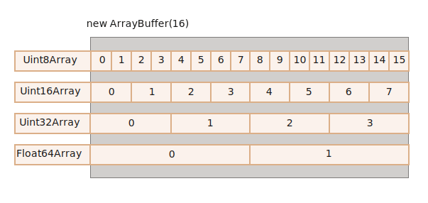
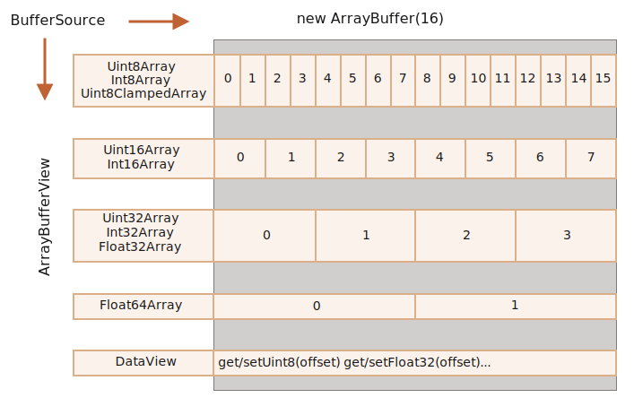

# ArrayBuffer, آرایه‌های دودویی

در توسعه‌ی وب، ما معمولا هنگام سروکار داشتن با فایل‌ها(ساختن، بارگذاری کردن، دانلود کردن) به داده‌های دودویی برخورد می‌کنیم. یکی دیگر از استفاده‌های رایج آن پردازش تصویر می‌باشد.

همه‌ی این‌ موارد در جاوااسکریپت ممکن است، و عملیات‌های دودویی عملکرد بالایی دارند.

هرچند، اندکی احتمال اشتباه کردن وجود دارد، زیرا کلاس‌های بسیاری وجود دارند. برخی از آن‌ها عبارتند از:
- `ArrayBuffer`, `Uint8Array`, `DataView`, `Blob`, `File`, etc.

داده‌های دودویی در جاوااسکریپت، نسبت به سایر زبان‌ها به شکل غیراستانداردی پیاده‌سازی شده‌اند. ولی هنگاهی که ما چیزها را مرتب می‌کنیم، همه چیز نسبتا ساده می‌شود.

**شی دودویی پایه `ArrayBuffer` است -- یک اشاره به یک ناحیه‌ی پیوسته‌ی حافظه با طول ثابت.**

آن را به شکل زیر می‌سازیم:
```js run
let buffer = new ArrayBuffer(16); // ساخت یک بافر با طول 16
alert(buffer.byteLength); // 16
```

این کد یک حافظه‌ی پیوسته به اندازه 16 بایت را اختصاص می‌دهد و آن را با صفر مقداردهی اولیه می‌کند.

```هدر هشدار="`ArrayBuffer` یک آرایه از چیزی نیست."
بیایید یک منبع احتمال اشتباه کردن را رفع کنیم. `ArrayBuffer` هیچ ارتباطی با آرایه ندارد:
- یک طول ثابت دارد، ما نمی‌توانیم آن را کم یا زیاد کنیم.
- دقیقا به همان میزان حافظه اشغال می‌کند.
- برای دسترسی به بایت‌های جداگانه، یک شی "View" دیگر لازم است، نه `buffer[index]`.
```

یک ناحیه از حافظه است. چه چیزی در آن ذخیره می‌شود؟ هیچ سرنخی وجود ندارد. فقط یک دنباله خالی از بایت‌ها `ArrayBuffer`

**استفاده کنیم "View" ما باید از یک شی ،`ArrayBuffer` برای دستکاری کردن یک**

را می‌دهد `ArrayBuffer` است که تفسیری از بایت‌های ذخیره شده در "eyeglasses" چیزی را در خود ذخیره نمی‌کند. این view یک شی

:برای مثال

- **`Uint8Array`** -- مانند یک عدد جداگانه برخورد می‌کند و مقادیر مجاز آن از 0 تا 255 است.(یک بایت 8 بیت است پس فقط تا همان مقدار را می‌تواند نگه دارد.). به این مقدار یک عدد صحیح بدون‌علامت 8-بیتی گفته می‌شود `ArrayBuffer` با هر بایت در
- **`Uint16Array`** -- برخورد می‌کند که مقادیر مجاز آن از 0 تا 65535 می‌باشد. به آن یک عدد صحیح بدون‌علامت 16-بیتی گفته می‌شود integer با هر 2 بایت به عنوان یک
- **`Uint32Array`** -- برخورد می‌کند که مقادیر مجاز آن از 0 تا 4294967295 می‌باشد. به آن یک عدد صحیح بدون‌علامت 32-بیتی گفته می‌شود integer با هر 4 بایت به عنوان یک
- **`Float64Array`** -- می‌باشد <code>1.8x10<sup>308</sup></code> تا <code>5.0x10<sup>-324</sup></code> رفتار می‌کند و مقادیر مجاز آن از float با هر 8 بایت به عنوان یک عدد

با دقت بالا(هر کدام 8 بایت) تفسیر شود float یی با اندازه‌ی 16 بایت، می‌تواند به عنوان 16 عدد کوچک یا 8 عدد بزرگ‌تر (هر کدام 2 بایت) یا 4 عدد بزرگ‌تر از قبلی(هر کدام 4 بایت) یا 2 عدد `ArrayBuffer` بنابراین، یک داده‌ی دودویی درون



شی اصلی، ریشه‌ی همه چیز و داده‌ی باینری خام است `ArrayBuffer`

مانند زیر استفاده کنیم view اما اگر بخواهیم هر عملیاتی روی آن انجام دهیم، از جمله، در آن بنویسیم، یا آن را پیمایش کتیم - باید از یک

```js run
let buffer = new ArrayBuffer(16); // ساخت یک بافر با طول 16

*!*
let view = new Uint32Array(buffer); // رفتار با بافر مانند یک دنباله از اعداد صحیح 32 بیتی

alert(Uint32Array.BYTES_PER_ELEMENT); // به ازای هر عدد صحیح، 4 بایت
*/!*

alert(view.length); // 4, به این تعداد عدد صحیح در خود ذخیره می‌کند
alert(view.byteLength); // 16, اندازه‌ی بایت‌ها

// نوشتن یک مقدار
view[0] = 123456;

// پیمایش روی مقادیر
for(let num of view) {
  alert(num); // ابتدا 123456 سپس 0 و 0 و 0(در مجموع 4 مقدار)
}

```

## TypedArray

اصطلاح رایج برای تمامی این viewها (`Uint8Array` و `Unit32Array` و غیره) [TypedArray](https://tc39.github.io/ecma262/#sec-typedarray-objects) می‌باشد. آن‌ها متدها و ویژگی‌های یکسانی دارند.

لطفا به خاطر داشته باشید که هیچ سازنده‌ای با عنوان `TypedArray` وجود ندارد و این فقط یک اصطلاح رایج برای پوشش یکی از viewهای موضوع گسترده‌ی `ArrayBuffer` می‌باشد: `Int8Array` و `Uint8Array` و به همین ترتیب، لیست کامل به زودی ارائه می‌شود.

هرگاه چیزی مانند `new TypedArray` مشاهده کردید، این عبارت به معنای هرکدام از `new Int8Array`، `new Uint8Array` و غیره می‌باشد.

آرایه‌های Typed مانند آرایه‌های عادی رفتار می‌کنند: دارای اندیش هستند و قابل پیمایش می‌باشند.

یک سازنده‌ی آرایه‌ی Typed(می‌تواند `Int8Array` یا `Float64Array` باشد، اهمیتی ندارد) با توجه به نوع آرگومان آن متفاوت رفتار می‌کند.

5 نوع مختلف آرگومان‌ها وجود دارند:

```js
new TypedArray(buffer, [byteOffset], [length]);
new TypedArray(object);
new TypedArray(typedArray);
new TypedArray(length);
new TypedArray();
```

1. اگر یک آرگومان `ArrayBuffer` وجود داشته باشد، view بر حسب آن ساخته می‌شود. ما پیش از این از همین سینتکس استفاده کردیم.
    
   ما می‌توانیم به صورت اختیاری `byteOffset` تهیه کنیم که از آن شروع کنیم(به شکل پیش‌فرض از 0 شروع می‌کنیم) و یک `length` که تا آنجا ادامه دهیم(به صورت پیش‌فرض تا انتهای بافر ادامه‌ می‌دهیم)؛ در نتیجه، view فقط بخشی از بافر را پوشش می‌دهد.

2. اگر یک آرایه یا هر شی مانند آن داشته باشیم، آن شی یک آرایه‌ی typed به همان طول می‌سازد و محتوا را نیز کپی می‌کند.
   
   ما می‌توانیم از آن برای مقداردهی اولیه‌ی آرایه با داده استفاده کنیم:
    ```js run
    *!*
    let arr = new Uint8Array([0, 1, 2, 3]);
    */!*
    alert( arr.length ); // 4, یک آرایه دودویی به همان طول می‌سازد
    alert( arr[1] ); // 1, با 4 بایت(اعداد صحیح بدون‌علامت 8-بیتی) با مقادیر داده شده پر می‌شود
    ```
3. اگر یک `TypedArray` دیگر وجود داشته باشد، به همان شکل رفتار می‌کند: ک آرایه‌ی typed به همان طول می‌سازد و محتوا را نیز کپی می‌کند. در طول این فرآیند، مقادیر در صورت نیاز به نوع جدیدی تبدیل می‌شوند.
    ```js run
    let arr16 = new Uint16Array([1, 1000]);
    *!*
    let arr8 = new Uint8Array(arr16);
    */!*
    alert( arr8[0] ); // 1
    alert( arr8[1] ); // 232,  تلاش می‌کند 1000 را کپی کند اما نمی‌تواند 1000 را در 8 بیت جا دهد(توضیخات در پایین)
    ```

4. برای آرگومان عددی `length` -- یک آرایه‌ typed که به همان تعداد عضو دارد می‌سازد. طول بایت آن برابر `length` ضرب در تعداد بایت‌های یک آیتم واحد `TypedArray.BYTES_PER_ELEMENT` خواهد بود:
    ```js run
    let arr = new Uint16Array(4); // برای 4 عدد صحیح می‌سازد typed یک آرایه‌ی
    alert( Uint16Array.BYTES_PER_ELEMENT ); // به ازای هر عدد صحیح 2 بایت
    alert( arr.byteLength ); // 8 (اندازه در بایت‌ها)
    ```

5. بدون آرگومان‌ها یک آرایه‌ی typed با طول صفر می‌سازد.

ما می‌توانیم مستقیما یک `TypedArray` بسازیم، بدون اینکه به `ArrayBuffer` اشاره‌ای کنیم. ولی یک view بدون `ArrayBuffer` دربرگیرنده نمی‌تواند وجود دشاته باشد؛ در نتیجه در همه‌ی این موارد بجز مورد اول(هنگامی که فراهم شده است) به طور خودکار ساخته می@شود.

برای دسترسی به `ArrayBuffer` دربرگیرنده، ویژگی‌های زیر در `TypedArray` وجود دارد:
- `buffer` -- `ArrayBuffer` ارجاع به
- `byteLength` -- `ArrayBuffer` طول

بنابراین، ما همیشه می‌توانیم از یک view به دیگری برویم:
```js
let arr8 = new Uint8Array([0, 1, 2, 3]);

// دیگر در همان داده view یک
let arr16 = new Uint16Array(arr8.buffer);
```


در ادامه لیست آرایه‌های typed آمده است:

- `Uint8Array`, `Uint16Array`, `Uint32Array` -- برای اعداد صحیح 8 و 16 و 32 بیتی
  - `Uint8ClampedArray` -- می‌کند (در ادامه خواهید دید) "clamps" برای اعداد صحیح 8 بیتی، آن‌ها را
- `Int8Array`, `Int16Array`, `Int32Array` -- برای اعداد صحیح علامت‌دار(می‌توانند منفی باشند)
- `Float32Array`, `Float64Array` -- برای اعداد اعشاری علامت‌دار 32 و 64 بیتی

```هدر هشدار="بدون `int8` یا انواع مشابه با مقدار واحد"
لطفا به خاطر داشته باشید، علی‌رغم نام‌هایی مانند `Int8Array`، هیچ نوعی با مقدار واحد مانند `int` یا `int8` در جاوااسکریپت وجود ندارد.

این موضوع منطقی است، زیرا `Int8Array` یک آرایه از این مقادیر مجزا نیست، بلکه یک view روی `ArrayBuffer` است.
```

### رفتار خارج از محدوده

بنویسیم چه؟ هیچ خطایی وجود نخواهد داشت، اما بیت‌ههای اضافی حذف خواهند شد typed اگر بخواهیم یک مقدار خارج از محدوده را در یک آرایه‌ی

به ازای هر مقدار 8 بیت دارد، پس بازه‌ی آن بین 0 تا 255 خواهد بود `Uint8Array` قرار دهیم. در حالت دودویی، 256 برابر `100000000`(9 بیت) خواهد بود، ولی `Uint8Array` به عنوان مثال، بیایید سعی کنیم 256 را در

:برای اعداد بزرگتر، فقط 8 بیت سمت راست(بیت‌های کم‌ارزش‌تر) ذخیره می‌شود، و بقیه بیت‌ها حذف می‌شوند


.در نتیجه صفر دریافت می‌کنیم

:برای 257، حالت دودویی `100000001`(9 بیت) خواهد بود، 8 بیت سمت راست ذخیره می‌شوند، در نتیجه در آرایه `1` را داریم


ذخیره می‌شود 2<sup>8</sup> به عبارت دیگر، باقی‌مانده عدد

:یک نمونه

```js run
let uint8array = new Uint8Array(16);

let num = 256;
alert(num.toString(2)); // 100000000 (نمایش دودویی)

uint8array[0] = 256;
uint8array[1] = 257;

alert(uint8array[0]); // 0
alert(uint8array[1]); // 1
```

از این نظر، `Uint8ClampedArray` خاص است و رفتار متفاوتی دارد. این مورد به ازای هر عدد بزرگتر از 255، 255 و به ازای هر عدد منفی، 0 را ذخیره می‌کند. این رفتار ببرای پردازش تصویر مفید است.

## متدهای TypedArray

متدهای `TypedArray` مانند آرایه‌های معمولی می‌باشد ولی استثناهای قابل توجهی نیز وجود دارد.

ما می‌توانیم `map`، `slice`، `find`، `reduce` و غیره را پیمایش کنیم.

هرچند، تعداد کمی کار وجود دارد که ما نمی‌توانیم انجام دهیم:

- بدون `splice` -- ما نمی‌توانیم یک مقدار را "حذف" کنیم، زیرا آرایه‌های typed، درواقع viewهایی روی یک بافر هستند که ناحیه‌هایی ثابت و پیوسته روی حافظه می‌باشند. تنها کاری که ما می‌توانیم انجام دهیم تخصیص یک صفر است.
- بدون متد `concat`

دو متد اضافی نیز وجود دارد:

- متد `arr.set(fromArr, [offset])` تمام اعضای `fromArr` را در `arr` کپی می‌کند، که این کپی کردن از محل `offset` شروع می‌شود.(حالت پیش‌فرض آن 0 است.)
- متد `arr.subarray([begin, end])` یک view جدید از همان نوع را از `begin` تا `end` می‌سازد(انحصاری). این متد مانند متد `slice` است(آن متد نیز پشتیبانی می‌شود.) ولی چیزی را کپی نمی‌کند -- فقط یک view جدید می‌سازد که روی داده‌های داده شده، عمملیات انجام دهد.

این متدها به ما اجازه می‌دهد که آرایه‌های typed را کپی کنیم، آن‌ها را با هم ترکیب کنیم، آرایه‌های جدید از آرایه‌های موجود بسازیم، و به همین ترتیب.


## DataView

یک [DataView](mdn:/JavaScript/Reference/Global_Objects/DataView) یک view خاص فوق‌العاده انعطاف‌پذیر "untyped" روی `ArrayBuffer` است. DataView اجازه می‌هد که در هر offset و در هر فرمتی به داده‌ها دسترسی داشته باشیم.

- برای آرایه‌های typed، سازنده فرمت را مشخص می‌کند. کل آرایه قرار است یکنواخت باشد. عدد iام، `arr[i]` است.

- با `DataView`، ما با متدهایی مانند `.getUint8(i)` یا `.getUint16(i)` به داده دسترسی پیدا می‌کنیم. ما فرمت را بجای هنگام ساخت، هنگام فراخوانی متد انتخاب می‌کنیم.

سینتکس:
```js
new DataView(buffer, [byteOffset], [byteLength])
```

- **`buffer`** --  بافر مخصوص خودش را نمی‌سازد. ما باید آن را آماده داشته باشیم typed برخلاف آرایه‌های `DataView` .دربرگیرنده `ArrayBuffer`
- **`byteOffset`** -- (حالت پیش‌فرض 0 می‌باشد)view محل بایت شروع‌کننده‌ی
- **`byteLength`** -- (حالت پیش‌فرض تا انتهای بافر می‌باشد)view طول بایت‌های

برای نمونه، در اینجا ما اعداد یک بافر یکسان را در فرمت‌های مختلف استخراج کرده‌ایم:

```js run

let buffer = new Uint8Array([255, 255, 255, 255]).buffer; // آرایه‌های دودویی 4 بایتی، که حداکثر مقدار همه‌ی آن‌ها 255 است

let dataView = new DataView(buffer);

// صفر offset دریافت یک عدد 8 بیتی در
alert( dataView.getUint8(0) ); // 255

// صفر، این عدد از دو بایت تشکیل شده است که با هم 65535 را نشان می‌دهند offset حالا دریافت یک عدد 16 بیتی در
alert( dataView.getUint16(0) ); // 65535 (بزرگترین عدد صحیح بدون‌علامت 16 بیتی)

//  صفر offset دریافت یک عدد 32 بیتی در
alert( dataView.getUint32(0) ); // 4294967295 (بزرگترین عدد صحیح بدون‌علامت 32 بیتی)

dataView.setUint32(0, 0); // صفر قرار دادن یک عدد 4 بایتی، در نتیجه همه بایت‌ها را صفر می‌کنیم
```

هنگامی که می‌خواهیم داده‌هایی با فرمت‌های درهم و برهم را در یک بافر ذخیره کنیم، `DataView` عالی است. به عنوان مثال، هنگامی که دنباله‌ای از جفت‌های(عدد صحیح 16 بیتی، عدد اعشاری 32 بیتی) را ذخیره می‌کنیم، `DataView` به آسانی اجازه دسترسی به آن‌ها را می‌دهد.

## خلاصه

یک `ArrayBuffer`، شی اصلی است، یک ارجاع به یک ناحیه پیوسته از حافظه با طول ثابت.

برای انجام تقریبا هر عملیاتی روی `ArrayBuffer`، ما به یک view نیاز داریم.

- این می‌تواند یک `TypedArray` باشد:
    - `Uint8Array`, `Uint16Array`, `Uint32Array` -- برای اعداد صحیح بدون عللامت 8 و 16 و 32 بیتی
    - `Uint8ClampedArray` -- می‌کند "clamps" برای اعداد صحیح 8 بیتی، آن‌ها را
    - `Int8Array`, `Int16Array`, `Int32Array` -- برای اعداد صحیح علامت‌دار(می‌توانند منفی باشند)
    - `Float32Array`, `Float64Array` -- برای اعداد اعشاری علامت‌دار 32 و 64 بیتی
- یا یک `DataView` -- همان viewیی که از متدها برای مشخص کردن یک فرمت استفاده می‌کند، مانند `getUint8(offset)`

در بیشتر موارد، ما مستقیما آرایه‌های typed را می‌سازیم و اجرا می‌کنیم، `ArrayBuffer` را به عنوان یک "مخرج مشترک" تخت پوشش قرار می‌دهیم. می‌توانیم با `buffer.` به آن دسترسی پیدا کنیم و در صورت نیاز یک view دیگر ایجاد کنیم.

دو اصطلاح اضافی نیز وجود دارد، که برای توصیف متدهایی که روی داده‌های دودویی عملیات انجام می‌دهند استفاده می‌شوند:
- اصطلاح `ArrayBufferView`، از نوعی اصطلاح است که برای پوشش دسته‌ی گسترده‌ای از چیزها استفاده می‌شود، که در این مورد، برای تمام انواع viewها استفاده می‌شود.
- اصطلاح `BufferSource`، از نوعی اصطلاح است که برای پوشش دسته‌ی گسترده‌ای از چیزها استفاده می‌شود، که در این مورد، برای `ArrayBuffer` یا `ArrayBufferView` استفاده می‌شود.

این اصطلاحات را در بخش بعد مشاهده خواهیم کرد. `BufferSource` یکی از رایج‌ترین اصطلاحات می‌باشد، که معنی آن "هر نوع از داده دودویی" است -- یک `ArrayBuffer` یا یک view روی آن.

در اینجا یک چیت‌شیت(برگه تقلب) داریم:


