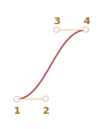

# CSS انیمیشن های

نیمیشن‌های CSS امکان انجام انیمیشن‌های ساده را بدون جاوا اسکریپت فراهم می‌کنند.

جاوا اسکریپت می تواند برای کنترل انیمیشن های CSS و حتی بهتر کردن آنها با کد کمی استفاده شود.

## انتقال CSS transitions [#css-transition]

ایده انتقال CSS ساده است. ما یک ویژگی را توضیح می دهیم و چگونه تغییرات آن باید متحرک شود. هنگامی که ویژگی تغییر می کند، مرورگر انیمیشن را رنگ می کند.

یعنی تنها چیزی که نیاز داریم تغییر ویژگی است و انتقال سیال توسط مرورگر انجام می شود.

برای مثال، CSS زیر تغییرات 'رنگ پس‌زمینه' را به مدت ۳ ثانیه متحرک می‌کند:

```css
.animated {
  transition-property: background-color;
  transition-duration: 3s;
}
```

حال اگر عنصری دارای کلاس '.animated' باشد، هر تغییری در 'رنگ پس‌زمینه' در طول 3 ثانیه متحرک می‌شود.

برای متحرک سازی پس زمینه روی دکمه زیر کلیک کنید:

```html run autorun height=60
<button id="color">Click me</button>

<style>
  #color {
    transition-property: background-color;
    transition-duration: 3s;
  }
</style>

<script>
  color.onclick = function() {
    this.style.backgroundColor = 'red';
  };
</script>
```

4 ویژگی برای توصیف انتقال CSS وجود دارد:

- `transition-property`
- `transition-duration`
- `transition-timing-function`
- `transition-delay`

ما آنها را در یک لحظه پوشش خواهیم داد، فعلاً توجه داشته باشیم که ویژگی مشترک 'transition' اجازه می دهد تا آنها را با هم به ترتیب اعلام کنیم: 'تأخیر زمان بندی-عملکرد مدت زمان' و همچنین متحرک سازی چندین ویژگی به طور همزمان.

به عنوان مثال، این دکمه هم `color` و هم `font-size` را متحرک می کند:

```html run height=80 autorun no-beautify
<button id="growing">Click me</button>

<style>
#growing {
*!*
  transition: font-size 3s, color 2s;
*/!*
}
</style>

<script>
growing.onclick = function() {
  this.style.fontSize = '36px';
  this.style.color = 'red';
};
</script>
```

حالا بیایید ویژگی های انیمیشن را یکی یکی پوشش دهیم.

## transition-property

در «transition-property»، ما فهرستی از ویژگی‌ها را برای متحرک کردن می‌نویسیم، به‌عنوان مثال: `left`, `margin-left`, `height`, `color`. یا می‌توانیم `all` را بنویسیم که به معنای «animate به همه ویژگی‌ها» است.

توجه داشته باشید که ویژگی هایی وجود دارد که نمی توان آنها را متحرک کرد. با این حال، [بیشتر ویژگی‌هایی که معمولاً مورد استفاده قرار می‌گیرند متحرک هستند](https://developer.mozilla.org/en-US/docs/Web/CSS/CSS_animated_properties).

## مدت زمان انتقال

در 'transition-duration' می‌توانیم مشخص کنیم که انیمیشن چقدر طول می‌کشد. زمان باید در [قالب زمان CSS](https://www.w3.org/TR/css3-values/#time): بر حسب ثانیه یا میلی ثانیه «ms» باشد.

## transition-delay

در `transition-delay` می‌توانیم تاخیر *قبل از* انیمیشن را مشخص کنیم. برای مثال، اگر `تاخیر انتقال` `1 ثانیه` و `مدت انتقال` `2 ثانیه` باشد، انیمیشن 1 ثانیه پس از تغییر ویژگی شروع می‌شود و مدت زمان کل 2 ثانیه خواهد بود.

مقادیر منفی نیز ممکن است. سپس انیمیشن بلافاصله نشان داده می شود، اما نقطه شروع انیمیشن پس از مقدار داده شده (زمان) خواهد بود. به عنوان مثال، اگر `تاخیر انتقال` `-۱ ثانیه` و `مدت انتقال` `۲ ثانیه` باشد، انیمیشن از نیمه شروع می‌شود و مدت زمان کل ۱ ثانیه خواهد بود.

در اینجا انیمیشن با استفاده از ویژگی `translate` CSS اعداد را از `0` به `9` تغییر می‌دهد:

[codetabs src="digits"]

ویژگی `transform` به شکل زیر متحرک است:

```css
#stripe.animate {
  transform: translate(-90%);
  transition-property: transform;
  transition-duration: 9s;
}
```

در مثال بالا جاوا اسکریپت کلاس `.animate` را به عنصر اضافه می کند -- و انیمیشن شروع می شود:

```js
stripe.classList.add('animate');
```

ما همچنین می‌توانیم آن را از جایی در میانه انتقال، از یک عدد دقیق شروع کنیم، به عنوان مثال. متناظر با ثانیه فعلی، با استفاده از `transition-delay` منفی.

در اینجا اگر روی رقم کلیک کنید -- انیمیشن را از ثانیه فعلی شروع می کند:

[codetabs src="digits-negative-delay"]

جاوا اسکریپت این کار را با یک خط اضافی انجام می دهد:

```js
stripe.onclick = function() {
  let sec = new Date().getSeconds() % 10;
*!*
  // for instance, -3s here starts the animation from the 3rd second
  stripe.style.transitionDelay = '-' + sec + 's';
*/!*
  stripe.classList.add('animate');
};
```

## تابع انتقال-زمان

تابع زمان بندی نحوه توزیع فرآیند انیمیشن در طول جدول زمانی آن را توصیف می کند. آیا به آرامی شروع می شود و سپس سریع می رود یا برعکس.

به نظر می رسد در ابتدا پیچیده ترین ویژگی باشد. اما اگر کمی زمان را به آن اختصاص دهیم بسیار ساده می شود.

این ویژگی دو نوع مقدار را می پذیرد: منحنی Bezier یا مراحل. بیایید با منحنی شروع کنیم، زیرا بیشتر استفاده می شود.

### Bezier منحنی

تابع زمان بندی را می توان به عنوان یک [منحنی Bezier](/bezier-curve) با 4 نقطه کنترل که شرایط را برآورده می کند تنظیم کرد:

1. اولین نقطه کنترل: `(0,0)`.
2. آخرین نقطه کنترل: `(1,1)`.
3. برای نقاط میانی، مقادیر `x` باید در بازه `0..1` باشد، `y` می تواند هر چیزی باشد.

نحو برای منحنی Bezier در `CSS: cubic-bezier(x2، y2، x3، y3)`. در اینجا باید فقط نقاط کنترل 2 و 3 را مشخص کنیم، زیرا اولین نقطه روی `(0,0)` ثابت شده است و نقطه چهارم `(1،1)` است.

تابع زمان بندی سرعت فرآیند انیمیشن را توصیف می کند.

- محور `x` زمان است: `0` -- شروع، `1` -- پایان `transition-duration`.
- محور `y` تکمیل فرآیند را مشخص می کند: `0` -- مقدار شروع ویژگی، `1` -- مقدار نهایی.

ساده ترین حالت زمانی است که انیمیشن به طور یکنواخت و با همان سرعت خطی پیش می رود. این را می توان با منحنی `cubic-bezier(0، 0، 1، 1)` مشخص کرد.

در اینجا این منحنی به نظر می رسد:


... همانطور که می بینیم، فقط یک خط مستقیم است. با گذشت زمان (`x`)، تکمیل (`y`) انیمیشن به طور پیوسته از 0 به 1 می رود.

قطار در مثال زیر از چپ به راست با سرعت دائمی حرکت می کند (روی آن کلیک کنید):

[codetabs src="train-linear"]

`انتقال` CSS بر اساس آن منحنی است:

```css
.train {
  left: 0;
  transition: left 5s cubic-bezier(0, 0, 1, 1);
  /* click on a train sets left to 450px, thus triggering the animation */
}
```

... و چگونه می توانیم قطاری را در حال کاهش سرعت نشان دهیم؟

می‌توانیم از منحنی دیگر Bezier استفاده کنیم: `cubic-bezier(0.0، 0.5، 0.5، 1.0)`.

نمودار:


همانطور که می بینیم، این روند سریع شروع می شود: منحنی به اوج می رسد و سپس کندتر و کندتر می شود.

در اینجا تابع زمان بندی در عمل آمده است (روی train کلیک کنید):

[codetabs src="train"]

CSS:
```css
.train {
  left: 0;
  transition: left 5s cubic-bezier(0, .5, .5, 1);
  /* click on a train sets left to 450px, thus triggering the animation */
}
```

  چندین منحنی داخلی وجود دارد: `linear`, `ease`, `ease-in`, `ease-out` و `ease-in-out`.

`linear` مخفف `cubic-bezier(0، 0، 1، 1)` است - یک خط مستقیم، که در بالا توضیح دادیم.

نام‌های دیگر مخفف عبارت `cubic-bezier` زیر هستند:

| <code>ease</code><sup>*</sup> | <code>ease-in</code> | <code>ease-out</code> | <code>ease-in-out</code> |
|-------------------------------|----------------------|-----------------------|--------------------------|
| <code>(0.25, 0.1, 0.25, 1.0)</code> | <code>(0.42, 0, 1.0, 1.0)</code> | <code>(0, 0, 0.58, 1.0)</code> | <code>(0.42, 0, 0.58, 1.0)</code> |
|  |  |  |  |

`*` -- به‌طور پیش‌فرض، اگر تابع زمان‌بندی وجود نداشته باشد، `ease` استفاده می‌شود.

بنابراین می‌توانیم از `ease-out` برای کاهش سرعت قطار خود استفاده کنیم:

```css
.train {
  left: 0;
  transition: left 5s ease-out;
  /* same as transition: left 5s cubic-bezier(0, .5, .5, 1); */
}
```

اما کمی متفاوت به نظر می رسد.

**یک منحنی Bezier می تواند باعث شود که انیمیشن از محدوده خود فراتر رود.**

نقاط کنترل روی منحنی می توانند هر مختصات `y` داشته باشند: حتی منفی یا بزرگ. سپس منحنی Bezier نیز بسیار کم یا زیاد می شود و باعث می شود انیمیشن از محدوده طبیعی خود فراتر رود.

در مثال زیر کد انیمیشن به شرح زیر است:

```css
.train {
  left: 100px;
  transition: left 5s cubic-bezier(.5, -1, .5, 2);
  /* click on a train sets left to 450px */
}
```

ویژگی "چپ" باید از `100px` تا `400px` متحرک شود.

اما اگر روی قطار کلیک کنید، خواهید دید که:

- ابتدا، قطار *به عقب* می رود: «چپ» کمتر از `100px` می شود.
- سپس به جلو می رود، کمی دورتر از `400px`.
- و سپس دوباره -- به `400px`.
  
[codetabs src="train-over"]

اگر به نمودار منحنی Bezier داده شده نگاه کنیم، چرا این اتفاق می افتد کاملاً واضح است:


  مختصات `y` نقطه دوم را به زیر صفر رساندیم و برای نقطه سوم آن را روی `1` قرار دادیم، بنابراین منحنی از ربع `منظم` خارج می‌شود. `y` خارج از محدوده `استاندارد` `0..1` است.

همانطور که می دانیم، `y` "تکمیل فرآیند انیمیشن" را اندازه گیری می کند. مقدار "y = 0" مربوط به مقدار ویژگی شروع و `y = 1` - مقدار پایانی است. بنابراین مقادیر `y<0` ویژگی را فراتر از `چپ` شروع و `y>1` - از `چپ` نهایی عبور می‌کند.

مطمئناً این یک نوع "نرم" است. اگر مقادیر `y` مانند `-99` و «99» را قرار دهیم، قطار بسیار بیشتر از محدوده خارج خواهد شد.

اما چگونه یک منحنی Bezier برای یک کار خاص بسازیم؟ ابزارهای زیادی وجود دارد.

- به عنوان مثال، ما می توانیم این کار را در سایت <https://cubic-bezier.com> انجام دهیم.
- ابزارهای توسعه دهنده مرورگر همچنین از منحنی های Bezier در CSS پشتیبانی می کنند:
     1. ابزارهای توسعه دهنده را با `key:F12` باز کنید (`Mac: key:Cmd+Opt+I`).
     2. برگه `Elements` را انتخاب کنید، سپس به پنل فرعی `Styles` در سمت راست توجه کنید.
     3. ویژگی های CSS با کلمه `cubic-bezier` یک نماد قبل از این کلمه خواهد داشت.
     4. برای ویرایش منحنی روی این نماد کلیک کنید.


### مراحل

تابع زمان‌بندی `گام‌ها (تعداد مراحل[، شروع/پایان])` اجازه می‌دهد یک انتقال را به چند مرحله تقسیم کنید.

بیایید آن را در یک مثال با ارقام ببینیم.

در اینجا لیستی از ارقام، بدون هیچ گونه انیمیشن، فقط به عنوان منبع آمده است:

[codetabs src="step-list"]

در HTML، نواری از ارقام در یک `<div id="digits">` با طول ثابت محصور شده است:

```html
<div id="digit">
  <div id="stripe">0123456789</div>
</div>
```

Div '#digit' دارای یک عرض و یک حاشیه ثابت است، بنابراین مانند یک پنجره قرمز به نظر می رسد.

ما یک تایمر می سازیم: ارقام یک به یک، به روشی گسسته ظاهر می شوند.

برای رسیدن به این هدف، `#stripe` را خارج از `# رقم` با استفاده از `overflow: hidden` پنهان می کنیم و سپس `#stripe` را گام به گام به سمت چپ تغییر می دهیم.

9 مرحله وجود خواهد داشت که برای هر رقم یک گام حرکت می کند:

```css
#stripe.animate  {
  transform: translate(-90%);
  transition: transform 9s *!*steps(9, start)*/!*;
}
```

اولین آرگومان `steps(9، start)` تعداد مراحل است. تبدیل به 9 قسمت (هر کدام 10٪) تقسیم می شود. بازه زمانی به طور خودکار به 9 قسمت نیز تقسیم می شود، بنابراین «Transition: 9s» به ما 9 ثانیه برای کل انیمیشن می دهد – 1 ثانیه در هر رقم.

آرگومان دوم یکی از دو کلمه است: `شروع` یا `پایان`.

`شروع` به این معنی است که در ابتدای انیمیشن باید بلافاصله اولین قدم را برداریم.

در عمل:

[codetabs src="step"]

با کلیک بر روی رقم آن را بلافاصله به `1` (مرحله اول) تغییر می دهد و سپس در ابتدای ثانیه بعدی تغییر می کند.

روند به این صورت پیش می رود:

- `0s` -- `-10%` (اولین تغییر در ابتدای ثانیه اول، بلافاصله)
- `1s` -- `-20%`
- ...
- `8s` -- `-90%`
- (ثانیه آخر مقدار نهایی را نشان می دهد).

در اینجا، اولین تغییر فوری به دلیل `شروع` در `مراحل` بود.

مقدار جایگزین `پایان` به این معنی است که تغییر نه در ابتدا، بلکه در پایان هر ثانیه اعمال شود.

بنابراین فرآیند `steps(9, end)` به این صورت خواهد بود:

- `0s` -- `0` (در ثانیه اول هیچ چیز تغییر نمی کند)
- `1s` -- `-10%` (اولین تغییر در پایان ثانیه اول)
- `2s` -- `-20%`
- ...
- `9s` -- `-90%`

در اینجا `مراحل (9، پایان)` در عمل آمده است (به مکث قبل از تغییر رقم اول توجه کنید):

[codetabs src="step-end"]

همچنین چند مختصر از پیش تعریف شده برای آن وجود دارد `steps(...)`:

- `step-start` -- همان "steps(1, start)" است. یعنی انیمیشن بلافاصله شروع می شود و 1 مرحله می گیرد. بنابراین بلافاصله شروع می شود و به پایان می رسد، گویی هیچ انیمیشنی وجود ندارد.
- `step-end` -- همانند "steps(1, end)": انیمیشن را در یک مرحله در پایان `transition-duration` بسازید.

این مقادیر به ندرت مورد استفاده قرار می گیرند، زیرا نشان دهنده یک انیمیشن واقعی نیستند، بلکه یک تغییر تک مرحله ای هستند. ما در اینجا برای تکمیل آنها را ذکر می کنیم.

## رویداد: "transitionend"

هنگامی که انیمیشن CSS به پایان می رسد، رویداد `transitionend` فعال می شود.

به طور گسترده ای برای انجام یک عمل پس از انجام انیمیشن استفاده می شود. همچنین می توانیم به انیمیشن ها بپیوندیم.

به عنوان مثال، کشتی در مثال زیر شروع به حرکت به آنجا می کند و با کلیک کردن، هر بار دورتر و دورتر به سمت راست باز می گردد:

[iframe src="boat" height=300 edit link]

انیمیشن توسط تابع «go» شروع می‌شود که هر بار که انتقال به پایان می‌رسد، دوباره اجرا می‌شود و جهت را برمی‌گرداند:

```js
boat.onclick = function() {
  //...
  let times = 1;

  function go() {
    if (times % 2) {
      // sail to the right
      boat.classList.remove('back');
      boat.style.marginLeft = 100 * times + 200 + 'px';
    } else {
      // sail to the left
      boat.classList.add('back');
      boat.style.marginLeft = 100 * times - 200 + 'px';
    }

  }

  go();

  boat.addEventListener('transitionend', function() {
    times++;
    go();
  });
};
```

شی رویداد برای «transitionend» دارای چند ویژگی خاص است:

`event.propertyName`.
: خاصیتی که انیمیشن آن تمام شده است. اگر چندین ویژگی را به طور همزمان متحرک کنیم، می تواند خوب باشد.

`event.elapsedTime`.
: زمان (بر حسب ثانیه) که انیمیشن طول کشید، بدون `تاخیر انتقال`.

## Keyframes

می‌توانیم چندین انیمیشن ساده را با استفاده از قانون `CSS @keyframes` به هم بپیوندیم.

`نام` انیمیشن و قوانین را مشخص می کند - چه چیزی، چه زمانی و کجا باید متحرک شود. سپس با استفاده از ویژگی `animation` می توانیم انیمیشن را به عنصر متصل کرده و پارامترهای اضافی را برای آن مشخص کنیم.

در اینجا یک مثال با توضیحات آورده شده است:

```html run height=60 autorun="no-epub" no-beautify
<div class="progress"></div>

<style>
*!*
  @keyframes go-left-right {        /* give it a name: "go-left-right" */
    from { left: 0px; }             /* animate from left: 0px */
    to { left: calc(100% - 50px); } /* animate to left: 100%-50px */
  }
*/!*

  .progress {
*!*
    animation: go-left-right 3s infinite alternate;
    /* apply the animation "go-left-right" to the element
       duration 3 seconds
       number of times: infinite
       alternate direction every time
    */
*/!*

    position: relative;
    border: 2px solid green;
    width: 50px;
    height: 20px;
    background: lime;
  }
</style>
```

مقالات زیادی در مورد `@keyframes` و [detailed specification](https://drafts.csswg.org/css-animations/).

احتمالاً اغلب به `@keyframes` نیاز نخواهید داشت، مگر اینکه همه چیز در سایت شما در حال حرکت باشد.

## اجرا

اکثر خصوصیات CSS را می توان متحرک کرد، زیرا اکثر آنها مقادیر عددی هستند. به عنوان مثال، «عرض»، «رنگ»، «اندازه قلم» همه اعداد هستند. وقتی آنها را متحرک می کنید، مرورگر به تدریج این اعداد را فریم به فریم تغییر می دهد و یک جلوه صاف ایجاد می کند.

با این حال، همه انیمیشن ها آنطور که می خواهید صاف به نظر نمی رسند، زیرا ویژگی های مختلف CSS هزینه متفاوتی برای تغییر دارند.

در جزئیات فنی بیشتر، هنگامی که تغییر سبک وجود دارد، مرورگر 3 مرحله را برای ارائه ظاهر جدید طی می کند:

1. **طراحی**: هندسه و موقعیت هر عنصر را دوباره محاسبه کنید، سپس
2. **نقاشی**: دوباره محاسبه کنید که همه چیز در مکان خود چگونه باید باشد، از جمله پس زمینه، رنگ ها،
3. **کامپوزیت**: نتایج نهایی را به پیکسل های روی صفحه نمایش دهید، در صورت وجود، تبدیل های CSS را اعمال کنید.

در طول یک انیمیشن CSS، این فرآیند هر فریم را تکرار می کند. با این حال، ویژگی‌های CSS که هرگز بر هندسه یا موقعیت تأثیر نمی‌گذارند، مانند «رنگ»، ممکن است مرحله Layout را نادیده بگیرند. اگر یک "رنگ" تغییر کند، مرورگر هیچ هندسه جدیدی را محاسبه نمی کند، به Paint -> Composite می رود. و خواص کمی وجود دارد که مستقیماً به Composite می رود. در <https://csstriggers.com> می‌توانید فهرست طولانی‌تری از ویژگی‌های CSS و اینکه کدام مراحل را راه‌اندازی می‌کنند پیدا کنید.

محاسبات ممکن است زمان ببرد، به خصوص در صفحاتی که عناصر زیاد و طرح بندی پیچیده دارند. و تأخیرها در واقع در اکثر دستگاه‌ها قابل مشاهده است، که منجر به انیمیشن‌های کم‌تر روان‌تر می‌شود.

انیمیشن های خواصی که مرحله Layout را رد می کنند سریعتر هستند. حتی بهتر است از Paint نیز صرف نظر شود.

ویژگی `transform` یک انتخاب عالی است، زیرا:
- تبدیل های CSS روی جعبه عنصر هدف به عنوان یک کل تأثیر می گذارد (چرخش، تلنگر، کشش، تغییر آن).
- تبدیل CSS هرگز بر عناصر همسایه تأثیر نمی گذارد.

...بنابراین مرورگرها `تبدیل` را `در بالای` محاسبات Layout و Paint موجود در مرحله ترکیبی اعمال می کنند.

به عبارت دیگر، مرورگر Layout (اندازه‌ها، موقعیت‌ها) را محاسبه می‌کند، آن را با رنگ‌ها، پس‌زمینه‌ها و غیره در مرحله Paint رنگ می‌کند و سپس `تبدیل` را در جعبه‌های عناصری که به آن نیاز دارند اعمال می‌کند.

تغییرات (انیمیشن) ویژگی «تبدیل» هرگز مراحل Layout و Paint را راه‌اندازی نمی‌کند. بیشتر از آن، مرورگر از شتاب دهنده گرافیکی (چیپ مخصوص روی CPU یا کارت گرافیک) برای تبدیل CSS استفاده می کند، بنابراین آنها را بسیار کارآمد می کند.

خوشبختانه، ویژگی «تبدیل» بسیار قدرتمند است. با استفاده از «تبدیل» روی یک عنصر، می‌توانید آن را بچرخانید و بچرخانید، آن را کشیده و کوچک کنید، آن را به اطراف حرکت دهید، و [خیلی بیشتر](https://developer.mozilla.org/docs/Web/CSS/transform#syntax ). بنابراین به جای ویژگی‌های `left/margin-left` می‌توانیم از `transform: translateX(…)` استفاده کنیم، از `transform: scale` برای افزایش اندازه عنصر و غیره استفاده کنیم.

خاصیت `تعوض` نیز هرگز Layout را فعال نمی‌کند (از Paint در Mozilla Gecko نیز عبور می‌کند). می‌توانیم از آن برای جلوه‌های نمایش/پنهان کردن یا محو شدن/محو شدن استفاده کنیم.

تفکیک `تبدیل` با `تصادف` معمولاً می‌تواند اکثر نیازهای ما را برطرف کند و انیمیشن‌های روان و خوش‌نظری ارائه کند.

برای مثال، در اینجا با کلیک بر روی عنصر «#boat» کلاسی با `transform: translateX(300)` و `opacity: 0` اضافه می‌شود، بنابراین باعث می‌شود «300px» به سمت راست حرکت کند و ناپدید شود:

```html run height=260 autorun no-beautify


<style>
#boat {
  cursor: pointer;
  transition: transform 2s ease-in-out, opacity 2s ease-in-out;
}

.move {
  transform: translateX(300px);
  opacity: 0;
}
</style>
<script>
  boat.onclick = () => boat.classList.add('move');
</script>
```

در اینجا یک مثال پیچیده تر، با `@keyframes` آمده است:

```html run height=80 autorun no-beautify
<h2 onclick="this.classList.toggle('animated')">click me to start / stop</h2>
<style>
  .animated {
    animation: hello-goodbye 1.8s infinite;
    width: fit-content;
  }
  @keyframes hello-goodbye {
    0% {
      transform: translateY(-60px) rotateX(0.7turn);
      opacity: 0;
    }
    50% {
      transform: none;
      opacity: 1;
    }
    100% {
      transform: translateX(230px) rotateZ(90deg) scale(0.5);
      opacity: 0;
    }
  }
</style>
```

## خلاصه

انیمیشن های CSS اجازه می دهند به آرامی (یا گام به گام) تغییرات متحرک یک یا چند ویژگی CSS را انجام دهند.

آنها برای اکثر کارهای انیمیشن خوب هستند. ما همچنین می‌توانیم از جاوا اسکریپت برای انیمیشن‌ها استفاده کنیم، فصل بعدی به آن اختصاص دارد.

محدودیت های انیمیشن های CSS در مقایسه با انیمیشن های جاوا اسکریپت:

```compare plus="CSS animations" منهای ="JavaScript animations"
+ کارهای ساده به سادگی انجام می شود.
+ سریع و سبک برای CPU.
- انیمیشن های جاوا اسکریپت انعطاف پذیر هستند. آنها می توانند هر منطق انیمیشنی را مانند "انفجار" یک عنصر پیاده سازی کنند.
- نه فقط تغییر ملک. ما می توانیم عناصر جدیدی را در جاوا اسکریپت به عنوان بخشی از انیمیشن ایجاد کنیم.
```

در مثال‌های اولیه در این فصل، «اندازه قلم»، «چپ»، «عرض»، «ارتفاع» و غیره را متحرک می‌کنیم. در پروژه‌های واقعی، باید از `transform: scale()` و `transform: translate( استفاده کنیم. )` برای عملکرد بهتر.

اکثر انیمیشن ها را می توان با استفاده از CSS همانطور که در این فصل توضیح داده شد پیاده سازی کرد. و رویداد `transitionend` اجازه می دهد تا جاوا اسکریپت بعد از انیمیشن اجرا شود، بنابراین به خوبی با کد یکپارچه می شود.

اما در فصل بعدی چند انیمیشن جاوا اسکریپت را برای پوشش موارد پیچیده تر انجام خواهیم داد.
