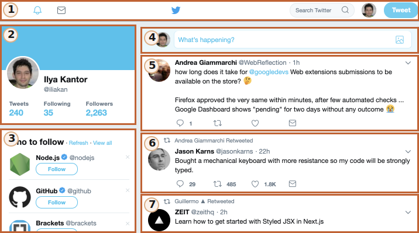

# از ارتفاع مداری

این بخش مجموعه ای از استانداردهای مدرن را برای  "web components" توصیف می کند.

در حال حاضر، این استانداردها در حال توسعه هستند. برخی از ویژگی ها به خوبی پشتیبانی شده و در استاندارد مدرن HTML/DOM یکپارچه شده اند، در حالی که برخی دیگر هنوز در مرحله پیش نویس هستند. می‌توانید نمونه‌هایی را در هر مرورگری امتحان کنید، Google Chrome احتمالاً به‌روزترین با این ویژگی‌ها است. حدس بزنید، به این دلیل است که همکاران گوگل پشت بسیاری از مشخصات مرتبط هستند.

## چه چیز هایی مشابه است بین...

کل ایده جزء چیز جدیدی نیست. در بسیاری از چارچوب ها و جاهای دیگر استفاده می شود.

قبل از اینکه به جزئیات پیاده سازی برویم، به این دستاورد بزرگ بشریت نگاهی بیندازیم:

این ایستگاه فضایی بین المللی (ISS) است.

و اینطوری داخلش ساخته شده (تقریبا):

ایستگاه فضایی بین المللی:
- از اجزای زیادی تشکیل شده است.
- هر جزء به نوبه خود دارای جزئیات کوچک تری در داخل است.
- اجزاء بسیار پیچیده هستند، بسیار پیچیده تر از بسیاری از وب سایت ها.
- کامپوننت ها در سطح بین المللی، توسط تیم هایی از کشورهای مختلف، که به زبان های مختلف صحبت می کنند، توسعه می یابند.

...و این چیز پرواز می کند، انسان ها را در فضا زنده نگه می دارد!

چگونه چنین دستگاه های پیچیده ای ایجاد می شوند؟

کدام اصول را می‌توانیم قرض بگیریم تا توسعه‌مان در همان سطح قابل اعتماد و مقیاس‌پذیر باشد؟ یا حداقل به آن نزدیک است؟

## معماری Component ها 

قانون شناخته شده برای توسعه نرم افزارهای پیچیده این است: نرم افزار پیچیده نسازید.

اگر چیزی پیچیده شد - آن را به بخش های ساده تر تقسیم کنید و به واضح ترین روش متصل کنید.

** یک معمار خوب کسی است که بتواند مجموعه را ساده کند.**

ما می‌توانیم رابط کاربری را به اجزای بصری تقسیم کنیم: هر یک از آنها جایگاه خاص خود را در صفحه دارند، می‌توانند یک کار به خوبی توصیف شده را انجام دهند و از بقیه جدا هستند.

بیایید نگاهی به یک وب سایت بیندازیم، به عنوان مثال توییتر.

به طور طبیعی به اجزای زیر تقسیم می شود:

1. پیمایش بالا.
2. اطلاعات کاربر.
3. پیشنهادات را دنبال کنید.
4. ارسال فرم.
5. (و همچنین 6، 7) -- پیام ها.
 
کامپوننت ها ممکن است دارای اجزای فرعی باشند، به عنوان مثال. پیام ها ممکن است بخشی از یک جزء "فهرست پیام" سطح بالاتر باشند. یک تصویر کاربر قابل کلیک ممکن است خود یک جزء باشد و غیره.

چگونه تصمیم بگیریم که یک جزء چیست؟ این از شهود، تجربه و عقل سلیم ناشی می شود. معمولاً این یک موجودیت بصری جداگانه است که می‌توانیم آن را از نظر کاری که انجام می‌دهد و نحوه تعامل آن با صفحه توصیف کنیم. در مورد بالا، صفحه دارای بلوک هایی است، هر کدام از آنها نقش خود را ایفا می کنند، منطقی است که این اجزا را بسازید.

یک جزء دارای:
- کلاس جاوا اسکریپت خودش.
- ساختار DOM، که صرفاً توسط کلاس خود مدیریت می شود، کد خارجی به آن دسترسی ندارد (اصل "کپسوله سازی").
- سبک های CSS، اعمال شده بر روی کامپوننت.
- API: رویدادها، متدهای کلاس و غیره، برای تعامل با اجزای دیگر.

یک بار دیگر، کل چیز "component" چیز خاصی نیست.

چارچوب ها و روش های توسعه زیادی برای ساخت آنها وجود دارد که هر کدام زنگ ها و سوت های خاص خود را دارند. معمولاً از کلاس‌ها و قراردادهای ویژه CSS برای ارائه «احساس مؤلفه» استفاده می‌شود - محدوده CSS و کپسوله‌سازی DOM.
​
"Web components" قابلیت های داخلی مرورگر را برای آن فراهم می کند، بنابراین دیگر نیازی به تقلید از آنها نداریم.

- [Custom elements](https://html.spec.whatwg.org/multipage/custom-elements.html#custom-elements) -- برای تعریف کردن custom HTML elements.
- [Shadow DOM](https://dom.spec.whatwg.org/#shadow-trees) -- برای ساختن internal DOM برای component, به صورت مخفی.
- [CSS Scoping](https://drafts.csswg.org/css-scoping/) -- برای تعریف کردن style هایی که فقط داخل Shadow DOM در component می باشند.
- [Event retargeting](https://dom.spec.whatwg.org/#retarget) و سایر موارد جزئی برای ساختن اجزای سفارشی بهتر با توسعه.

در فصل بعدی به جزئیات "Custom Elements"خواهیم پرداخت--ویژگی اساسی و پشتیبانی شده اجزای وب، که به تنهایی خوب است.
